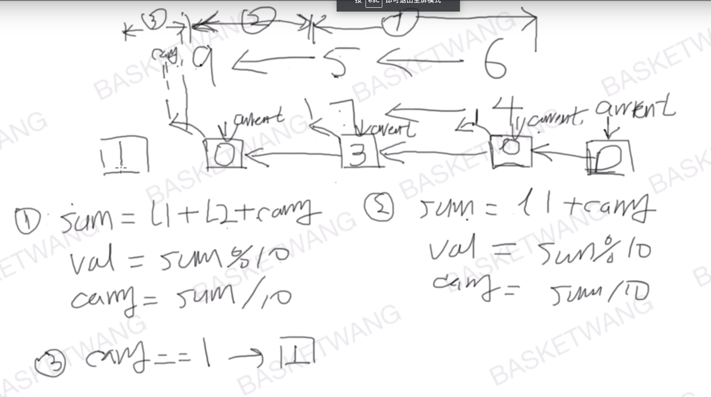

## [2. 两数相加](https://leetcode-cn.com/problems/add-two-numbers/)

### 题目描述

难度中等

给出两个 **非空** 的链表用来表示两个非负的整数。其中，它们各自的位数是按照 **逆序** 的方式存储的，并且它们的每个节点只能存储 **一位** 数字。

如果，我们将这两个数相加起来，则会返回一个新的链表来表示它们的和。

您可以假设除了数字 0 之外，这两个数都不会以 0 开头。

**示例：**

```
输入：(2 -> 4 -> 3) + (5 -> 6 -> 4)
输出：7 -> 0 -> 8
原因：342 + 465 = 807
```

### 分析

分三种状态讨论

1. l1和l2都非0
2. l1或l2有一个是0
3. l1和l2都是0



### 解法一

分情况讨论

- 当`cur->next`指向空时，要生成下一个节点，必须先`cur->next = new ListNode(val)`，再`cur=cur->next`，否则链接指针丢失

```c++
/**
 * Definition for singly-linked list.
 * struct ListNode {
 *     int val;
 *     ListNode *next;
 *     ListNode(int x) : val(x), next(NULL) {}
 * };
 */
//basketwang 的解法
class Solution {
public:
    ListNode* addTwoNumbers(ListNode* l1, ListNode* l2) {
        if(!l1) return l2;
        if(!l2) return l1;
        ListNode *dummy = new ListNode(0);
        ListNode *cur = dummy;
        int carry = 0;
        while(l1 && l2){    //l1、l2均非空
            int dig = l1->val + l2->val + carry;
            int val = dig%10;
            carry = dig/10;
            cur->next = new ListNode(val);
            cur = cur->next;
            l1 = l1->next;
            l2 = l2->next;
        }
        while(l1){ //l2为空
            int val = (l1->val+carry)%10;
            carry = (l1->val+carry)/10;
            cur->next = new ListNode(val);
            cur = cur->next;
            l1 = l1->next;
        }
        while(l2){ //l1为空
            int val = (l2->val+carry)%10;
            carry = (l2->val+carry)/10;
            cur->next = new ListNode(val);
            cur = cur->next;
            l2 = l2->next;
        }
        if(carry!=0)  cur->next = new ListNode(carry);
        return dummy->next;
    }
};
```

#### python版

```python
#sol1
class Solution:
    def addTwoNumbers(self, l1: ListNode, l2: ListNode) -> ListNode:
        if(not l1):
            return l2
        if(not l2):
            return l1
        dummy = ListNode(0)
        cur = dummy
        carry = 0
        while(l1 and l2):
            sum_tmp = l1.val + l2.val + carry
            val_tmp = sum_tmp % 10
            carry = sum_tmp // 10
            cur.next = ListNode(val_tmp)
            cur = cur.next
            l1 = l1.next
            l2 = l2.next
        while(l1):
            sum_tmp = l1.val + carry
            val_tmp = sum_tmp % 10
            carry = sum_tmp // 10
            cur.next = ListNode(val_tmp)
            cur = cur.next
            l1 = l1.next
        while(l2):
            sum_tmp = l2.val + carry
            val_tmp = sum_tmp % 10
            carry = sum_tmp // 10
            cur.next = ListNode(val_tmp)
            cur = cur.next
            l2 = l2.next
        if(carry is not 0):
            cur.next = ListNode(carry)
        return dummy.next
        
```


### 解法二

三种情况合并考虑

```c++
/**
 * Definition for singly-linked list.
 * struct ListNode {
 *     int val;
 *     ListNode *next;
 *     ListNode(int x) : val(x), next(NULL) {}
 * };
 */
// Author: Huahua
class Solution {
public:
  ListNode* addTwoNumbers(ListNode* l1, ListNode* l2) {
    ListNode dummy(0);
    ListNode* tail = &dummy;
    int sum = 0;
    while (l1 || l2 || sum) {
      sum += (l1 ? l1->val : 0) + (l2 ? l2->val : 0);
      l1 = l1 ? l1->next : nullptr;
      l2 = l2 ? l2->next : nullptr;
      tail->next = new ListNode(sum % 10);
      sum /= 10;
      tail = tail->next;
    }            
    return dummy.next;
  }
};
```

