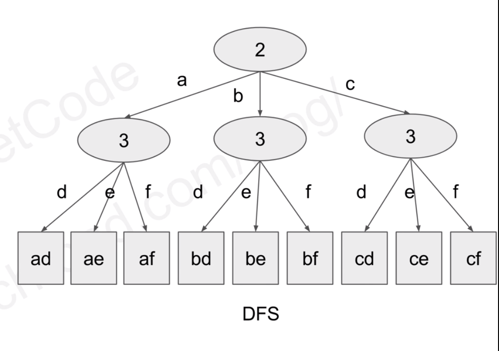

## [17. 电话号码的字母组合](https://leetcode-cn.com/problems/letter-combinations-of-a-phone-number/)

难度中等

### 题目描述

给定一个仅包含数字 `2-9` 的字符串，返回所有它能表示的字母组合。

给出数字到字母的映射如下（与电话按键相同）。注意 1 不对应任何字母。


**示例:**

```
输入："23"
输出：["ad", "ae", "af", "bd", "be", "bf", "cd", "ce", "cf"].
```

**说明:**
尽管上面的答案是按字典序排列的，但是你可以任意选择答案输出的顺序。

### 分析




### 解法一

DFS

```c++
//4ms, 8.9MB
class Solution {
public:
    vector<string> letterCombinations(string digits) {
        if (digits.empty()) return {};

        vector<vector<char>> dictionary(10);
        dictionary[0] = {' '};
        dictionary[1] = {};
        dictionary[2] = {'a', 'b', 'c'};
        dictionary[3] = {'d', 'e', 'f'};
        dictionary[4] = {'g', 'h', 'i'};
        dictionary[5] = {'j', 'k', 'l'};
        dictionary[6] = {'m', 'n', 'o'};
        dictionary[7] = {'p', 'q', 'r', 's'};
        dictionary[8] = {'t', 'u', 'v'};
        dictionary[9] = {'w', 'x', 'y', 'z'};
        string curString;
        vector<string> answers;
        dfs(digits, dictionary, 0, curString, answers);
        return answers;
    }
private:
    //函数前两个参数为输入，分别为输入的字符串、字典，用const并&引用
    //strIndex为状态变量，表示现在处理了多少位字符；curString表示当前字符串
    void dfs(const string& digits, const vector<vector<char>>& dictionary,
             int strIndex, string& curString, 
             vector<string>& answers) {
        if (strIndex == digits.length()) {
        //当遍历到叶子结点时，将当前字符串加入answers中
            answers.push_back(curString);
            return;
        }
        for (const char &curLetter : dictionary[digits[strIndex] - '0']) {
        //digits[strIndex]表示当前所在树的节点（以char表示）
            curString.push_back(curLetter); //把curString字符当作栈
            dfs(digits, dictionary, strIndex + 1, curString, answers);
            //遍历树的下一层
            curString.pop_back();
        }
    }
};
```


Java题解

```java
import java.util.ArrayList;
import java.util.List;

class Solution {

    String[] letter_map = {" ", "*", "abc", "def", "ghi", "jkl", "mno", "pqrs", "tuv", "wxyz"};
    List<String> res = new ArrayList<>();

    public List<String> letterCombinations(String digits) {
        if (digits == null || digits.length() == 0) {
            return new ArrayList<>();
        }
        dfs(digits, "", 0);
        return res;
    }

    void dfs(String digits, String curString, int index) {
        if (index == digits.length()) {
            res.add(curString);
            return;
        }
        String map_string = letter_map[digits.charAt(index) - '0'];
        for (int i = 0; i < map_string.length(); i++) {
            dfs(digits, curString + map_string.charAt(i), index + 1);
        }
    }
}

```


### 解法二

BFS

```c++
//花花的第二种解答
class Solution {
public:
    vector<string> letterCombinations(string digits) {
        if (digits.empty()) return {};

        vector<vector<char>> d(10);
        d[0] = {' '};
        d[1] = {};
        d[2] = {'a','b','c'};
        d[3] = {'d','e','f'};
        d[4] = {'g','h','i'};
        d[5] = {'j','k','l'};
        d[6] = {'m','n','o'};
        d[7] = {'p','q','r','s'};
        d[8] = {'t','u','v'};
        d[9] = {'w','x','y','z'};
        vector<string> ans{""};
        //ans存放第i位的解
        for (char digit : digits) {
        //digit表示当前遍历所在的层次
            vector<string> tmp;
            //tmp存放第i+1位的解
            for (const string& s : ans){
            //遍历所有当前层次的节点
                for (char c : d[digit - '0']){
                //产生子节点
                    tmp.push_back(s + c);
                }
            }
            ans.swap(tmp);
        }
        return ans;
    }
};
```

