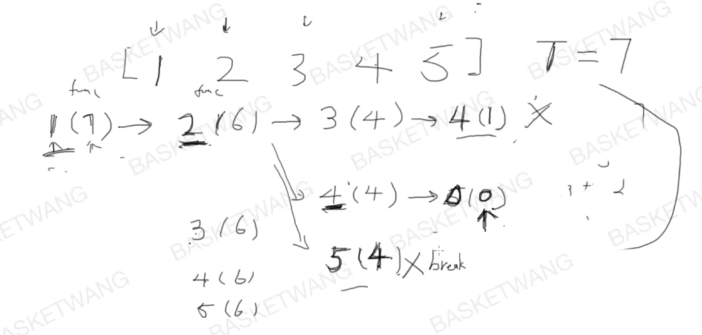

## [39. 组合总和](https://leetcode-cn.com/problems/combination-sum/)

难度中等

### 题目描述

给定一个**无重复元素**的数组 `candidates` 和一个目标数 `target` ，找出 `candidates` 中所有可以使数字和为 `target` 的组合。

`candidates` 中的数字可以无限制重复被选取。

**说明：**

- 所有数字（包括 `target`）都是正整数。
- 解集不能包含重复的组合。 

**示例 1:**

```
输入: candidates = [2,3,6,7], target = 7,
所求解集为:
[
  [7],
  [2,2,3]
]
```

**示例 2:**

```
输入: candidates = [2,3,5], target = 8,
所求解集为:
[
  [2,2,2,2],
  [2,3,3],
  [3,5]
]
```

### 分析



### 解法一

篮子王的回溯法（和DFS相似）

```c++
class Solution {
public:
    vector<vector<int>> combinationSum(vector<int>& candidates, int target) {
        vector<vector<int> > results;
        if(candidates.empty()||target<=0)	return results;
        sort(candidates.begin(),candidates.end());
        vector<int> curComb;
        backTrack(candidates,target,results,0,curComb);
        return results;
    }

private:
    void backTrack(vector<int>& candidates, int target, vector<vector<int> >& results, 
                   int candIndex,vector<int>& curComb){
    //candIndex：当前处理的数字在candidate中的位置
    //curComb：当前target下的数字组合
        if(target == 0){
            results.push_back(curComb);
            return;
        }

        for(int i=candIndex;i<candidates.size();i++){
            if(target < candidates[i])	return;
            curComb.push_back(candidates[i]);
            backTrack(candidates,target-candidates[i],results,i,curComb);
            curComb.pop_back();
        }
    }
};
```
