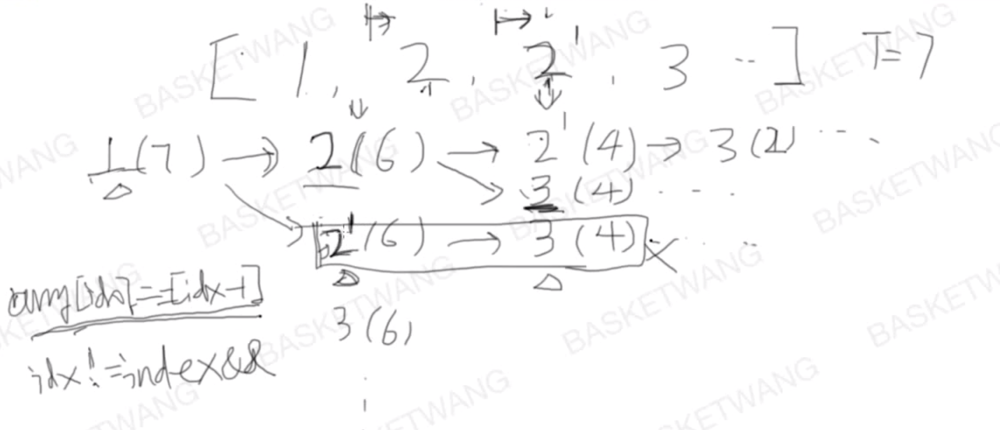

## [40. 组合总和 II](https://leetcode-cn.com/problems/combination-sum-ii/)

难度中等

### 题目描述

给定一个数组 `candidates` 和一个目标数 `target` ，找出 `candidates` 中所有可以使数字和为 `target` 的组合。

`candidates` 中的每个数字在每个组合中只能使用一次。

**说明：**

- 所有数字（包括目标数）都是正整数。
- 解集不能包含重复的组合。 

**示例 1:**

```
输入: candidates = [10,1,2,7,6,1,5], target = 8,
所求解集为:
[
  [1, 7],
  [1, 2, 5],
  [2, 6],
  [1, 1, 6]
]
```

**示例 2:**

```
输入: candidates = [2,5,2,1,2], target = 5,
所求解集为:
[
  [1,2,2],
  [5]
]
```

### 分析



### 解法一

篮子王的回溯法（和DFS相似）

```c++
class Solution {
public:
    //vector<vector<int>> combinationSum(vector<int>& candidates, int target) {
    vector<vector<int>> combinationSum2(vector<int>& candidates, int target) {
        vector<vector<int> > results;
        if(candidates.empty()||target<=0)	return results;
        sort(candidates.begin(),candidates.end());
        vector<int> curComb;
        backTrack(candidates,target,results,0,curComb);
        return results;
    }

private:
    void backTrack(vector<int>& candidates, int target, vector<vector<int> >& results, 
                   int candIndex,vector<int>& curComb){
    //candIndex：当前处理的数字在candidate中的位置
    //curComb：当前target下的数字组合
        if(target == 0){
            results.push_back(curComb);
            return;
        }

        for(int i=candIndex;i<candidates.size();i++){
            if(i!=candIndex && candidates[i]==candidates[i-1])	continue;
            	/*
            	比39题多加的部分,用以排除某些重复的情况
				(i==candIndex && candidates[i]==candidates[i-1])  表示1,2,2'
            	(i!=candIndex && candidates[i]==candidates[i-1])	表示1,2'
            	*/
            if(target < candidates[i])	return;
            curComb.push_back(candidates[i]);
            //backTrack(candidates,target-candidates[i],results,i,curComb);
            backTrack(candidates,target-candidates[i],results,i+1,curComb);
            	/*
            	40题修改的部分
            	candidates中的每个数字在每个组合中只能使用一次。
            	*/
            curComb.pop_back();
        }
    }
};
```

## 