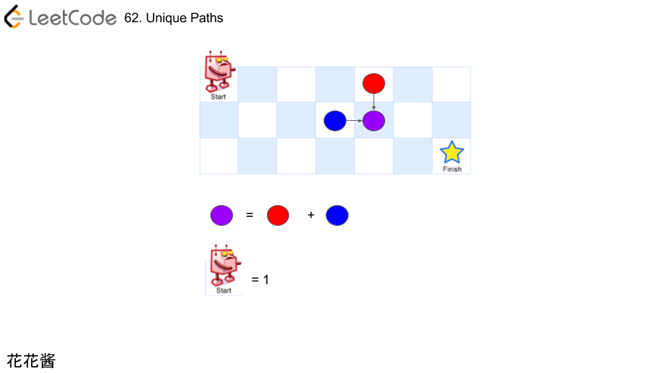
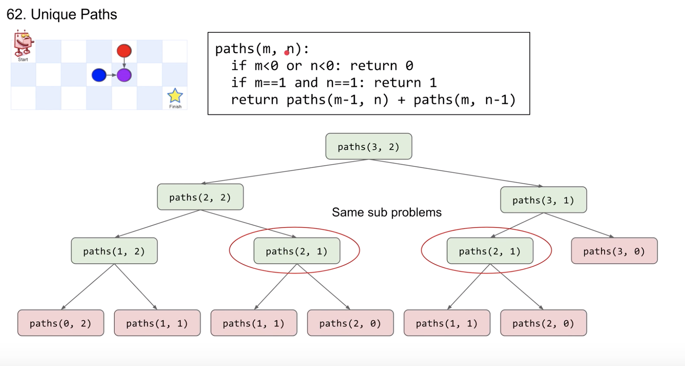

## [62. 不同路径](https://leetcode-cn.com/problems/unique-paths/)

### 题目描述

难度中等

一个机器人位于一个 *m x n* 网格的左上角 （起始点在下图中标记为“Start” ）。

机器人每次只能向下或者向右移动一步。机器人试图达到网格的右下角（在下图中标记为“Finish”）。

问总共有多少条不同的路径？


例如，上图是一个7 x 3 的网格。有多少可能的路径？

**说明：***m* 和 *n* 的值均不超过 100。

**示例 1:**

```
输入: m = 3, n = 2
输出: 3
解释:
从左上角开始，总共有 3 条路径可以到达右下角。
1. 向右 -> 向右 -> 向下
2. 向右 -> 向下 -> 向右
3. 向下 -> 向右 -> 向右
```

**示例 2:**

```
输入: m = 7, n = 3
输出: 28
```

### 分析



### 解法一



有相同的子问题：paths(2, 1)   

使用记忆化递归

```c++
// Author: Huahua
class Solution {    
public:
    int uniquePaths(int m, int n) {
        if (m < 0 || n < 0) return 0;
        if (m == 1 && n == 1) return 1;
        if (f_[m][n] > 0) return f_[m][n];  
      	//使用函数式编程
        int left_paths = uniquePaths(m - 1, n);
        int top_paths = uniquePaths(m, n - 1);
        f_[m][n] = left_paths + top_paths;
        return f_[m][n];
    }
private:
    unordered_map<int, unordered_map<int, int>> f_;
  	//看作二维数组
};
```

### 解法二

递推地求解DP

```c++
// Author: Huahua
class Solution {    
public:
    int uniquePaths(int m, int n) {
        auto f = vector<vector<int>>(n + 1, vector<int>(m + 1, 0));
        f[1][1] = 1;
        
        for (int y = 1; y <= n; ++y)
            for(int x = 1; x <= m; ++x) {
                if (x == 1 && y == 1) {
                    continue;
                } else {
                    f[y][x] = f[y-1][x] + f[y][x-1];
                }
            }
        
        return f[n][m];
    }
};
```

