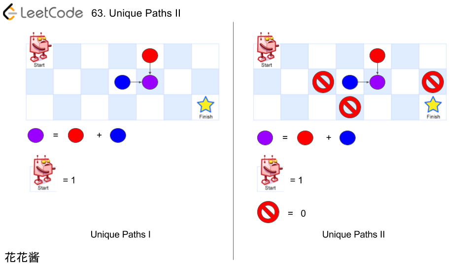

## [63. 不同路径 II](https://leetcode-cn.com/problems/unique-paths-ii/)

### 题目描述

难度中等

一个机器人位于一个 *m x n* 网格的左上角 （起始点在下图中标记为“Start” ）。

机器人每次只能向下或者向右移动一步。机器人试图达到网格的右下角（在下图中标记为“Finish”）。

现在考虑网格中有障碍物。那么从左上角到右下角将会有多少条不同的路径？


网格中的障碍物和空位置分别用 `1` 和 `0` 来表示。

**说明：***m* 和 *n* 的值均不超过 100。

**示例 1:**

```
输入:
[
  [0,0,0],
  [0,1,0],
  [0,0,0]
]
输出: 2
解释:
3x3 网格的正中间有一个障碍物。
从左上角到右下角一共有 2 条不同的路径：
1. 向右 -> 向右 -> 向下 -> 向下
2. 向下 -> 向下 -> 向右 -> 向右
```

### 分析



### 解法一

继续记忆化递归

对于所有obstacle的格子，解记为0

```c++
class Solution {
public:
    int uniquePathsWithObstacles(vector<vector<int>>& obstacleGrid) {
        int n = obstacleGrid.size();
        if (n == 0) return 0;
        int m = obstacleGrid[0].size();
        
        // f[i][j] = paths(i, j)
        // INT_MIN -> not solved yet, solution unknown
        f_ = vector<vector<int>>(n + 1, vector<int>(m + 1, INT_MIN));        
        return paths(m, n, obstacleGrid);
    }
private:
    vector<vector<int>> f_;
    
    int paths(int x, int y, const vector<vector<int>>& o) {
        // Out of bound, return 0.
        if (x <= 0 || y <= 0) return 0;
        
        // Reaching the starting point.
        // Note, there might be an obstacle here as well.
        if (x == 1 && y == 1) return 1 - o[0][0];
        
        // Already solved, return the answer.
        if (f_[y][x] != INT_MIN) return f_[y][x];
        
        // There is an obstacle on current block, no path
        if (o[y - 1][x - 1] == 1) {
            f_[y][x] = 0;
        } else {
            // Recursively find paths.
            f_[y][x] = paths(x - 1, y, o) + paths(x, y - 1, o);
        }
        
        // Return the memorized answer.
        return f_[y][x];
    }
};
```

### 解法二

改良解法一

```c++
class Solution {
public:
    int uniquePathsWithObstacles(vector<vector<int>>& obstacleGrid) {
        int n = obstacleGrid.size();
        if(n == 0)  return 0;
        int m = obstacleGrid[0].size();
        if(m == 0 || obstacleGrid[0][0]==1) return 0;
        f_ = vector<vector<int>>(n+1,vector<int>(m+1,INT_MIN));
        f_[1][1] = 1;
        return paths(m,n,obstacleGrid);
    }
private:
    vector<vector<int>> f_;
    int paths(int m,int n,vector<vector<int>>& obs){
        if(m<=0 || n<=0)   return 0;
        if(f_[n][m]!=INT_MIN)  return f_[n][m];
        if(obs[n-1][m-1]==1)    f_[n][m]=0;
        else f_[n][m] = paths(m-1,n,obs)+paths(m,n-1,obs);
        return f_[n][m];
    }
};
```

