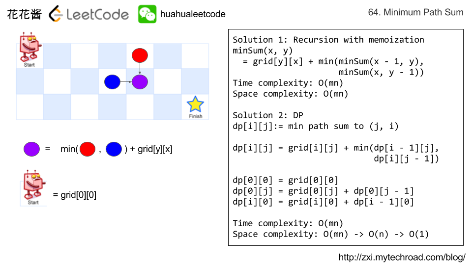

## [64. 最小路径和](https://leetcode-cn.com/problems/minimum-path-sum/)

### 题目描述

难度中等

给定一个包含非负整数的 *m* x *n* 网格，请找出一条从左上角到右下角的路径，使得路径上的数字总和为最小。

**说明：**每次只能向下或者向右移动一步。

**示例:**

```
输入:
[
  [1,3,1],
  [1,5,1],
  [4,2,1]
]
输出: 7
解释: 因为路径 1→3→1→1→1 的总和最小。
```

### 分析



### 解法一

记忆化递归，自上而下，先求解最大，然后逐渐求较小的子问题

```c++
// Author: Huahua
// Runtime: 9 ms
class Solution {
public:
    int minPathSum(vector<vector<int>>& grid) {
        int m = grid.size();
        if (m == 0) return 0;
        int n = grid[0].size();
        
        s_ = vector<vector<int>>(m, vector<int>(n, 0));
        
        return minPathSum(grid, n - 1, m - 1, n, m);
    }    
private:
    long minPathSum(const vector<vector<int>>& grid, 
                   int x, int y, int n, int m) {        
        if (x == 0 && y == 0) return grid[y][x];	//达到原点
        if (x < 0 || y < 0) return INT_MAX;		//超过边界
        if (s_[y][x] > 0) return s_[y][x];
        
        int ans = grid[y][x] + min(minPathSum(grid, x - 1, y, n, m),
                                   minPathSum(grid, x, y - 1, n, m));
        return s_[y][x] = ans;
    }
    
    vector<vector<int>> s_;
};
```

### 解法二

递推，动态规划，自下而上

还可以使用滚动数组，减少额外的空间

```c++
// Author: Huahua
// Runtime: 9 ms
class Solution {
public:
    int minPathSum(vector<vector<int>>& grid) {
        int m = grid.size();
        if (m == 0) return 0;
        int n = grid[0].size();
        
        for (int i = 0; i < m; ++i)
            for (int j = 0; j < n; ++j) {
                if (i == 0 && j == 0) continue;
                if (i == 0) 
                    grid[i][j] += grid[i][j - 1];
                else if (j == 0)
                    grid[i][j] += grid[i - 1][j];
                else
                    grid[i][j] += min(grid[i][j - 1], grid[i - 1][j]);
            }
        
        return grid[m - 1][n - 1];
    }    
};
```

