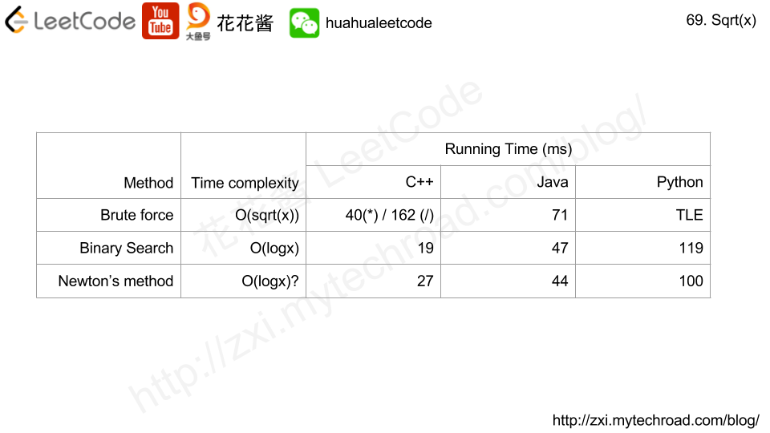
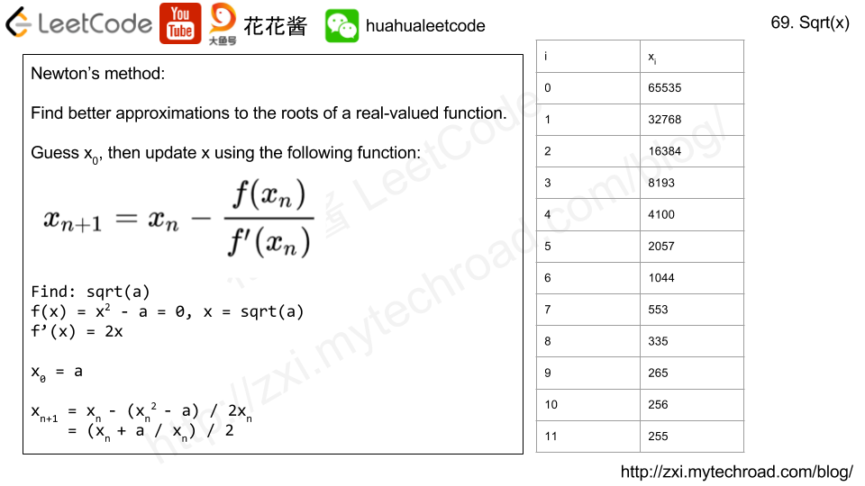

## [69. x 的平方根](https://leetcode-cn.com/problems/sqrtx/)

### 题目描述

难度简单

实现 `int sqrt(int x)` 函数。

计算并返回 *x* 的平方根，其中 *x* 是非负整数。

由于返回类型是整数，结果只保留整数的部分，小数部分将被舍去。

**示例 1:**

```
输入: 4
输出: 2
```

**示例 2:**

```
输入: 8
输出: 2
说明: 8 的平方根是 2.82842..., 
     由于返回类型是整数，小数部分将被舍去。
```

### 分析



### 解法一

brute force

- 除法慢，但是可以避免long long

```c++
//108ms, 8.1MB
class Solution {
public:
  int mySqrt(int x) {
    for (int s = 1; s <= x; ++s)
      if (s > x/s) return s - 1;
    return x;	//处理当x=1或x=0的情况
  }
};
```

### 解法二

二分法

.png)

```c++
//4ms 8.2MB
class Solution {
public:
    int mySqrt(int x) {
        long l=0, r=INT_MAX;
        while(l+1<r){
            long m = l+(r-l)/2;
            if(m*m == x)    return m;
            else if(m*m > x)    r=m;
            else l = m;
        }
        if(r*r <= x)    return r;
        else return l;
    }
};
```

### 解法三

牛顿法



```c++
// Author: Huahua
// Running time: 28 ms
// Use float
class Solution {
public:
    int mySqrt(int a) {
      constexpr double epsilon = 1e-2;
      double x = a;
      while (x * x - a > epsilon) {
        x = (x + a / x) / 2.0;
      }
      return x;
    }
};
```


```c++
// Author: Huahua
// Running time: 27 ms
// Use int
class Solution {
public:
  int mySqrt(int a) {
    // f(x) = x^2 - a, find root of f(x)
    // Newton's method
    // f'(x) = 2x
    // x' = x - f(x) / f'(x) = x - (1/2*x - a/(2*x))
    //    = (x + a / x) / 2
    int x = a;
    while (x > a / x)
      x = (x + a / x) / 2;
    return x;
  }
};
```

