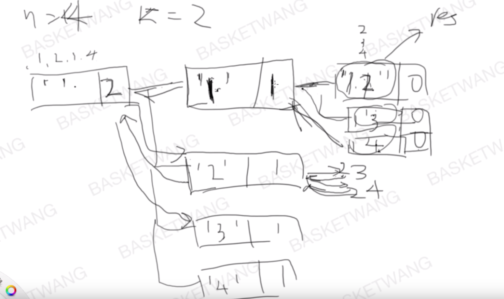

## [77. 组合](https://leetcode-cn.com/problems/combinations/)

### 题目描述

难度中等

给定两个整数 *n* 和 *k*，返回 1 ... *n* 中所有可能的 *k* 个数的组合。

**示例:**

```
输入: n = 4, k = 2
输出:
[
  [2,4],
  [3,4],
  [2,3],
  [1,2],
  [1,3],
  [1,4],
]
```

### 分析



### 解法一

方法：回溯法

自己做的，耗时30分钟以内，但其中findComb函数的else语句原本写成了while(k--)导致错误，排除错误花了很久

```c++
//执行用时 :4 ms, 在所有 C++ 提交中击败了99.88%的用户
//内存消耗 :11.5 MB, 在所有 C++ 提交中击败了99.52%的用户
class Solution {
public:
    vector<vector<int>> combine(int n, int k) {
        vector<vector<int> > answers;
        if(k>n || k==0) return answers;
        vector<int> curComb;
        findComb(n,k,1,curComb,answers);
        return answers;
    }
    void findComb(int& n,int k, int nStart,vector<int> &curComb,
                  vector<vector<int> > &answers){
        if(k == 0){
            answers.push_back(curComb);
            return;
        }else{
            k--;
            for(int i=nStart;i<=n-k;i++){
                curComb.push_back(i);
                findComb(n,k,i+1,curComb,answers);
                curComb.pop_back();
            }
        }
    }
};
```

### 解法二

解法二说明

```c++

```

