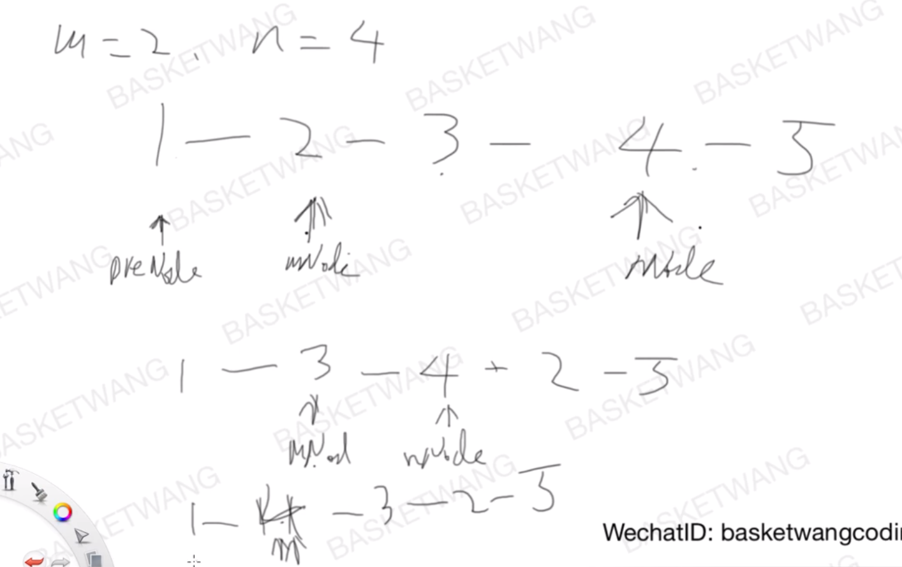

## [92. 反转链表 II](https://leetcode-cn.com/problems/reverse-linked-list-ii/)

### 题目描述

难度中等

反转从位置 *m* 到 *n* 的链表。请使用一趟扫描完成反转。

**说明:**
1 ≤ *m* ≤ *n* ≤ 链表长度。

**示例:**

```
输入: 1->2->3->4->5->NULL, m = 2, n = 4
输出: 1->4->3->2->5->NULL
```

### 分析

题目分析

### 解法一



- 把mnode插到nnode的后面，直到两者重合
- preM和nNode不动

```c++
//篮子王，8ms, 9.8MB
class Solution {
public:
    ListNode* reverseBetween(ListNode* head, int m, int n) {
        if(!head)   return head;
        ListNode *dummy = new ListNode(0);
        dummy->next = head;
        ListNode *mNode = head;
        ListNode *preM = dummy;
        ListNode *nNode = head;
        for(int i=1;i<m;++i){
            preM = mNode;
            mNode = mNode->next;
        }
        for(int i=1;i<n;++i){
            nNode = nNode->next;
        }
        while(mNode!=nNode){
            preM->next = mNode->next;
            mNode->next = nNode->next;
            nNode->next = mNode;
            mNode = preM->next;
        }
        return dummy->next;
    }
};
```

### 解法二

- 模仿206题的写法，主函数部分模仿解法1

```c++
//4ms, 9.9MB
class Solution {
public:
    ListNode* reverseBetween(ListNode* head, int m, int n) {
        if(!head)   return head;
        ListNode *dummy = new ListNode(0);
        dummy->next = head;
        ListNode *mNode = head;
        ListNode *preM = dummy;
        ListNode *nNode = head;
        for(int i=1;i<m;++i){
            preM = mNode;
            mNode = mNode->next;
        }
        for(int i=1;i<n;++i){
            nNode = nNode->next;
        }
        reverse(preM,nNode);
        return dummy->next;
    }
private:
    void reverse(ListNode* _previous, ListNode* _last){
        ListNode *prev = _previous;
        ListNode *curr = prev->next;
        ListNode *next;
        while(prev!=_last){
            next = curr->next;
            curr->next = prev;
            prev = curr;
            curr = next;
        }
        _previous->next->next=curr;
        _previous->next = prev;
    }
};
```

