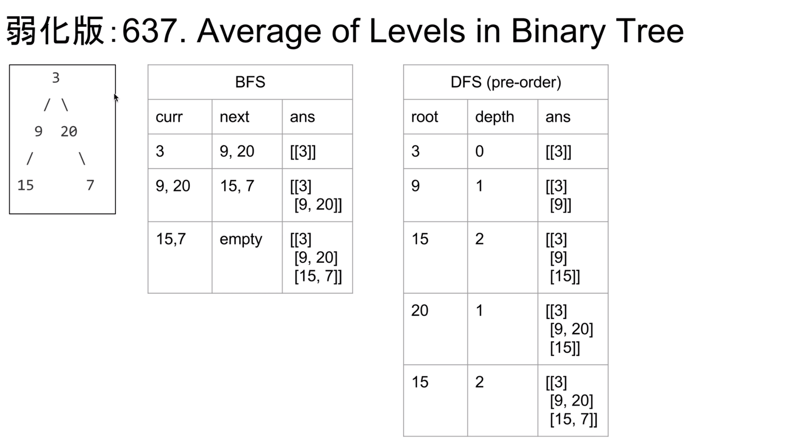

## [102. 二叉树的层次遍历](https://leetcode-cn.com/problems/binary-tree-level-order-traversal/)

### 题目描述

难度中等

给定一个二叉树，返回其按层次遍历的节点值。 （即逐层地，从左到右访问所有节点）。

例如:
给定二叉树: `[3,9,20,null,null,15,7]`,

```
    3
   / \
  9  20
    /  \
   15   7
```

返回其层次遍历结果：

```
[
  [3],
  [9,20],
  [15,7]
]
```

### 分析



### 解法一

DFS O(n)

- 在DFS时需要拷贝深度信息
- 根据`ans`数组的长度和`height`的比较，判断是否要添加新的行

> 在递归深度不深时，可以通过限制DFS的深度，使DFS的时间复杂度和BFS相同，但空间复杂度小很多

```c++
class Solution {
public:
    vector<vector<int>> levelOrder(TreeNode* root) {
        vector<vector<int>> ans;
        DFS(ans, root, 0);
        return ans;
    }
private:
    void DFS(vector<vector<int>>& ans,TreeNode*& p, int height) {
        if(!p) return;
        // Works with pre/in/post order
        while(ans.size()<=height) ans.push_back({});
        //在res中动态添加新的行，可以以前中后三种遍历方式实现levelorder
        ans[height].push_back(p->val); // pre-order
        DFS(p->left, height+1, ans);        
        DFS(p->right, height+1, ans);   
    }
};
```


### 解法二

BFS O(n)

- 使用`curr`和`next`数组分别来保存当前要处理节点、下一步要处理节点
- `ans.push_back({});`为关键一步

```c++
class Solution {
public:
    vector<vector<int>> levelOrder(TreeNode*& root) {
        if(!root) return {};
        vector<vector<int>> ans;
        vector<TreeNode*> curr,next;//当前要处理节点、下一步要处理节点
        curr.push_back(root);
        while(!curr.empty()) {
            ans.push_back({});	//添加新的一行
            for(TreeNode* p : curr) {//遍历当前这一层
                ans.back().push_back(p->val);
                if(p->left) next.push_back(p->left);
                if(p->right) next.push_back(p->right);
            }
            curr.swap(next);
            next.clear();
        }
        return ans;
    }
};
```

