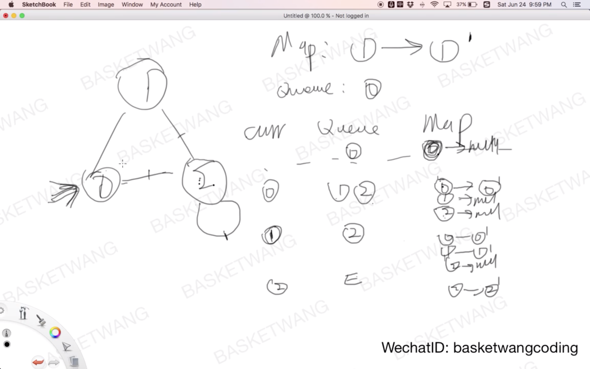
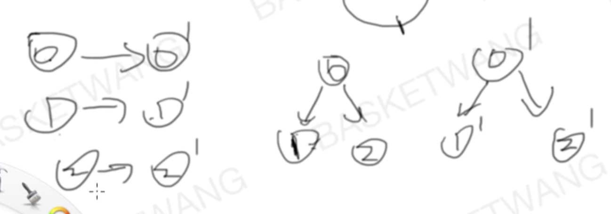

## [133. 克隆图](https://leetcode-cn.com/problems/clone-graph/)

### 题目描述

难度中等

给你无向 **[连通](https://baike.baidu.com/item/连通图/6460995?fr=aladdin)** 图中一个节点的引用，请你返回该图的 [**深拷贝**](https://baike.baidu.com/item/深拷贝/22785317?fr=aladdin)（克隆）。

图中的每个节点都包含它的值 `val`（`int`） 和其邻居的列表（`list[Node]`）。

```java
class Node {
    public int val;
    public List<Node> neighbors;
}
```

 

**测试用例格式：**

简单起见，每个节点的值都和它的索引相同。例如，第一个节点值为 1，第二个节点值为 2，以此类推。该图在测试用例中使用邻接列表表示。

邻接列表是用于表示有限图的无序列表的集合。每个列表都描述了图中节点的邻居集。

给定节点将始终是图中的第一个节点（值为 1）。你必须将 **给定节点的拷贝** 作为对克隆图的引用返回。

 

**示例 1：**


```
输入：adjList = [[2,4],[1,3],[2,4],[1,3]]
输出：[[2,4],[1,3],[2,4],[1,3]]
解释：
图中有 4 个节点。
节点 1 的值是 1，它有两个邻居：节点 2 和 4 。
节点 2 的值是 2，它有两个邻居：节点 1 和 3 。
节点 3 的值是 3，它有两个邻居：节点 2 和 4 。
节点 4 的值是 4，它有两个邻居：节点 1 和 3 。
```

**示例 2：**


```
输入：adjList = [[]]
输出：[[]]
解释：输入包含一个空列表。该图仅仅只有一个值为 1 的节点，它没有任何邻居。
```

**示例 3：**

```
输入：adjList = []
输出：[]
解释：这个图是空的，它不含任何节点。
```

**示例 4：**


```
输入：adjList = [[2],[1]]
输出：[[2],[1]]
```

 

**提示：**

1. 节点数介于 1 到 100 之间。
2. 每个节点值都是唯一的。
3. 无向图是一个[简单图](https://baike.baidu.com/item/简单图/1680528?fr=aladdin)，这意味着图中没有重复的边，也没有自环。
4. 由于图是无向的，如果节点 *p* 是节点 *q* 的邻居，那么节点 *q* 也必须是节点 *p* 的邻居。
5. 图是连通图，你可以从给定节点访问到所有节点。

### 分析

1. clone每一个节点



2. 进行连接



### 解法一

解法一说明

```c++
/*
// Definition for a Node.
class Node {
public:
    int val;
    vector<Node*> neighbors;
    Node() {}
    Node(int _val, vector<Node*> _neighbors) {
        val = _val;
        neighbors = _neighbors;
    }
};
*/
class Solution {
public:
    Node* cloneGraph(Node* node) {
        if ( !node )  return NULL;

        queue<Node *> q;	//利用队列实现图的广度优先遍历
        map<Node *,Node *> m;
        Node *curr;
        Node *p;

        q.push(node);	 //第一个结点入队

        //首先BFS所有节点，一一对应以创建新节点，并保存新节点与原节点的映射关系
        while(!q.empty()) {
            //队头出队到curr
            curr = q.front();	q.pop();
            //新节点创建
            p = new Node(curr->val,{});
            m.insert({curr,p});
            //入队元素
            for( Node *neighbor : curr->neighbors ) 
              	//如果map中已有了该节点，则不入队
                if(!m.count(neighbor))	q.push(neighbor);  
        }

        //遍历所有节点 完成边的拷贝
        map<Node *,Node *>::iterator iter;
        for( iter = m.begin(); iter != m.end(); ++iter ){
            for( Node *neigh : iter->first->neighbors ) {
                iter->second->neighbors.push_back(m.find(neigh)->second);
            }
        }
        return m.find(node)->second;
    }
};
//作者：505968568
//链接：https://leetcode-cn.com/problems/clone-graph/solution/133-ke-long-tu-c-bfsmap-by-505968568/
//来源：力扣（LeetCode）
//著作权归作者所有。商业转载请联系作者获得授权，非商业转载请注明出处。
```

### 解法二

重写以上答案

```c++
class Solution {
public:
    Node* cloneGraph(Node* node) {
        if(!node)   return nullptr;
        queue<Node*> q;
        map<Node*,Node*> m;
        Node *curr, *p;
        q.push(node);
        //第一遍遍历，添加添加节点到map中
        while(!q.empty()) {
            curr=q.front();q.pop();
            p = new Node(curr->val);
            m[curr] = p;
            for(auto& neigh : curr->neighbors) {
                if(m.count(neigh))   continue;
                q.push(neigh);
            }
        }
        //第二遍遍历，将拷贝的节点连接起来
        for(auto& it : m) {
            for(auto& neigh : it.first->neighbors) {
                it.second->neighbors.push_back(m[neigh]);
            }
        }
        return m[node];
    }
};
```

