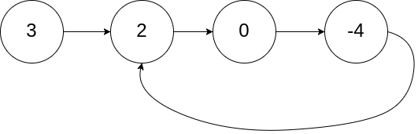
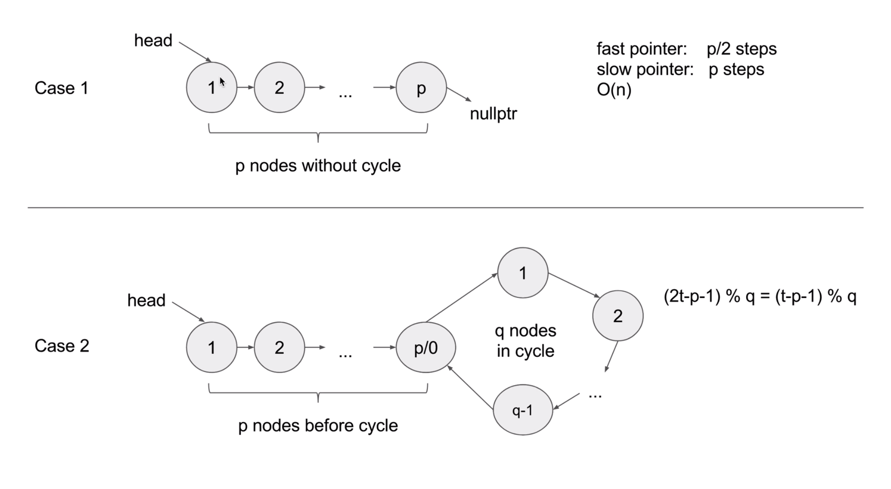

## [141. 环形链表](https://leetcode-cn.com/problems/linked-list-cycle/)

### 题目描述

难度简单

给定一个链表，判断链表中是否有环。

为了表示给定链表中的环，我们使用整数 `pos` 来表示链表尾连接到链表中的位置（索引从 0 开始）。 如果 `pos` 是 `-1`，则在该链表中没有环。

 

**示例 1：**

```
输入：head = [3,2,0,-4], pos = 1
输出：true
解释：链表中有一个环，其尾部连接到第二个节点。
```



**示例 2：**

```
输入：head = [1,2], pos = 0
输出：true
解释：链表中有一个环，其尾部连接到第一个节点。
```


**示例 3：**

```
输入：head = [1], pos = -1
输出：false
解释：链表中没有环。
```


 

**进阶：**

你能用 *O(1)*（即，常量）内存解决此问题吗？

### 分析

题目分析

### 解法一

HashTable

Time complexity: O(n)

Space complexity: O(n)

```c++
// Author: Huahua
// Running time: 16 ms
class Solution {
public:
  bool hasCycle(ListNode *head) {
    unordered_set<ListNode*> seen;
    while (head) {
      if (seen.count(head)) return true;
      seen.insert(head);
      head = head->next;
    }
    return false;
  }
};
```

### 解法二

Fast + Slow pointers



- 快慢指针：快指针每次移动两个距离，慢指针每次移动一个距离
- 快指针先到环里打转，然后慢指针进入环
- 因为快指针移动两步，所以要检查fast->next和fast->next->next后才能进行移动

Time complexity: O(n)

Space complexity: O(1)

```c++
class Solution {
public:
  bool hasCycle(ListNode *head) {
    if(!head)   return false;
    ListNode* slow = head;
    ListNode* fast = head;
    while (fast->next && fast->next->next) {
      slow = slow->next;
      fast = fast->next->next;
      if(slow == fast)	return true;
    }
    return false;
  }
};
```

花花的版本

```c++
class Solution {
public:
  bool hasCycle(ListNode *head) {
    auto slow = head;
    auto fast = head;
    while (fast) {
      if (!fast->next) return false;
      fast = fast->next->next;
      slow = slow->next;
      if (fast == slow) return true;
    }
    return false;
  }
};
```

