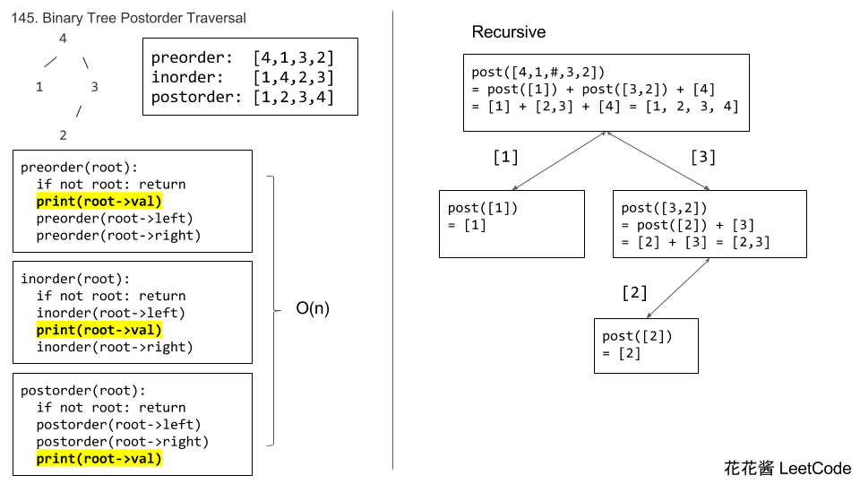
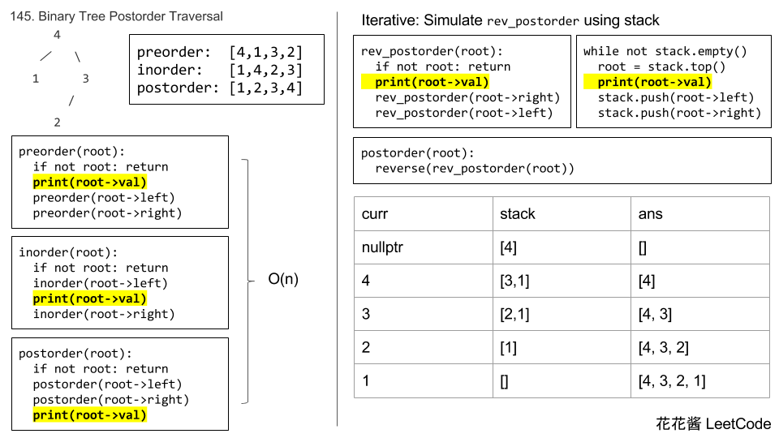

## [145. 二叉树的后序遍历](https://leetcode-cn.com/problems/binary-tree-postorder-traversal/)

### 题目描述

难度困难

给定一个二叉树，返回它的 *后序* 遍历。

**示例:**

```
输入: [1,null,2,3]  
   1
    \
     2
    /
   3 

输出: [3,2,1]
```

**进阶:** 递归算法很简单，你可以通过迭代算法完成吗？

### 分析

### 



### 解法一

recursive 递归

```c++
// Author: Huahua
class Solution {
public:
    vector<int> postorderTraversal(TreeNode* root) {
        vector<int> ans;        
        postorder(root, ans);
        return ans;
    }
    
    void postorder(TreeNode* root, vector<int>& ans) {
        if (!root) return;
        postorder(root->left, ans);
        postorder(root->right, ans);
        ans.push_back(root->val);
    }
};
```

### 解法二

recursive 递归

- 函数式编程
- `ans.insert(ans.end(), l.begin(), l.end());`在`ans`最后插入`l`

```c++
// Author: Huahua
class Solution {
public:
    vector<int> postorderTraversal(TreeNode* root) {
        if (!root) return {};
        vector<int> ans;
        const vector<int> l = postorderTraversal(root->left);
        const vector<int> r = postorderTraversal(root->right);
        ans.insert(ans.end(), l.begin(), l.end());
        ans.insert(ans.end(), r.begin(), r.end());
        ans.push_back(root->val);
        return ans;
    }
};
```

### 解法三

- 后序遍历反转之后为中右左，类似前序遍历的方法
- 花花原本使用deque，在添加时逆序添加，在返回时顺序返回；我将其修改成在返回时逆序的vector
- 学习了vector的另一种定义方式`vector<int>(ans.begin(), ans.end());`

```c++
class Solution {
public:
    vector<int> postorderTraversal(TreeNode* root) {
        if (!root) return {};
        vector<int> ans;
        stack<TreeNode*> s;
        s.push(root);
        while (!s.empty()) {
            TreeNode* n = s.top();
            s.pop();
            ans.push_back(n->val);
            if (n->left) s.push(n->left);
            if (n->right) s.push(n->right);
        }   
        return vector<int>(ans.rbegin(), ans.rend());
    }
};
```

