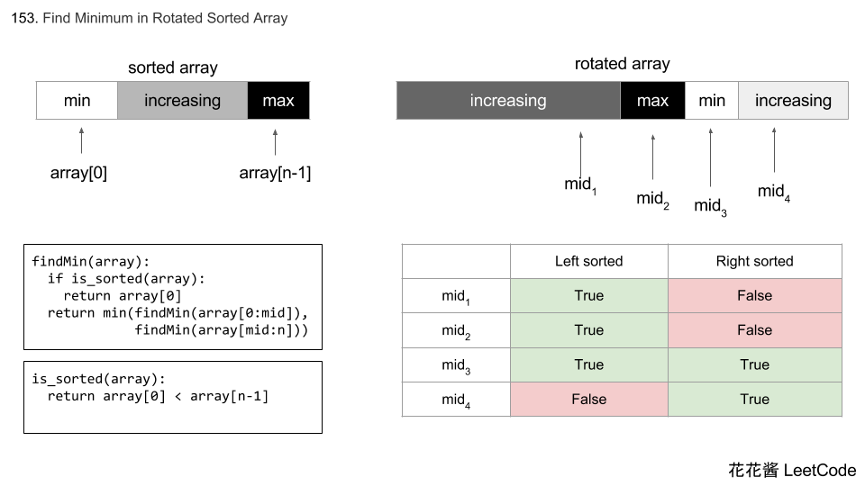
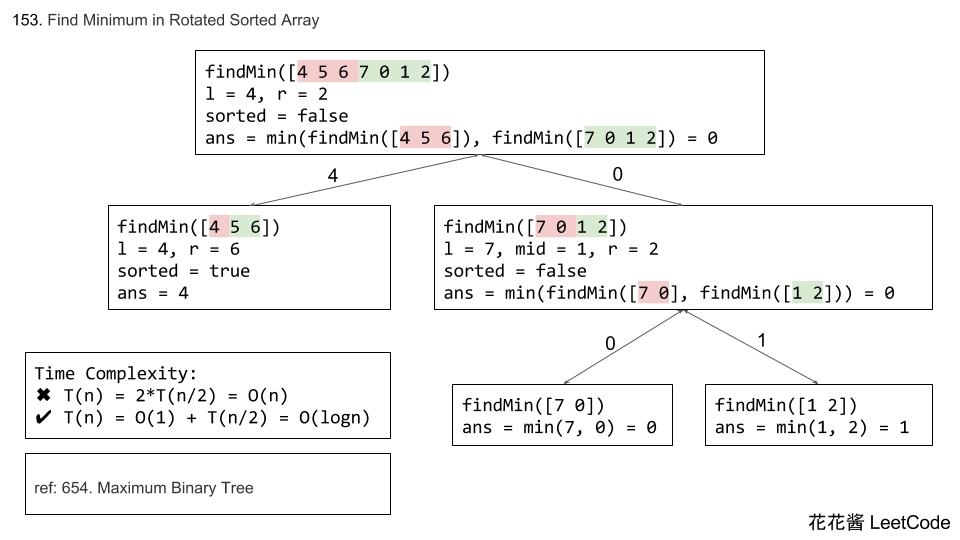

## [153. 寻找旋转排序数组中的最小值](https://leetcode-cn.com/problems/find-minimum-in-rotated-sorted-array/)

### 题目描述

难度中等

假设按照升序排序的数组在预先未知的某个点上进行了旋转。

( 例如，数组 `[0,1,2,4,5,6,7]` 可能变为 `[4,5,6,7,0,1,2]` )。

请找出其中最小的元素。

你可以假设数组中不存在重复元素。

**示例 1:**

```
输入: [3,4,5,1,2]
输出: 1
```

**示例 2:**

```
输入: [4,5,6,7,0,1,2]
输出: 0
```

### 分析

题目分析

### 解法一

我的解答，在模板的基础上修改

```c++
class Solution {
public:
    int findMin(vector<int>& nums) {
        if(nums.empty())    return 0;
        int l=0,r=nums.size()-1;
        int m=l + (r-l)/2;
        while(l+1<r){
            if(nums[m]>nums[r]){
                l=m+1;
                m=l + (r-l)/2;
            }else if(nums[l]>nums[m]){
                m=l+ (m-l)/2;
            }else break;
        }
        if(nums[l]<nums[r]) return nums[l];
        else    return nums[r];
    }
};
```

### 解法二





DAQ方法

- 先找左半边的最小值，再找右半边的最小值

```c++
// Author: Huahua
class Solution {
public:
    int findMin(vector<int> &num) {
        return findMin(num, 0, num.size()-1);
    }
    
private:
    int findMin(const vector<int>& num, int l, int r)
    {
        // Only 1 or 2 elements
        if (l+1 >= r) return min(num[l], num[r]);
        
        // Sorted
        if (num[l] < num[r]) return num[l];
        
        int mid = l + (r-l)/2; 
        
        return min(findMin(num, l, mid-1), 
                   findMin(num, mid, r));
    }
};
```

