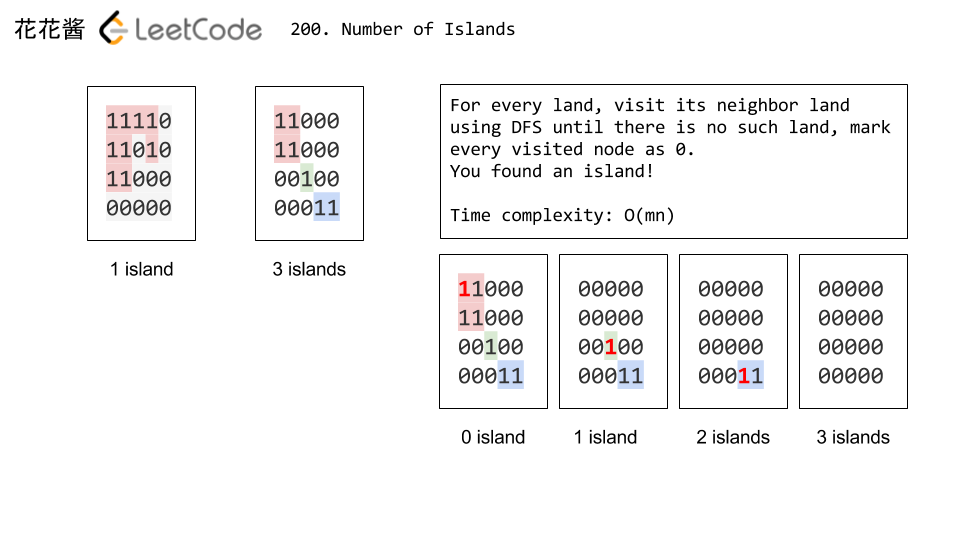

## [200. 岛屿数量](https://leetcode-cn.com/problems/number-of-islands/)

### 题目描述

难度中等

给定一个由 `'1'`（陆地）和 `'0'`（水）组成的的二维网格，计算岛屿的数量。一个岛被水包围，并且它是通过水平方向或垂直方向上相邻的陆地连接而成的。你可以假设网格的四个边均被水包围。

**示例 1:**

```
输入:
11110
11010
11000
00000

输出: 1
```

**示例 2:**

```
输入:
11000
11000
00100
00011

输出: 3
```

### 分析

DFS，不需要回溯

1. 找到陆地，并把它变成水
2. 递归地dfs陆地节点相邻的所有节点




### 解法一

```c++
// Author: Huahua
// Time complexity: O(mn)
// Running time: 6 ms
class Solution {
public:
    int numIslands(vector<vector<char>>& grid) {
        if (grid.empty()) return 0;
        int m = grid.size();
        int n = grid[0].size();
        int ans = 0;
        for (int i = 0; i < m; ++i)
            for (int j = 0; j < n; ++j) {
                ans += grid[i][j] - '0';
                dfs(grid, i, j, m, n);
            }
        return ans;
    }
private:
    void dfs(vector<vector<char>>& grid, int i, int j, int m, int n) {
        if (i < 0 || j < 0 || i >= m || j >= n || grid[i][j] == '0')
            return;
        grid[i][j] = '0';
        dfs(grid,i, j + 1,  m, n);
        dfs(grid,i, j - 1,  m, n);
        dfs(grid,i + 1, j,  m, n);
        dfs(grid,i - 1, j,  m, n);
    }
};
```

### 解法二

解法二说明

```c++

```

