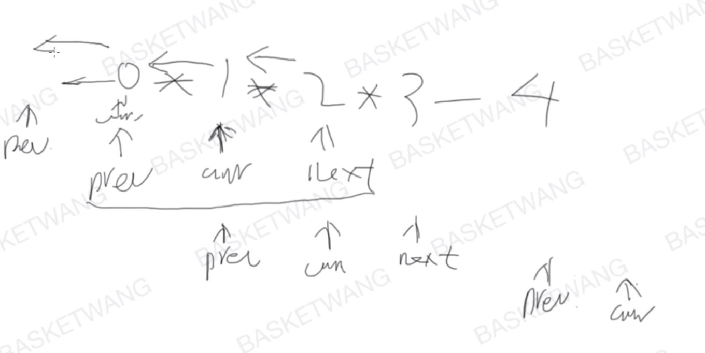
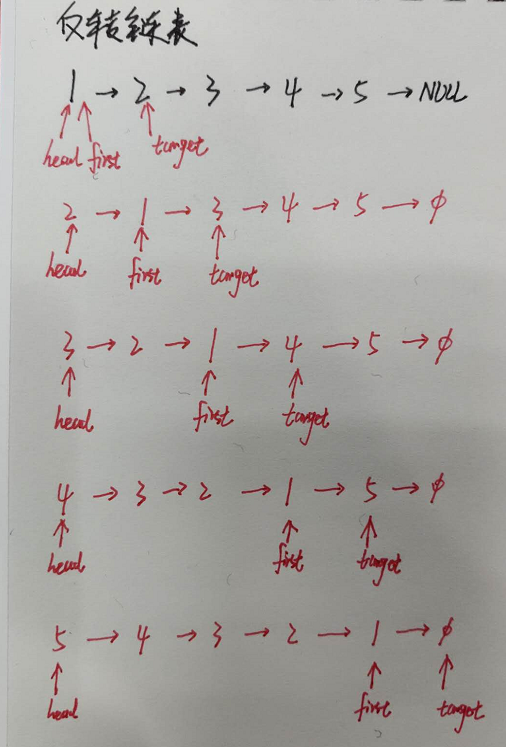

## [206. 反转链表](https://leetcode-cn.com/problems/reverse-linked-list/)

### 题目描述

难度简单

反转一个单链表。

**示例:**

```
输入: 1->2->3->4->5->NULL
输出: 5->4->3->2->1->NULL
```

**进阶:**
你可以迭代或递归地反转链表。你能否用两种方法解决这道题？

### 分析



### 解法一

迭代

- 需要三个指针即可
- 每次循环把curr指向prev

```c++
// Author: Huahua
// Running time: 9 ms
class Solution {
public:
  ListNode* reverseList(ListNode* head) {
    ListNode* prev = nullptr;
    ListNode* curr = head;
    ListNode* next;
    while (curr) {
      next = curr->next;
      curr->next = prev;
      prev = curr;
      curr = next;
    }
    return prev;
  }
};
```

### 解法二

递归



```c++
ListNode* reverseList(ListNode* head) {
  if(!head)	return nullptr;
  return reverse(head, head, head->next);        
}

ListNode* reverse(ListNode* head, ListNode* first, ListNode* target){
  if(!target)	return head;
  first->next = target->next;
  ListNode* temp = target->next;
  target->next = head;
  return reverse(target, first, temp);
}

```

