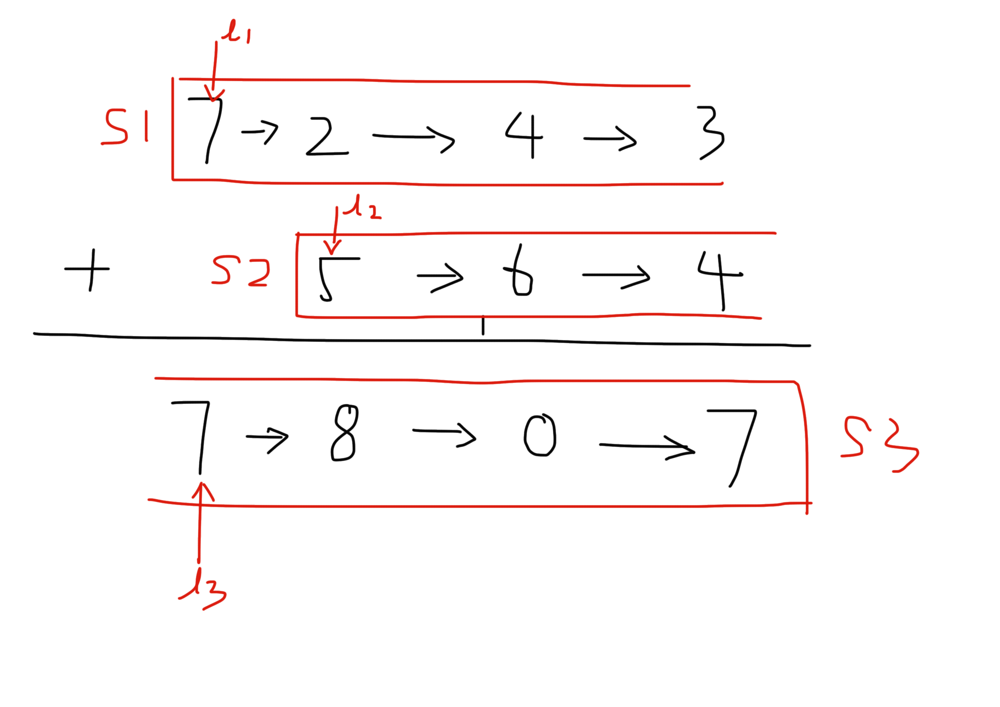

## [445. 两数相加 II](https://leetcode-cn.com/problems/add-two-numbers-ii/)

### 题目描述

给定两个**非空**链表来代表两个非负整数。数字最高位位于链表开始位置。它们的每个节点只存储单个数字。将这两数相加会返回一个新的链表。 

你可以假设除了数字 0 之外，这两个数字都不会以零开头。

**进阶:**

如果输入链表不能修改该如何处理？换句话说，你不能对列表中的节点进行翻转。

**示例:**

```
输入: (7 -> 2 -> 4 -> 3) + (5 -> 6 -> 4)
输出: 7 -> 8 -> 0 -> 7
```

### 分析

由于两个数在链表中从大到小排列，无法从大到小计算。先把两个数放入栈中，则栈顶元素即为最低位，此时可以相加。



### 解法1

```c++
/*
作者：bing-dian-5
链接：https://leetcode-cn.com/problems/add-two-numbers-ii/solution/445-liang-shu-xiang-jia-ii-san-zhan-jie-fa-po-shi-/
来源：力扣（LeetCode）
著作权归作者所有。商业转载请联系作者获得授权，非商业转载请注明出处。
*/
/**
 * Definition for singly-linked list.
 * struct ListNode {
 *     int val;
 *     ListNode *next;
 *     ListNode(int x) : val(x), next(NULL) {}
 * };
 */
class Solution {
public:
    ListNode* addTwoNumbers(ListNode* l1, ListNode* l2){
        //因为对于链表来说：先遍历的节点是后计算的，所以要想到栈的用法，先进后出。
        stack<ListNode*> s1;
        stack<ListNode*> s2;
        while(l1){
            s1.push(l1);
            l1=l1->next;
        }
        while(l2){
            s2.push(l2);
            l2=l2->next;
        }

        int carry=0;    //初始化进位符
        stack<int> s3;  //存储每一位的加和结果
        while(!s1.empty() || !s2.empty() || carry == 1){//这里的carry为1,是防止遇到[5]和[5]这种情况
            int dig=0;  //用num来记录每个位置相加的结果
            if(!s1.empty()){
                dig += s1.top()->val;
                s1.pop();
            }
            if(!s2.empty()){
                dig += s2.top()->val;
                s2.pop();
            }
            dig += carry;
            if(dig >= 10){  //判断dig与10的关系，进而推出有没有进位符号
                dig= dig % 10;
                carry=1;
            }else{
                carry=0;
            }
            s3.push(dig);   //将最终的加和结果存到栈s3中
        }

        //从s3栈输出结果
        ListNode* l3 = new ListNode(s3.top());
        s3.pop();
        ListNode* p = l3;
        while(!s3.empty())
        {
            ListNode* temp=new ListNode(s3.top());
            s3.pop();
            p->next=temp;
            p=p->next;
        }
        return l3;
    }
};
```


### 解法2

```c++
// Author: Huahua
// Running time: 40 ms
class Solution {
public:
  ListNode* addTwoNumbers(ListNode* l1, ListNode* l2) {
    stack<int> s1;
    stack<int> s2;
    while (l1) {
      s1.push(l1->val);
      l1 = l1->next;
    }    
    while (l2) {
      s2.push(l2->val);
      l2 = l2->next;
    }    
    ListNode* head = nullptr;
    int sum = 0;
    while (!s1.empty() || !s2.empty() || sum) {
      sum += s1.empty() ? 0 : s1.top();
      sum += s2.empty() ? 0 : s2.top();
      if (!s1.empty()) s1.pop();
      if (!s2.empty()) s2.pop();            
      ListNode* n = new ListNode(sum % 10);
      sum /= 10;
      n->next = head;
      head = n;      
    }    
    return head;      
  }
};
```

### 解法三

模仿leetcode0002

```c++
// Author: Huahua
// Running time: 40 ms
class Solution {
public:
  ListNode* addTwoNumbers(ListNode* l1, ListNode* l2) {
    stack<int> s1;
    stack<int> s2;
    while (l1) {
      s1.push(l1->val);
      l1 = l1->next;
    }    
    while (l2) {
      s2.push(l2->val);
      l2 = l2->next;
    }    
    ListNode* head = nullptr;
    int sum = 0;
    while (!s1.empty() || !s2.empty() || sum) {
      sum += s1.empty() ? 0 : s1.top();
      sum += s2.empty() ? 0 : s2.top();
      if (!s1.empty()) s1.pop();
      if (!s2.empty()) s2.pop();            
      ListNode* n = new ListNode(sum % 10);
      sum /= 10;
      n->next = head;
      head = n;      
    }    
    return head;      
  }
};
```

