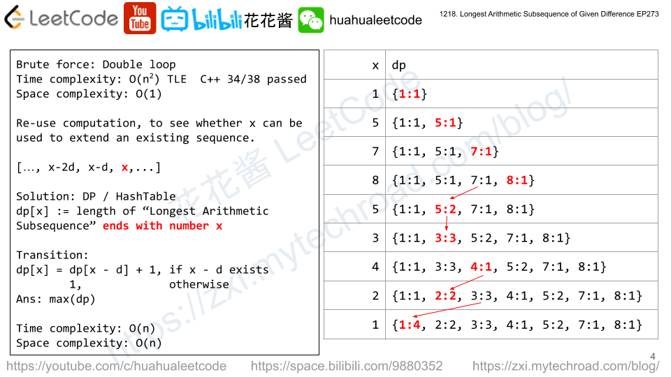

## [1218. 最长定差子序列](https://leetcode-cn.com/problems/longest-arithmetic-subsequence-of-given-difference/)

### 题目描述

难度中等

给你一个整数数组 `arr` 和一个整数 `difference`，请你找出 `arr` 中所有相邻元素之间的差等于给定 `difference` 的等差子序列，并返回其中最长的等差子序列的长度。

**示例 1：**

```
输入：arr = [1,2,3,4], difference = 1
输出：4
解释：最长的等差子序列是 [1,2,3,4]。
```

**示例 2：**

```
输入：arr = [1,3,5,7], difference = 1
输出：1
解释：最长的等差子序列是任意单个元素。
```

**示例 3：**

```
输入：arr = [1,5,7,8,5,3,4,2,1], difference = -2
输出：4
解释：最长的等差子序列是 [7,5,3,1]。
```

**提示：**

- `1 <= arr.length <= 10^5`
- `-10^4 <= arr[i], difference <= 10^4`

### 分析

- 数据规模为10^5可知，若O(n^2)则到了10^10肯定过不了，则时间复杂度不能超过n log n 

- 首先想到brute force的双重循环

  

  

### 解法一



把某个数x变成某个等差数列的最后一个元素，去查找它的前一个元素是否存在

用dp实现 ，即用某个元素本身的值做dp的key

dp[x] := 以x结尾的最长的等差数列的长度

**dp[x]** 

- = dp[x-d] + 1 , if dp[x-d] 存在

- = 1, otherwise

Time complexity: O(n) , Space complexity: O(n)

```c++
//执行用时:188ms,在所有C++提交中击败了56.02%的用户
//内存消耗:55.6MB,在所有C++提交中击败了5.04%的用户
class Solution {
public:
    int longestSubsequence(vector<int>& arr, int difference) {
        unordered_map<int,int> dp;
        int res = 0;
        for(int x : arr) {
            if(dp.count(x-difference)){
                dp[x] = dp[x-difference] + 1;
            }else{
                dp[x] = 1;
            }
        }
        unordered_map<int,int>::iterator it;
        for(it = dp.begin();it != dp.end();++it){
            res = max(res, it->second);
        }
        return res;
    }
};
```


```c++
//156 ms, 56.5 MB
// Author: Huahua
class Solution {
public:
  int longestSubsequence(vector<int>& arr, int difference) {
    unordered_map<int, int> dp;
    int ans = 0;
    for (int x : arr)      
      ans = max(ans, dp[x] = dp[x - difference] + 1);    
    return ans;
  }
};
```

### 解法二

brute force 

先将某个元素作为起始元素，接下来根据difference的值找下一个

时间复杂度为O(n^2)

缺点：没有重复使用计算结果，如5-3-1，3不用再次计算

```c++
//超出时间限制
//34 / 38 个通过测试用例
class Solution {
public:
    int longestSubsequence(vector<int>& arr, int difference) {
        int n=arr.size();
        int res = 0;
        vector<int> temp;
        for(int i=0;i<n;++i) {
            temp.push_back(arr[i]);
            for(int j=i+1;j<n;++j) {
                if(arr[j] == temp.back()+difference) {
                    temp.push_back(arr[j]);
                }
            }
            if(temp.size() > res) res = temp.size();
            temp.clear();
        }
        return res;
    }
};
```

