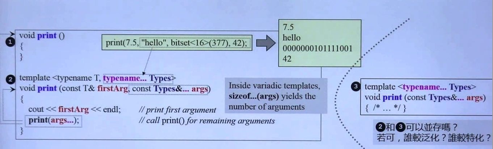

## C++基础知识

### const

1. 修饰变量，说明该变量不可以被改变；

2. 修饰指针，分为指向常量的指针（pointer to const）和自身是常量的指针（常量指针，const pointer）；

   ```c
   const int a = 2;
   const int *p = &a;            // 指向常量的指针
   
   int b = 3;
   int *const p2 = &b;						// 常量指针，指向不能改变
   ```

3. 修饰引用，指向常量的引用（reference to const），用于形参类型，即避免了拷贝，又避免了函数对值的修改；

   ```c
   const int a = 2;
   const int &q = a;			// 指向常量的引用
   ```

4. 修饰成员函数，说明该成员函数内不能修改成员变量。

   ```c
   int getValue() const;  	// 常成员函数，不得修改类中的任何数据成员的值
   ```

> （为了方便记忆可以想成）被 const 修饰（在 const 后面）的值不可改变

### static

#### 修饰变量

静态变量在编译阶段就分配了空间，对象还没创建时就已经分配了空间，放到全局静态区。

类的静态成员变量：静态成员变量属于一个类，所有对象共享。

#### 修饰函数

修饰普通函数：表明函数的作用范围，仅在定义该函数的文件内才能使用。

类的静态成员函数：不需要生成对象就可以访问该函数。不能直接访问普通成员变量，但可以通过参数传递的方式访问。

### explicit

防止类构造函数的隐式自动转换

普通构造函数能够被隐式调用。而explicit构造函数只能被显式调用。

```cpp
Integer a = 1; // 隐式调用
```

### this指针

1. `this` 指针是一个隐含于每一个非静态成员函数中的特殊指针。它指向调用该成员函数的那个对象。
2. 当对一个对象调用成员函数时，编译程序先将对象的地址赋给 `this` 指针。
3. `this` 指针被隐含地声明为: `ClassName *const this`，这意味着不能给 `this` 指针赋值。

### inline 内联函数

- 相当于把内联函数里面的内容写在调用内联函数处；但是内联函数以代码复制为代价，省去了函数调用的开销。
- 相当于宏，却比宏多了类型检查，真正具有函数特性；
- 编译器一般不内联包含循环、递归、switch 等复杂操作的内联函数；
- 在类声明中定义的函数，除了虚函数的其他函数都会自动隐式地当成内联函数；类外需要显式内联。

#### 虚函数（virtual）可以是内联函数（inline）吗？

### volatile

```cpp
volatile int i = 10;
```

- volatile 关键字是一种类型修饰符，用它声明的类型变量表示可以被某些编译器未知的因素（操作系统、硬件、其它线程等）更改。所以使用 volatile 告诉编译器不应对这样的对象进行优化。
- volatile 关键字声明的变量，每次访问时都必须从内存中取出值（没有被 volatile 修饰的变量，可能由于编译器的优化，从 CPU 寄存器中取值）
- const 可以是 volatile （如只读的状态寄存器）
- 指针可以是 volatile

### assert()

断言，是宏，而非函数。assert 宏的原型定义在 `<assert.h>`（C）、`<cassert>`（C++）中，其作用是如果它的条件返回错误，则终止程序执行。可以通过定义 `NDEBUG` 来关闭 assert，但是需要在源代码的开头，`include <assert.h>` 之前。

```cpp
#define NDEBUG        // 加上这行，则 assert 不可用
#include <assert.h>
assert( p != NULL );  // assert 不可用
```

### sizeof()

- sizeof 对数组，得到整个数组所占空间大小。
- sizeof 对指针，得到指针本身所占空间大小。

### struct

#### C++ 中 struct 和 class

总的来说，struct 更适合看成是一个数据结构的实现体，class 更适合看成是一个对象的实现体。

最本质的一个区别就是默认的访问控制：struct 作为数据结构的实现体，它默认的数据访问控制是 public 的，而 class 作为对象的实现体，它默认的成员变量访问控制是 private 的。

#### C和C++中的Struct区别

C++的struct和class接近

| C                                                    | C++                                                          |
| :--------------------------------------------------- | :----------------------------------------------------------- |
| 不能将函数放在结构体声明                             | 能将函数放在结构体声明                                       |
| 在C结构体声明中不能使用C++访问修饰符。               | public、protected、private 在C++中可以使用。                 |
| 在C中定义结构体变量，如果使用了下面定义必须加struct  | 可以不加struct                                               |
| 结构体不能继承（没有这一概念）                       | 可以继承                                                     |
| 若结构体的名字与函数名相同，可以正常运行且正常的调用 | 若结构体的名字与函数名相同，使用结构体，只能使用带struct定义 |

### union 联合


联合（union）是一种节省空间的特殊的类，一个 union 可以有多个数据成员，但是在任意时刻只有一个数据成员可以有值。当某个成员被赋值后其他成员变为未定义状态。

### C 实现 C++ 类

C 实现 C++ 的面向对象特性（封装、继承、多态）

- 封装：使用函数指针把属性与方法封装到结构体中
- 继承：结构体嵌套
- 多态：父类与子类方法的函数指针不同

https://github.com/Light-City/CPlusPlusThings/blob/master/basic_content/c_poly/c%2B%2B_examp.cpp

### explicit（显式）

- explicit 修饰构造函数时，可以防止隐式转换和复制初始化
- explicit 修饰转换函数时，可以防止隐式转换，但 [按语境转换](https://zh.cppreference.com/w/cpp/language/implicit_conversion) 除外

### friend 友元类和友元函数

（1）友元函数：普通函数对一个访问某个类中的私有或保护成员。

（2）友元类：类A中的成员函数访问类B中的私有或保护成员

- 能访问私有成员
- 破坏封装性
- 友元关系不可传递
- 友元关系的单向性
- 友元声明的形式及数量不受限制

### 引用

#### 左值引用

常规引用，一般表示对象的身份。

#### 右值引用

右值引用就是必须绑定到右值（一个临时对象、将要销毁的对象）的引用，一般表示对象的值。

右值引用可实现转移语义（Move Sementics）和精确传递（Perfect Forwarding），它的主要目的有两个方面：

- 消除两个对象交互时不必要的对象拷贝，节省运算存储资源，提高效率。
- 能够更简洁明确地定义泛型函数。

#### 引用折叠

- `X& &`、`X& &&`、`X&& &` 可折叠成 `X&`
- `X&& &&` 可折叠成 `X&&`

### 左值右值

- 一个左值是指向一个指定内存的东西。另一方面，右值就是不指向任何地方的东西
- 左值可以理解为容器，右值为容器中的对象

#### 左值引用

```cpp
int y = 10;
int& yref = y;
yref++;        // y is now 11
```

#### 右值引用

传统的C++规则规定：只有存储在`const`变量（immutable）中的右值才能获取它的地址。传统的C++引用方式称为左值引用。

```cpp
int& x = 666;       // Error
const int& x = 666; // OK
```

C++ 0x引入了右值引用（rvalue reference），**通过在类型名后放置`&&`来表示右值引用。**这些右值引用让你可以改变一个临时对象的值，看上去好像他去掉了上面第二行中的`const`了一样。

```cpp
std::string   s1     = "Hello ";
std::string   s2     = "world";
std::string&& s_rref = s1 + s2;    // the result of s1 + s2 is an rvalue
  s_rref += ", my friend";           // I can change the temporary string!
std::cout << s_rref << '\n';       // prints "Hello world, my friend"
```

`s_rref`是一个对于临时对象的一个引用，或者称之为右值引用

### 强制类型转换

#### static_cast

- 用于非多态类型的转换
- 不执行运行时类型检查（转换安全性不如 dynamic_cast）
- 通常用于转换数值数据类型（如 float -> int）
- 可以在整个类层次结构中移动指针，子类转化为父类安全（向上转换），父类转化为子类不安全（因为子类可能有不在父类的字段或方法）

> 向上转换是一种隐式转换。

#### dynamic_cast

- 用于多态类型的转换
- 执行行运行时类型检查
- 只适用于指针或引用
- 对不明确的指针的转换将失败（返回 nullptr），但不引发异常
- 可以在整个类层次结构中移动指针，包括向上转换、向下转换


在运行时查询一个对象是否能作为某种多态类型使用，相比C风格的强制类型转换和C++ reinterpret_cast，dynamic_cast提供了类型安全检查，是一种基于能力查询(Capability Query)的转换，所以在多态类型间进行转换更提倡采用dynamic_cast。

#### const_cast

- 用于删除 const、volatile 和 __unaligned 特性（如将 const int 类型转换为 int 类型 ）

#### reinterpret_cast

- 用于位的简单重新解释
- 滥用 reinterpret_cast 运算符可能很容易带来风险。 除非所需转换本身是低级别的，否则应使用其他强制转换运算符之一。
- 允许将任何指针转换为任何其他指针类型（如 `char*` 到 `int*` 或 `One_class*` 到 `Unrelated_class*` 之类的转换，但其本身并不安全）
- 也允许将任何整数类型转换为任何指针类型以及反向转换。
- reinterpret_cast 运算符不能丢掉 const、volatile 或 __unaligned 特性。
- reinterpret_cast 的一个实际用途是在哈希函数中，即，通过让两个不同的值几乎不以相同的索引结尾的方式将值映射到索引。

#### bad_cast

- 由于强制转换为引用类型失败，dynamic_cast 运算符引发 bad_cast 异常。

bad_cast 使用

```cpp
try {  
    Circle& ref_circle = dynamic_cast<Circle&>(ref_shape);   
}  
catch (bad_cast b) {  
    cout << "Caught: " << b.what();  
} 
```

## C++11新特性

### 智能指针

对内存进行绑定，然后自动进行管理，申请和释放

#### shared_ptr

它采用引用计数的方法，记录当前内存资源被多少个智能指针引用。该引用计数的内存在堆上分配。当新增一个时引用计数加1，当过期时引用计数减一。只有引用计数为0时，智能指针才会自动释放引用的内存资源。

不能自动将指针转换为智能指针对象，必须显式调用：

```cpp
int* a = new int(2);
shared_ptr<int> sp(a);
sp.reset();
```

#### unique_ptr

保证同一时间内只有一个智能指针可以指向该对象


### std::move()

> https://blog.csdn.net/p942005405/article/details/84644069/
>
> https://zhuanlan.zhihu.com/p/94588204

左值是指表达式结束后依然存在的持久化对象，右值是指表达式结束时就不再存在的临时对象

std::move()的作用：充分利用即将不使用的变量

```cpp
RLavue value;
init(value);//初始化value，可能涉及各种资源构造 
containerValues.push_back(new RLvalue(std::move(value)));
// 这样，处理完value之后，将其保存起来，减少不必要的拷贝
```

将一个左值强制转化为右值引，继而可以通过右值引用使用该值。从实现上讲，std::move基本等同于一个类型转换：static_cast<T&&>(lvalue);

- C++ 标准库使用比如vector::push_back 等这类函数时,会对参数的对象进行复制,连数据也会复制.这就会造成对象内存的额外创建, 本来原意是想把参数push_back进去就行了,通过std::move，可以避免不必要的拷贝操作。
- std::move是将对象的状态或者所有权从一个对象转移到另一个对象，只是转移，没有内存的搬迁或者内存拷贝所以可以提高利用效率,改善性能。
- 对指针类型的标准库对象并不需要这么做

使用前提：

1. 定义的类使用了资源并定义了移动构造函数和移动赋值运算符，
2. 该变量即将不再使用

### lanbda表达式

> https://www.cnblogs.com/jimodetiantang/p/9016826.html

C++ 11 中的 Lambda 表达式用于定义并创建匿名的函数对象，以简化编程工作。
Lambda 的语法形式如下：

```
[函数对象参数] (操作符重载函数参数) mutable 或 exception 声明 -> 返回值类型 {函数体}
```

可以看到，Lambda 主要分为五个部分：[函数对象参数]、(操作符重载函数参数)、mutable 或 exception 声明、-> 返回值类型、{函数体}.

### std::bind

> 《C++ primer》 p345
>
> https://www.jianshu.com/p/f191e88dcc80

可将std::bind函数看作一个通用的函数适配器，它接受一个可调用对象，生成一个新的可调用对象来“适应”原对象的参数列表。

std::bind将可调用对象与其参数一起进行绑定，绑定后的结果可以使用std::function保存。std::bind主要有以下两个作用：

- 将可调用对象和其参数绑定成一个仿函数；
- 只绑定部分参数，减少可调用对象传入的参数。

### Variadic Templates

数量不定的模板参数，可以方便地完成递归函数调用



### nullptr

nullptr是一个字面值常量，可以转换为任意类型的指针类型

在c++中（void* ）不能转化为任意类型的指针，即`int *p = (void*)`是错误的

```cpp
//C语言中NULL定义
#define NULL (void*)0                //c语言中NULL为void类型的指针，但允许将NULL定义为0

//c++中NULL的定义
#ifndef NULL
#ifdef _cpluscplus                       //用于判定是c++类型还是c类型，详情看上一篇blog
#define NULL 0                         //c++中将NULL定义为整数0
#else
#define NULL ((void*)0)             //c语言中NULL为void类型的指针
#endif
#endif
```

### decltype

decltype 关键字用于检查实体的声明类型或表达式的类型及值分类。语法：

```cpp
decltype ( expression )
```

### 其他

- auto
- for (int i : {2, 3, 4})


## 面向对象


### 封装

把客观事物封装成抽象的类，并且类可以把自己的数据和方法只让可信的类或者对象操作，对不可信的进行信息隐藏。关键字：public, protected, private。不写默认为 private。

- `public` 成员：可以被任意实体访问
- `protected` 成员：只允许被子类及本类的成员函数访问
- `private` 成员：只允许被本类的成员函数、友元类或友元函数访问

### 继承

### 在继承关系的类之间的相互转换

- 从派生类到基类的类型转换只对指针或引用有效
- 基类不能向派生类进行类型转换

### 多态

- 多态，即多种状态（形态）。简单来说，我们可以将多态定义为消息以多种形式显示的能力。
- 多态是以封装和继承为基础的。
- C++ 多态分类及实现：
  1. 参数多态性（编译期）：类模板、函数模板
  2. 重载多态（编译期）：函数重载、运算符重载
  3. 子类型多态（运行期）：虚函数
  4. 强制多态（编译期/运行期）：基本类型转换、自定义类型转换

## 虚函数

### 纯虚函数

纯虚函数是一种特殊的虚函数，在基类中不能对虚函数给出有意义的实现，而把它声明为纯虚函数，它的实现留给该基类的派生类去做。

```cpp
virtual int A() = 0;
```

### 虚函数

- 类中的普通函数静态生成，在编译时已确定。而类中的虚函数是动态生成的
- 动态绑定只在使用指针或引用调用虚函数时才会发生
- 虚函数由虚函数表的指向进行访问，不为类的对象分配内存，没有虚函数表就无法访问。

### 回避虚函数

希望对虚函数的调用不进行动态绑定，强制执行虚函数的某个版本。在编译时完成解析。

```cpp
double undiscount = basePrice->Quote::net_price(42);
```


### 虚函数表

- 每个从虚函数派生的类都含有一个虚函数表，对象只有虚指针。表中每个条目都是一个函数指针，指向该类可访问的派生函数。

- vptr虚指针：每个对象实例地址的最前面，隐藏的指向虚函数表的指针。

  

> [C++中的虚函数(表)实现机制以及用C语言对其进行的模拟实现](https://blog.twofei.com/496/)


### 虚继承

虚继承用于解决多继承条件下的菱形继承问题（浪费存储空间、存在二义性）。


```cpp
//直接基类B
class B: virtual public A{  //虚继承
protected:
    int m_b;
};
```

#### 虚继承和虚函数

- 相同之处：都利用了虚指针（均占用类的存储空间）和虚表（均不占用类的存储空间）
- 不同之处：
  - 虚继承
    - 虚基类依旧存在继承类中，只占用存储空间
    - 虚基类表存储的是虚基类相对直接继承类的偏移
  - 虚函数
    - 虚函数不占用存储空间
    - 虚函数表存储的是虚函数地址

### 模板类中虚函数

- 模板类中可以使用虚函数
- 一个类（无论是普通类还是类模板）的成员模板（本身是模板的成员函数）不能是虚函数

### （1） 静态函数可以声明为虚函数吗？

static静态函数不可以声明为虚函数，同时也不能被const 和 volatile关键字修饰

原因：

- 静态成员函数没有this指针，所以无法访问vptr。虚函数依靠vptr和vtable来处理。vptr是一个指针，在类的构造函数中创建生成，并且只能用this指针来访问它。
- static成员函数不属于任何类对象或类实例，所以即使给此函数加上virutal也是没有任何意义

### （2）构造函数可以为虚函数吗？

构造函数不可以声明为虚函数。同时除了inline|explicit之外，构造函数不允许使用其它任何关键字。

- 尽管虚函数表vtable是在编译阶段就已经建立的，但指向虚函数表的指针vptr是在运行阶段实例化对象时才产生的。
  如果类含有虚函数，编译器会在构造函数中添加代码来创建vptr。
  
  构造函数需要在构造时确定。
  
  如果构造函数是虚的，那么它需要vptr来访问vtable，可这个时候**（编译时）vptr还没产生**。 因此，构造函数不可以为虚函数。
  
- 我们之所以使用虚函数，是因为需要在信息不全的情况下进行多态运行。而构造函数是用来初始化实例的，**实例的类型必须是明确的**。 因此，构造函数没有必要被声明为虚函数。

### （3）析构函数可以为虚函数吗？

删除一个指向派生类对象的基类指针。如果析构函数不是虚拟的，则只能调用基类析构函数。

### （4）虚函数可以为私有函数吗？

> https://blog.csdn.net/shltsh/article/details/45999929?utm_medium=distribute.wap_relevant.none-task-blog-BlogCommendFromMachineLearnPai2-1.wap_blog_relevant_pic2&depth_1-utm_source=distribute.wap_relevant.none-task-blog-BlogCommendFromMachineLearnPai2-1.wap_blog_relevant_pic2

- 可以，但是要将int main()必须声明为Base类的友元，否则编译失败。 编译器报错： ptr无法访问私有函数。 或把基类声明为public， 继承类为private。

### （5）虚函数可以被内联吗？

通常类成员函数都会被编译器考虑是否进行内联。 但通过基类指针或者引用调用的虚函数必定不能被内联。 当然，实体对象调用虚函数或者静态调用时可以被内联，虚析构函数的静态调用也一定会被内联展开。

- 虚函数可以是内联函数，内联是可以修饰虚函数的，但是当虚函数表现多态性的时候不能内联。
- **内联是在编译器建议编译器内联，而虚函数的多态性在运行期**，编译器无法知道运行期调用哪个代码，因此虚函数表现为多态性时（运行期）不可以内联。
- `inline virtual` 唯一可以内联的时候是：编译器知道所调用的对象是哪个类（如 `Base::who()`），这只有在编译器具有实际对象而不是对象的指针或引用时才会发生。


## 内存分配和管理

### 内存布局

> https://blog.csdn.net/weixin_40959706/article/details/90753876
>
> CSAPP P587

**代码段**：代码段是用来存放可执行文件的操作指令，也就是说是它是可执行程序在内存中的镜像。代码段需要防止在运行时被非法修改，所以只准许读取操作，而不允许写入（修改）操作——它是不可写的。

**数据段**：数据段用来存放可执行文件中已初始化全局变量，换句话说就是存放程序**静态分配的变量和全局变量**。

**BSS段**：BSS段包含了程序中未初始化全局变量，在内存中bss段全部置零。

**堆（heap）**：堆是用于存放进程运行中被动态分配的内存段，它大小并不固定，可动态扩张或缩减。当进程调用malloc/new等函数分配内存时，新分配的内存就被动态添加到堆上（堆被扩张）；当利用free等函数释放内存时，被释放的内存从堆中被剔除（堆被缩减）

**栈**：栈是用户存放程序临时创建的局部变量，也就是说我们函数括弧“{}”中定义的变量（但不包括static声明的变量，static意味这在数据段中存放变量）。除此以外在函数被调用时，其参数也会被压入发起调用的进程栈中，并且待到调用结束后，函数的返回值也回被存放回栈中。由于栈的先进先出特点，所以栈特别方便用来保存/恢复调用现场。从这个意义上将我们可以把堆栈看成一个临时数据寄存、交换的内存区。

### 内存分配方式

#### 从静态存储区域分配

- 由编译器自动分配和释放的
- 即内存在程序编译的时候就已经分配好，这块内存在程序的整个运行期间都存在，直到整个程序运行结束时才被释放
- 如全局变量与 static 变量

#### 在栈上分配

- 由编译器自动分配和释放的
- 即在执行函数时，函数内局部变量的存储单元都可以在栈上创建，函数执行结束时这些存储单元将被自动释放
- 需要注意的是，栈内存分配运算内置于处理器的指令集中，它的运行效率一般很高，但是分配的内存容量有限。

#### 从堆上分配

- 也被称为动态内存分配，它是由程序员手动完成申请和释放的
- 即程序在运行的时候由程序员使用内存分配函数（如 malloc 函数）来申请任意多少的内存，使用完之后再由程序员自己负责使用内存释放函数（如 free 函数）来释放内存。
- 不释放会导致内存泄露

#### 栈和堆的区别

- 分配和释放方式
- 堆分配中，频繁分配和释放（malloc / free）造成内存空间的不连续，从而造成大量碎片，导致程序效率降低
- 分配效率：栈是底层的数据结构，有专门的寄存器；堆是C++提供的，分配效率更低。
- 申请的大小限制：堆内存的申请大小受限于计算机系统中有效的虚拟内存；栈是一块连续的内存区域，空间更小。

### 如何限制对象只能建立在堆上或者栈上

https://blog.csdn.net/szchtx/article/details/12000867

### 变量存储位置和作用域

#### 全局变量

从静态存储区域分配，其作用域是全局作用域，也就是整个程序的生命周期内都可以使用。

与此同时，如果程序是由多个源文件构成的，那么全局变量只要在一个文件中定义，就可以在其他所有的文件中使用，但必须在其他文件中通过使用extern关键字来声明该全局变量。

#### 全局静态变量

从静态存储区域分配，其生命周期也是与整个程序同在的，从程序开始到结束一直起作用。

但是与全局变量不同的是，全局静态变量作用域只在定义它的一个源文件内，其他源文件不能使用。

#### 局部变量

从栈上分配，其作用域只是在局部函数内。

在定义该变量的函数内，只要出了该函数，该局部变量就不再起作用，该变量的生命周期也只是和该函数同在。

#### 局部静态变量

从静态存储区域分配，其在第一次初始化后就一直存在直到程序结束。

该变量的特点是其作用域只在定义它的函数内可见，出了该函数就不可见了。

### malloc、calloc等

1. malloc：申请指定字节数的内存。申请到的内存中的初始值不确定。
2. calloc：为指定长度的对象，分配能容纳其指定个数的内存。申请到的内存的每一位（bit）都初始化为 0。
3. realloc：更改以前分配的内存长度（增加或减少）。当增加长度时，可能需将以前分配区的内容移到另一个足够大的区域，而新增区域内的初始值则不确定。
4. alloca：在栈上申请内存。程序在出栈的时候，会自动释放内存。但是需要注意的是，alloca 不具可移植性, 而且在没有传统堆栈的机器上很难实现。alloca 不宜使用在必须广泛移植的程序中。C99 中支持变长数组 (VLA)，可以用来替代 alloca。

### malloc、free

用于分配、释放内存

申请内存，确认是否申请成功

```cpp
char *str = (char*) malloc(100);
assert(str != nullptr);
```

释放内存后指针置空

```cpp
free(p); 
p = nullptr;
```

### new、delete

1. new / new[]：完成两件事，先底层调用 malloc 分配了内存（调用operator new），然后调用构造函数（创建对象）。
2. delete/delete[]：也完成两件事，先调用析构函数（清理资源），然后底层调用 free 释放空间。

new 操作符的执行过程：

1. 调用operator new分配内存；
2. 调用构造函数生成类对象；
3. 返回相应指针。

### new和malloc的区别

> https://blog.csdn.net/nie19940803/article/details/76358673

参数：大小是否需要指定

返回类型：对象类型的指针、void* 

分配失败：抛出异常、返回NULL

## ref

- [interview-c++](https://interview.huihut.com/#/)
- [c++那些事](https://light-city.club/sc/)
- 《C++ primer》

