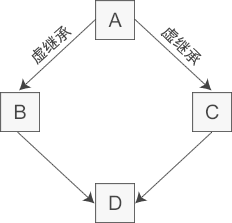

## C++基础知识

### const

1. 修饰变量，说明该变量不可以被改变；

2. 修饰指针，分为指向常量的指针（pointer to const）和自身是常量的指针（常量指针，const pointer）；

   ```c
   const int a = 2;
   const int *p = &a;            // 指向常量的指针
   
   int b = 3;
   int *const p2 = &b;						// 常量指针，指向不能改变
   ```

3. 修饰引用，指向常量的引用（reference to const），用于形参类型，即避免了拷贝，又避免了函数对值的修改；

   ```c
   const int a = 2;
   const int &q = a;			// 指向常量的引用
   ```

4. 修饰成员函数，说明该成员函数内不能修改成员变量。

   ```c
   int getValue() const;  	// 常成员函数，不得修改类中的任何数据成员的值
   ```

> （为了方便记忆可以想成）被 const 修饰（在 const 后面）的值不可改变

### static

1. **修饰普通变量**：修改变量的存储区域和生命周期，**使变量存储在静态区**，在 main 函数运行前就分配了空间，如果有初始值就用初始值初始化它，如果没有初始值系统用默认值初始化它。
2. **修饰普通函数**：表明函数的作用范围，**仅在定义该函数的文件内才能使用**。在多人开发项目时，为了防止与他人命名空间里的函数重名，可以将函数定位为 static。
3. **修饰类的成员变量**：修饰成员变量使**所有的对象只保存一个该变量**，而且不需要生成对象就可以访问该成员。
4. **修饰类的成员函数**：修饰成员函数使得**不需要生成对象就可以访问该函数**，但是在 static 函数内不能访问非静态成员。

### this指针

1. `this` 指针是一个隐含于每一个非静态成员函数中的特殊指针。它指向调用该成员函数的那个对象。
2. 当对一个对象调用成员函数时，编译程序先将对象的地址赋给 `this` 指针。
3. `this` 指针被隐含地声明为: `ClassName *const this`，这意味着不能给 `this` 指针赋值。

### inline 内联函数

- 相当于把内联函数里面的内容写在调用内联函数处；但是内联函数以代码复制为代价，省去了函数调用的开销。
- 相当于宏，却比宏多了类型检查，真正具有函数特性；
- 编译器一般不内联包含循环、递归、switch 等复杂操作的内联函数；
- 在类声明中定义的函数，除了虚函数的其他函数都会自动隐式地当成内联函数；类外需要显式内联。

#### 虚函数（virtual）可以是内联函数（inline）吗？

### volatile

```cpp
volatile int i = 10;
```

- volatile 关键字是一种类型修饰符，用它声明的类型变量表示可以被某些编译器未知的因素（操作系统、硬件、其它线程等）更改。所以使用 volatile 告诉编译器不应对这样的对象进行优化。
- volatile 关键字声明的变量，每次访问时都必须从内存中取出值（没有被 volatile 修饰的变量，可能由于编译器的优化，从 CPU 寄存器中取值）
- const 可以是 volatile （如只读的状态寄存器）
- 指针可以是 volatile

### assert()

断言，是宏，而非函数。assert 宏的原型定义在 `<assert.h>`（C）、`<cassert>`（C++）中，其作用是如果它的条件返回错误，则终止程序执行。可以通过定义 `NDEBUG` 来关闭 assert，但是需要在源代码的开头，`include <assert.h>` 之前。

```cpp
#define NDEBUG        // 加上这行，则 assert 不可用
#include <assert.h>
assert( p != NULL );  // assert 不可用
```

### sizeof()

- sizeof 对数组，得到整个数组所占空间大小。
- sizeof 对指针，得到指针本身所占空间大小。

### struct

#### C++ 中 struct 和 class

总的来说，struct 更适合看成是一个数据结构的实现体，class 更适合看成是一个对象的实现体。

最本质的一个区别就是默认的访问控制：struct 作为数据结构的实现体，它默认的数据访问控制是 public 的，而 class 作为对象的实现体，它默认的成员变量访问控制是 private 的。

#### C和C++中的Struct区别

C++的struct和class接近

| C                                                    | C++                                                          |
| :--------------------------------------------------- | :----------------------------------------------------------- |
| 不能将函数放在结构体声明                             | 能将函数放在结构体声明                                       |
| 在C结构体声明中不能使用C++访问修饰符。               | public、protected、private 在C++中可以使用。                 |
| 在C中定义结构体变量，如果使用了下面定义必须加struct  | 可以不加struct                                               |
| 结构体不能继承（没有这一概念）                       | 可以继承                                                     |
| 若结构体的名字与函数名相同，可以正常运行且正常的调用 | 若结构体的名字与函数名相同，使用结构体，只能使用带struct定义 |

### union 联合


联合（union）是一种节省空间的特殊的类，一个 union 可以有多个数据成员，但是在任意时刻只有一个数据成员可以有值。当某个成员被赋值后其他成员变为未定义状态。

### C 实现 C++ 类

C 实现 C++ 的面向对象特性（封装、继承、多态）

- 封装：使用函数指针把属性与方法封装到结构体中
- 继承：结构体嵌套
- 多态：父类与子类方法的函数指针不同

https://github.com/Light-City/CPlusPlusThings/blob/master/basic_content/c_poly/c%2B%2B_examp.cpp

### explicit（显式）

- explicit 修饰构造函数时，可以防止隐式转换和复制初始化
- explicit 修饰转换函数时，可以防止隐式转换，但 [按语境转换](https://zh.cppreference.com/w/cpp/language/implicit_conversion) 除外

### friend 友元类和友元函数

（1）友元函数：普通函数对一个访问某个类中的私有或保护成员。

（2）友元类：类A中的成员函数访问类B中的私有或保护成员

- 能访问私有成员
- 破坏封装性
- 友元关系不可传递
- 友元关系的单向性
- 友元声明的形式及数量不受限制

### decltype

decltype 关键字用于检查实体的声明类型或表达式的类型及值分类。语法：

```cpp
decltype ( expression )
```

### 引用

#### 左值引用

常规引用，一般表示对象的身份。

#### 右值引用

右值引用就是必须绑定到右值（一个临时对象、将要销毁的对象）的引用，一般表示对象的值。

右值引用可实现转移语义（Move Sementics）和精确传递（Perfect Forwarding），它的主要目的有两个方面：

- 消除两个对象交互时不必要的对象拷贝，节省运算存储资源，提高效率。
- 能够更简洁明确地定义泛型函数。

#### 引用折叠

- `X& &`、`X& &&`、`X&& &` 可折叠成 `X&`
- `X&& &&` 可折叠成 `X&&`

### 左值右值

- 一个左值是指向一个指定内存的东西。另一方面，右值就是不指向任何地方的东西
- 左值可以理解为容器，右值为容器中的对象

#### 左值引用

```cpp
int y = 10;
int& yref = y;
yref++;        // y is now 11
```

#### 右值引用

传统的C++规则规定：只有存储在`const`变量（immutable）中的右值才能获取它的地址。传统的C++引用方式称为左值引用。

```cpp
int& x = 666;       // Error
const int& x = 666; // OK
```

C++ 0x引入了右值引用（rvalue reference），**通过在类型名后放置`&&`来表示右值引用。**这些右值引用让你可以改变一个临时对象的值，看上去好像他去掉了上面第二行中的`const`了一样。

```cpp
std::string   s1     = "Hello ";
std::string   s2     = "world";
std::string&& s_rref = s1 + s2;    // the result of s1 + s2 is an rvalue
  s_rref += ", my friend";           // I can change the temporary string!
std::cout << s_rref << '\n';       // prints "Hello world, my friend"
```

`s_rref`是一个对于临时对象的一个引用，或者称之为右值引用

### 强制类型转换

#### static_cast

- 用于非多态类型的转换
- 不执行运行时类型检查（转换安全性不如 dynamic_cast）
- 通常用于转换数值数据类型（如 float -> int）
- 可以在整个类层次结构中移动指针，子类转化为父类安全（向上转换），父类转化为子类不安全（因为子类可能有不在父类的字段或方法）

> 向上转换是一种隐式转换。

#### dynamic_cast

- 用于多态类型的转换
- 执行行运行时类型检查
- 只适用于指针或引用
- 对不明确的指针的转换将失败（返回 nullptr），但不引发异常
- 可以在整个类层次结构中移动指针，包括向上转换、向下转换

#### const_cast

- 用于删除 const、volatile 和 __unaligned 特性（如将 const int 类型转换为 int 类型 ）

#### reinterpret_cast

- 用于位的简单重新解释
- 滥用 reinterpret_cast 运算符可能很容易带来风险。 除非所需转换本身是低级别的，否则应使用其他强制转换运算符之一。
- 允许将任何指针转换为任何其他指针类型（如 `char*` 到 `int*` 或 `One_class*` 到 `Unrelated_class*` 之类的转换，但其本身并不安全）
- 也允许将任何整数类型转换为任何指针类型以及反向转换。
- reinterpret_cast 运算符不能丢掉 const、volatile 或 __unaligned 特性。
- reinterpret_cast 的一个实际用途是在哈希函数中，即，通过让两个不同的值几乎不以相同的索引结尾的方式将值映射到索引。

#### bad_cast

- 由于强制转换为引用类型失败，dynamic_cast 运算符引发 bad_cast 异常。

bad_cast 使用

```cpp
try {  
    Circle& ref_circle = dynamic_cast<Circle&>(ref_shape);   
}  
catch (bad_cast b) {  
    cout << "Caught: " << b.what();  
} 
```


## 面向对象


### 封装

把客观事物封装成抽象的类，并且类可以把自己的数据和方法只让可信的类或者对象操作，对不可信的进行信息隐藏。关键字：public, protected, private。不写默认为 private。

- `public` 成员：可以被任意实体访问
- `protected` 成员：只允许被子类及本类的成员函数访问
- `private` 成员：只允许被本类的成员函数、友元类或友元函数访问

### 继承

- 基类（父类）——> 派生类（子类）

### 多态

- 多态，即多种状态（形态）。简单来说，我们可以将多态定义为消息以多种形式显示的能力。
- 多态是以封装和继承为基础的。
- C++ 多态分类及实现：
  1. 重载多态（编译期）：函数重载、运算符重载
  2. 子类型多态（运行期）：虚函数
  3. 参数多态性（编译期）：类模板、函数模板
  4. 强制多态（编译期/运行期）：基本类型转换、自定义类型转换

## 虚函数

### 纯虚函数

纯虚函数是一种特殊的虚函数，在基类中不能对虚函数给出有意义的实现，而把它声明为纯虚函数，它的实现留给该基类的派生类去做。

```cpp
virtual int A() = 0;
```

#### 虚函数和纯虚函数

- 虚函数在基类中是实现的，在子类里面可以不重写；纯虚函数在基类中只有声明，通过声明中赋值0来声明纯虚函数，必须在子类实现才可以实例化子类。
- 虚函数的类用于 “实作继承”，继承接口的同时也继承了父类的实现。纯虚函数关注的是接口的统一性，实现由子类完成。
- 带纯虚函数的类叫抽象类，这种类不能直接生成对象，而只有被继承，并重写其虚函数后，才能使用。抽象类被继承后，子类可以继续是抽象类，也可以是普通类。
- 虚基类是虚继承中的基类，具体见下文虚继承。

> [CSDN . C++ 中的虚函数、纯虚函数区别和联系](https://blog.csdn.net/u012260238/article/details/53610462)

### 虚函数表

- vptr：隐藏的指向基类的指针。
- 每个从虚函数派生的类都有自己的虚拟表。表中每个条目都是一个函数指针，指向该类可访问的派生函数。

> [C++中的虚函数(表)实现机制以及用C语言对其进行的模拟实现](https://blog.twofei.com/496/)


### 虚继承

虚继承用于解决多继承条件下的菱形继承问题（浪费存储空间、存在二义性）。




```cpp
//直接基类B
class B: virtual public A{  //虚继承
protected:
    int m_b;
};
```

#### 虚继承、虚函数

- 相同之处：都利用了虚指针（均占用类的存储空间）和虚表（均不占用类的存储空间）
- 不同之处：
  - 虚继承
    - 虚基类依旧存在继承类中，只占用存储空间
    - 虚基类表存储的是虚基类相对直接继承类的偏移
  - 虚函数
    - 虚函数不占用存储空间
    - 虚函数表存储的是虚函数地址

### 模板类中虚函数

- 模板类中可以使用虚函数
- 一个类（无论是普通类还是类模板）的成员模板（本身是模板的成员函数）不能是虚函数

### （1） 静态函数可以声明为虚函数吗？

**static静态函数不可以声明为虚函数，同时也不能被const 和 volatile关键字修饰**

原因：

- 静态成员函数没有this指针，所以无法访问vptr。虚函数依靠vptr和vtable来处理。vptr是一个指针，在类的构造函数中创建生成，并且只能用this指针来访问它。
- static成员函数不属于任何类对象或类实例，所以即使给此函数加上virutal也是没有任何意义

### （2）构造函数可以为虚函数吗？

构造函数不可以声明为虚函数。同时除了inline|explicit之外，构造函数不允许使用其它任何关键字。

- 尽管虚函数表vtable是在编译阶段就已经建立的，但指向虚函数表的指针vptr是在运行阶段实例化对象时才产生的。
  如果类含有虚函数，编译器会在构造函数中添加代码来创建vptr。 问题来了，如果构造函数是虚的，那么它需要vptr来访问vtable，可这个时候**（编译时）vptr还没产生**。 因此，构造函数不可以为虚函数。
- 我们之所以使用虚函数，是因为需要在信息不全的情况下进行多态运行。而构造函数是用来初始化实例的，**实例的类型必须是明确的**。 因此，构造函数没有必要被声明为虚函数。

### （3）析构函数可以为虚函数吗？

删除一个指向派生类对象的基类指针。如果析构函数不是虚拟的，则只能调用基类析构函数。

### （4）虚函数可以为私有函数吗？

- 可以，但是要将int main()必须声明为Base类的友元，否则编译失败。 编译器报错： ptr无法访问私有函数。 或把基类声明为public， 继承类为private。

### （5）虚函数可以被内联吗？

通常类成员函数都会被编译器考虑是否进行内联。 但通过基类指针或者引用调用的虚函数必定不能被内联。 当然，实体对象调用虚函数或者静态调用时可以被内联，虚析构函数的静态调用也一定会被内联展开。

- 虚函数可以是内联函数，内联是可以修饰虚函数的，但是当虚函数表现多态性的时候不能内联。
- **内联是在编译器建议编译器内联，而虚函数的多态性在运行期**，编译器无法知道运行期调用哪个代码，因此虚函数表现为多态性时（运行期）不可以内联。
- `inline virtual` 唯一可以内联的时候是：编译器知道所调用的对象是哪个类（如 `Base::who()`），这只有在编译器具有实际对象而不是对象的指针或引用时才会发生。

### dynamic_cast

在运行时查询一个对象是否能作为某种多态类型使用，相比C风格的强制类型转换和C++ reinterpret_cast，dynamic_cast提供了类型安全检查，是一种基于能力查询(Capability Query)的转换，所以在多态类型间进行转换更提倡采用dynamic_cast。

## 内存分配和管理

### malloc等

1. malloc：申请指定字节数的内存。申请到的内存中的初始值不确定。
2. calloc：为指定长度的对象，分配能容纳其指定个数的内存。申请到的内存的每一位（bit）都初始化为 0。
3. realloc：更改以前分配的内存长度（增加或减少）。当增加长度时，可能需将以前分配区的内容移到另一个足够大的区域，而新增区域内的初始值则不确定。
4. alloca：在栈上申请内存。程序在出栈的时候，会自动释放内存。但是需要注意的是，alloca 不具可移植性, 而且在没有传统堆栈的机器上很难实现。alloca 不宜使用在必须广泛移植的程序中。C99 中支持变长数组 (VLA)，可以用来替代 alloca。

### malloc、free

用于分配、释放内存

申请内存，确认是否申请成功

```cpp
char *str = (char*) malloc(100);
assert(str != nullptr);
```

释放内存后指针置空

```cpp
free(p); 
p = nullptr;
```

### new、delete

1. new / new[]：完成两件事，先底层调用 malloc 分配了内存，然后调用构造函数（创建对象）。
2. delete/delete[]：也完成两件事，先调用析构函数（清理资源），然后底层调用 free 释放空间。
3. new 在申请内存时会自动计算所需字节数，而 malloc 则需我们自己输入申请内存空间的字节数。


## ref

- [interview-c++](https://interview.huihut.com/#/)
- [c++那些事](https://light-city.club/sc/)
- 《C++ primer》

