## 分析complex类

### inline内联函数

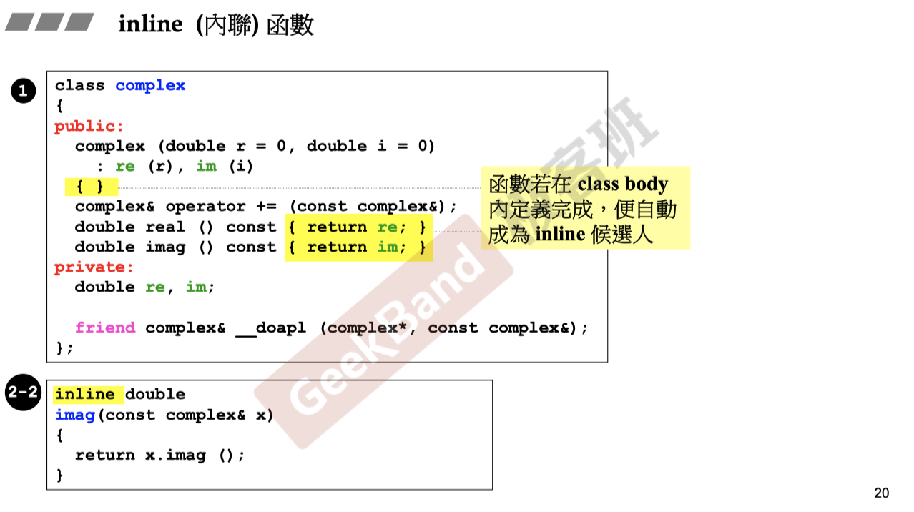

- inline可以解决一些**频繁调用的小函数**大量消耗栈空间的问题
- inline只是对编译器的建议，最终是否内联取决于编译器
- 定义在类中的成员函数缺省都是内联，类外需要加inline

### ctor构造函数

#### 初始化

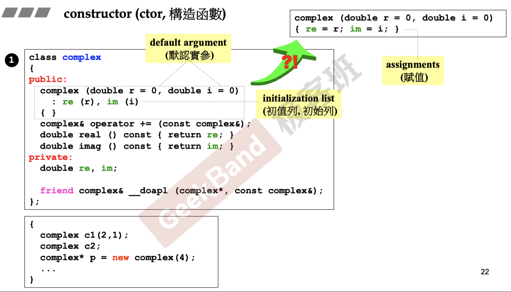

```cpp
complex(double r = 0, double i = 0) 
  : re(r), im(i) {}
```

使用这种方式比直接在构造函数中赋值更快，推荐使用

#### ctor放在private区

单例模式

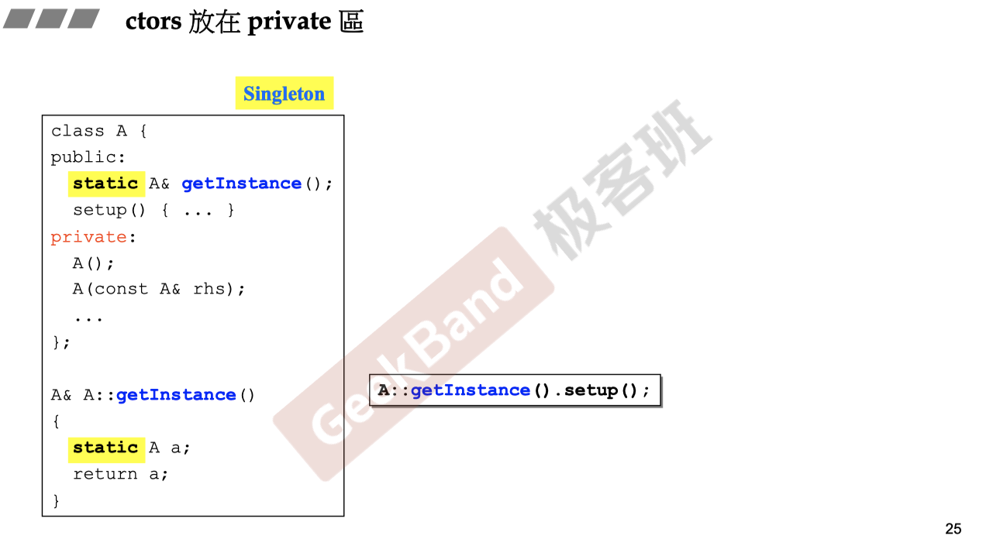

### 常量成员函数

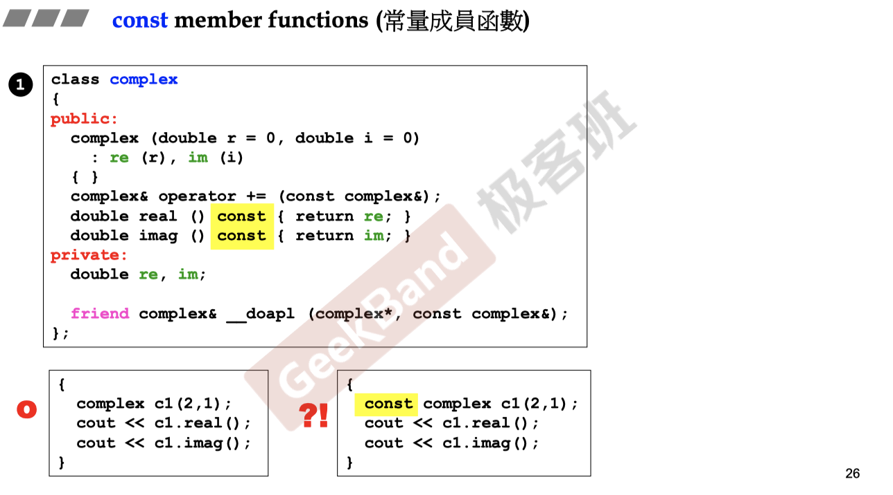

```cpp
class complex {
public:
  ...
  double real() const {return re;} 
  double imag() const {return im;}
  //如果这两个方法定义时没有加入const关键字，调用时将报错。
};

{
  const complex c1(2, 1);
  cout << c1.real() << c1.imag();
}
```


### 友元

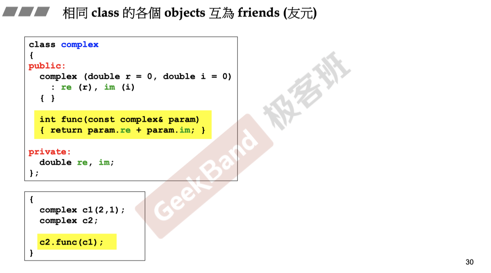

相同类的各个实例对象互为友元，可以通过内部方法调用友元的private变量。

### this指针

所有的成员函数都带有的隐藏参数

```cpp
inline complex& __doapl(complex* ths, const complex& r) {
    ths->re += r.re;
    ths->im += r.im;
    return *ths;
}

inline complex& complex::operator+=(const complex& r) {
    return __doapl(this, r);
}
```

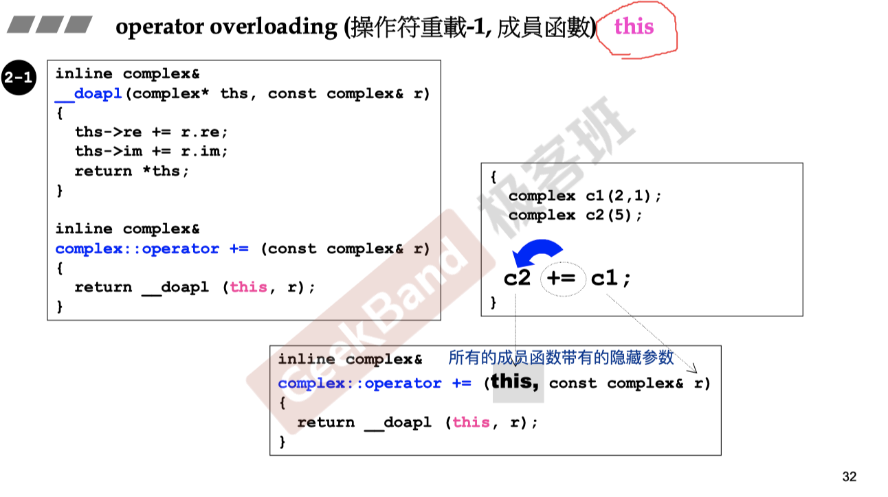

### 运算符重载

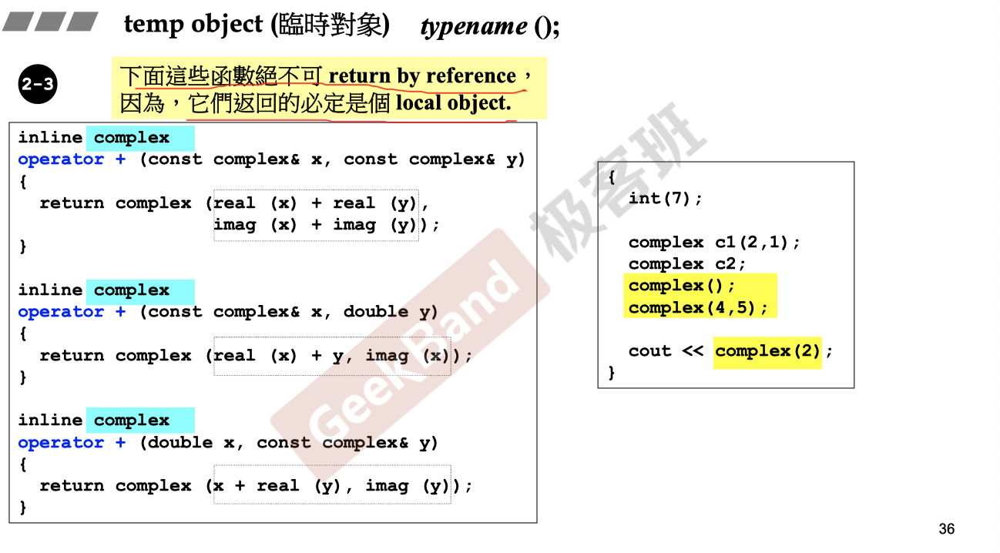

非成员函数

不可以return by reference，因为返回的必定是local object

```cpp
inline complex operator+(const complex& x, const complex& y) {
    return complex(real(x) + real(y), imag(x) + imag(y));
}
```

## 分析String类

### 构造函数与析构函数

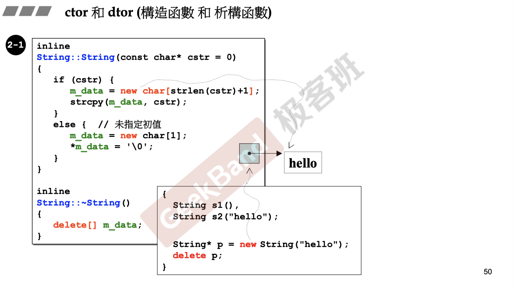

以指针为成员的类必须有拷贝构造函数copy ctor和拷贝赋值函数copy op=，否则会造成内存泄露

#### 拷贝构造

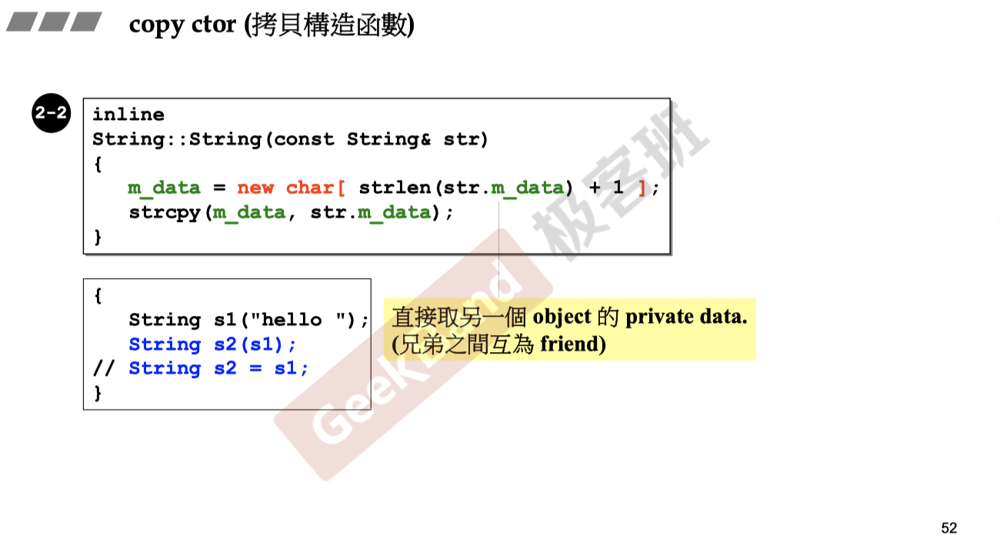

#### 拷贝赋值

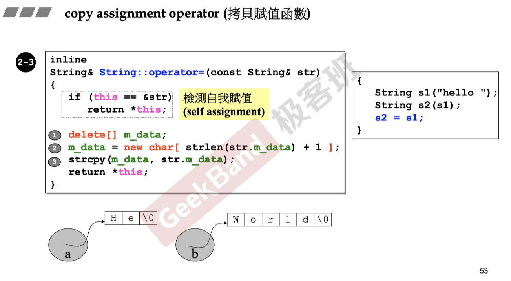


### output函数

需要return os，因为<<运算符使用时可能连续使用，
如 cout<< s1 << s2 << endl;


### 栈与堆

stack：存在于作用域的一块内存空间。在函数本体内声明的任何变量，其使用的内存块都来自于stack。

heap：或称system heap，指系统提供的一块global内存空间，程序可动态分配(dynamic allocate)从中获取若干区块。

```cpp
class Complex{...};

{
  Complex c1(1, 2); // c1所占用的空间来自于stack
  //c1：stack object，在作用域结束时结束，又称作auto object，会被自动清理。
  Complex *p = new Complex(3);
  // Complex(3)是个临时对象，其所占用的空间是new自heap
  delete p;  // 需要delete自行释放
  static Complex c2(1, 2);
  //c2：static object，其生命在作用域(scope)结束后继续存在，直到整个程序结束
}

Complex c3(1, 2);
//c3：global object，其生命在整个程序结束后结束，可以视作一种static object
```


### new与delete

编译器将new操作转化为分配内存、转型、构造函数先后三个操作。

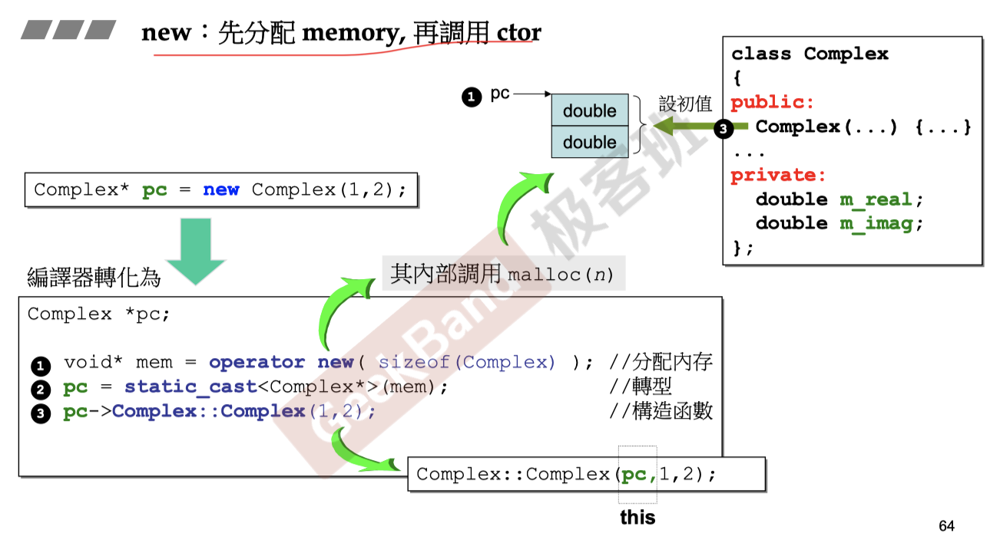

```cpp
void *mem = operator new(sizeof(Complex));
pc = static_cast<Complex*>(mem);
pc->Complex::Complex(1, 2);
```

编译器将delete操作转化为析构函数、释放内存两个操作

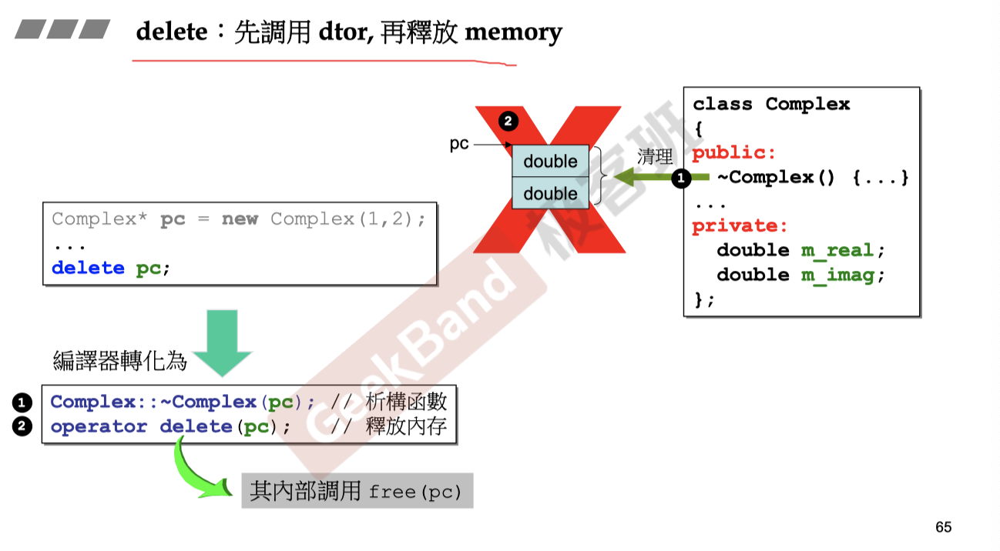

```cpp
Complex::~Complex(pc);
operator delete(pc);
```

### 动态分配内存

左侧两个框，是Complex对象在调试模式和release模式下，编译器做出的内存分配。右侧是String对象。


对于数组对象，编译器的内存分配：


删除数组对象需要使用delete[]方法，而不是delete方法


### explicit

普通构造函数能够被隐式调用。而explicit构造函数只能被显式调用。

```cpp
class Test1 {
public:
    Test1(int n) {
        num = n;
    }//普通构造函数
private:
    int num;
};

class Test2 {
public:
    explicit Test2(int n) {
        num = n;
    }//explicit(显式)构造函数
private:
    int num;
};

int main() {
    Test1 t1=1;	//隐式调用其构造函数,成功
    Test2 t2=1;	//编译错误,不能隐式调用其构造函数
    Test2 t2(1);	//显式调用成功
    return 0;
}
```

### 类模板


### 函数模板

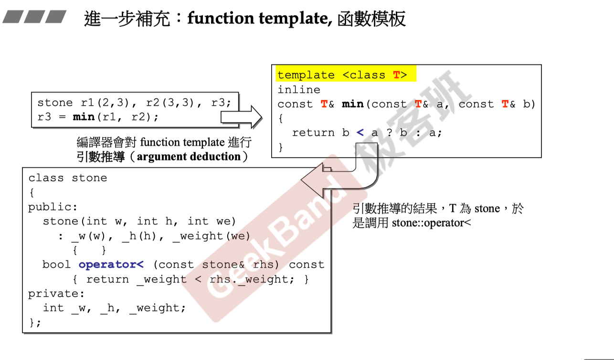

### 虚函数

非虚函数：不能被继承

虚函数：有默认定义，可以重写

纯虚函数：必须要重写

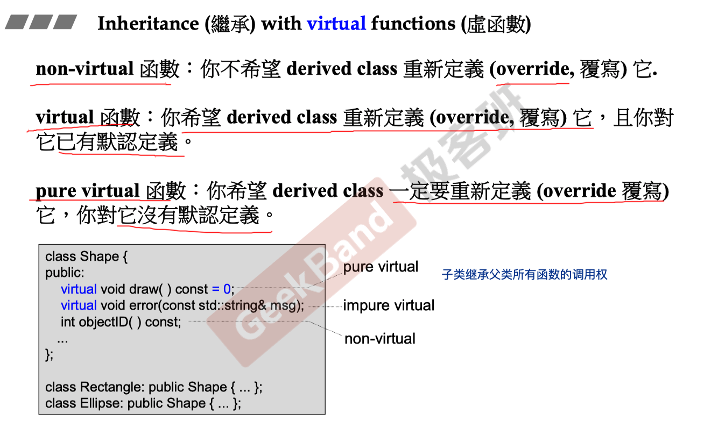

继承关系下的构造和析构：

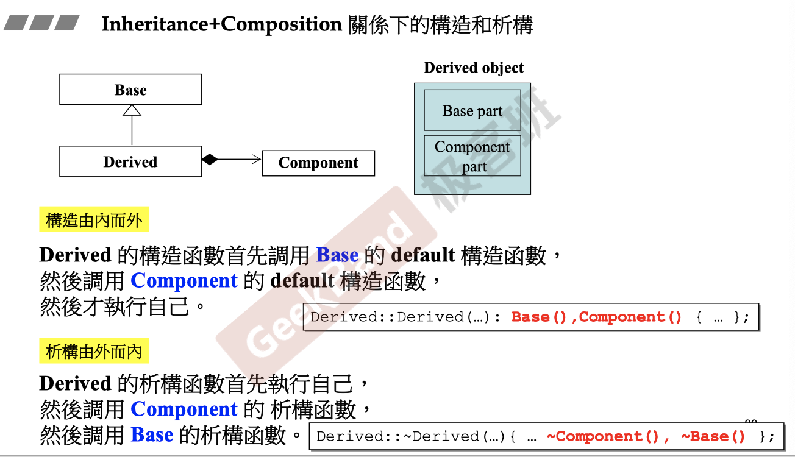


## 泛型编程和面向对象

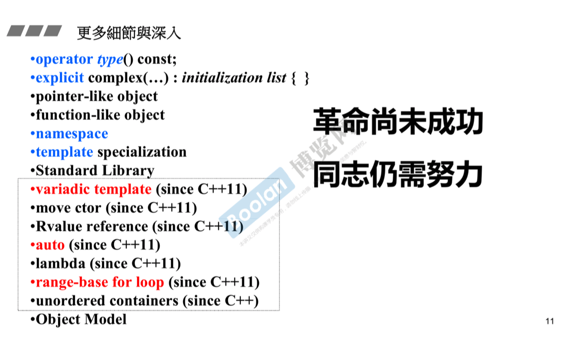

### 转换函数

explict：用以限制函数，禁止其被自动调用。

下图中，如没有explict修饰，最后一行会自动把4转化为Fraction对象

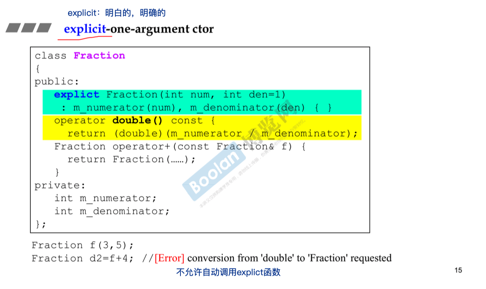

### 智能指针

> 能像指针一样使用的class（pointer-like classes）

通过运算符重载，使智能指针也可以使用 * 和 -> 符号。（-> 符号的作用要传递到底）


**迭代器**可以理解为一种智能指针

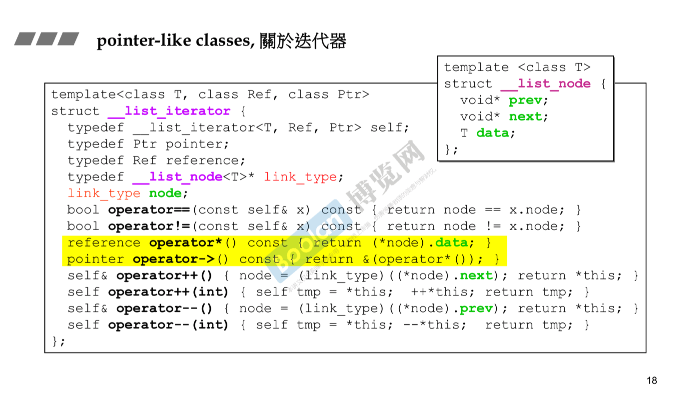

### 仿函数

> 能像函数一样操作的类（function like classes）

看到class中重载`()`，为仿函数

标准库中的仿函数：

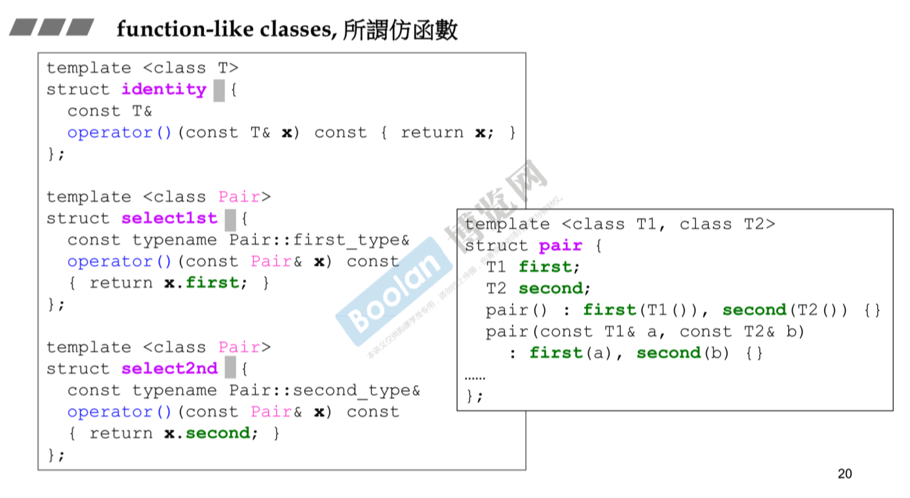

```cpp
// 使用仿函数
pair<int,int> p1;
select1st<pair>()(p1);	//第一个括号：创建临时对象
```

### 泛型编程

#### 类模板

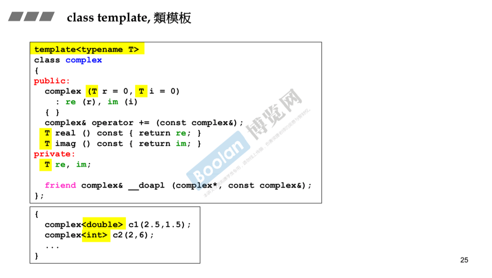

#### 函数模板

类模板使用时需要指定类型，函数模板不用指定类型

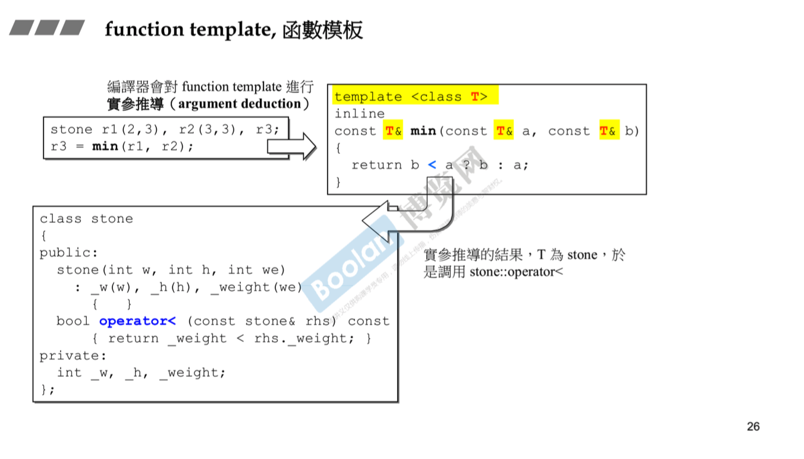

模板的编译需要在使用时再次编译

#### 成员模板

pair是模板中的member，同时也是一个template，因此称作member template

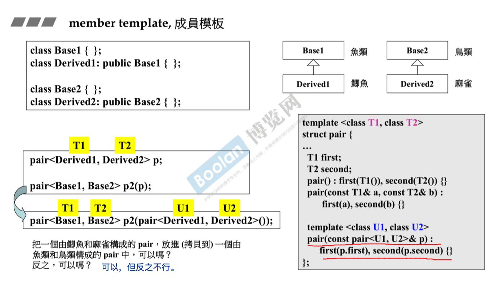

目的：使模板更有弹性。

#### 模板特化

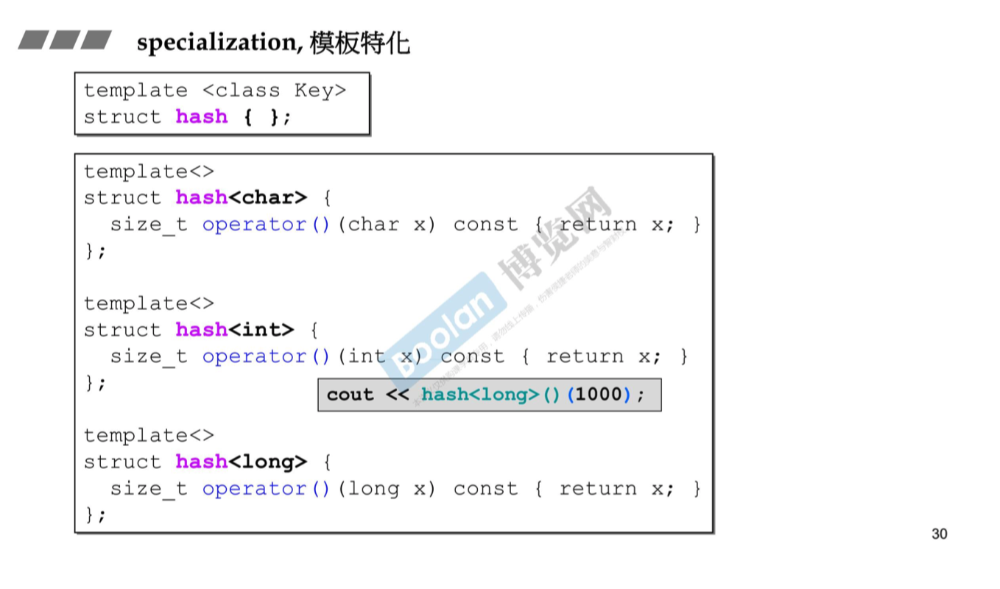

#### 偏特化

个数的偏：几个模板参数中固定一个


范围的偏：任意类型转化为某个特定类型，如指针类型

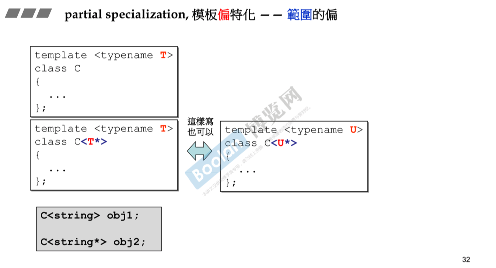