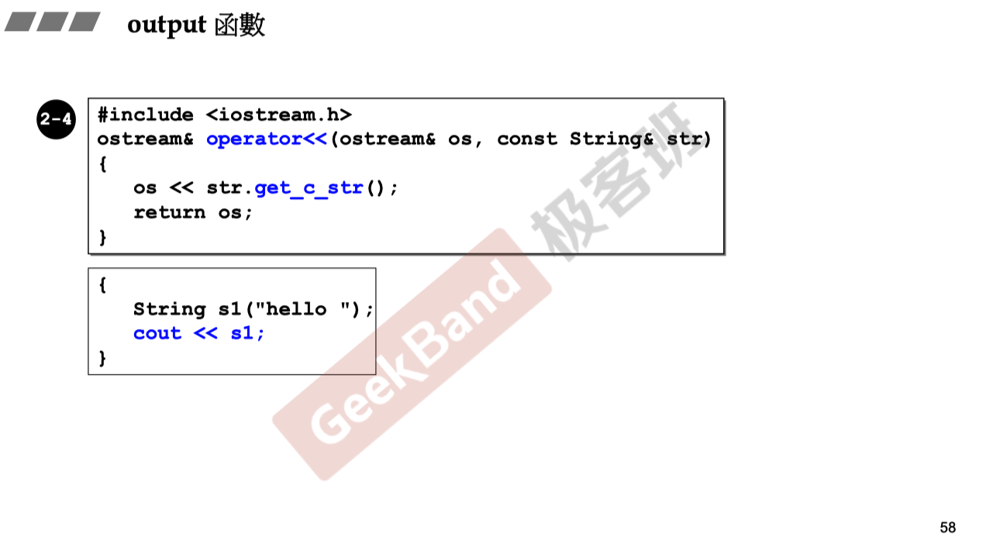
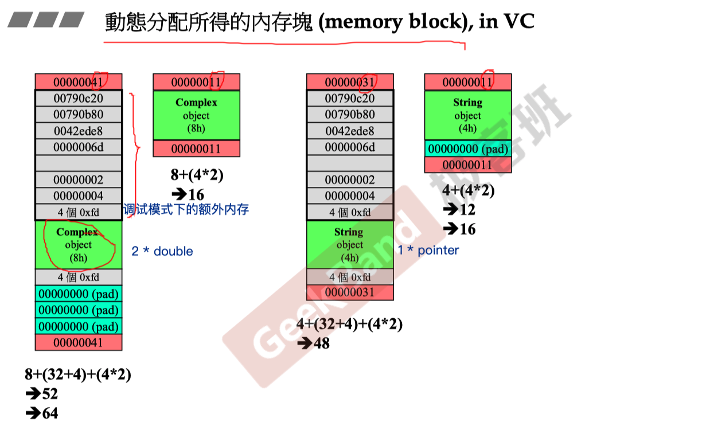
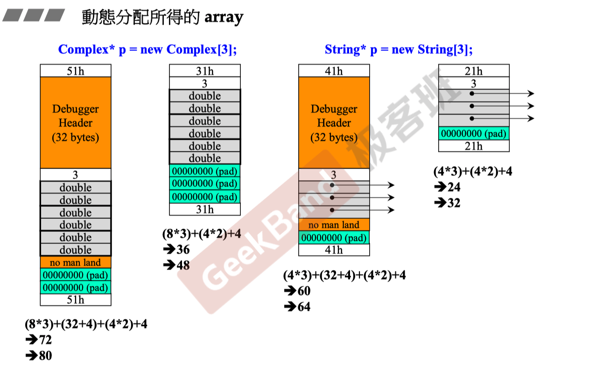
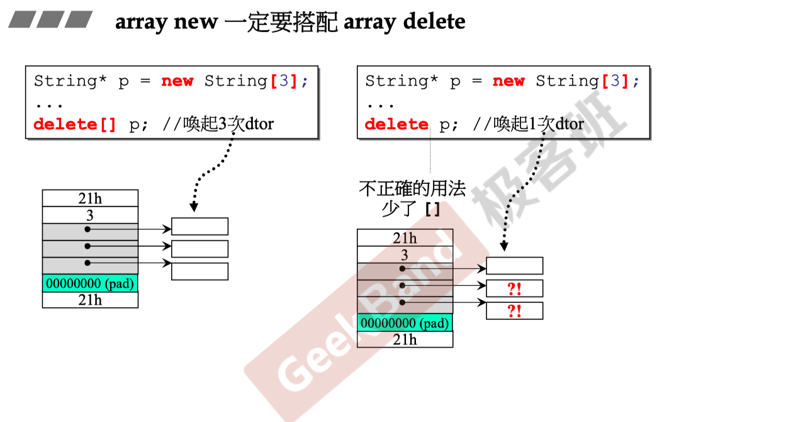
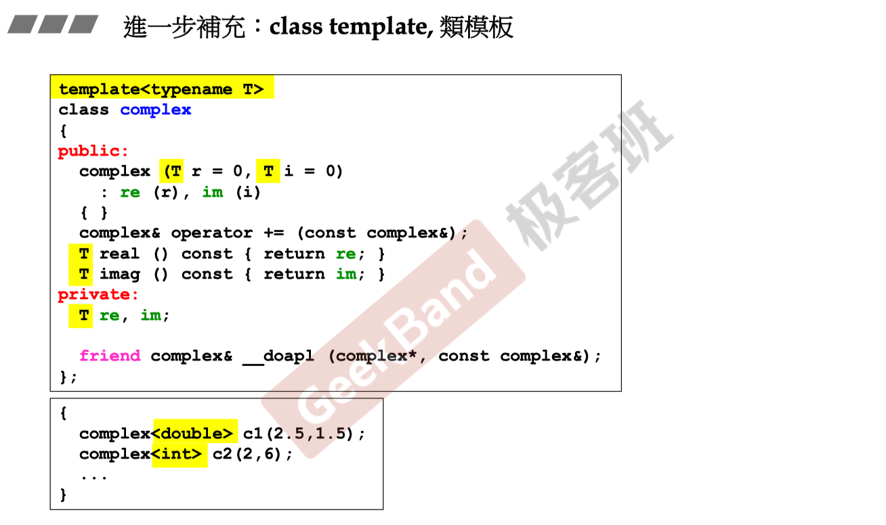
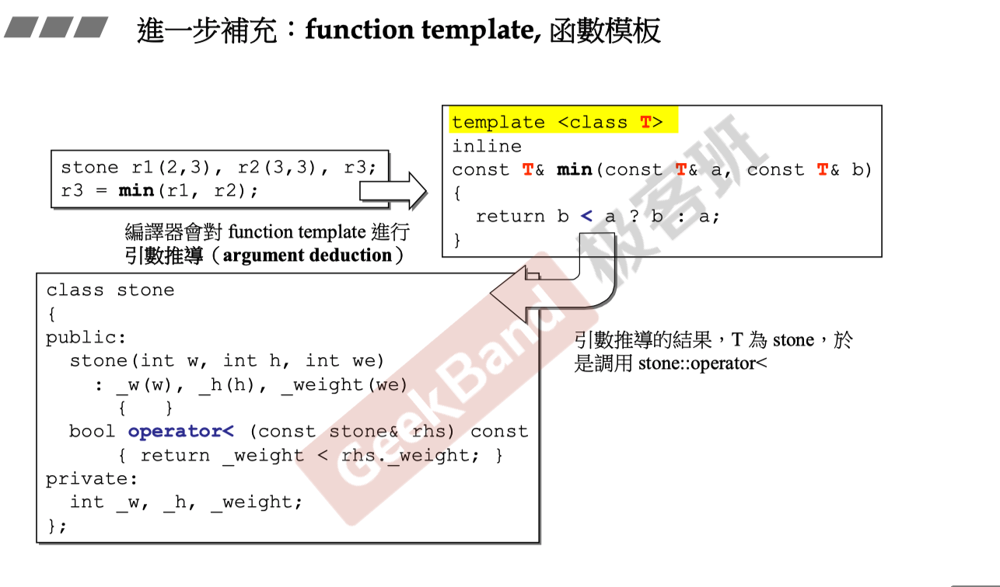
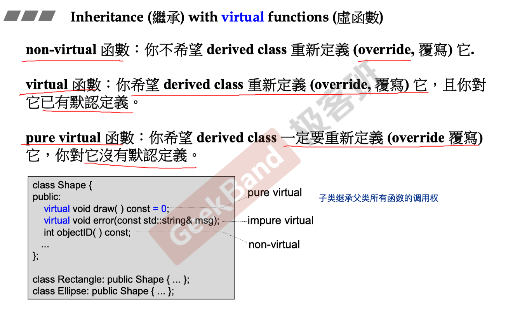

## 分析complex类

### inline内联函数

- inline可以解决一些**频繁调用的小函数**大量消耗栈空间的问题
- inline只是对编译器的建议，最终是否内联取决于编译器
- 定义在类中的成员函数缺省都是内联，类外需要加inline

### 构造函数初始化

```cpp
complex(double r = 0, double i = 0) 
  : re(r), im(i) {}
```

使用这种方式比直接在构造函数中赋值更快，推荐使用

### 构造函数重载注意

```cpp
complex(): re(0), im(0) {}
```

如果该函数与上面构造函数同时出现，在无参数初始化该类的对象时会产生冲突。

### 常量成员函数

```cpp
class complex {
public:
  ...
  double real() const {return re;}
  double imag() const {return im;}
};

{
  const complex c1(2, 1);
  cout << c1.real() << c1.imag();
}
```

如果这两个方法定义时没有加入const关键字，调用时将报错。

### 友元

```cpp
class complex {
public:
  int func(const complex &param) {
    return param.re + param.im;
  }
}

{
  complex c1(2, 1);
  complex c2;
  c2.func(c1);
}
```

相同类的各个实例对象互为友元，可以通过内部方法调用友元的private变量。

### this指针

所有的成员函数都带有的隐藏参数

```cpp
inline complex& __doapl(complex* ths, const complex& r) {
    ths->re += r.re;
    ths->im += r.im;
    return *ths;
}

inline complex& complex::operator+=(const complex& r) {
    return __doapl(this, r);
}
```

### 运算符重载

非成员函数

不可以return by reference，因为返回的必定是local object

```cpp
inline complex operator+(const complex& x, const complex& y) {
    return complex(real(x) + real(y), imag(x) + imag(y));
}
```

## 分析String类

### output函数




### 栈与堆

stack：存在于作用域的一块内存空间。在函数本体内声明的任何变量，其使用的内存块都来自于stack。

heap：或称system heap，指系统提供的一块global内存空间，程序可自动分配从中获取若干区块。

```cpp
class Complex{...};

{
  Complex c1(1, 2); // c1所占用的空间来自于stack
  Complex *p = new Complex(3);
  // Complex(3)是个临时对象，其所占用的空间是new自heap
  // 需要delete自行释放
  delete p;
  static Complex c2(1, 2);
}

Complex c3(1, 2);
```

c1：stack object，在作用域结束时结束，又称作auto object，会被自动清理。

c2：static object，其生命在作用域结束后继续存在，直到整个程序结束

c3：global object，其生命在整个程序结束后结束，可以视作一种static object

### new与delete

编译器将new操作转化为分配内存、转型、构造函数先后三个操作。

```cpp
void *mem = operator new(sizeof(Complex));
pc = static_cast<Complex*>(mem);
pc->Complex::Complex(1, 2);
```

编译器将delete操作转化为析构函数、释放内存两个操作

```cpp
Complex::~Complex(pc);
operator delete(pc);
```

### 动态分配内存



左侧是两个Complex对象在调试模式和release模式下，编译器做出的内存分配。右侧是String对象。

对于数组对象：



删除数组对象需要使用delete[]方法：



### explicit

普通构造函数能够被隐式调用。而explicit构造函数只能被显式调用。

```cpp
class Test1 {
public:
    Test1(int n) {
        num = n;
    }//普通构造函数
private:
    int num;
};

class Test2 {
public:
    explicit Test2(int n) {
        num = n;
    }//explicit(显式)构造函数
private:
    int num;
};

int main() {
    Test1 t1=12;	//隐式调用其构造函数,成功
    Test2 t2=12;	//编译错误,不能隐式调用其构造函数
    Test2 t2(12);	//显式调用成功
    return 0;
}
```

### 类模板



### 函数模板



### 虚函数



