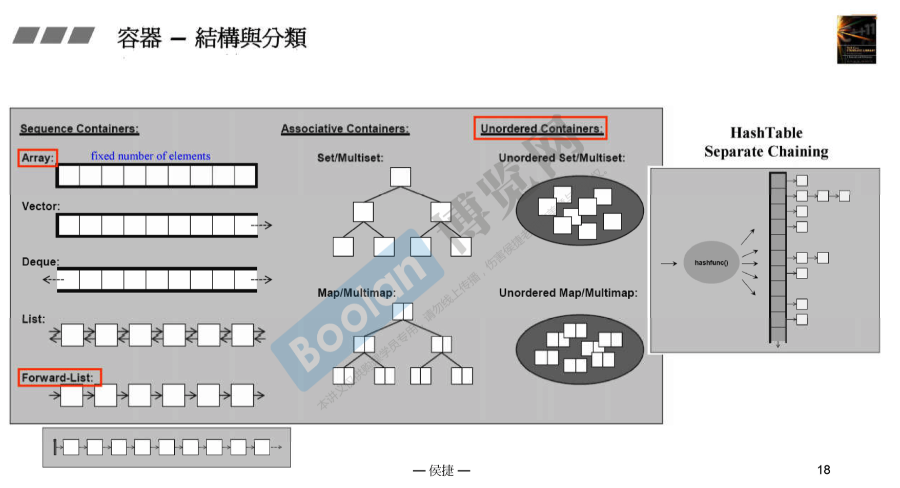
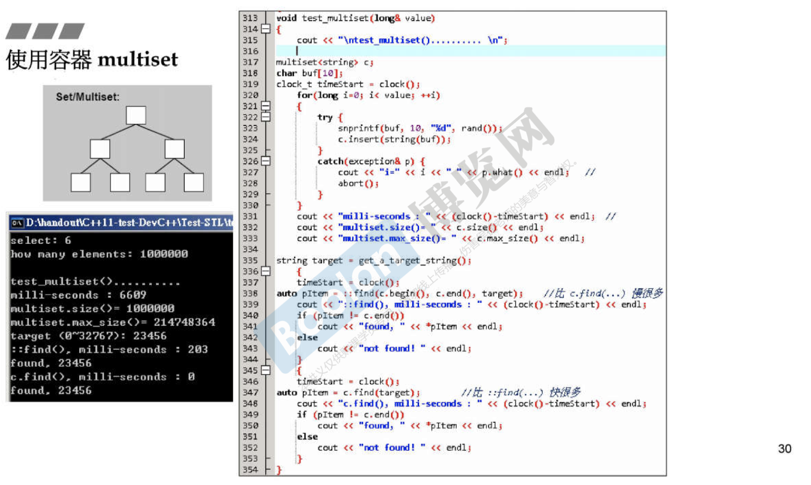
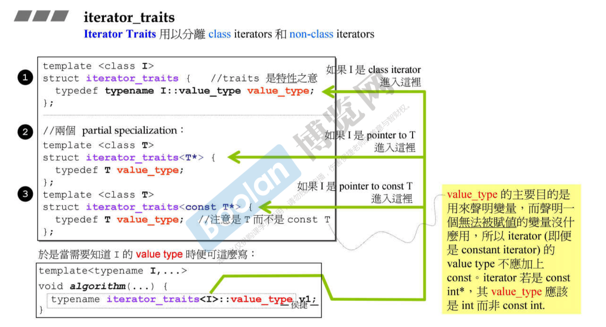

### 课程介绍

C++标准库：主要使用模板templates写出，没有使用太多的虚函数、继承等

### 课程目标


### C++标准库和STL标准模板库

> STL：(Standard Template Library)

C++标准库 > STL库（包含六大部件等）

### 重要网站

- [cplusplus.com](https://cplusplus.com)
- [cppreference.com](https://cppreference.com)
- [gcc.gnu.org](https://gcc.gnu.org)

### 参考书

- [C++标准库](https://book.douban.com/subject/26419721/)
- STL源码剖析

## STL六大部件

- 容器（Containers）
- 分配器（Allocators）
- 算法（Algorithms）
- 迭代器（Iterators）
- 适配器（Adapters）
- 仿函式（Functors)


- 分配器用以支持容器，为容器分配内存
- 算法中存放模板函数
- 数据在容器中，操作数据的算法在另一个地方，使用模板编程（区别于OO）
- 迭代器可理解为泛化的指针
- 仿函数类似函数
- 适配器可以进行转换


## 容器简介

### 分类

- 序列式容器
- 关联式容器：使用key来查找
- 不定序容器：使用哈希表，也是一种关联式容器



set、map：一般编译器都使用红黑树实现

multiset、multimap：key可以重复

### 使用vector


### 使用list、forward_list

```c
c.sort();           
// 调用容器自己提供的sort, 而不是标准库的sort
```


### 使用deque

分段连续，但是使用者感觉全部连续

两端都可扩充，每次扩充一个buffer


### 使用stack和queue

没有实现数据结构，内部有一个deque，可被称作Container Adapter

不存在iterator


### 使用multiset和multimap

小型的关联数据库，底层是红黑树

使用标准库的find和容器本身的find时间差距大




### 使用unordered_multiset和unordered_multimap

篮子一定比元素多


### 使用set和map

与multiset和multimap类似

### 使用unordered_set和unordered_map

与unordered_multiset和unordered_multimap类似

### 其他容器

- priority_queue
- heap

### 使用分配器

使用 malloc 和 free

另一门课《内存管理》中详解


## OOP vs. GP 

OOP (面向对象编程) vs. GP (泛型编程）

GNU2.91 源码

OOP企图将datas和methods联系在一起

GP企图将datas和methods分开

链表List并非randomAccessIterator，不能使用::sort()函数，自带sort()


## 分配器

分配器的效率会影响到容器的效率

malloc会给出需求空间的附加内容，图中灰色、红色、绿色部分（《内存管理》中讲解）


vector、list、deque、set等都使用分配器allocator

allocator最终在allocate时调用malloc()

VC6、GCC2.91的allocator只是以::operator new 和 ::operator delete完成allocate()和deallocate()，没有任何特殊设计

allocator在deallocate时要求输入最初分配的内存数量，导致用户使用时不便，但容器在使用时没有该困扰


GCC2.91的STL使用另一种分配器alloc

运行模式如下。调用malloc会带有额外开销，malloc中最有价值的是头尾的cookie（记录大小）。alloc不需要cookie


GCC4.9使用的分配器回到了原来的方式

## 容器结构与分类

容器间的衍生关系

如set中拥有一个rb_tree的结构


## List深度探索

list不是最简单的（array、vector），但是是最有代表性的

### 双向列表实现


### iterator实现

list的iterator是一个class智能指针（除了array和vector）

- 需要实现五个typedef 
- 需要实现指针的一般操作，如++、->、* 等


### it++和++it

操作符重载中的前++和后++：C++语言为了区分，将后++增加了参数，前++不需要参数

指针的前++和后++，应当向整数看起


### *it


### GNU4.9的改进

- 模板参数只有一个，不用传引用和指针
- void_pointer写成了指向自身类型的pointer 


## iterator设计原则和traits

### iterator设计原则

Iterator需要遵循的原则，Iterator拥有的特性

Iterator：算法和容器的桥梁

- difference_type 距离
- value_type 传递过来的值的类
- iterator_category 表示双向列表


### iterator traits

iterator可能只是一个native pointer，增加一个中间层来解决问题


如：算法想知道iterator的value_type，现在改为向iterator_traits提问

利用偏特化，分离出指针和class iterator等




## vector深度探索


