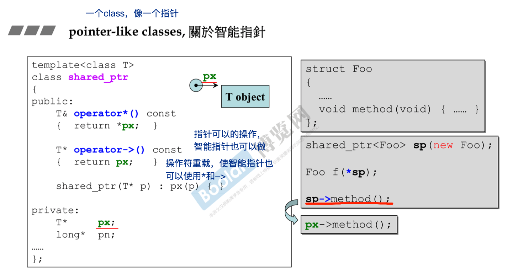
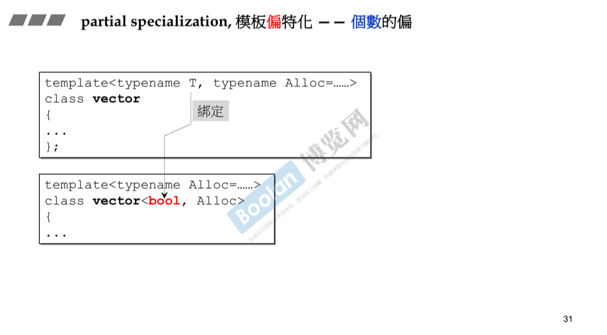

## 泛型编程和面向对象


### 转换函数

explict：用以限制函数，禁止其被自动调用。

下图中，如没有explict修饰，最后一行会自动把4转化为Fraction对象


### 智能指针

> 能像指针一样使用的class（pointer-like classes）

通过运算符重载，使智能指针也可以使用 * 和 -> 符号。（-> 符号的作用要传递到底）



**迭代器**可以理解为一种智能指针


### 仿函数

> 能像函数一样操作的类（function like classes）

看到class中重载`()`，为仿函数

标准库中的仿函数：


```cpp
// 使用仿函数
pair<int,int> p1;
select1st<pair>()(p1);	//第一个括号：创建临时对象
```

### 泛型编程

#### 类模板


#### 函数模板

类模板使用时需要指定类型，函数模板不用指定类型


模板的编译需要在使用时再次编译

#### 成员模板

pair是模板中的member，同时也是一个template，因此称作member template


目的：使模板更有弹性。

#### 模板特化


#### 偏特化

个数的偏：几个模板参数中固定一个



范围的偏：任意类型转化为某个特定类型，如指针类型


