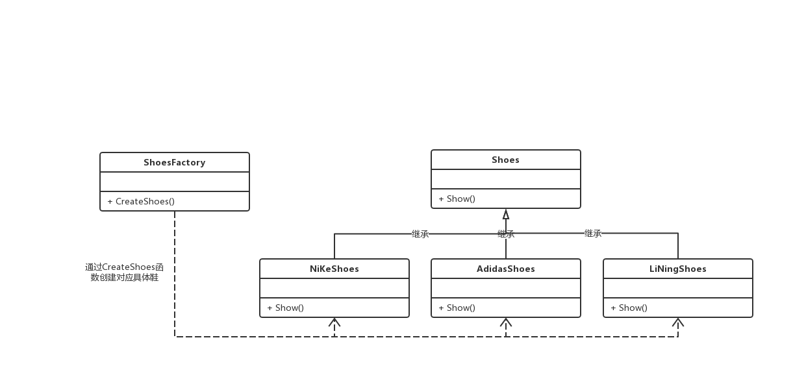
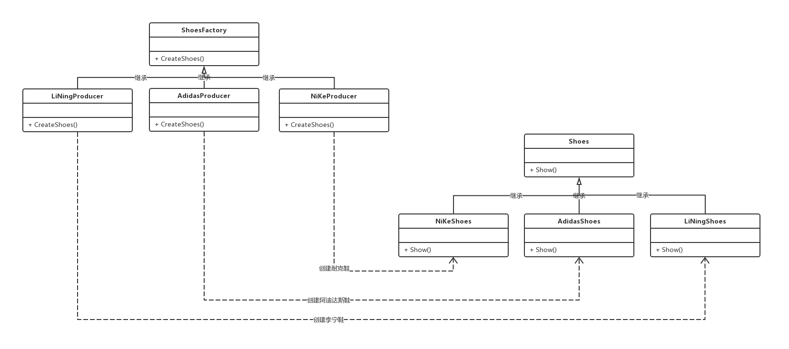
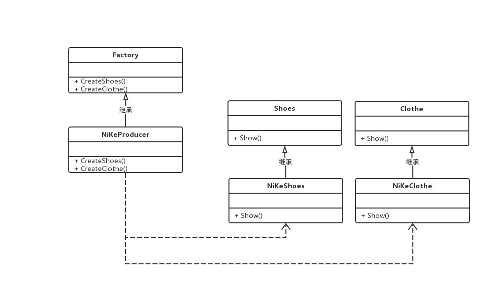

## 单例Singleton

> https://www.cnblogs.com/sunchaothu/p/10389842.html

### 懒汉式

直到使用时才实例化对象，需要考虑线程安全

### 饿汉式

> https://www.cnblogs.com/loveis715/archive/2012/07/18/2598409.html

类的静态变量生存期：从声明到结束

如果当变量在初始化的时候，并发同时进入声明语句，并发线程将会阻塞等待初始化结束。

```cpp
class Singleton {
public:
    static Singleton& get_instance(){
        static Singleton instance;
        return instance;
    }
private:
  	singleton(){}
};
```

## 工厂模式

> https://www.cnblogs.com/xiaolincoding/p/11524376.html
>
> https://www.cnblogs.com/xiaolincoding/p/11524401.html

使用了C++**多态**的特性，将存在**继承**关系的类，通过一个**工厂类创建**对应的子类（派生类）对象。在项目复杂的情况下，可以便于子类对象的创建

### 简单工厂模式



##### 简单工厂模式的**结构组成**：

1. **工厂类**(`ShoesFactory`)：工厂模式的核心类，会定义一个用于创建指定的具体实例对象的接口。
2. **抽象产品类**(`Shoes`)：是具体产品类的继承的父类或实现的接口。
3. **具体产品类**(`NiKeShoes\AdidasShoes\LiNingShoes`)：工厂类所创建的对象就是此具体产品实例。

### 工厂方法模式

现各类鞋子抄的非常火热，于是为了大量生产每种类型的鞋子，则要针对不同品牌的鞋子开设独立的生产线，那么每个生产线就只能生产同类型品牌的鞋。



### 抽象工厂模式

鞋厂为了扩大了业务，不仅只生产鞋子，把运动品牌的衣服也一起生产了。

