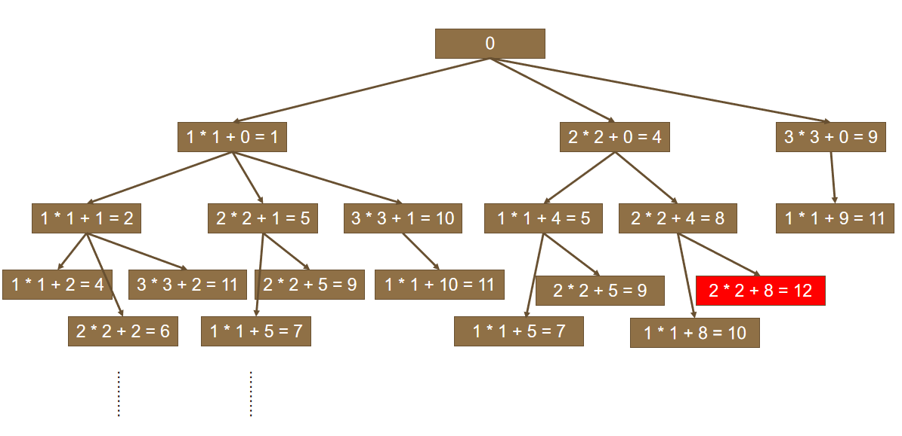

# BFS

## 思想

<div align="center">  </div><br>

### 解题思路

（1）BFS的问题一般都会选用队列方式实现；
（2）代码模板如下：

```c++
void BFS()
{
    定义队列;
    定义备忘录，用于记录已经访问的位置；

    判断边界条件，是否能直接返回结果的。

    将起始位置加入到队列中，同时更新备忘录。

    while (队列不为空) {
        获取当前队列中的元素个数。
        for (元素个数) {
            取出一个位置节点。
            判断是否到达终点位置。
            获取它对应的下一个所有的节点。
            条件判断，过滤掉不符合条件的位置。
            新位置重新加入队列。
        }
    }
}

链接：https://leetcode-cn.com/problems/shortest-path-in-binary-matrix/solution/biao-zhun-de-bfsjie-fa-duo-lian-xi-jiu-hui-zhang-w/

```


## 1091. 计算在网格中从原点到特定点的最短路径长度

1091\. Shortest Path in Binary Matrix(Medium)

[Leetcode](https://leetcode.com/problems/shortest-path-in-binary-matrix/) / [力扣](https://leetcode-cn.com/problems/shortest-path-in-binary-matrix/)

```html
[[1,1,0,1],
 [1,0,1,0],
 [1,1,1,1],
 [1,0,1,1]]
```

题目描述：0 表示可以经过某个位置，求解从左上角到右下角的最短路径长度。

```c++
struct Node {
    int x;
    int y;
};
class Solution {
public:
    int shortestPathBinaryMatrix(vector<vector<int>>& grid) {
        int ans = 0;
        queue<Node> myQ; // BFS一般通过队列方式解决
        int M = grid.size();
        int N = grid[0].size();

        // 先判断边界条件，很明显，这两种情况下都是不能到达终点的。
        if (grid[0][0] == 1 || grid[M - 1][N - 1] == 1) {
            return -1;
        }
        
        // 备忘录，记录已经走过的节点
        vector<vector<int>> mem(M, vector<int>(N, 0));
        
        myQ.push({0, 0});
        mem[0][0] = 1;

        // 以下是标准BFS的写法
        while (!myQ.empty()) {
            int size = myQ.size();

            for (int i = 0; i < size; i++) {
                Node currentNode = myQ.front();
                int x = currentNode.x;
                int y = currentNode.y;

                // 判断是否满足退出的条件
                if (x == (N - 1) && y == (M - 1)) {
                    return (ans + 1);
                }

                // 下一个节点所有可能情况
                vector<Node> nextNodes = {{x + 1, y}, {x - 1, y}, {x + 1, y - 1}, {x + 1, y + 1},
                                          {x, y + 1}, {x, y - 1}, {x - 1, y - 1}, {x - 1, y + 1}};

                for (auto& n : nextNodes) {
                    // 过滤条件1： 边界检查
                    if (n.x < 0 || n.x >= N || n.y < 0 || n.y >= M) {
                        continue;
                    }
                    // 过滤条件2：备忘录检查
                    if (mem[n.y][n.x] == 1) {
                        continue;
                    }
                    // 过滤条件3：题目中的要求
                    if (grid[n.y][n.x] == 1) {
                        continue;
                    }

                    // 通过过滤筛选，加入队列！
                    mem[n.y][n.x] = 1;
                    myQ.push(n);
                }               

                myQ.pop();
            }
            ans++;
        }

        return -1;        
    }
};
```


## 279. 组成整数的最小平方数数量

279\. Perfect Squares (Medium)

[Leetcode](https://leetcode.com/problems/perfect-squares/description/) / [力扣](https://leetcode-cn.com/problems/perfect-squares/description/)

```html
For example, given n = 12, return 3 because 12 = 4 + 4 + 4; given n = 13, return 2 because 13 = 4 + 9.
```

可以将每个整数看成图中的一个节点，如果两个整数之差为一个平方数，那么这两个整数所在的节点就有一条边。

要求解最小的平方数数量，就是求解从节点 n 到节点 0 的最短路径。



```c++
class Solution {
public:
    int numSquares(int n) {
        set<int> visited;
        queue<int> q;
        q.push(0);
        int steps = 1;
        while (!q.empty()) {
            int size = q.size();
            while (size--) {
                int cur = q.front();
                q.pop();
                int i = 0;
                while (++i) {
                    int next = i * i + cur;
                    if (next > n) {
                        break;
                    } else if (next == n) {
                        return steps;
                    } else {
                        if(!visited.count(next)) {
                            visited.insert(next);
                            q.push(next);
                        }
                    }
                }
            }
            steps++;
        }
        return -1;
    }
};
```


## 127. 最短单词路径

127\. Word Ladder (Medium)

[Leetcode](https://leetcode.com/problems/word-ladder/description/) / [力扣](https://leetcode-cn.com/problems/word-ladder/description/)

题目描述：找出一条从 beginWord 到 endWord 的最短路径，每次移动规定为改变一个字符，并且改变之后的字符串必须在 wordList 中。

https://leetcode-cn.com/problems/word-ladder/solution/dan-ci-jie-long-by-leetcode-solution/

# DFS

<div align="center">  </div><br>

从一个节点出发，使用 DFS 对一个图进行遍历时，能够遍历到的节点都是从初始节点可达的，DFS 常用来求解这种   **可达性**   问题。

在程序实现 DFS 时需要考虑以下问题：

- 栈：用栈来保存当前节点信息，当遍历新节点返回时能够继续遍历当前节点。可以使用递归栈。
- 标记：和 BFS 一样同样需要对已经遍历过的节点进行标记。

## 695. 查找最大的连通面积

695\. Max Area of Island (Medium)

[Leetcode](https://leetcode.com/problems/max-area-of-island/description/) / [力扣](https://leetcode-cn.com/problems/max-area-of-island/description/)

```html
[[0,0,1,0,0,0,0,1,0,0,0,0,0],
 [0,0,0,0,0,0,0,1,1,1,0,0,0],
 [0,1,1,0,1,0,0,0,0,0,0,0,0],
 [0,1,0,0,1,1,0,0,1,0,1,0,0],
 [0,1,0,0,1,1,0,0,1,1,1,0,0],
 [0,0,0,0,0,0,0,0,0,0,1,0,0],
 [0,0,0,0,0,0,0,1,1,1,0,0,0],
 [0,0,0,0,0,0,0,1,1,0,0,0,0]]
```


## 200. 矩阵中的连通分量数目

200\. Number of Islands (Medium)

[Leetcode](https://leetcode.com/problems/number-of-islands/description/) / [力扣](https://leetcode-cn.com/problems/number-of-islands/description/)

```html
Input:
11000
11000
00100
00011

Output: 3
```

可以将矩阵表示看成一张有向图。


## 547. 好友关系的连通分量数目

547\. Friend Circles (Medium)

[Leetcode](https://leetcode.com/problems/friend-circles/description/) / [力扣](https://leetcode-cn.com/problems/friend-circles/description/)

```html
Input:
[[1,1,0],
 [1,1,0],
 [0,0,1]]

Output: 2

Explanation:The 0th and 1st students are direct friends, so they are in a friend circle.
The 2nd student himself is in a friend circle. So return 2.
```

题目描述：好友关系可以看成是一个无向图，例如第 0 个人与第 1 个人是好友，那么 M[0][1] 和 M[1][0] 的值都为 1。


## 130. 填充封闭区域

130\. Surrounded Regions (Medium)

[Leetcode](https://leetcode.com/problems/surrounded-regions/description/) / [力扣](https://leetcode-cn.com/problems/surrounded-regions/description/)

```html
For example,
X X X X
X O O X
X X O X
X O X X

After running your function, the board should be:
X X X X
X X X X
X X X X
X O X X
```

题目描述：使被 'X' 包围的 'O' 转换为 'X'。

先填充最外侧，剩下的就是里侧了。


## 417. 能到达的太平洋和大西洋的区域

417\. Pacific Atlantic Water Flow (Medium)

[Leetcode](https://leetcode.com/problems/pacific-atlantic-water-flow/description/) / [力扣](https://leetcode-cn.com/problems/pacific-atlantic-water-flow/description/)

```html
Given the following 5x5 matrix:

  Pacific ~   ~   ~   ~   ~
       ~  1   2   2   3  (5) *
       ~  3   2   3  (4) (4) *
       ~  2   4  (5)  3   1  *
       ~ (6) (7)  1   4   5  *
       ~ (5)  1   1   2   4  *
          *   *   *   *   * Atlantic

Return:
[[0, 4], [1, 3], [1, 4], [2, 2], [3, 0], [3, 1], [4, 0]] (positions with parentheses in above matrix).
```

左边和上边是太平洋，右边和下边是大西洋，内部的数字代表海拔，海拔高的地方的水能够流到低的地方，求解水能够流到太平洋和大西洋的所有位置。


# Backtracking

Backtracking（回溯）属于 DFS。

- 普通 DFS 主要用在   **可达性问题**  ，这种问题只需要执行到特点的位置然后返回即可。
- 而 Backtracking 主要用于求解   **排列组合**   问题，例如有 { 'a','b','c' } 三个字符，求解所有由这三个字符排列得到的字符串，这种问题在执行到特定的位置返回之后还会继续执行求解过程。

因为 Backtracking 不是立即返回，而要继续求解，因此在程序实现时，需要注意对元素的标记问题：

- 在访问一个新元素进入新的递归调用时，需要将新元素标记为已经访问，这样才能在继续递归调用时不用重复访问该元素；
- 但是在递归返回时，需要将元素标记为未访问，因为只需要保证在一个递归链中不同时访问一个元素，可以访问已经访问过但是不在当前递归链中的元素。

## 17. 数字键盘组合

17\. Letter Combinations of a Phone Number (Medium)

[Leetcode](https://leetcode.com/problems/letter-combinations-of-a-phone-number/description/) / [力扣](https://leetcode-cn.com/problems/letter-combinations-of-a-phone-number/description/)

### 题目描述

给定一个仅包含数字 `2-9` 的字符串，返回所有它能表示的字母组合。

给出数字到字母的映射如下（与电话按键相同）。注意 1 不对应任何字母。


**示例:**

```
输入："23"
输出：["ad", "ae", "af", "bd", "be", "bf", "cd", "ce", "cf"].
```

**说明:**
尽管上面的答案是按字典序排列的，但是你可以任意选择答案输出的顺序。

### 分析


### C++

```c++
//4ms, 8.9MB
class Solution {
public:
    vector<string> letterCombinations(string digits) {
        if (digits.empty()) return {};

        vector<vector<char>> dictionary(10);
        dictionary[0] = {' '};
        dictionary[1] = {};
        dictionary[2] = {'a', 'b', 'c'};
        dictionary[3] = {'d', 'e', 'f'};
        dictionary[4] = {'g', 'h', 'i'};
        dictionary[5] = {'j', 'k', 'l'};
        dictionary[6] = {'m', 'n', 'o'};
        dictionary[7] = {'p', 'q', 'r', 's'};
        dictionary[8] = {'t', 'u', 'v'};
        dictionary[9] = {'w', 'x', 'y', 'z'};
        string curString;
        vector<string> answers;
        dfs(digits, dictionary, 0, curString, answers);
        return answers;
    }
private:
    //函数前两个参数为输入，分别为输入的字符串、字典，用const并&引用
    //strIndex为状态变量，表示现在处理了多少位字符；curString表示当前字符串
    void dfs(const string& digits, const vector<vector<char>>& dictionary,
             int strIndex, string& curString, 
             vector<string>& answers) {
        if (strIndex == digits.length()) {
        //当遍历到叶子结点时，将当前字符串加入answers中
            answers.push_back(curString);
            return;
        }
        for (const char &curLetter : dictionary[digits[strIndex] - '0']) {
        //digits[strIndex]表示当前所在树的节点（以char表示）
            curString.push_back(curLetter); //把curString字符当作栈
            dfs(digits, dictionary, strIndex + 1, curString, answers);
            //遍历树的下一层
            curString.pop_back();
        }
    }
};
```

## 93. IP 地址划分

93\. Restore IP Addresses(Medium)

[Leetcode](https://leetcode.com/problems/restore-ip-addresses/description/) / [力扣](https://leetcode-cn.com/problems/restore-ip-addresses/description/)

```html
Given "25525511135",
return ["255.255.11.135", "255.255.111.35"].
```


## 79. 在矩阵中寻找字符串

79\. Word Search (Medium)

[Leetcode](https://leetcode.com/problems/word-search/description/) / [力扣](https://leetcode-cn.com/problems/word-search/description/)

```html
For example,
Given board =
[
  ['A','B','C','E'],
  ['S','F','C','S'],
  ['A','D','E','E']
]
word = "ABCCED", -> returns true,
word = "SEE", -> returns true,
word = "ABCB", -> returns false.
```


## 257. 输出二叉树中所有从根到叶子的路径

257\. Binary Tree Paths (Easy)

[Leetcode](https://leetcode.com/problems/binary-tree-paths/description/) / [力扣](https://leetcode-cn.com/problems/binary-tree-paths/description/)

```html
  1
 /  \
2    3
 \
  5
```

```html
["1->2->5", "1->3"]
```

## 46. 排列

46\. Permutations (Medium)

[Leetcode](https://leetcode.com/problems/permutations/description/) / [力扣](https://leetcode-cn.com/problems/permutations/description/)

```html
[1,2,3] have the following permutations:
[
  [1,2,3],
  [1,3,2],
  [2,1,3],
  [2,3,1],
  [3,1,2],
  [3,2,1]
]
```


## 47. 含有相同元素求排列

47\. Permutations II (Medium)

[Leetcode](https://leetcode.com/problems/permutations-ii/description/) / [力扣](https://leetcode-cn.com/problems/permutations-ii/description/)

```html
[1,1,2] have the following unique permutations:
[[1,1,2], [1,2,1], [2,1,1]]
```

数组元素可能含有相同的元素，进行排列时就有可能出现重复的排列，要求重复的排列只返回一个。

在实现上，和 Permutations 不同的是要先排序，然后在添加一个元素时，判断这个元素是否等于前一个元素，如果等于，并且前一个元素还未访问，那么就跳过这个元素。


## 77. 组合

77\. Combinations (Medium)

[Leetcode](https://leetcode.com/problems/combinations/description/) / [力扣](https://leetcode-cn.com/problems/combinations/description/)

```html
If n = 4 and k = 2, a solution is:
[
  [2,4],
  [3,4],
  [2,3],
  [1,2],
  [1,3],
  [1,4],
]
```


## 39. 组合求和

39\. Combination Sum (Medium)

[Leetcode](https://leetcode.com/problems/combination-sum/description/) / [力扣](https://leetcode-cn.com/problems/combination-sum/description/)

```html
given candidate set [2, 3, 6, 7] and target 7,
A solution set is:
[[7],[2, 2, 3]]
```


## 40. 含有相同元素的组合求和

40\. Combination Sum II (Medium)

[Leetcode](https://leetcode.com/problems/combination-sum-ii/description/) / [力扣](https://leetcode-cn.com/problems/combination-sum-ii/description/)

```html
For example, given candidate set [10, 1, 2, 7, 6, 1, 5] and target 8,
A solution set is:
[
  [1, 7],
  [1, 2, 5],
  [2, 6],
  [1, 1, 6]
]
```


## 216. 1-9 数字的组合求和

216\. Combination Sum III (Medium)

[Leetcode](https://leetcode.com/problems/combination-sum-iii/description/) / [力扣](https://leetcode-cn.com/problems/combination-sum-iii/description/)

```html
Input: k = 3, n = 9

Output:

[[1,2,6], [1,3,5], [2,3,4]]
```

从 1-9 数字中选出 k 个数不重复的数，使得它们的和为 n。


## 78. 子集

78\. Subsets (Medium)

[Leetcode](https://leetcode.com/problems/subsets/description/) / [力扣](https://leetcode-cn.com/problems/subsets/description/)

找出集合的所有子集，子集不能重复，[1, 2] 和 [2, 1] 这种子集算重复

```java
public List<List<Integer>> subsets(int[] nums) {
    List<List<Integer>> subsets = new ArrayList<>();
    List<Integer> tempSubset = new ArrayList<>();
    for (int size = 0; size <= nums.length; size++) {
        backtracking(0, tempSubset, subsets, size, nums); // 不同的子集大小
    }
    return subsets;
}

private void backtracking(int start, List<Integer> tempSubset, List<List<Integer>> subsets,
                          final int size, final int[] nums) {

    if (tempSubset.size() == size) {
        subsets.add(new ArrayList<>(tempSubset));
        return;
    }
    for (int i = start; i < nums.length; i++) {
        tempSubset.add(nums[i]);
        backtracking(i + 1, tempSubset, subsets, size, nums);
        tempSubset.remove(tempSubset.size() - 1);
    }
}
```

## 90. 含有相同元素求子集

90\. Subsets II (Medium)

[Leetcode](https://leetcode.com/problems/subsets-ii/description/) / [力扣](https://leetcode-cn.com/problems/subsets-ii/description/)

```html
For example,
If nums = [1,2,2], a solution is:

[
  [2],
  [1],
  [1,2,2],
  [2,2],
  [1,2],
  []
]
```


## 131. 分割字符串使得每个部分都是回文数

131\. Palindrome Partitioning (Medium)

[Leetcode](https://leetcode.com/problems/palindrome-partitioning/description/) / [力扣](https://leetcode-cn.com/problems/palindrome-partitioning/description/)

```html
For example, given s = "aab",
Return

[
  ["aa","b"],
  ["a","a","b"]
]
```


## 37. 数独

37\. Sudoku Solver (Hard)

[Leetcode](https://leetcode.com/problems/sudoku-solver/description/) / [力扣](https://leetcode-cn.com/problems/sudoku-solver/description/)

<div align="center">  </div><br>


## 51. N 皇后

51\. N-Queens (Hard)

[Leetcode](https://leetcode.com/problems/n-queens/description/) / [力扣](https://leetcode-cn.com/problems/n-queens/description/)

<div align="center">  </div><br>

在 n\*n 的矩阵中摆放 n 个皇后，并且每个皇后不能在同一行，同一列，同一对角线上，求所有的 n 皇后的解。

一行一行地摆放，在确定一行中的那个皇后应该摆在哪一列时，需要用三个标记数组来确定某一列是否合法，这三个标记数组分别为：列标记数组、45 度对角线标记数组和 135 度对角线标记数组。

45 度对角线标记数组的长度为 2 \* n - 1，通过下图可以明确 (r, c) 的位置所在的数组下标为 r + c。

<div align="center">  </div><br>


135 度对角线标记数组的长度也是 2 \* n - 1，(r, c) 的位置所在的数组下标为 n - 1 - (r - c)。

<div align="center">  </div><br>


