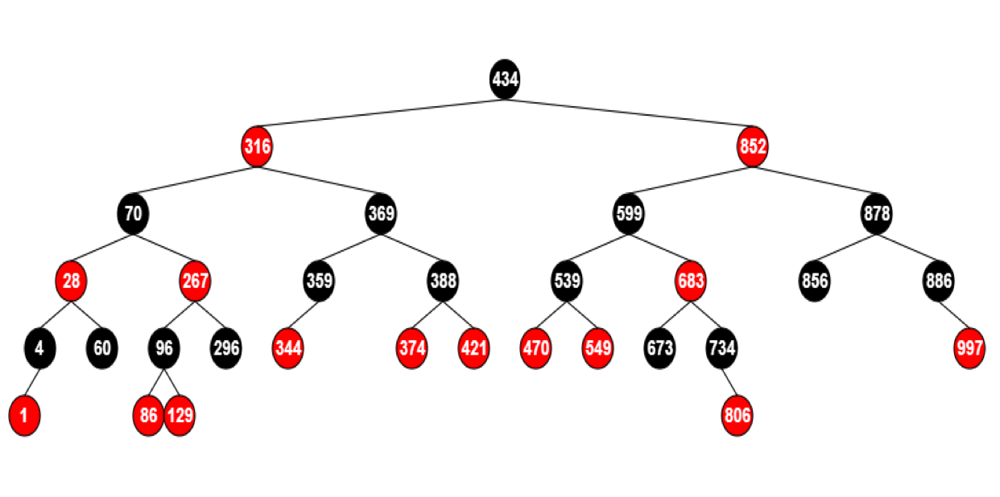
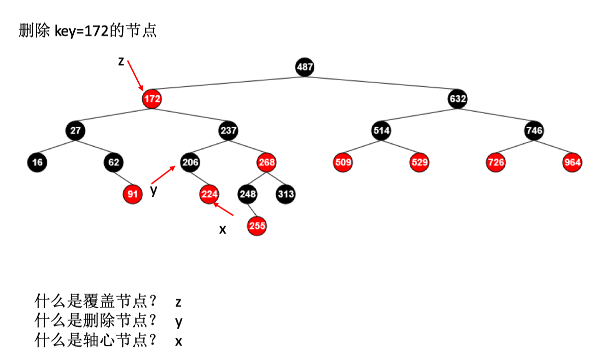

# 红黑树

红黑树在工程中的使用：

1. 顺序排序
2. 快速查找 key-value

二叉树的定义：业务要跟数据结构分离

## 性质

1. 每个结点是红的或者黑的

2. 根结点是黑的

3. 每个叶子结点是黑的

4. 如果一个结点是红的，则它的两个儿子都是黑的

5. 对每个结点，从该结点到其所有子孙节点，包含相同数目的黑结点

平衡：黑色节点的高度相同

红色节点：方便区分、旋转

### 插入节点

新插入的节点先设置为红色

当新插入节点的父节点为红色时，需要调整

新插入节点为红色，父节点为红色，祖父节点为黑色，叔父节点可能为红色或黑色

- 情况1：叔节点是红色 422，颜色调整

- 情况2：叔节点是黑色，本身是父节点的左子树 990，拓扑调整

- 情况3：叔节点是黑色，本身是父节点的右子树 1000

### 删除

只有当删除的节点是黑色的时，才需要调整

实际删除的节点：想要删除节点的后继节点

后继节点概念：16->27，172->206，313->487

y为黑色，x是y的右子树

​	如果x是红色，把x变成黑色；如果x是黑色，需要调整

## 应用

1. Linux进程调度 CFS

2. Nginx Timer事件管理

3. Epoll事件块的管理