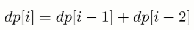
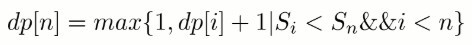
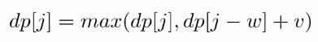
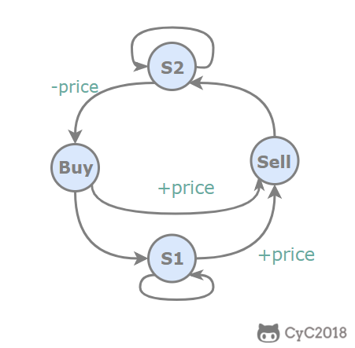
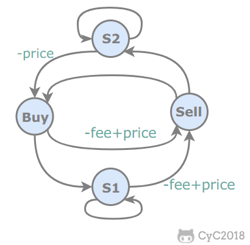

递归和动态规划都是将原问题拆成多个子问题然后求解，他们之间最本质的区别是，动态规划保存了子问题的解，避免重复计算。

# 斐波那契数列

## 70. 爬楼梯

70\. Climbing Stairs (Easy)

[Leetcode](https://leetcode.com/problems/climbing-stairs/description/) / [力扣](https://leetcode-cn.com/problems/climbing-stairs/description/)

题目描述：有 N 阶楼梯，每次可以上一阶或者两阶，求有多少种上楼梯的方法。



## 198. 强盗抢劫

198\. House Robber (Easy)

[Leetcode](https://leetcode.com/problems/house-robber/description/) / [力扣](https://leetcode-cn.com/problems/house-robber/description/)

题目描述：抢劫一排住户，但是不能抢邻近的住户，求最大抢劫量。


## 213. 强盗在环形街区抢劫

[Leetcode](https://leetcode.com/problems/house-robber-ii/description/) / [力扣](https://leetcode-cn.com/problems/house-robber-ii/description/)

# 矩阵路径

可以使用dp和记忆式递归

## 64. 矩阵的最小路径和

[Leetcode](https://leetcode.com/problems/minimum-path-sum/description/) / [力扣](https://leetcode-cn.com/problems/minimum-path-sum/description/)

```html
[[1,3,1],
 [1,5,1],
 [4,2,1]]
Given the above grid map, return 7. Because the path 1→3→1→1→1 minimizes the sum.
```

题目描述：求从矩阵的左上角到右下角的最小路径和，每次只能向右和向下移动。


## 62. 矩阵的总路径数

[Leetcode](https://leetcode.com/problems/unique-paths/description/) / [力扣](https://leetcode-cn.com/problems/unique-paths/description/)

题目描述：统计从矩阵左上角到右下角的路径总数，每次只能向右或者向下移动。


# 数组区间

## 303. 数组区间和

[Leetcode](https://leetcode.com/problems/range-sum-query-immutable/description/) / [力扣](https://leetcode-cn.com/problems/range-sum-query-immutable/description/)

```html
Given nums = [-2, 0, 3, -5, 2, -1]

sumRange(0, 2) -> 1
sumRange(2, 5) -> -1
sumRange(0, 5) -> -3
```

求区间 i \~ j 的和，可以转换为 sum[j + 1] - sum[i]，其中 sum[i] 为 0 \~ i - 1 的和。

## 413. 数组中等差递增子区间的个数

[Leetcode](https://leetcode.com/problems/arithmetic-slices/description/) / [力扣](https://leetcode-cn.com/problems/arithmetic-slices/description/)

```html
A = [0, 1, 2, 3, 4]

return: 6, for 3 arithmetic slices in A:

[0, 1, 2],
[1, 2, 3],
[0, 1, 2, 3],
[0, 1, 2, 3, 4],
[ 1, 2, 3, 4],
[2, 3, 4]
```

dp[i] 表示以 A[i] 为结尾的等差递增子区间的个数。

当 A[i] - A[i-1] == A[i-1] - A[i-2]，那么 [A[i-2], A[i-1], A[i]] 构成一个等差递增子区间。而且在以 A[i-1] 为结尾的递增子区间的后面再加上一个 A[i]，一样可以构成新的递增子区间。

```html
dp[2] = 1
    [0, 1, 2]
dp[3] = dp[2] + 1 = 2
    [0, 1, 2, 3], // [0, 1, 2] 之后加一个 3
    [1, 2, 3]     // 新的递增子区间
dp[4] = dp[3] + 1 = 3
    [0, 1, 2, 3, 4], // [0, 1, 2, 3] 之后加一个 4
    [1, 2, 3, 4],    // [1, 2, 3] 之后加一个 4
    [2, 3, 4]        // 新的递增子区间
```

综上，在 A[i] - A[i-1] == A[i-1] - A[i-2] 时，dp[i] = dp[i-1] + 1。

因为递增子区间不一定以最后一个元素为结尾，可以是任意一个元素结尾，因此需要返回 dp 数组累加的结果。

# *分割整数

## 343. 分割整数的最大乘积

[Leetcode](https://leetcode.com/problems/integer-break/description/) / [力扣](https://leetcode-cn.com/problems/integer-break/description/)

题目描述：For example, given n = 2, return 1 (2 = 1 + 1); given n = 10, return 36 (10 = 3 + 3 + 4).

考虑用dp方法，不要用数学求解。

## 279. 按平方数来分割整数

[Leetcode](https://leetcode.com/problems/perfect-squares/description/) / [力扣](https://leetcode-cn.com/problems/perfect-squares/description/)

题目描述：For example, given n = 12, return 3 because 12 = 4 + 4 + 4; given n = 13, return 2 because 13 = 4 + 9.


## 91. 分割整数构成字母字符串

[Leetcode](https://leetcode.com/problems/decode-ways/description/) / [力扣](https://leetcode-cn.com/problems/decode-ways/description/)

题目描述：Given encoded message "12", it could be decoded as "AB" (1 2) or "L" (12).


# 最长递增子序列

已知一个序列 {S<sub>1</sub>, S<sub>2</sub>,...,S<sub>n</sub>}，取出若干数组成新的序列 {S<sub>i1</sub>, S<sub>i2</sub>,..., S<sub>im</sub>}，其中 i1、i2 ... im 保持递增，即新序列中各个数仍然保持原数列中的先后顺序，称新序列为原序列的一个  **子序列**  。

如果在子序列中，当下标 ix > iy 时，S<sub>ix</sub> > S<sub>iy</sub>，称子序列为原序列的一个  **递增子序列**  。

定义一个数组 dp 存储最长递增子序列的长度，dp[n] 表示以 S<sub>n</sub> 结尾的序列的最长递增子序列长度。对于一个递增子序列 {S<sub>i1</sub>, S<sub>i2</sub>,...,S<sub>im</sub>}，如果 im < n 并且 S<sub>im</sub> < S<sub>n</sub>，此时 {S<sub>i1</sub>, S<sub>i2</sub>,..., S<sub>im</sub>, S<sub>n</sub>} 为一个递增子序列，递增子序列的长度增加 1。满足上述条件的递增子序列中，长度最长的那个递增子序列就是要找的，在长度最长的递增子序列上加上 S<sub>n</sub> 就构成了以 S<sub>n</sub> 为结尾的最长递增子序列。因此 dp[n] = max{ dp[i]+1 | S<sub>i</sub> < S<sub>n</sub> && i < n} 。

因为在求 dp[n] 时可能无法找到一个满足条件的递增子序列，此时 {S<sub>n</sub>} 就构成了递增子序列，需要对前面的求解方程做修改，令 dp[n] 最小为 1，即：



对于一个长度为 N 的序列，最长递增子序列并不一定会以 S<sub>N</sub> 为结尾，因此 dp[N] 不是序列的最长递增子序列的长度，需要遍历 dp 数组找出最大值才是所要的结果，max{ dp[i] | 1 <= i <= N} 即为所求。

## 1. 最长递增子序列

300\. Longest Increasing Subsequence (Medium)

[Leetcode](https://leetcode.com/problems/longest-increasing-subsequence/description/) / [力扣](https://leetcode-cn.com/problems/longest-increasing-subsequence/description/)


使用 Stream 求最大值会导致运行时间过长，可以改成以下形式：


以上解法的时间复杂度为 O(N<sup>2</sup>)，可以使用二分查找将时间复杂度降低为 O(NlogN)。

定义一个 tails 数组，其中 tails[i] 存储长度为 i + 1 的最长递增子序列的最后一个元素。对于一个元素 x，

- 如果它大于 tails 数组所有的值，那么把它添加到 tails 后面，表示最长递增子序列长度加 1；
- 如果 tails[i-1] < x <= tails[i]，那么更新 tails[i] = x。

例如对于数组 [4,3,6,5]，有：

```html
tails      len      num
[]         0        4
[4]        1        3
[3]        1        6
[3,6]      2        5
[3,5]      2        null
```

可以看出 tails 数组保持有序，因此在查找 S<sub>i</sub> 位于 tails 数组的位置时就可以使用二分查找。


## 2. 一组整数对能够构成的最长链

646\. Maximum Length of Pair Chain (Medium)

[Leetcode](https://leetcode.com/problems/maximum-length-of-pair-chain/description/) / [力扣](https://leetcode-cn.com/problems/maximum-length-of-pair-chain/description/)

```html
Input: [[1,2], [2,3], [3,4]]
Output: 2
Explanation: The longest chain is [1,2] -> [3,4]
```

题目描述：对于 (a, b) 和 (c, d) ，如果 b < c，则它们可以构成一条链。


## 3. 最长摆动子序列

376\. Wiggle Subsequence (Medium)

[Leetcode](https://leetcode.com/problems/wiggle-subsequence/description/) / [力扣](https://leetcode-cn.com/problems/wiggle-subsequence/description/)

```html
Input: [1,7,4,9,2,5]
Output: 6
The entire sequence is a wiggle sequence.

Input: [1,17,5,10,13,15,10,5,16,8]
Output: 7
There are several subsequences that achieve this length. One is [1,17,10,13,10,16,8].

Input: [1,2,3,4,5,6,7,8,9]
Output: 2
```

要求：使用 O(N) 时间复杂度求解。


# 最长公共子序列

- 首先，区分两个概念：子序列可以是不连续的；子数组（子字符串）需要是连续的；
- 动态规划的套路的：
  - 单个数组或者字符串要用动态规划时，可以把动态规划 dp[i] 定义为 nums[0:i] 中想要求的结果；
  - 当两个数组或者字符串要用动态规划时，可以把动态规划定义成两维的 dp[i][j] ，其含义是在 A[0:i] 与 B[0:j] 之间匹配得到的想要的结果。

## 1. 最长公共子序列

1143\. Longest Common Subsequence

[Leetcode](https://leetcode.com/problems/longest-common-subsequence/) / [力扣](https://leetcode-cn.com/problems/longest-common-subsequence/)

1. 状态定义： `dp[i][j]` 表示 `text1[0:i-1]` 和 `text2[0:j-1]` 的最长公共子序列

2. 状态转移方程

   ```c
   dp[i][j] = text1[i - 1] == text2[j - 1]?
   						dp[i - 1][j - 1] + 1:
   						max(dp[i - 1][j], dp[i][j - 1]);
   ```

3. 初始状态：当 i = 0 或者 j = 0 时，`dp[i][j]` 初始化为 0.

4. 遍历方向和范围：从小到大

5. 返回结果：`dp[len(text1)][len(text2)]`

# 0-1 背包

有一个容量为 N 的背包，要用这个背包装下物品的价值最大，这些物品有两个属性：体积 w 和价值 v。

定义一个二维数组 dp 存储最大价值，其中 `dp[i][j]` 表示**前 i 件物品在容积 w 的背包内的最大价值**。

设第 i 件物品体积为 w，价值为 v，根据第 i 件物品是否添加到背包中，可以分两种情况讨论：

- 第 i 件物品没添加到背包，总体积不超过 j 的前 i 件物品的最大价值就是总体积不超过 j 的前 i-1 件物品的最大价值，`dp[i][j] = dp[i-1][j]`。
- 第 i 件物品添加到背包中，`dp[i][j] = dp[i-1][j-w] + v`。

第 i 件物品可添加也可以不添加，取决于哪种情况下最大价值更大。因此，0-1 背包的状态转移方程为：


**空间优化**

在程序实现时可以对 0-1 背包做优化。观察状态转移方程可以知道，前 i 件物品的状态仅与前 i-1 件物品的状态有关，因此可以将 dp 定义为一维数组，其中 dp[j] 既可以表示 `dp[i-1][j]` 也可以表示 `dp[i][j]`。此时，



因为 dp[j-w] 表示 `dp[i-1][j-w]`，因此不能先求 `dp[i][j-w]`，防止将 `dp[i-1][j-w]` 覆盖。也就是说要先计算 `dp[i][j]` 再计算 `dp[i][j-w]`，在程序实现时需要**按倒序循环求解**。


**无法使用贪心算法的解释**  

0-1 背包问题无法使用贪心算法来求解，也就是说不能按照先添加性价比最高的物品来达到最优，这是因为这种方式可能造成背包空间的浪费，从而无法达到最优。考虑下面的物品和一个容量为 5 的背包，如果先添加物品 0 再添加物品 1，那么只能存放的价值为 16，浪费了大小为 2 的空间。最优的方式是存放物品 1 和物品 2，价值为 22.

| id | w | v | v/w |
| --- | --- | --- | --- |
| 0 | 1 | 6 | 6 |
| 1 | 2 | 10 | 5 |
| 2 | 3 | 12 | 4 |

**变种**  

- 完全背包：物品数量为无限个

- 多重背包：物品数量有限制

- 多维费用背包：物品不仅有重量，还有体积，同时考虑这两种限制

- 其它：物品之间相互约束或者依赖

## 416. 划分数组为和相等的两部分

[Leetcode](https://leetcode.com/problems/partition-equal-subset-sum/description/) / [力扣](https://leetcode-cn.com/problems/partition-equal-subset-sum/description/)

```html
Input: [1, 5, 11, 5]

Output: true

Explanation: The array can be partitioned as [1, 5, 5] and [11].
```

可以看成一个背包大小为 sum/2 的 0-1 背包问题。


## 494. 改变一组数的正负号使得它们的和为一给定数

494\. Target Sum (Medium)

[Leetcode](https://leetcode.com/problems/target-sum/description/) / [力扣](https://leetcode-cn.com/problems/target-sum/description/)

```html
Input: nums is [1, 1, 1, 1, 1], S is 3.
Output: 5
Explanation:

-1+1+1+1+1 = 3
+1-1+1+1+1 = 3
+1+1-1+1+1 = 3
+1+1+1-1+1 = 3
+1+1+1+1-1 = 3

There are 5 ways to assign symbols to make the sum of nums be target 3.
```

该问题可以转换为 Subset Sum 问题，从而使用 0-1 背包的方法来求解。

可以将这组数看成两部分，P 和 N，其中 P 使用正号，N 使用负号，有以下推导：

```html
                  sum(P) - sum(N) = target
sum(P) + sum(N) + sum(P) - sum(N) = target + sum(P) + sum(N)
                       2 * sum(P) = target + sum(nums)
```

因此只要找到一个子集，令它们都取正号，并且和等于 (target + sum(nums))/2，就证明存在解。


DFS 解法：


## 3. 01 字符构成最多的字符串

474\. Ones and Zeroes (Medium)

[Leetcode](https://leetcode.com/problems/ones-and-zeroes/description/) / [力扣](https://leetcode-cn.com/problems/ones-and-zeroes/description/)

```html
Input: Array = {"10", "0001", "111001", "1", "0"}, m = 5, n = 3
Output: 4

Explanation: There are totally 4 strings can be formed by the using of 5 0s and 3 1s, which are "10","0001","1","0"
```

这是一个多维费用的 0-1 背包问题，有两个背包大小，0 的数量和 1 的数量。


## 4. 找零钱的最少硬币数

322\. Coin Change (Medium)

[Leetcode](https://leetcode.com/problems/coin-change/description/) / [力扣](https://leetcode-cn.com/problems/coin-change/description/)

```html
Example 1:
coins = [1, 2, 5], amount = 11
return 3 (11 = 5 + 5 + 1)

Example 2:
coins = [2], amount = 3
return -1.
```

题目描述：给一些面额的硬币，要求用这些硬币来组成给定面额的钱数，并且使得硬币数量最少。硬币可以重复使用。

- 物品：硬币
- 物品大小：面额
- 物品价值：数量

因为硬币可以重复使用，因此这是一个完全背包问题。完全背包只需要将 0-1 背包的逆序遍历 dp 数组改为正序遍历即可。


## 5. 找零钱的硬币数组合

518\. Coin Change 2 (Medium)

[Leetcode](https://leetcode.com/problems/coin-change-2/description/) / [力扣](https://leetcode-cn.com/problems/coin-change-2/description/)

```text-html-basic
Input: amount = 5, coins = [1, 2, 5]
Output: 4
Explanation: there are four ways to make up the amount:
5=5
5=2+2+1
5=2+1+1+1
5=1+1+1+1+1
```

完全背包问题，使用 dp 记录可达成目标的组合数目。


## 6. 字符串按单词列表分割

139\. Word Break (Medium)

[Leetcode](https://leetcode.com/problems/word-break/description/) / [力扣](https://leetcode-cn.com/problems/word-break/description/)

```html
s = "leetcode",
dict = ["leet", "code"].
Return true because "leetcode" can be segmented as "leet code".
```

dict 中的单词没有使用次数的限制，因此这是一个完全背包问题。

该问题涉及到字典中单词的使用顺序，也就是说物品必须按一定顺序放入背包中，例如下面的 dict 就不够组成字符串 "leetcode"：

```html
["lee", "tc", "cod"]
```

求解顺序的完全背包问题时，对物品的迭代应该放在最里层，对背包的迭代放在外层，只有这样才能让物品按一定顺序放入背包中。


## 7. 组合总和

377\. Combination Sum IV (Medium)

[Leetcode](https://leetcode.com/problems/combination-sum-iv/description/) / [力扣](https://leetcode-cn.com/problems/combination-sum-iv/description/)

```html
nums = [1, 2, 3]
target = 4

The possible combination ways are:
(1, 1, 1, 1)
(1, 1, 2)
(1, 2, 1)
(1, 3)
(2, 1, 1)
(2, 2)
(3, 1)

Note that different sequences are counted as different combinations.

Therefore the output is 7.
```

涉及顺序的完全背包。


# 股票交易

## 1. 需要冷却期的股票交易

309\. Best Time to Buy and Sell Stock with Cooldown(Medium)

[Leetcode](https://leetcode.com/problems/best-time-to-buy-and-sell-stock-with-cooldown/description/) / [力扣](https://leetcode-cn.com/problems/best-time-to-buy-and-sell-stock-with-cooldown/description/)

题目描述：交易之后需要有一天的冷却时间。




## 2. 需要交易费用的股票交易

714\. Best Time to Buy and Sell Stock with Transaction Fee (Medium)

[Leetcode](https://leetcode.com/problems/best-time-to-buy-and-sell-stock-with-transaction-fee/description/) / [力扣](https://leetcode-cn.com/problems/best-time-to-buy-and-sell-stock-with-transaction-fee/description/)

```html
Input: prices = [1, 3, 2, 8, 4, 9], fee = 2
Output: 8
Explanation: The maximum profit can be achieved by:
Buying at prices[0] = 1
Selling at prices[3] = 8
Buying at prices[4] = 4
Selling at prices[5] = 9
The total profit is ((8 - 1) - 2) + ((9 - 4) - 2) = 8.
```

题目描述：每交易一次，都要支付一定的费用。




## 3. 只能进行两次的股票交易

123\. Best Time to Buy and Sell Stock III (Hard)

[Leetcode](https://leetcode.com/problems/best-time-to-buy-and-sell-stock-iii/description/) / [力扣](https://leetcode-cn.com/problems/best-time-to-buy-and-sell-stock-iii/description/)


## 4. 只能进行 k 次的股票交易

188\. Best Time to Buy and Sell Stock IV (Hard)

[Leetcode](https://leetcode.com/problems/best-time-to-buy-and-sell-stock-iv/description/) / [力扣](https://leetcode-cn.com/problems/best-time-to-buy-and-sell-stock-iv/description/)

# 字符串编辑

## 1. 删除两个字符串的字符使它们相等

583\. Delete Operation for Two Strings (Medium)

[Leetcode](https://leetcode.com/problems/delete-operation-for-two-strings/description/) / [力扣](https://leetcode-cn.com/problems/delete-operation-for-two-strings/description/)

```html
Input: "sea", "eat"
Output: 2
Explanation: You need one step to make "sea" to "ea" and another step to make "eat" to "ea".
```

可以转换为求两个字符串的最长公共子序列问题。

## 2. 编辑距离

72\. Edit Distance (Hard)

[Leetcode](https://leetcode.com/problems/edit-distance/description/) / [力扣](https://leetcode-cn.com/problems/edit-distance/description/)

```html
Example 1:

Input: word1 = "horse", word2 = "ros"
Output: 3
Explanation:
horse -> rorse (replace 'h' with 'r')
rorse -> rose (remove 'r')
rose -> ros (remove 'e')
Example 2:

Input: word1 = "intention", word2 = "execution"
Output: 5
Explanation:
intention -> inention (remove 't')
inention -> enention (replace 'i' with 'e')
enention -> exention (replace 'n' with 'x')
exention -> exection (replace 'n' with 'c')
exection -> execution (insert 'u')
```

题目描述：修改一个字符串成为另一个字符串，使得修改次数最少。一次修改操作包括：插入一个字符、删除一个字符、替换一个字符。

## 3. 复制粘贴字符

650\. 2 Keys Keyboard (Medium)

[Leetcode](https://leetcode.com/problems/2-keys-keyboard/description/) / [力扣](https://leetcode-cn.com/problems/2-keys-keyboard/description/)

题目描述：最开始只有一个字符 A，问需要多少次操作能够得到 n 个字符 A，每次操作可以复制当前所有的字符，或者粘贴。

```
Input: 3
Output: 3
Explanation:
Intitally, we have one character 'A'.
In step 1, we use Copy All operation.
In step 2, we use Paste operation to get 'AA'.
In step 3, we use Paste operation to get 'AAA'.
```


