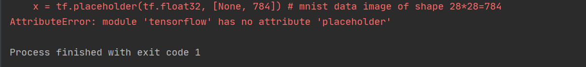
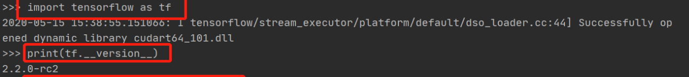

# 安装

pip问题

```
python -m pip install --upgrade pip
pip install ipykernel
```

代码

```bash
jupyter kernelspec remove python-tensorflow
conda remove -n tensorflow --all
conda create -n tensorflow python=3.6
conda activate tensorflow

conda search --full --name ipykernel
conda install ipykernel
python -m ipykernel install --name Python-tensorflow

conda search --full --name tensorflow
conda install tensorflow
conda install ipython matplotlib scipy pandas numpy seaborn
```


# 版本问题

# 'placeholder'

此博客链接：https://www.cnblogs.com/ping2yingshi/p/12920537.html

当你出现这个问题时，说明在tf2下使用了tf1的API。




1.参看版本号是否使用错误。

在pycharm下，找到工程，然后输出下面命令参看版本

```
import tensorflow as tf  #载入tensorflow环境

print(tf.__version__)    #查看tensorflow版本
```

如果显示下图所示，说明你用的是tf2.

 

 2.把代码进入tf环境中下面的代码

```
import tensorflow as tf
```

替换成下面代码。

```
import tensorflow.compat.v1 as tf
tf.disable_v2_behavior()
```

运行程序。程序正确。


# keras

```
pip install keras_resnet
```

tensorflow和keras对应关系https://docs.floydhub.com/guides/environments/