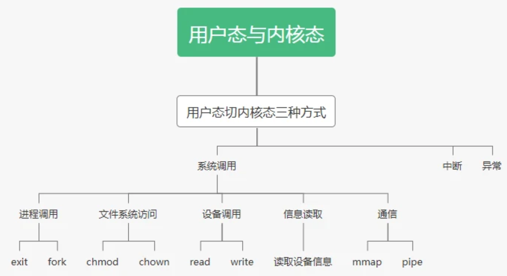
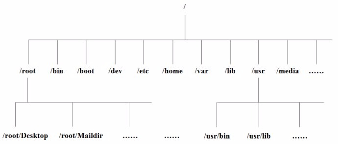
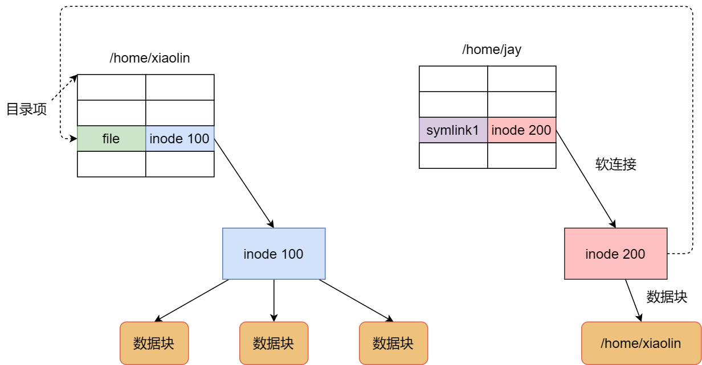

## 进程与线程

### 进程概念

> 进程和环境变量：https://blog.csdn.net/sandmm112/article/details/79551142

进程是操作系统资源分配的基本单位。进程有自己的地址空间，包括代码、数据、指令的地址。运行过程中也会不断申请系统资源。

### PCB

Linux内核的进程控制块是task_struct结构体。

> /usr/src/linux-headers-3.16.0-30/include/linux/sched.h文件中可以查看struct task_struct 结构体定义。其内部成员有很多，掌握以下部分

- 进程id

- 进程的状态（就绪、运行、挂起、停止等）

- CPU寄存器信息（进程切换时有用）

- 虚拟地址空间的信息

- 控制终端的信息

- 当前工作目录

- umask掩码

- 文件描述符表（包含很多指向file结构体的指针）

- 和信号相关的信息

- 用户id和组id

- 会话（Session）和进程组

- 进程可以使用的资源上限

### 进程的创建

> https://blog.csdn.net/Luckyboom_/article/details/99608525

- 调用fork()之后，陷入内核态
- 内核分配新的内存和内核数据结构(PCB task_struct结构体)给子进程
- 内核将父进程的数据内容拷贝到子进程
- 将子进程PCB加入到管理链表（PCB描述程序，用于OS管理进程）
- 返回用户态（父进程fork返回子进程pid，子进程返回0）
- 调度器调度

 vfork的用法与fork相同，只是，有下列区别：

- vfork创建子进程后，父子进程共享代码和数据
- 先运行子进程，子进程只有通过调用exit或exec结束后，父进程才开始运行

### OS对进程的管理

描述：将进程的相关属性信息放在进程控制块PCB中，Linux中为task_struct

组织：OS将PCB用链表存储，放在内核中

各个进程分别需要一个虚拟地址空间（结构体 mm_struct）、页表、映射关系

进程的代码和数据都在物理内存中，OS将虚拟地址通过页表映射到物理内存上，从而操作内存。虚拟地址空间由PCB中的指针指向。

### 环境变量

操作系统指定的程序运行时的一些变量。如链接库文件时的库文件目录。

（1）echo：查看环境变量的内容，上述已经说明

（2）export：设置一个新的环境变量

本地变量没有全局特性，只会被本shell看到，不会被子进程看到。而环境变量具有全局特性，所以会被本shell及以下的所有子进程看到，即被子进程继承下去。

### 进程和线程区别

根本区别：进程是操作系统资源分配的基本单位，而线程是任务调度和执行的基本单位

> https://www.zhihu.com/question/25532384

- 一个执行中的程序就是一个进程，每个进程都有一段地址空间，在这段空间中，用于存放程序的代码，数据，指令的地址等静态的事物；
  - 线程是进程的一部分，线程不会改变进程对内存（堆）的管理，线程间共享内存资源。每个线程都有自己独立的栈。
- 进程的上下文切换更复杂
  - 进程调度：包括分配的内存，数据段，堆栈段等
  - 线程调度：主要切换堆栈，以及各寄存器（同个进程里的线程 堆栈不同）
- 线程需要自己处理异常

### 线程同步

> https://blog.csdn.net/weixin_30420305/article/details/96077082

#### 互斥锁

互斥为多个时刻只有一个进程能使用资源；同步是一种更严格的互斥，进程有严格的先后执行关系。

```cpp
// 静态
pthread_mutex_t mutex_x=PTHREAD_MUTEX_INITIALIZER;//static init mutex
// 动态：pthread_mutex_init函数
pthread_mutex_lock(&mutex_x);//atomic opreation through mutex lock
pthread_mutex_unlock(&mutex_x);
```

#### 条件变量

当线程在等待满足某些条件时使线程进入睡眠状态，一旦条件满足，就换线因等待满足特定条件而睡眠的线程

1）创建

静态方式：pthread_cond_t cond PTHREAD_COND_INITIALIZER

动态方式：int pthread_cond_init(&cond,NULL)

2）注销

int pthread_cond_destory(&cond)

只有没有线程在该条件变量上，该条件变量才能注销，否则返回EBUSY

3）等待

条件等待：int pthread_cond_wait(&cond,&mutex)

计时等待：int pthread_cond_timewait(&cond,&mutex,time)

1.其中计时等待如果在给定时刻前条件没有被满足，则返回ETIMEOUT，结束等待

2.无论那种等待方式，都必须有一个互斥锁配合，以防止多个线程同时请求pthread_cond_wait形成竞争条件

3.在调用pthread_cond_wait前必须由本线程加锁

4）激发

激发一个等待线程：pthread_cond_signal(&cond)

激发所有等待线程：pthread_cond_broadcast(&cond)

重要的是，pthread_cond_signal不会存在惊群效应，也就是是它最多给一个等待线程发信号，不会给所有线程发信号唤醒提他们，然后要求他们自己去争抢资源！

pthread_cond_signal会根据等待线程的优先级和等待时间来确定激发哪一个等待线程

#### 读写锁

可以多个线程同时读，但是不能多个线程同时写

动态初始化：int pthread_rwlock_init(rwlock，NULL)，NULL代表读写锁采用默认属性

阻塞方式获取锁：

int pthread_rwlock_rdlock(rwlock),以读的方式获取锁

int pthread_rwlock_wrlock(rwlock)，以写的方式获取锁

int pthread_rwlock_unlock(rwlock),释放锁

非阻塞的方式获取锁：

int pthread_rwlock_tryrdlock(rwlock)

int pthread_rwlock_trywrlock(rwlock)

#### 信号量

信号量（sem）和互斥锁的区别：互斥锁只允许一个线程进入临界区，而信号量允许多个线程进入临界区
```cpp
int sem_init(&sem,pshared,v)

//pshared为0表示这个信号量是当前进程的局部信号量
//pshared为1表示这个信号量可以在多个进程之间共享
//v为信号量的初始值

int sem_init(&sem,pshared,v)

//以原子操作的方式将信号量的值减去1
int sem_wait(&sem)
//以原子操作的方式将信号量的值加上1
int sem_post(&sem)

```


### 进程间通信

> https://www.jianshu.com/p/43e4a1123017

#### 管道

- 底层用队列实现，管道中内容读完就删除
- 半双工，数据单项流动
- 缺点：只能在父子进程或有亲缘关系的进程中使用

```cpp
int  pipe(int[2]);//创建无名管道,参数返回写和读文件操作符
```

读写使用read/write函数；close关闭文件操作符

#### 命名管道

- **命名管道**也是半双工的通信方式，它允许无亲缘关系的进程间进行通信

```cpp
int mkfifo(const char *, mode_t);//创建管道对象
int open(const char *, int, ...)；//打开管道
```

#### 信号通信

**信号**是一种比较复杂的通信方式，用于通知接收进程某个事件已经发生。

- 使用内核中已经存在的信号对象；
- kill -l查看内核中支持多少种信号；
- 需要接收进程存在；
- raise函数把信号发给当前进程；

- alarm函数：定时一段时间发出信号给当前进程，终止进程；
- 接收信号的进程条件不能结束；

- sleep;while(1)；

- pause()与sleep状态一样；

#### 系统IPC

##### 共享内存

映射一段能被其它进程访问的内存，这段共享内存由一个进程创建，但是多个进程可以访问。

共享内存读完之后，内容还存在；

```cpp
key_t   ftok(const char *, int);//创建key
int shmget(key_t, size_t, int);//创建共享内存对象
void    *shmat (int, const void *, int);//内存映射
int shmdt(const void *);//将用户空间的内存释放
int shmctl(int, int, struct shmid_ds *)//将内核空间的内存释放
```


##### 消息队列

消息的链表，存放在内核中并由消息队列标识符标识。

链式队列；
读完内容之后，消息就删除了；
一个消息队列可以供两个进程双向通信

```cpp
int msgget(key_t, int);//创建消息队列对象
int msgsnd(int, const void *, size_t, int)//发送消息
ssize_t msgrcv(int, void *, size_t, long, int)//接收消息
int msgctl(int, int, struct msqid_ds *)//删除、设置读取消息队列对象
```

##### 信号量

是一个计数器，用来控制多个进程对资源的访问，它通常作为一种锁机制。


### 进程状态


初始态，就绪态，运行态，挂起态与终止态


- 就绪状态：进程已获得除CPU以外的所需资源，等待分配CPU资源
- 运行状态：占用CPU资源运行，处于此状态的进程数小于等于CPU数
- 阻塞状态：缺少需要的资源从而由运行状态转换而来，但是该资源不包括 CPU 时间，缺少 CPU 时间会从运行态转换为就绪态。

### 进程调度算法

**批处理系统**

- FCFS(先来先服务)

- 短作业优先：非抢占式，长作业可能饿死

- 最短剩余时间优先

**交互式系统**

- 时间片轮转：将就绪进程按 FCFS 排成一个队列。队首运行一个时间片后，计时器时钟中断，使其停止执行，去往队尾。

- 优先级调度

  为了防止低优先级的进程永远等不到调度，可以随着时间的推移增加等待进程的优先级。

- 多级反馈队列：间片轮转调度算法和优先级调度算法的结合。设置了多个队列，每个队列时间片大小都不同，例如 1,2,4,8,..。进程在第一个队列没执行完，就会被移到下一个队列。

  


**实时系统**

要求一个请求在一个确定时间内得到响应。


### 同步异步

> https://blog.csdn.net/qq_38994205/article/details/105198018
>
> https://blog.csdn.net/diaopai5230/article/details/101216907?utm_medium=distribute.pc_relevant_t0.none-task-blog-2%7Edefault%7EBlogCommendFromMachineLearnPai2%7Edefault-1.control&depth_1-utm_source=distribute.pc_relevant_t0.none-task-blog-2%7Edefault%7EBlogCommendFromMachineLearnPai2%7Edefault-1.control

同步异步指两者关系，阻塞非阻塞是一方的状态。

真正的异步IO：linux中，可以调用aio_read函数告诉内核描述字缓冲区指针和缓冲区的大小、文件偏移及通知的方式，然后立即返回，当内核将数据拷贝到缓冲区后，再通知应用程序。

**同步：执行一个操作之后，进程触发IO操作并等待(也就是我们说的阻塞)或者轮询的去查看IO操作(也就是我们说的非阻塞)是否完成，\**等待结果，\**然后才继续执行后续的操作。**

**异步：执行一个操作后，可以去执行其他的操作，然后等待通知再回来执行刚才没执行完的操作。**

**对客户端而言**

- 同步表示请求之后等待服务端返回后，再进行下一步操作
- 异步表示请求之后，不用等服务器返回，直接进行下一步操作

**对服务端而言**

- 同步表示检测IO可操作与IO读写，使用同一个线程顺序执行
- 异步表示检测到IO可操作之后，使用另一个线程来进行IO操作

### 阻塞非阻塞

- 阻塞IO：函数调用者等待这个函数返回才能进行下一步动作

- **非阻塞IO**：非阻塞I/O执行系统调用总是立即返回，不管时间是否已经发生，若时间没有发生，则返回-1。

  此时可以根据errno区分这两种情况，对于accept，recv和send，事件未发生时，errno通常被设置成eagain

## 死锁

### 什么是死锁

在两个或者多个并发进程中，如果每个进程持有某种资源而又等待其它进程释放它或它们现在保持着的资源，在未改变这种状态之前都不能向前推进，称这一组进程产生了死锁。


### 必要条件

- 互斥：一个资源一次只能被一个进程使用
- 占有和等待：一个进程因请求资源而阻塞时，对已获得资源保持不放
- 不可抢占：已经分配给一个进程的资源不能强制性地被抢占，它只能被占有它的进程显式地释放。
- 环路等待：若干进程之间形成一种头尾相接的环形等待资源关系

### 鸵鸟策略

因为解决死锁的代价太大，且死锁不会对用户造成太大影响或发生死锁的概率很低时，可以采用鸵鸟策略。

### 死锁检测

- 每种类型需要一个资源

如果死锁，则资源分配图中成环。可以从一个节点出发进行DFS并标记，如果访问到已经访问过的节点，表示死锁。

- 每种类型需要多个资源


### 死锁恢复

- 利用抢占恢复
- 利用回滚恢复
- 通过杀死进程恢复

### 死锁预防

在程序运行之前预防发生死锁。

1. 破坏互斥条件

   例如假脱机打印机技术允许若干个进程同时输出，唯一真正请求物理打印机的进程是打印机守护进程。

2. 破坏占有和等待条件

   一种实现方式是规定所有进程在开始执行前请求所需要的全部资源。

3. 破坏不可抢占条件

4. 破坏环路等待

   给资源统一编号，进程只能按编号顺序来请求资源。

### 死锁避免

在程序运行时避免发生死锁。

银行家算法：一个小城镇的银行家，他向一群客户分别承诺了一定的贷款额度，算法要做的是判断对请求的满足是否会进入不安全状态，如果是，就拒绝请求；否则予以分配。


## 内存管理

### 虚拟地址映射

内存管理单元（MMU）管理着地址空间和物理内存的转换，其中的页表（Page table）存储着页（程序地址空间）和页框（物理内存空间）的映射表。

一个虚拟地址分成两个部分：一部分存储页面号，一部分存储偏移量。页面号从页表中读到的表项内容+偏移量 = 页框中地址。

下图的页表存放着 16 个页，这 16 个页需要用 4 个比特位来进行索引定位。例如对于虚拟地址（0010 000000000100），前 4 位是存储页面号 2，读取表项内容为（110 1），页表项最后一位表示是否存在于内存中，1 表示存在。后 12 位存储偏移量。这个页对应的页框的地址为 （110 000000000100）。


### 页面置换算法

1. 先进先出 FIFO
2. 最近最久未使用 LRU
3. 第二次机会：在FIFO的基础上多给一次机会，在链表中移动
4. 时钟算法：使用环形离岸边将页面链接起来，再使用一个指针指向最老的页面
5. 最不常用算法 LFU

### 缓冲区溢出

缓冲区溢出是指当计算机向缓冲区填充数据时，超出了缓冲区本身的容量，溢出的数据覆盖在合法数据上。

危害有以下两点：

- 程序崩溃
- 跳转并且执行一段恶意代码

造成缓冲区溢出的主要原因是程序中没有仔细检查用户输入。

### 分页和分段

虚拟内存采用的是分页技术，也就是将地址空间划分成固定大小的页，每一页再与内存进行映射。

- 段是信息的逻辑单位，对用户是可见的 ；页是信息的物理单位，对用户透明。
- 段的大小不固定，有它所完成的功能决定；页大大小固定，由系统决定
- 出现的原因：分页用于实现虚拟内存，从而获得更大的地址空间；分段主要是为了使程序和数据可以被划分为逻辑上独立的地址空间

### 堆和栈的区别

栈区（stack）— 由编译器自动分配释放 ，存放函数的参数值，局部变量的值等。其操作方式类似于数据结构中的栈。

堆区（heap） — 一般由程序员分配释放， 若程序员不释放，程序结束时可能由OS回收 。


## 内核

### CPU和MMU


- 虚拟地址: 可用的地址空间 有 4G

0x804a4000   int a = 10;

- 物理地址:1000


### 用户态与内核态切换

特权级从3级到0级



- 系统调用

  这是用户态进程主动要求切换到内核态的一种方式，用户态进程通过系统调用申请使用操作系统提供的服务程序完成工作，比如前例中fork()实际上就是执行了一个创建新进程的系统调用。而系统调用的机制其核心还是使用了操作系统为用户特别开放的一个中断来实现，例如Linux的int 80h中断

- 中断

  当外围设备完成用户请求的操作后，会向CPU发出相应的中断信号，这时CPU会暂停执行下一条即将要执行的指令转而去执行与中断信号对应的处理程序，如果先前执行的指令是用户态下的程序，那么这个转换的过程自然也就发生了由用户态到内核态的切换。比如硬盘读写操作完成，系统会切换到硬盘读写的中断处理程序中执行后续操作等。

- 异常

  当CPU在执行运行在用户态下的程序时，发生了某些事先不可知的异常，这时会触发由当前运行进程切换到处理此异常的内核相关程序中，也就转到了内核态，比如缺页异常。

具体操作：

1. 使用内核栈将当前进程的CS:IP、SS等其他寄存器保存起来
2. 将中断处理程序的CS存入寄存区，执行中断处理程序
3. 执行完后取出回到进程

###   select原理

> https://cloud.tencent.com/developer/article/1596048


1. 用户向内核发起select调用，并将文件描述符集合从用户空间拷贝到内核
2. 内核将fd加入到等待队列中
3. 内核接收到数据包时，轮询找到可读的socketfd，并更新fd集合中的描述符状态
4. ？在轮询唤醒的过程中,如果有对应的socket描述符是可读的,那么此时会将read_process加入到cpu就绪队列中,让cpu能够调度执行read_process任务
5. 用户调用select返回，用遍历fd集合进行操作

poll：poll使用链表的方式存储描述符fd,不受数组大小影响

### epoll原理

> https://www.cnblogs.com/zhilong233/p/13410719.html

1. 通过epoll_ctl将文件描述符从用户空间注册到内核。内核保存一棵红黑树来存储epitem节点（节点中保存监听的fd），以及一个rdlist链表用于存储准备就绪的事件
2. 当epoll_wait调用时，仅仅观察这个list链表里有没有数据即可。
3. 当有就绪事件的时候,循环遍历将监听变化的事件拷贝到用户空间中,并且会将就绪事件socket添加到epitem的就绪队列ready_list上

### 为何支持百万并发

- 不用重复传递事件集合
- epoll初始化时，内核开辟了epoll缓冲区，缓冲区内事件以epitem结点挂载到红黑树上，通过epoll_ctl的任何操作都是O(logN)
- epoll_wait调用仅需观察rdlist是否为空，若非空则拷贝rdlist到用户空间并返回触发事件数量，无需遍历，O(1)
- 向内核中断处理注册回调，一旦关心的事件触发，回调自动将socket对应的epitem添加到rdlist中

### 应用场景

- 当监测的fd数目较小，且各个fd都比较活跃，建议使用select或者poll
- 当监测的fd数目非常大，成千上万，且单位时间只有其中的一部分fd处于就绪状态，这个时候使用epoll能够明显提升性能

### ET、LT、EPOLLONESHOT

EPOLLONESHOT事件能进一步减少可读、可写和异常事件被触发的次数。 

LT：epoll_wait检测到文件描述符有事件发生，则将其通知给应用程序，应用程序可以不立即处理该事件。当下一次调用epoll_wait时，epoll_wait还会再次向应用程序报告此事件，直至被处理

ET：epoll_wait检测到文件描述符有事件发生，则将其通知给应用程序，应用程序必须立即处理该事件。通常使用非阻塞I/O，直到读取出现eagain。

EPOLLONESHOT

- 一个线程读取某个socket上的数据后开始处理数据，在处理过程中该socket上又有新数据可读，此时另一个线程被唤醒读取，此时出现两个线程处理同一个socket
- 我们期望的是一个socket连接在任一时刻都只被一个线程处理，通过epoll_ctl对该文件描述符注册epolloneshot事件，一个线程处理socket时，其他线程将无法处理，**当该线程处理完后，需要通过epoll_ctl重置epolloneshot事件**

**epoll线程安全**

> http://blog.sina.com.cn/s/blog_aed82f6f0102vu59.html

**边缘触发为什么要使用非阻塞IO**

> https://blog.csdn.net/qq_34793133/article/details/82055915

如果fd非阻塞，那么那个循环就能无阻塞地退出。而如果fd是阻塞的，那个循环就会阻塞在最后一次read调用上。

阻塞模式下，只要内核中可用的数据小于read调用时传入的buffer的长度就会导致read阻塞，或者如果内核中可用空闲容量小于write调用时传入的buffer长度也会导致write阻塞。

### epoll实现

#### epoll如何检测到IO数据发生变化？

send、connect、close

#### epoll和TCP的关系

#### epoll检测机制

#### epoll数据结构

红黑树+就绪队列


## 文件系统

### Linux目录结构



| 目录        | 含义                                 |
| ----------- | ------------------------------------ |
| **/bin**    | binary，存放命令                     |
| /boot       | 存放镜像，用于Linux启动              |
| **/dev**    | device，存放外部设备                 |
| **/etc**    | 存放系统管理所需的配置文件           |
| **/home**   | 用户主目录                           |
| **/lib**    | 系统基本的动态连接共享库             |
| /lost+found | 系统非法关闭相关                     |
| **/media**  | U盘、光驱等自动识别的设备            |
| **/mnt**    | 用户临时挂载的文件系统               |
| /opt        | 额外安装软件的目录                   |
| /proc       | 虚拟目录，存放系统内存的映射         |
| /root       | 系统管理员目录                       |
| /sbin       | 系统管理员使用的系统管理程序         |
| /selinux    | Redhat/CentOS特有的目录，安全相关    |
| /srv        | 存放一些服务启动之后需要提取的数据   |
| /sys        | 文件系统 sysfs                       |
| /tmp        | 存放临时文件                         |
| **/usr**    | 存放用户的应用程序和文件             |
| /usr/bin    | 系统用户使用的应用程序               |
| /usr/sbin   | 超级用户使用的管理程序和系统守护程序 |
| /usr/src    | 内核源代码默认的放置目录             |
| /var        | 存放日志文件、经常被修改的目录       |

### 索引节点和目录项

索引节点：存储在硬盘中，记录了文件的原信息，如数据在磁盘中的位置、访问权限、修改时间等。

目录项：缓存在内存中，是内核维护的一个数据结构，用来记录文件名字、索引节点指针和与其他目录项的层级关系。

目录项与索引节点为多对一的关系。如硬链接中，多个目录项中的索引节点指向同一个文件。


### 虚拟文件系统

VFS是在系统调用和文件系统层之间的系统，提供了一套所有文件系统都支持的数据接口和标准接口。


### 文件的使用

用户以字节的方式读写文件，操作系统以数据块来读写文件，

### 文件的存储

文件头：指定起始块的大小和长度

分为：连续空间存储、非连续空间存储。一般常用的是非连续空间存储。非连续空间存储又分为链表方式和索引方式。

显式链表：将链接文件各数据块的指针，放在文件分配表（FAT）中。

索引的方式：

文件头中含有一个索引数据块指针，指向索引数据块。

索引数据块中存放的是文件块的指针，指向各个文件块。

### 空闲空间管理

#### 空闲表法

为所有空闲空间建⽴⼀张表，表内容包括空闲区的第⼀个块号和该空闲区的块个数

#### 空闲链表法

每⼀个空闲块⾥有⼀个指针指向下⼀个空闲块

#### 位图法

利⽤⼆进制的⼀位来表示磁盘中⼀个盘块的使⽤情况，磁盘上所有的盘块都有⼀个⼆进制位与之对应。

当值为 0 时，表示对应的盘块空闲，值为 1 时，表示对应的盘块已分配。它形式如下：

1111110011111110001110110111111100111 ...

### 文件系统结构

### 软链接和硬链接

硬链接是多个⽬录项中的「索引节点」指向⼀个⽂件，也就是指向同⼀个 inode。 由于多个⽬录项都是指向⼀个 inode，那么只有删除⽂件的所有硬链接以及源⽂件时，系统才会彻底删除该⽂件。


软链接相当于重新创建⼀个⽂件，这个⽂件有独⽴的inode，但是这个⽂件的内容是另外⼀个⽂件的路径，所以访问软链接的时候，实际上相当于访问到了另外⼀个⽂件，所以软链接是可以跨⽂件系统的，甚⾄⽬标⽂件被删除了，链接⽂件还是在的，只不过指向的⽂件找不到了⽽已。




## ref

- 路人甲：常见面试题整理--操作系统篇（每位开发者必备）https://zhuanlan.zhihu.com/p/23755202?refer=passer
- CS-Notes: [计算机操作系统](http://www.cyc2018.xyz/%E8%AE%A1%E7%AE%97%E6%9C%BA%E5%9F%BA%E7%A1%80/%E6%93%8D%E4%BD%9C%E7%B3%BB%E7%BB%9F%E5%9F%BA%E7%A1%80/%E8%AE%A1%E7%AE%97%E6%9C%BA%E6%93%8D%E4%BD%9C%E7%B3%BB%E7%BB%9F%20-%20%E7%9B%AE%E5%BD%95.html)

