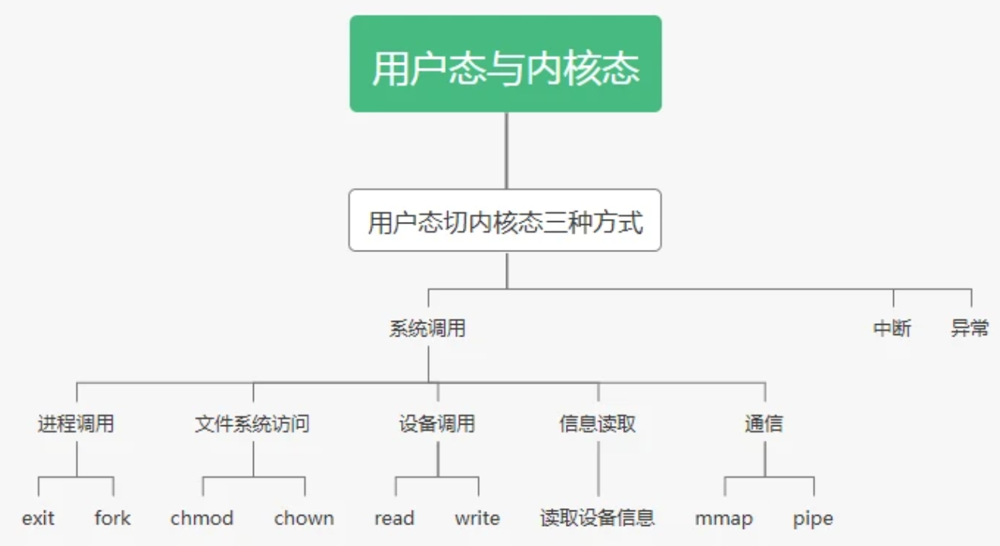
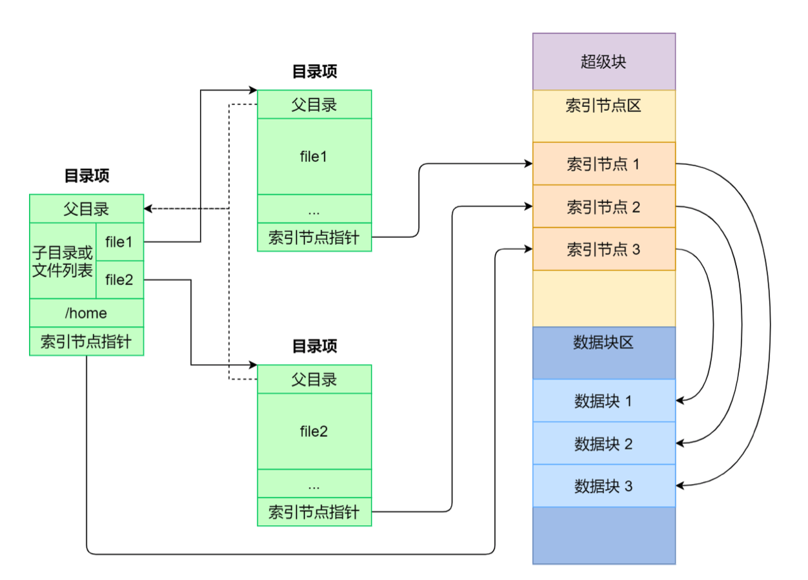
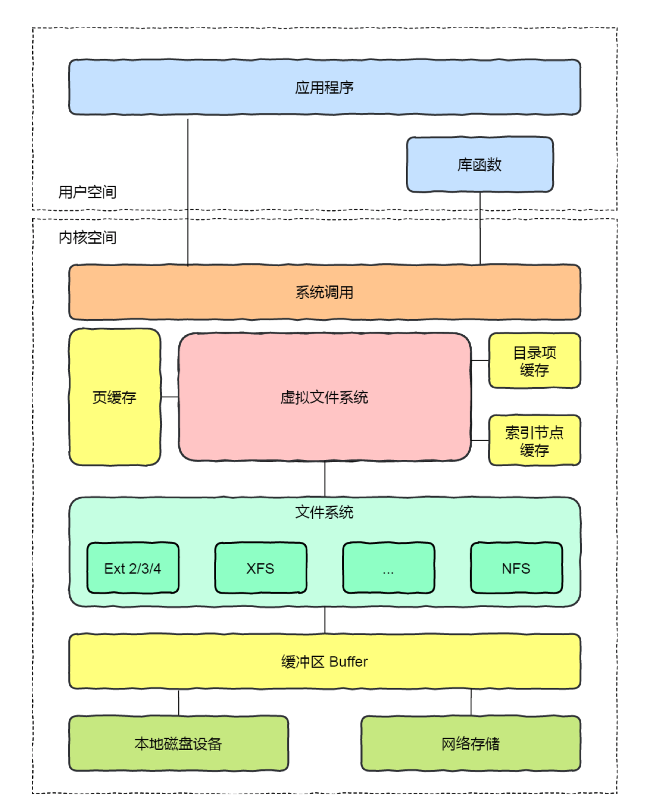
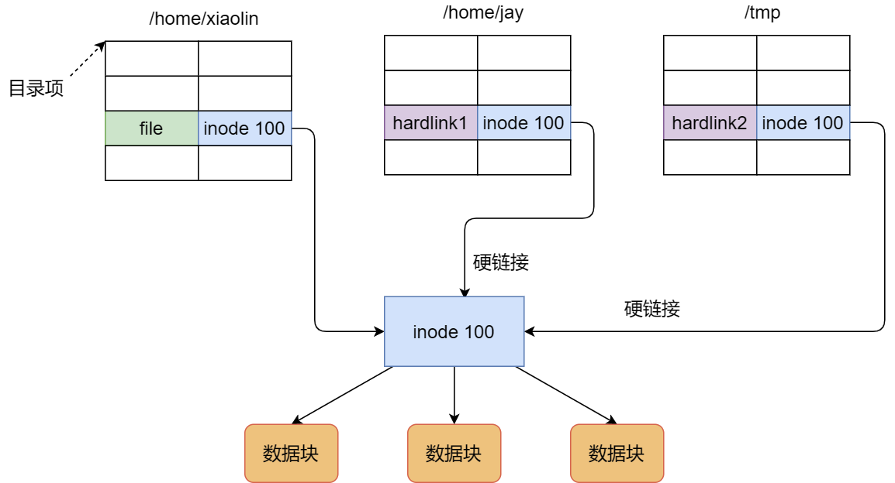
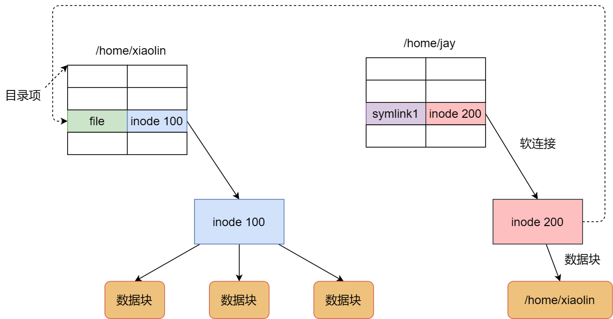

## 进程与线程

### 二者区别

- 一个进程可以包含多个线程
- 数据共享方式
- 进程要比线程消耗更多的计算机资源
- 进程间不会相互影响，一个线程挂掉将导致整个进程挂掉
- 进程可以拓展到多机，进程最多适合多核

### 线程同步

- 锁mutex：互斥为多个时刻只有一个进程能使用资源；同步是一种更严格的互斥，进程有严格的先后执行关系。
- 信号量sem：它允许同一时刻多个线程访问同一资源，但是需要控制同一时刻访问此资源的最大线程数量。

```c
typedef int semaphore;
semaphore mutex = 1;
void P1() {
    down(&mutex);
    // 临界区
    up(&mutex);
}

void P2() {
    down(&mutex);
    // 临界区
    up(&mutex);
}
```

- 信号signal：通过通知操作的方式来保持多线程同步，还可以方便的实现多线程优先级的比较操作。

### 进程的通信方式

**管道**pipe

- **管道**是一种半双工的通信方式，数据只能单项流动，并且只能在具有亲缘关系的进程间流动，进程的亲缘关系通常是父子进程
- **命名管道**也是半双工的通信方式，它允许无亲缘关系的进程间进行通信

**系统IPC**

- **消息队列**：消息的链表，存放在内核中并由消息队列标识符标识。
- **共享内存**：映射一段能被其它进程访问的内存，这段共享内存由一个进程创建，但是多个进程可以访问。
- **信号量**是一个计数器，用来控制多个进程对资源的访问，它通常作为一种锁机制。
- **信号**是一种比较复杂的通信方式，用于通知接收进程某个事件已经发生。

**SOCKET**

- 套接字：可用于不同机器间的进程通信

### 进程的状态


- 就绪状态：进程已获得除CPU以外的所需资源，等待分配CPU资源
- 运行状态：占用CPU资源运行，处于此状态的进程数小于等于CPU数
- 阻塞状态：缺少需要的资源从而由运行状态转换而来，但是该资源不包括 CPU 时间，缺少 CPU 时间会从运行态转换为就绪态。

### 进程调度算法

**批处理系统**

- FCFS(先来先服务)

- 短作业优先：非抢占式，长作业可能饿死

- 最短剩余时间优先

**交互式系统**

- 时间片轮转：将就绪进程按 FCFS 排成一个队列。队首运行一个时间片后，计时器时钟中断，使其停止执行，去往队尾。

- 优先级调度

  为了防止低优先级的进程永远等不到调度，可以随着时间的推移增加等待进程的优先级。

- 多级反馈队列：间片轮转调度算法和优先级调度算法的结合。设置了多个队列，每个队列时间片大小都不同，例如 1,2,4,8,..。进程在第一个队列没执行完，就会被移到下一个队列。

  


**实时系统**

要求一个请求在一个确定时间内得到响应。


## 死锁

### 什么是死锁

在两个或者多个并发进程中，如果每个进程持有某种资源而又等待其它进程释放它或它们现在保持着的资源，在未改变这种状态之前都不能向前推进，称这一组进程产生了死锁。


### 必要条件

- 互斥：一个资源一次只能被一个进程使用
- 占有和等待：一个进程因请求资源而阻塞时，对已获得资源保持不放
- 不可抢占：已经分配给一个进程的资源不能强制性地被抢占，它只能被占有它的进程显式地释放。
- 环路等待：若干进程之间形成一种头尾相接的环形等待资源关系

### 鸵鸟策略

因为解决死锁的代价太大，且死锁不会对用户造成太大影响或发生死锁的概率很低时，可以采用鸵鸟策略。

### 死锁检测

- 每种类型需要一个资源

如果死锁，则资源分配图中成环。可以从一个节点出发进行DFS并标记，如果访问到已经访问过的节点，表示死锁。

- 每种类型需要多个资源


### 死锁恢复

- 利用抢占恢复
- 利用回滚恢复
- 通过杀死进程恢复

### 死锁预防

在程序运行之前预防发生死锁。

1. 破坏互斥条件

   例如假脱机打印机技术允许若干个进程同时输出，唯一真正请求物理打印机的进程是打印机守护进程。

2. 破坏占有和等待条件

   一种实现方式是规定所有进程在开始执行前请求所需要的全部资源。

3. 破坏不可抢占条件

4. 破坏环路等待

   给资源统一编号，进程只能按编号顺序来请求资源。

### 死锁避免

在程序运行时避免发生死锁。

银行家算法：一个小城镇的银行家，他向一群客户分别承诺了一定的贷款额度，算法要做的是判断对请求的满足是否会进入不安全状态，如果是，就拒绝请求；否则予以分配。


## 内存管理

### 虚拟地址映射

内存管理单元（MMU）管理着地址空间和物理内存的转换，其中的页表（Page table）存储着页（程序地址空间）和页框（物理内存空间）的映射表。

一个虚拟地址分成两个部分：一部分存储页面号，一部分存储偏移量。页面号从页表中读到的表项内容+偏移量 = 页框中地址。

下图的页表存放着 16 个页，这 16 个页需要用 4 个比特位来进行索引定位。例如对于虚拟地址（0010 000000000100），前 4 位是存储页面号 2，读取表项内容为（110 1），页表项最后一位表示是否存在于内存中，1 表示存在。后 12 位存储偏移量。这个页对应的页框的地址为 （110 000000000100）。


### 页面置换算法

1. 先进先出 FIFO
2. 最近最久未使用 LRU
3. 第二次机会：在FIFO的基础上多给一次机会，在链表中移动
4. 时钟算法：使用环形离岸边将页面链接起来，再使用一个指针指向最老的页面
5. 最不常用算法 LFU

### 缓冲区溢出

缓冲区溢出是指当计算机向缓冲区填充数据时，超出了缓冲区本身的容量，溢出的数据覆盖在合法数据上。

危害有以下两点：

- 程序崩溃
- 跳转并且执行一段恶意代码

造成缓冲区溢出的主要原因是程序中没有仔细检查用户输入。

### 分页和分段

虚拟内存采用的是分页技术，也就是将地址空间划分成固定大小的页，每一页再与内存进行映射。

- 段是信息的逻辑单位，对用户是可见的 ；页是信息的物理单位，对用户透明。
- 段的大小不固定，有它所完成的功能决定；页大大小固定，由系统决定
- 出现的原因：分页用于实现虚拟内存，从而获得更大的地址空间；分段主要是为了使程序和数据可以被划分为逻辑上独立的地址空间

### 堆和栈的区别

栈区（stack）— 由编译器自动分配释放 ，存放函数的参数值，局部变量的值等。其操作方式类似于数据结构中的栈。
堆区（heap） — 一般由程序员分配释放， 若程序员不释放，程序结束时可能由OS回收 。


## 内核

### 用户态与内核态切换

特权级从3级到0级



- 系统调用

  这是用户态进程主动要求切换到内核态的一种方式，用户态进程通过系统调用申请使用操作系统提供的服务程序完成工作，比如前例中fork()实际上就是执行了一个创建新进程的系统调用。而系统调用的机制其核心还是使用了操作系统为用户特别开放的一个中断来实现，例如Linux的int 80h中断

- 中断

  当外围设备完成用户请求的操作后，会向CPU发出相应的中断信号，这时CPU会暂停执行下一条即将要执行的指令转而去执行与中断信号对应的处理程序，如果先前执行的指令是用户态下的程序，那么这个转换的过程自然也就发生了由用户态到内核态的切换。比如硬盘读写操作完成，系统会切换到硬盘读写的中断处理程序中执行后续操作等。

- 异常

  当CPU在执行运行在用户态下的程序时，发生了某些事先不可知的异常，这时会触发由当前运行进程切换到处理此异常的内核相关程序中，也就转到了内核态，比如缺页异常。

具体操作：

1. 使用内核栈将当前进程的CS:IP、SS等其他寄存器保存起来
2. 将中断处理程序的CS存入寄存区，执行中断处理程序
3. 执行完后取出回到进程

## 文件系统

### 索引节点和目录项

索引节点：存储在硬盘中，记录了文件的原信息，如数据在磁盘中的位置、访问权限、修改时间等。

目录项：缓存在内存中，是内核维护的一个数据结构，用来记录文件名字、索引节点指针和与其他目录项的层级关系。

目录项与索引节点为多对一的关系。如硬链接中，多个目录项中的索引节点指向同一个文件。



### 虚拟文件系统

VFS是在系统调用和文件系统层之间的系统，提供了一套所有文件系统都支持的数据接口和标准接口。



### 文件的使用

用户以字节的方式读写文件，操作系统以数据块来读写文件，文件系统

### 文件的存储

文件头：指定起始块的大小和长度

分为：连续空间存储、非连续空间存储。一般常用的是非连续空间存储。非连续空间存储又分为链表方式和索引方式。

显式链表：将链接文件各数据块的指针，放在文件分配表（FAT）中。

索引的方式：

文件头中含有一个索引数据块指针，指向索引数据块。

索引数据块中存放的是文件块的指针，指向各个文件块。

### 空闲空间管理

#### 空闲表法

为所有空闲空间建⽴⼀张表，表内容包括空闲区的第⼀个块号和该空闲区的块个数

#### 空闲链表法

每⼀个空闲块⾥有⼀个指针指向下⼀个空闲块

#### 位图法

利⽤⼆进制的⼀位来表示磁盘中⼀个盘块的使⽤情况，磁盘上所有的盘块都有⼀个⼆进制位与之对应。

当值为 0 时，表示对应的盘块空闲，值为 1 时，表示对应的盘块已分配。它形式如下：

1111110011111110001110110111111100111 ...

### 文件系统结构

### 软链接和硬链接

硬链接是多个⽬录项中的「索引节点」指向⼀个⽂件，也就是指向同⼀个 inode。 由于多个⽬录项都是指向⼀个 inode，那么只有删除⽂件的所有硬链接以及源⽂件时，系统才会彻底删除该⽂件。



软链接相当于重新创建⼀个⽂件，这个⽂件有独⽴的inode，但是这个⽂件的内容是另外⼀个⽂件的路径，所以访问软链接的时候，实际上相当于访问到了另外⼀个⽂件，所以软链接是可以跨⽂件系统的，甚⾄⽬标⽂件被删除了，链接⽂件还是在的，只不过指向的⽂件找不到了⽽已。




## ref

- 路人甲：常见面试题整理--操作系统篇（每位开发者必备）https://zhuanlan.zhihu.com/p/23755202?refer=passer
- CS-Notes: [计算机操作系统](http://www.cyc2018.xyz/%E8%AE%A1%E7%AE%97%E6%9C%BA%E5%9F%BA%E7%A1%80/%E6%93%8D%E4%BD%9C%E7%B3%BB%E7%BB%9F%E5%9F%BA%E7%A1%80/%E8%AE%A1%E7%AE%97%E6%9C%BA%E6%93%8D%E4%BD%9C%E7%B3%BB%E7%BB%9F%20-%20%E7%9B%AE%E5%BD%95.html)

