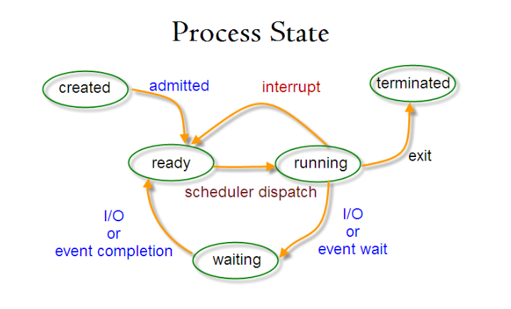

# 基本功能-进程管理

## 进程与线程

### 进程

进程是资源分配的基本单位。

进程控制块（PCB）包含进程的基本信息和运行状态。

对进程的创建和销毁，实际都是对 PCB 进行。

### 线程

线程是独立调度的基本单位

一个进程可以有多个线程，它们共享进程资源

### 区别

1. 资源：系统分配资源到进程，线程可以使用进程的资源
2. 调度：线程是独立调度的基本单位
3. 开销：进程的创建和销毁伴随资源的分配，线程切换只涉及少量寄存器的内容
4. 通信：线程可以直接读写统一进程中的数据，进程间通讯更复杂

## 进程状态的切换



缺少 CPU 时间：运行态 -> 就绪态

缺少资源：运行态 -> 阻塞态

## 进程调度算法

### 批处理系统

用户操作少，重点是吞吐量和周转时间（从提交到终止）

#### 先来先服务

按照请求的顺序调度

有利于长作业，会造成短作业等待时间过长

#### 短作业优先

可能导致长作业饿死，一直等待短作业的执行，最长的作业可能永远无法被执行

#### 最短剩余时间优先

短作业优先的抢占式版本

新的进程的时间与当前运行进程剩余时间比较，选择更短的执行

### 交互式系统

用户交互多，重点是快速响应交互

#### 时间片轮转

将所有就绪程序排成队列，每个程序执行一个时间片后移到队尾

#### 优先级调度

给每个进程分配优先级，按优先级进程调度

#### 多级反馈队列

是时间片轮转和优先级调度的结合

1. 设置多个队列，每个队列时间片长度不同，如1,2,4,8,...
2. 进程在第一个队列未执行完，则移到下一个队列
3. 每个队列优先级不同，最前面的队列优先级最高

### 实时系统

要求一个请求在一个确定的时间内得到相应

## 进程同步

### 临界区

必须互斥访问

### 同步与互斥

- 同步：合作关系，按顺序占用资源
- 互斥：制约关系，进入临界区后加锁

### 信号量

> 用以保护关键代码不被并发调用

信号量实现生产者-消费者问题

down（P）：若 信号量>0 则 -1，等于0则等待

up（V）：对信号量 +1

```c
#define N 100
typedef int semaphore;
semaphore mutex = 1;
semaphore empty = N;
semaphore full = 0;

void producer() {
    while(TRUE) {
        int item = produce_item();
        down(&empty);
        down(&mutex);
        insert_item(item);
        up(&mutex);
        up(&full);
    }
}

void consumer() {
    while(TRUE) {
        down(&full);
        down(&mutex);
        int item = remove_item();
        consume_item(item);
        up(&mutex);
        up(&empty);
    }
}
```

### 管程

管程把控制代码独立出来，是编程语言的组成部分。

任一时刻只能有一个进程使用管程，通常通过互斥量来实现


