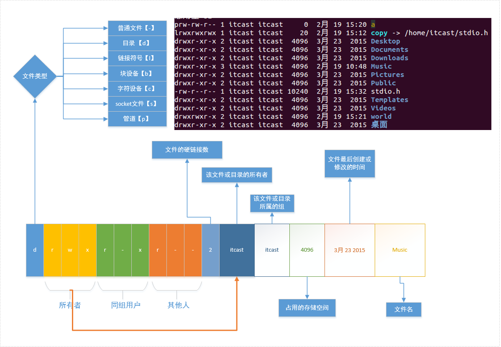
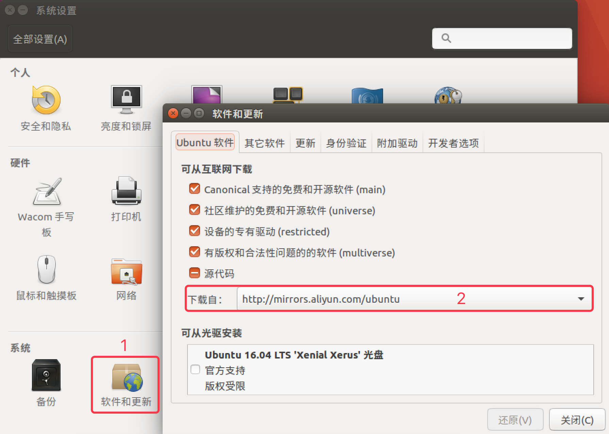
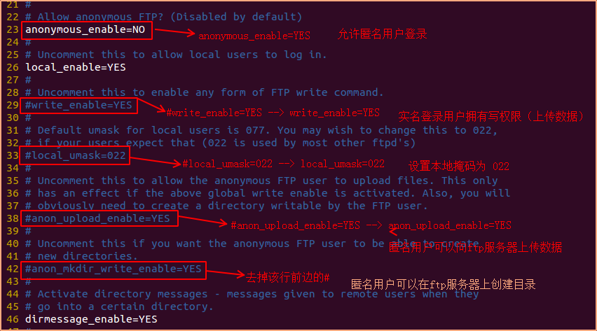

[命令大全](https://www.runoob.com/linux/linux-command-manual.html)

## SHELL操作

### 光标移动

1. 向上↑： ctrl+p (previous)
2. 向下↓： ctrl+n (next)
3. 向左←：ctrl+b (backward)
4. 右→：ctrl+f (forward)
5. 移动到头部: ctrl + a
6. 移动到尾部: ctrl + e

### 删除字符

1. 删除光标后边的: ctrl + d
	
2. 删除光标前边的: ctrl + h
3. 删除光标前的所有内容：ctrl + u

清屏：ctrl+L

## 文件操作

### 目录切换

```sh
cd - #在临近的两个目录直接切换
tree 目录  #显示文件夹树结构
```

### 颜色


### 文件权限



r-read w-write x-execute

### 删除拷贝

**删除**：rm -ri 删除时会提示

**创建**：touch xx 文件不存在：创建文件；文件存在：修改文件时间

**拷贝**：cp -r mytest/ newDir 拷贝文件夹。若newDir存在，则放入；若不存在，则创建

**查看文件**：cat more(只能向下浏览) less(可以上下浏览) head tail

### 远程拷贝

```sh
# 把本地当前目录下的 01.py 文件 复制到 远程 家目录下的 Desktop/01.py
# 注意：`:` 后面的路径如果不是绝对路径，则以用户的家目录作为参照路径
scp -P port 01.py user@remote:Desktop/01.py

# 把远程 家目录下的 Desktop/01.py 文件 复制到 本地当前目录下的 01.py
scp -P port user@remote:Desktop/01.py 01.py

# 加上 -r 选项可以传送文件夹
# 把当前目录下的 demo 文件夹 复制到 远程 家目录下的 Desktop
scp -r demo user@remote:Desktop

# 把远程 家目录下的 Desktop 复制到 当前目录下的 demo 文件夹
scp -r user@remote:Desktop demo
```


### 链接 ln

#### 软连接（符号链接）

相当于windows下快捷方式

- 创建软链接，源文件要使用**绝对路径**
- 软连接大小：源文件+路径 的总字节数
- 目录可以创建软链接

```sh
ln -s /home/a.txt（源文件名+绝对路径） a.test（软链接的名字）
```

#### 硬链接

注意事项

- 以**文件副本**的形式存在。但**不占用实际空间**
- 不允许给目录创建硬链接
- 硬链接只有在同一个文件系统中才能创建

硬链接能够**同步更新**

- linux下每一个文件都对应一个Inode，创建硬链接后，两个文件的Inode是相同的
- 查看文件的Inode：`stat a.txt`
- 文件创建硬链接后，硬链接计数+1，删除一个硬链接，硬链接计数-1

> inode：i节点，保存了一些文件信息，通过inode找到对应的节点·	

### 文件或目录属性

`wc a.txt`		查看文件的行数  字数  字节数  文件名

`od`	查看二进制文件信息

`du`(disk use)   查看某个目录的大小 

`df`(disk free)   查看磁盘的使用情况  一般加参数 `-h`（human） 以人类能看懂的方式显示 

`which`    查看指定命令所在的路径

> which指令会在PATH变量指定的路径中，搜索某个系统命令的位置，并且返回第一个搜索结果。


### find

在 **特定的目录下** **搜索** 符合条件的文件

按文件名查询：`-name`

- find + 路径 + -name + 文件名
- eg `find /home -name a.txt`

按文件大小查询：`-size`

- find + 路径 + -size + 范围
  - 范围
    - 大于：+100k
    - 小于：-100k
    - 等于： 100k
  - 大小
    - M 必须大写
    - k 必须小写

- 例子
  - 等于100k的文件: `find ~/ -size 100k`
  - 大于100k的文件: `find ~/ -size +100k`
  - 大于50k, 小于100k的文件: `find ~/ -size +50k -size -100k`

### grep

- 按文件内容查找
  - grep -r + “查找的关键字” + 路径
  - eg: `grep -r "main void" /home/itcast`

### mount挂载磁盘

- 系统默认挂载目录：/media
- 手动挂载目录：/mnt
- 挂载方式：mount + 设备名 + 挂载目录
  - 设备名
    - 检测设备名称： sudo fdisk -l
    - 磁盘命名规则
  - 挂载目录
    - 默认手动挂载到　/mnt
    - **注意**：挂载到/mnt以外的目录：挂载成功后会遮蔽掉目录中原来的东西，卸载设备之后才能看到目录中原来的数据

### unmount

sudo umount /mnt

**注意**：卸载的时候，用户的当前位置一定不能再 /mnt（/media）或者其子目录下，否则无法卸载

### 磁盘命名规则


### 打包 tar

`tar` 命令只打包不压缩，通过参数来完成压缩和解压

```sh
# 打包文件
tar -cvf 打包文件.tar 被打包的文件／路径...
# 解包文件
tar -xvf 打包文件.tar

# 压缩文件
tar -zcvf 打包文件.tar.gz 被压缩的文件／路径...
# 解压缩文件
tar -zxvf 打包文件.tar.gz
# 解压缩到指定路径
tar -zxvf 打包文件.tar.gz -C 目标路径
```

#### 参数

- z -> 用 gzip 来压缩/解压缩文件
  j -> 用 bzip2 来压缩/解压缩文件
- c -> create，创建新的压缩文件。
- x -> 从压缩文件中释放文件
- v -> 详细报告tar处理的文件信息，显示进度
- f -> 指定压缩文件的名字，放最后，后面是.tar文件

#### 压缩

- tar + 参数（zcvf） + 压缩包名字.tar.gz + 原材料（要打包压缩的文件或目录）
- tar + 参数（jcvf） + 压缩包名字.tar.bz2 + 原材料（要打包压缩的文件或目录）

#### 解压缩

- tar + 参数（zxvf） + 已有的压缩包（test.tar.gz）
- tar + 参数（jxvf） + 已有的压缩包（test.tar.bz2）
- 指定解压目录：添加参数 -C（大写）
  `tar zxvf test.tar.gz -C + 解压目录（./mytest）`

### 压缩

`命令 [参数] 压缩文件名 压缩的文件和目录`

#### .gz 格式

压缩：gzip 命令

解压缩：gunzip 命令

- 压缩过程中不保留源文件
- **不能对目录**进行压缩
- **不能对多个文件**进行打包压缩

#### .bz2格式

压缩：bzip2 命令

解压缩：bunzip2 命令

- 通过使用参数 -k(keep) 保留源文件
- **不能对目录**进行压缩
- **不能对多个文件**进行打包压缩

#### rar

使用前需要安装 rar 工具 sudo apt-get install rar

`rar <命令> -<选项1> ….-<选项N> <操作文档> <文件…> <@文件列表…> <解压路径>`

- 命令
  - a -> 添加文件到操作文档
  - x -> 带路径解压文档中内容到当前目录
  
- 选项
  
- r -> 递归子目录
  
- 打包 `rar a -r + 压缩文件名（newdir） + 压缩的目录（./mydir）`

  打包的生成的新文件不需要指定后缀		

- 解包 `rar x all.rar + 目录（/home/itcast/test）`

#### zip格式

- 压缩 `zip -r xxx.zip xxx`
- 解压缩 `unzip xxx.zip -d`

### 读log

https://www.cnblogs.com/shigfdengys/p/11164615.html

log所在位置：/var/log

| 命令                      | 含义                          |      |
| ------------------------- | ----------------------------- | ---- |
| tail -n 100 catalina.out  | 查询尾部最后100行，并不断刷新 |      |
| tail -n +100 catalina.out | 查询100行之后的所有           |      |
|                           |                               |      |
| cat filename              | 一次显示整个文件              |      |
| cat > filename            | 从键盘创建一个文件            |      |
| tac                       | 反向显示                      |      |


## 进程管理

​        (1) CTRL+Z挂起进程并放入后台

　　(2) jobs 显示当前暂停的进程

### shell

tty 设备：图形和文字界面互不影响

**设备切换：**

- tty1 - tty6 表示文字界面：ctrl + alt + [F1-F6]
- tty7 图形界面：ctrl + alt + F7

### ps

查看整个系统内部所运行的进程状况

- 涉及的参数
  - a：（all）当前系统所有用户的进程
  - u：查看进程所有者及其他一些信息
  - x：显示没有控制终端的进程 -- 不能与用户进行交互的进程【输入、输出】	
- 显示当前用户下所有进程 **ps aux**
- 对显示的进程过滤 `ps aux | grep xxx`
  - 什么是管道（|）
    			
    - 指令1的输出作为指令2的输入
    - 指令2处理完毕，将信息输出到屏幕
  - grep查询是需要占用一个进程的，所有结果 > 2 才能说明查询结果存在
  - 如果结果有一条，表示没有查询的进程
  - 查询结果中PID表示进程ID

```sh
ps aux | grep xxx

kill -9 xxx进程号
```

### kill

> 用来终止指定的进程（terminate a process）的运行

查看信号编号：`kill -l`

 `kill -9 【PID-进程标识号】`：向当前进程发送了9号信号（SIGKILL）

### env

查看当前进程环境变量

- 当前系统下用户的配置路径信息
- 格式为键值对：key=value:value  （多个值之间用:分隔）
- PATH：该环境变量中记录着shell命令解析器去查找命令的目录位置，从前往后的顺序查找

### top

动态显示运行中的进程并且排序

相当于windows下的任务管理器，文字版，不能翻页

### 查看进程

1. 显示进程目录/proc中所有当前正在运行的进程

```sh
ls /proc
```

2. 通过命令ps或top获取进程信息

3. 利用系统调用获取进程标识符

```c
pid_t getpid();//获取当前进程的PID
pid_t getppid();//获取当前进程的父进程的PID
```


### fork

- 父子进程共享：
  1. 文件描述符(打开文件的结构体)  
  2. mmap建立的映射区 (进程间通信)

`pid_t fork(void);	`

- 失败返回-1；

- 成功返回：① 父进程返回子进程的ID(非负)	②子进程返回 0 


### exec函数族

> 各个函数的参数使用方法/作用

fork创建子进程后，子进程需要调用exec函数以执行新的程序

> 当进程调用一种exec函数时，该进程的用户空间代码和数据完全被新程序替换，从新程序的启动例程开始执行。调用exec并不创建新进程，所以调用exec前后该进程的id并未改变。
>
> 将当前进程的.text、.data替换为所要加载的程序的.text、.data，然后让进程从新的.text第一条指令开始执行，但进程ID不变，换核不换壳。

其实有六种以exec开头的函数，统称exec函数：

```c
int execl(const char *path, const char *arg, ...);
int execlp(const char *file, const char *arg, ...);
int execle(const char *path, const char *arg, ..., char *const envp[]);
int execv(const char *path, char *const argv[]);
int execvp(const char *file, char *const argv[]);
int execve(const char *path, char *const argv[], char *const envp[]);
```


### 回收子进程

> 回收子进程的一般方式

- 孤儿进程：父进程先于子进程结束，子进程的父进程成为init进程

- 僵尸进程：进程终止，父进程尚未回收，子进程残留资源（PCB）存放于内核中，变成僵尸（Zombie）进程。

特别注意，僵尸进程是不能使用kill命令清除掉的。因为kill命令只是用来终止进程的，而僵尸进程已经终止。													

wait

父进程调用wait函数可以回收子进程终止信息。该函数有三个**功能**：

- 阻塞等待子进程退出 

- 回收子进程残留资源 

- 获取子进程结束状态(退出原因)。

`pid_t wait(int \*status);`	

成功：清理掉的子进程ID；失败：-1 (没有子进程)

**waitpid**

作用同wait，但可指定pid进程清理，可以不阻塞。

`pid_t waitpid(pid_t pid, int \*status, in options);`

成功：返回清理掉的子进程ID；失败：-1(无子进程)

## 环境变量

### 常用环境变量

| 环境变量 | 含义               |
| -------- | ------------------ |
| PATH     | 可执行文件搜索路径 |
| SHELL    | 命令解析器         |
| TERM     | 当前终端类型       |
| LANG     | 语言环境           |
| HOME     | 用户主目录         |

### 函数

| 函数                                                         | 含义             |
| ------------------------------------------------------------ | ---------------- |
| char *getenv(const char *name);                              | 获取环境变量值   |
| int setenv(const char *name, const char *value, int overwrite); | 设置环境变量的值 |
| int unsetenv(const char *name);                              | 删除环境变量     |

## 网络管理

### ifconfig

获取网络接口配置信息，修改这些配置


### ping

测试与目标主机的连通性

 `ping [参数] [主机名或IP地址]`

- 参数
  - -c 数目：在发送指定数目的包后停止。
  - -i 秒数：设定间隔几秒送一个网络封包给一台机器，预设值是一秒送一次

### nslookup

查看服务器域名对应的IP地址

一般访问网站都是使用域名，如：www.baidu.com，使用该命令就可查看百度所有服务器的IP地址

## 用户管理

切换到命令行模式： ctrl + Alt + F2~F6

桌面界面：ctrl + Alt + F7

### 创建用户

- `sudo adduser + 用户名（luffy）`
-  `sudo useradd -s /bin/bash -g itcast -d /home/itcast -m itcast`
  - -s 指定新用户登陆时shell类型
  - -g 指定所属组，该组必须已经存在
  - -d 用户家目录
  - -m 用户家目录不存在时，自动创建该目录

### 设置用户组

```sh
sudo groupadd itcast
```

### 删除用户

```sh
sudo deluser + 用户名（luffy） #不删除用户的主目录
sudo userdel -r itcast  #选项 -r 的作用是把用户的主目录一起删除
```

### 设置密码

```sh
sudo passwd + 用户名（luffy）
```

### 退出登录用户

exit


### whoami

查看当前登录用户

### chmod

> (change mod)

#### 文字设定法

`chmod [who] [+|-|=] [mode] 文件名`

- 操作对象【who】
  - u -- 用户（user）
  - g -- 同组用户（group）
  - o -- 其他用户（other）
  - a -- 所用用户（all）【默认】		
- 操作符【+-=】
  - \+ 添加权限
  - \-  取消权限
  - = 赋予给定权限并取消其他权限l
  - 权限【mode】
    	r -- 读
     		w -- 写
     		x -- 执行
    例：chmod u+wx file.txt

#### 数字设定法

`chmod 777 file.txt`

- 数字表示的含义
  - 0 -- 没有权限(-)
  - 1 -- 执行权限（x）
  - 2 -- 写权限（w）
  - 4 -- 读权限（r)
- 操作符【+-=】

### chown

将指定文件的拥有者改为指定的用户或组 -- change owner

- chown + 文件所属用户 + 文件或目录名

​			`sudo chown nobody text.txt`

- chown + 文件所属用户：文件所属组 + 文件或目录名

​			`sudo chown nobody：nogroup text.txt`

### chgrp

改变文件或目录的所属群组

- chgrp + 用户组 + 文件或目录名

​		`sudo chgrp nogroup text.txt`

## 软件安装和卸载

### 查看系统版本

```
lsb_release -a
```

### 在线安装


- apt-get

  - 安装：`sudo apt-get install tree` -- 在线下载安装

  - 移除：`sudo apt-get remove tree`

  - 更新：`sudo apt-get update` -- 更新软件列表

  - 清理所有软件安装包: `sudo apt-get clean`

    > 实际清理的是: /var/cache/apt/archives 目录下的 .deb 文件

- aptitude

  - 安装：`sudo aptitude install tree`
  - 重新安装：`sudo aptitude reinstall tree`
  - 更新：`sudo apt-get update`
  - 移除：`sudo aptitude remove tree`
  - 显示状态：`sudo aptitude show tree`

### apt

apt 是 `Advanced Packaging Tool`，是 Linux 下的一款安装包管理工具

> apt和apt-get的区别：
> https://www.sysgeek.cn/apt-vs-apt-get/

```sh
# 1. 安装软件
$ sudo apt install 软件包

# 2. 卸载软件
$ sudo apt remove 软件名

# 3. 更新已安装的包
$ sudo apt upgrade 
```


### deb包安装

- 安装 `sudo dpkg -i xxx.deb`

  > i--install    r--remove

- 删除 `sudo dpkg -r xxx`

### 源码安装

1. 解压缩源代码包
2. 进入到安装目录：cd dir
3. 检测文件是否缺失，创建Makefile，检测编译环境： ./configure
4. 编译源码，生成库和可执行程序：make
5. 把库和可执行程序，安装到系统目录下：sudo make install
6. 删除和卸载软件：sudo make distclean
7. 上述安装步骤并不是绝对的，应该先查看附带的 README 文件

### apt-get下载过慢

- https://blog.csdn.net/weixin_46474546/article/details/104708220
- https://www.cnblogs.com/zhaogaojian/p/12888227.html

1. 重命名原来的源作为备份：

```sh
sudo mv /etc/apt/sources.list /etc/apt/sources.list.backup
```

2. 新建一个sources.list文件

```sh
sudo gedit /etc/apt/sources.list
```

3. 复制以下内容并保存（阿里云源）：

```
deb-src http://archive.ubuntu.com/ubuntu xenial main restricted #Added by software-properties
deb http://mirrors.aliyun.com/ubuntu/ xenial main restricted
deb-src http://mirrors.aliyun.com/ubuntu/ xenial main restricted multiverse universe #Added by software-properties
deb http://mirrors.aliyun.com/ubuntu/ xenial-updates main restricted
deb-src http://mirrors.aliyun.com/ubuntu/ xenial-updates main restricted multiverse universe #Added by software-properties
deb http://mirrors.aliyun.com/ubuntu/ xenial universe
deb http://mirrors.aliyun.com/ubuntu/ xenial-updates universe
deb http://mirrors.aliyun.com/ubuntu/ xenial multiverse
deb http://mirrors.aliyun.com/ubuntu/ xenial-updates multiverse
deb http://mirrors.aliyun.com/ubuntu/ xenial-backports main restricted universe multiverse
deb-src http://mirrors.aliyun.com/ubuntu/ xenial-backports main restricted universe multiverse #Added by software-properties
deb http://archive.canonical.com/ubuntu xenial partner
deb-src http://archive.canonical.com/ubuntu xenial partner
deb http://mirrors.aliyun.com/ubuntu/ xenial-security main restricted
deb-src http://mirrors.aliyun.com/ubuntu/ xenial-security main restricted multiverse universe #Added by software-properties
deb http://mirrors.aliyun.com/ubuntu/ xenial-security universe
deb http://mirrors.aliyun.com/ubuntu/ xenial-security multiverse
```

4. 更新apt软件源：

```sh
sudo apt-get update
```

### 配置镜像源



### 语言问题

centos8安装中文（zh_CN）语言包

https://blog.csdn.net/whq12789/article/details/104043462

```
首先查看当前字符集

locale

看看有没有zh_CN.utf8

locale -a |grep CN

没有就安装

yum install -y langpacks-zh_CN

安装后再次确认配置

vi /etc/locale.conf

LANG="zh_CN.UTF-8"

修改后重启即可
```

## FTP服务器

ftp服务器作用：文件的上传和下载

### 安装

```sh
sudo apt-get install vsftpd# 客户端服务器都会被安装
```


服务安装完毕之后，ftp服务会随开机自动启动

```
1>. 服务器端:
		1). 修改配置文件 - 如何修改配置文件 -- /etc/vsftpd.conf
		2). 重启服务 -- sudo service vsftpd restart
2>. 客户端:
		1). 实名用户登录
					ftp + IP(server)
					输入用户名(server)
					输入密码
					
					文件的上传和下载
							文件的上传: put file
							文件的下载: get file
							不允许操作目录, 如果想操作目录 -- 打包 tar/rar/zip
		2). 匿名用户登录
					ftp + serverIP
					用户名: anonymous
					密码: 直接回车
					
					不允许匿名用户在任意目录直接切换
					只能在一个指定的目录范围内工作
					需要再ftp服务器上创建一个匿名用户的目录 -- 匿名用户的根目录
					
					
		3). lftp客户端访问ftp服务器
```

### 配置

- 服务器进行配置，配置给客户端使用
- 修改配置文件：gedit /etc/vsftpd.conf
  - write_enable=YES -> 是否拥有写权限	
  - anon_root=/home/itcast/ftp -> 匿名用户ftp根目录
  - anonymous_enable=YES -> 是否允许使用匿名用户
  - anon_upload_enable=YES -> 是否允许匿名用户上传权限
  - anon_mkdir_write_enable=YES -> 是否允许匿名用户创建目录



### 启动

配置完成之后，必须重启服务器新的配置才能够生效

```bash
sudo /lib/init/upstart-job vsftpd restart -- 14.04版本

sudo service vsftpd restart -- 通用，与版本无关
```

### 实名用户

- 连接服务器：ftp + 服务器IP（192.168.1.100）

- 用户可以访问服务器的任意目录
- 文件的上传和下载
  - 上传：put xxx
  - 下载：get xxx
  - 不能够上传下载目录，如有需求可以制作压缩包
- 退出  quit  bye  exit

### 匿名用户

- 连接服务器：ftp + 服务器IP（192.168.1.100）
  Name：anonymous      Password: 

- 指定匿名用户登录的根目录

  - 配置文件中添加：anon_root=/home/itcast/ftp

    或使用默认位置：/srv/ftp 
    可搜索/etc/passwd 文件中的ftp，里边给出了默认路径 /srv/ftp

  - 在指定的ftp目录下创建一个供匿名用户上传下载的目录

    - `sudo mkdir /srv/ftp/anonPersion`

    - `sudo chown ftp:nogroup /srv/ftp/annoPersion`
      把目录的所用者指定为ftp用户，设置组为nogroup(不属于任何组)

      或 `chmod 777 anonPersion`

### lftp

一个ftp客户端工具， 可以上传和下载目录

`sudo apt-get install lftp`

- 匿名

```
lftp 服务器IP
login
```

- 实名

```
lftp username@127.0.0.1 回车
输入服务器密码
```

| 命令      | 操作                   |
| --------- | ---------------------- |
| put       | 上传文件               |
| mput      | 上传多个文件           |
| get       | 下载文件               |
| mget      | 下载多个文件           |
| mirror    | 下载整个目录及其子目录 |
| mirror –R | 上传整个目录及其子目录 |


## SSH服务器

### 安装ssh

`sudo atp-get install openssh-server`

查看SSH是否安装

`sudo aptitude show openssh-server`

### 远程登录

`ssh 用户名@IP`
	确认连接的时候一定要写yes/no

例如：服务器管理员通过ssh远程登录外地主机，进行维护

### 退出登录

`logout`

#### scp命令

scp == super copy

使用该命令的前提条件：目标主机已经成功安装`openssh-server`

```sh
scp -r 目标用户名@IP地址:/目标文件的绝对路径 /保存到本机的绝对（相对）路径
		在后续会提示输入“yes”此时，只能输“yes”而不能简单输入“Y”

scp -r itcast@192.168.1.100:/home/itcast/QQ_dir/ ./mytest/360
	拷贝目录需要加参数 -r
```

## 手册 man

man man 共9个章节

1 可执行程序或shell命令

2 系统调用（内核提供的函数）

3 库调用（程序库中提供的函数）

5 文件格式和规范（如：/etc/passwd)

## 别名

查看 alias

设置 alias pag='ps aux | grep'

​		需要长久有效需要去设置配置文件：.bashrc

## echo

- 普通数据：echo 字符串
- 显示环境变量：`echo $PATH`
  - `$`：从变量中取值
- 显示上一次程序退出值：`echo $?`

## 关机重启

sudo poweroff  reboot   shutdown

```
shutdown
		参数
			-t 秒数 : 设定在切换至不同的runlevel之前, 警告和删除二讯号之间的延迟时间(秒).
			-k : 仅送出警告讯息文字, 但不是真的要 shutdown.
			-r : shutdown 之後重新开机.
			-h : shutdown 之後关机.
			-n : 不经过 init , 由 shutdown 指令本身来做关机动作.(不建议你用)
			-f : 重新开机时, 跳过 fsck 指令, 不检查档案系统.
			-F : 重新开机时, 强迫做 fsck 检查.
			-c : 将已经正在 shutdown 的动作取消.
		例子:
			shutdown -r now 立刻重新开机
			shutdown -h now 立刻关机
			shutdown -k now 'Hey! Go away! now....' 发出警告讯息, 但没有真的关机
			shutdown -t3 -r now 立刻重新开机, 但在警告和删除processes 之间, 延迟3秒钟.
			shutdown -h 10:42 'Hey! Go away!' 10:42 分关机
			shutdown -r 10 'Hey! Go away!' 10 分钟後关机
			shutdown -c 将刚才下的 shutdown 指令取消,必须切换至其它tty, 登入之後, 才能下此一指令.
			shutdown now 切换至单人操作模式(不加任何选项时)
```
