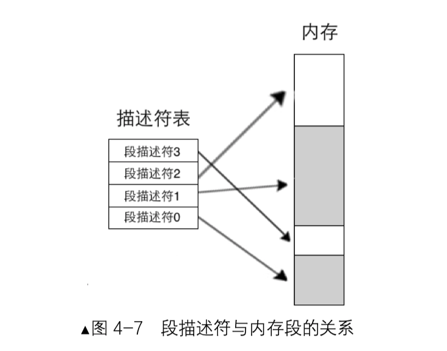
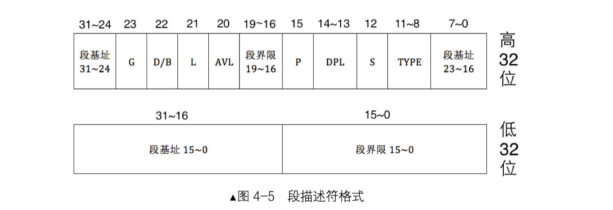
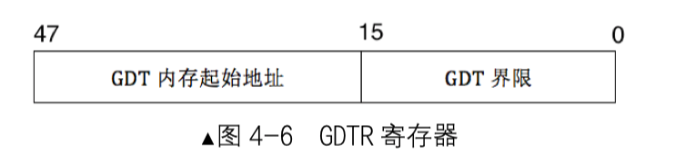

# 实验一：第一次运行MBR

## 1 相关知识

### BIOS

#### BIOS内存分布

16位机根据CS:IP的地址总线是20位，其地址范围是1MB，内存分布如下：

0-9FFFF：DRAM，即内存条

中间：显存

F0000-FFFFF：ROM，即BIOS


BIOS建立中断向量表，可以通过int 中断号来实现硬件调用

#### BIOS启动及其工作

接电时CPU的CS:IP寄存器即被初始化为0xF000:0xFFF0

BIOS的入口地址：0xFFFF0，内容为jmp far f000: e05b，即跳转到0xFE05B，BIOS代码起始位置

BIOS检测内存、显卡等外设信息，检测完成后在内存0x000~0x3FF处建立数据结构、中断向量表IVT并填写中断例程。

命令jmp 0: 0x7C00进行跳转。

### MBR

> 主引导记录（MBR，Master Boot Record）是硬盘的第一个扇区，即C/H/S地址的0柱面0磁头1扇区，也叫做MBR扇区。

大小必须是512字节，存储单元的最后两个字节是0x55和0xaa

### 0x10中断

调用的方法：把功能号送入 ah 寄存器，其他参数按照 BIOS 中断手册的要求放在适当的寄存器中，随后执行 int 0x10 即可。

## 2 实验记录

### 目的

编写mbr.S程序，功能为在屏幕上打印字符串“1 MBR”

### bochs

按照书上步骤安装bochs2.6到/usr/local/bin/目录下，并把配置文件bochsrc.disk放到此处

```bash

###############################################################
# Configuration file for Bochs
###############################################################

# how much memory the emulated machine will have
megs: 32

# filename of ROM images
romimage: file=/usr/local/share/bochs/BIOS-bochs-latest
vgaromimage: file=/usr/local/share/bochs/VGABIOS-lgpl-latest

# what disk images will be used
floppya: 1_44=a.img, status=inserted

# choose the boot disk.
boot:disk
#boot:floppy

# where do we send log messages?
log: bochs.out

# how much memory the emulated machine will have
megs: 32

# disable the mouse
mouse: enabled=0
vgaromimage: file=/usr/local/share/bochs/VGABIOS-lgpl-latest

# enable key mapping, using US layout as default.
keyboard:keymap=/usr/local/share/bochs/keymaps/x11-pc-us.map

# disk setting
#ata0: enabled=1, ioaddr1=0x1f0, ioaddr2=0x3f0, irq=14
ata0-master: type=disk, path="hd60M.img", mode=flat, cylinders=121, heads=16, spt=63, translation=auto

```


运行bochs

```bash
/usr/local/bin/bochs -f bochsrc.disk
```

### mbr.S

```assembly
;mbr.S
;主引导程序 
;------------------------------------------------------------
SECTION MBR vstart=0x7c00         
   mov ax,cs      
   mov ds,ax
   mov es,ax
   mov ss,ax
   mov fs,ax
   mov sp,0x7c00

; 清屏 利用0x06号功能，上卷全部行，则可清屏。
; -----------------------------------------------------------
;INT 0x10   功能号:0x06	   功能描述:上卷窗口
;------------------------------------------------------
;输入：
;AH 功能号= 0x06
;AL = 上卷的行数(如果为0,表示全部)
;BH = 上卷行属性
;(CL,CH) = 窗口左上角的(X,Y)位置
;(DL,DH) = 窗口右下角的(X,Y)位置
;无返回值：
   mov     ax, 0x600
   mov     bx, 0x700
   mov     cx, 0           ; 左上角: (0, 0)
   mov     dx, 0x184f	   ; 右下角: (80,25),
			   ; VGA文本模式中,一行只能容纳80个字符,共25行。
			   ; 下标从0开始,所以0x18=24,0x4f=79
   int     0x10            ; int 0x10

;;;;;;;;;    下面这三行代码是获取光标位置    ;;;;;;;;;
;.get_cursor获取当前光标位置,在光标位置处打印字符.
   mov ah, 3		; 输入: 3号子功能是获取光标位置,需要存入ah寄存器
   mov bh, 0		; bh寄存器存储的是待获取光标的页号

   int 0x10		; 输出: ch=光标开始行,cl=光标结束行
			; dh=光标所在行号,dl=光标所在列号

;;;;;;;;;    获取光标位置结束    ;;;;;;;;;;;;;;;;

;;;;;;;;;     打印字符串    ;;;;;;;;;;;
   ;还是用10h中断,不过这次是调用13号子功能打印字符串
   mov ax, message 
   mov bp, ax		; es:bp 为串首地址, es此时同cs一致，
			; 开头时已经为sreg初始化

   ; 光标位置要用到dx寄存器中内容,cx中的光标位置可忽略
   mov cx, 5		; cx 为串长度,不包括结束符0的字符个数
   mov ax, 0x1301	; 子功能号13是显示字符及属性,要存入ah寄存器,
			; al设置写字符方式 ah=01: 显示字符串,光标跟随移动
   mov bx, 0x2		; bh存储要显示的页号,此处是第0页,
			; bl中是字符属性, 属性黑底绿字(bl = 02h)
   int 0x10		; 执行BIOS 0x10 号中断
;;;;;;;;;      打字字符串结束	 ;;;;;;;;;;;;;;;

   jmp $		; 使程序悬停在此

   message db "1 MBR"
   times 510-($-$$) db 0
   db 0x55,0xaa
   
```

使用nasm进行编译

```bash
nasm -o mbr.bin mbr.S
```

### 磁盘操作

#### 创建磁盘

bochs 提供了创建虚拟硬盘的工具 bin/bximage

-fd 创建软盘。

-hd 创建硬盘。

-mode 创建硬盘的类型，有 flat、sparse、growing 三种。

-size 指创建多大的硬盘，以 MB 为单位。

-q 以静默模式创建，创建过程中不会和用户交互。

```sh
usr/local/bin/bximage -hd -mode="flat" -size=60 -q hd60M.img
```

需要在bochs配置文件中增加磁盘

#### 将mbr拷贝到磁盘

Linux命令dd

```bash
dd if=mbr.bin of=hd60M.img bs=512 count=1 conv=notrunc
```

bochs使用：

键入c 继续执行


# 实验二：访问显存

## 1 基础知识

实模式下显存地址分配


## 2 实验记录

```assembly
;主引导程序 
;
;LOADER_BASE_ADDR equ 0xA000 
;LOADER_START_SECTOR equ 0x2
;------------------------------------------------------------
SECTION MBR vstart=0x7c00         
   mov ax,cs      
   mov ds,ax
   mov es,ax
   mov ss,ax
   mov fs,ax
   mov sp,0x7c00
   mov ax,0xb800
   mov gs,ax

; 清屏
;利用0x06号功能，上卷全部行，则可清屏。
; -----------------------------------------------------------
;INT 0x10   功能号:0x06	   功能描述:上卷窗口
;------------------------------------------------------
;输入：
;AH 功能号= 0x06
;AL = 上卷的行数(如果为0,表示全部)
;BH = 上卷行属性
;(CL,CH) = 窗口左上角的(X,Y)位置
;(DL,DH) = 窗口右下角的(X,Y)位置
;无返回值：
   mov     ax, 0600h
   mov     bx, 0700h
   mov     cx, 0               ; 左上角: (0, 0)
   mov     dx, 184fh	       ; 右下角: (80,25),
			       ; 因为VGA文本模式中，一行只能容纳80个字符,共25行。
			       ; 下标从0开始，所以0x18=24,0x4f=79
   int     10h                 ; int 10h

   ; 输出背景色绿色，前景色红色，并且跳动的字符串"1 MBR"
   mov byte [gs:0x00],'1'
   mov byte [gs:0x01],0xA4     ; A表示绿色背景闪烁，4表示前景色为红色

   mov byte [gs:0x02],' '
   mov byte [gs:0x03],0xA4

   mov byte [gs:0x04],'M'
   mov byte [gs:0x05],0xA4   

   mov byte [gs:0x06],'B'
   mov byte [gs:0x07],0xA4

   mov byte [gs:0x08],'R'
   mov byte [gs:0x09],0xA4

   jmp $		       ; 通过死循环使程序悬停在此

   times 510-($-$$) db 0
   db 0x55,0xaa
```

# 实验三：MBR访问显存

```sh
nasm -I include/ -o mbr.bin mbr.S

nasm -I include/ -o loader.bin loader.S

/usr/local/bin/bximage -hd -mode="flat" -size=60 -q hd60M.img

dd if=mbr.bin of=hd60M.img bs=512 count=1 conv=notrunc

dd if=loader.bin of=hd60M.img bs=512 count=1 seek=2 conv=notrunc

/usr/local/bin/bochs -f bochsrc.disk
```

```assembly
;主引导程序 
;------------------------------------------------------------
%include "boot.inc"
SECTION MBR vstart=0x7c00         
   mov ax,cs      
   mov ds,ax
   mov es,ax
   mov ss,ax
   mov fs,ax
   mov sp,0x7c00
   mov ax,0xb800
   mov gs,ax

; 清屏
;利用0x06号功能，上卷全部行，则可清屏。
; -----------------------------------------------------------
;INT 0x10   功能号:0x06	   功能描述:上卷窗口
;------------------------------------------------------
;输入：
;AH 功能号= 0x06
;AL = 上卷的行数(如果为0,表示全部)
;BH = 上卷行属性
;(CL,CH) = 窗口左上角的(X,Y)位置
;(DL,DH) = 窗口右下角的(X,Y)位置
;无返回值：
   mov     ax, 0600h
   mov     bx, 0700h
   mov     cx, 0                   ; 左上角: (0, 0)
   mov     dx, 184fh		   ; 右下角: (80,25),
				   ; 因为VGA文本模式中，一行只能容纳80个字符,共25行。
				   ; 下标从0开始，所以0x18=24,0x4f=79
   int     10h                     ; int 10h

   ; 输出字符串:MBR
   mov byte [gs:0x00],'1'
   mov byte [gs:0x01],0xA4

   mov byte [gs:0x02],' '
   mov byte [gs:0x03],0xA4

   mov byte [gs:0x04],'M'
   mov byte [gs:0x05],0xA4	   ;A表示绿色背景闪烁，4表示前景色为红色

   mov byte [gs:0x06],'B'
   mov byte [gs:0x07],0xA4

   mov byte [gs:0x08],'R'
   mov byte [gs:0x09],0xA4
	 
   mov eax,LOADER_START_SECTOR	 ; 起始扇区lba地址
   mov bx,LOADER_BASE_ADDR       ; 写入的地址
   mov cx,1			 ; 待读入的扇区数
   call rd_disk_m_16		 ; 以下读取程序的起始部分（一个扇区）
  
   jmp LOADER_BASE_ADDR
       
;-------------------------------------------------------------------------------
;功能:读取硬盘n个扇区
rd_disk_m_16:	   
;-------------------------------------------------------------------------------
				       ; eax=LBA扇区号
				       ; ebx=将数据写入的内存地址
				       ; ecx=读入的扇区数
      mov esi,eax	  ;备份eax
      mov di,cx		  ;备份cx
;读写硬盘:
;第1步：设置要读取的扇区数
      mov dx,0x1f2
      mov al,cl
      out dx,al            ;读取的扇区数

      mov eax,esi	   ;恢复ax

;第2步：将LBA地址存入0x1f3 ~ 0x1f6

      ;LBA地址7~0位写入端口0x1f3
      mov dx,0x1f3                       
      out dx,al                          

      ;LBA地址15~8位写入端口0x1f4
      mov cl,8
      shr eax,cl
      mov dx,0x1f4
      out dx,al

      ;LBA地址23~16位写入端口0x1f5
      shr eax,cl
      mov dx,0x1f5
      out dx,al

      shr eax,cl
      and al,0x0f	   ;lba第24~27位
      or al,0xe0	   ; 设置7～4位为1110,表示lba模式
      mov dx,0x1f6
      out dx,al

;第3步：向0x1f7端口写入读命令，0x20 
      mov dx,0x1f7
      mov al,0x20                        
      out dx,al

;第4步：检测硬盘状态
  .not_ready:
      ;同一端口，写时表示写入命令字，读时表示读入硬盘状态
      nop
      in al,dx
      and al,0x88	   ;第4位为1表示硬盘控制器已准备好数据传输，第7位为1表示硬盘忙
      cmp al,0x08
      jnz .not_ready	   ;若未准备好，继续等。

;第5步：从0x1f0端口读数据
      mov ax, di
      mov dx, 256
      mul dx
      mov cx, ax	   ; di为要读取的扇区数，一个扇区有512字节，每次读入一个字，
			   ; 共需di*512/2次，所以di*256
      mov dx, 0x1f0
  .go_on_read:
      in ax,dx
      mov [bx],ax
      add bx,2		  
      loop .go_on_read
      ret

   times 510-($-$$) db 0
   db 0x55,0xaa

```

# 实验四：进入保护模式

## 1 基础知识

### 全局描述符表

实模式下的段基址，在保护模式下为全局描述符表。全局描述符表是保护模式下内存段的登记表

段寄存器中保存的内容为选择子，把全局描述符表当做数组，选择子可以理解为数组下标。



#### 段描述符

用以描述内存段的属性，大小为8字节。

- 段界限：单位为字节或4K，段的大小为1MB或4GB。若访问的地址超出段界限，即为非法访问，CPU抛出异常。

- type字段：非系统段中表明了一个内存段为代码段还是数据段、是否可读可执行



### GDTR

全局描述附表位于内存中，需要专门的寄存器GDTR指向它，CPU才知道它在哪儿




### 选择子

CPU用给出的选择子索引到描述符后，CPU自动从段描述符中取出段基址，再加上段内偏移地址，便组成了“段基址：段内偏移地址”的结构。


### 平坦模式

段基址和寄存器都是32位，只用寄存器就可以访问到4GB空间

## 进入保护模式的步骤

### 打开A20

实模式下地址线为20位，最大寻址空间是1MB，超出1MB的部分自动回绕到0地址。

打开A20地址线，就是关闭地址回绕功能，即将端口0x92的第1位置置1

```assembly
in al, 0x92
or al, 0000_0010B
out 0x92, al
```


### 加载GDT

```assembly
lgdt [gdt_ptr]
```


### 将CR0的PE位置1

控制寄存器系列CRx用以控制CPU的运行机制。CR0的PE位用以启动保护模式

```assembly
mov eax, cr
or eax, 0x00000001
mov cr0, eax
```

## 实验步骤

### 更新mbr.S

由于 loader.bin 超过了 512 字节，所以我们要把 mbr.S 中加载 loader.bin 的读入扇区 数增大，目前它是 1 扇区，为了避免将来再次修改，直接改成读入 4 扇区

```assembly
mov cx,4 	; 待读入的扇区数
call rd_disk_m_16 ; 以下读取程序的起始部分（一个扇区）
```

### inc/boot.inc

loader.S中用到的配置信息，都是定义在其中的符号

主要为新增段描述符的属性及选择子

### loader.S

构建GDT及其内部的描述符，描述符部分定义在boot.inc中，包括代码段描述符、数据段和栈段描述符、显存段描述符

获取GDT大小并为[中断描述符表IDT、任务状态段TSS描述符等]保留一定空间

构建代码段、数据段、显存段的选择子

定义GDT的指针gdt_ptr，此指针是后文使用 `lgdt [gdt_ptr]` 指令加载GDT到gdtr寄存器时用的

### 操作

```sh
nasm -I include/ -o mbr.bin mbr.S

nasm -I include/ -o loader.bin loader.S

/usr/local/bin/bximage -hd -mode="flat" -size=60 -q hd60M.img

dd if=mbr.bin of=hd60M.img bs=512 count=1 seek=0 conv=notrunc

# 注意count=2书上为1，因为loader.bin618字节超过了512字节，其实是刻入第2和第3扇区
dd if=loader.bin of=hd60M.img bs=512 count=2 seek=2 conv=notrunc

/usr/local/bin/bochs -f bochsrc.disk
```


# ref

- 《操作系统真相还原》
- https://blog.csdn.net/mxy990811?type=blog

