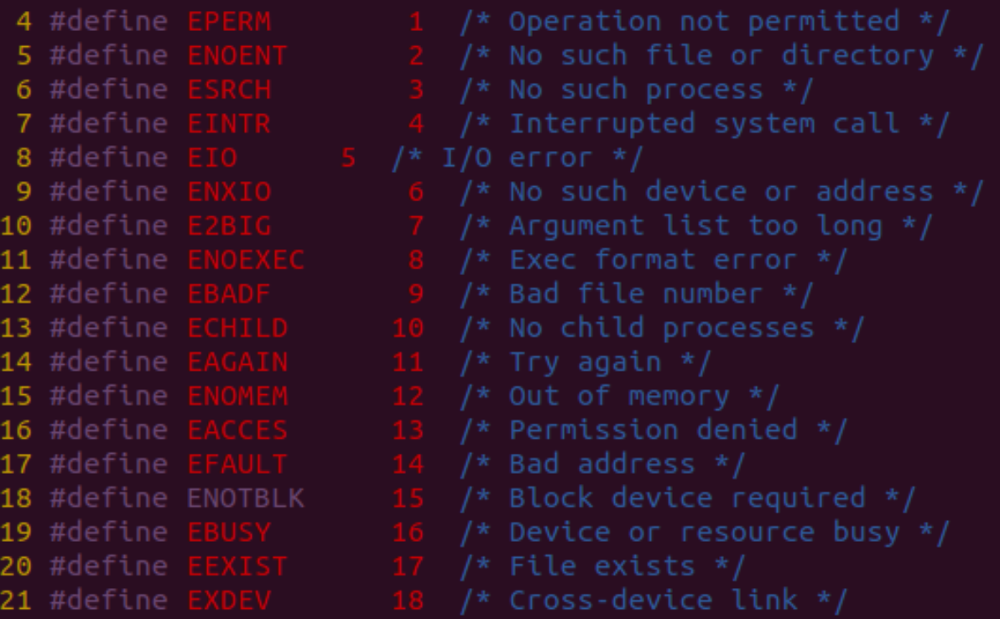

## vim编辑器

### 工作模式

1. 命令模式 -- 打开文件之后, 默认进入命令模式
2. 编辑模式 -- 需要输入一些命令, 切换到编辑模式
3. 末行模式 -- 在末行模式下可以输入一些命令


### 命令模式

#### 移动光标

	h: ← 左移
	l: → 右移
	j: ↓ 下移
	k: ↑ 上移
	gg: 光标移动文件开头
	G: 光标移动到文件末尾
	0: 光标移动到行首
	$: 光标移动到行尾
	123G：跳转到第123行
#### 删除

并不是真的删除，实际上是剪切

	x: 删除光标后一个字符,相当于 Del
	X: 删除光标前一个字符,相当于 Backspace
	dw: 删除光标开始位置的字
	d0: 删除光标前本行所有内容
	D（d$）: 删除光标后本行所有内容
	dd: 删除光标所在行
	n dd 删除指定的行数
	:%d 删除所有内容
#### 撤销操作

	u: 一步一步撤销
	Ctr-r: 反撤销
#### 复制粘贴

	yy: 复制当前行
	n yy：复制 n 行
	p: 在光标所在位置向下新开辟一行,粘贴
	P: 从光标所在行, 开始粘贴
其他软件中使用 `CTRL + C` 复制的内容，可以在 **编辑模式** 下使用 **鼠标右键粘贴**

#### 可视模式

	v：按字移动
	配合 h、j、k、l 使用，使用y复制选中内容
#### 查找操作

	/hello -> 从光标所在位置向后查找 hello
		n: 下一个
		N：上一个
		
	？hello -> 从光标所在位置向前查找 hello
		n: 上一个
		N：下一个
		
	在要查询的单词上使用 # 进行查找
#### 替换操作

```
r: 替换当前字符
```

#### 缩进

	>>: 文本行右移
	<<: 文本行左移
#### 查看 Man Page

光标移动到函数上

- `Shift-k`：查看man文档中最先出现单词的位置

- `3Shift-k`：查看第三章的 ManPage

### 编辑模式

	进入输入模式：
	  i: 插入光标前一个字符
	  I: 插入行首
	  a: 插入光标后一个字符
	  A: 插入行未
	  o: 向下新开一行,插入行首
	  O: 向上新开一行,插入行首
	  s: 删除光标所在的字符
	  S：删除当前行
### 末行模式

只能从命令模式切换到末行模式，使用`:`

#### 行跳转

```
:123 -> 跳转到第123行
```

#### 替换

	替换光标所在行
		:s/abc/123 -> 将第一个abc替换为123
		:s/abc/123/g -> 将abc全部替换为123
	替换所有行
		:%s/abc/123 -> 将所有行中的第一个abc替换为123
		:%s/abc/123/g -> 将所有行中的abc全部替换为123
	替换指定行
		:10,30s/abc/123/g -> 将10-30行中的abc全部替换为123
#### 执行shell命令

末行模式里输入`!`，后面跟命令

### 分屏操作

末行模式

	命令：sp 将屏幕分为两部分 --> 水平
	命令：vsp 将屏幕分为两部分 --> 垂直
	命令：sp（vsp） + 文件名 水平或垂直拆分窗口显示两个不同的文件
	操作
		命令：wqall 保存并退出所有屏幕
		命令：wq 保存并退出光标所在的屏幕
		CTrl+ww 切换两个屏幕
### vim设置

#### 设置行号

##### 临时

- 显示行号：:set number 或者 :set nu 

- 隐藏行号：:set nonumber 或者 :set nonu 

##### 永久

设置配置文件，两种配置方式

- /etc/vimrc  是系统范围的初始化配置

- ～/.vimrc   个人的vim初始化配置

在配置文件输入set number 或者 set nu 就可以了


## gcc

### gcc编译的流程


### 参数

- **产生目标文件 -o**
- **指定头文件目录 -I+目录** 
- 编译时定义宏 -D
- **编译优化 -On n=0∼3**
  -O0 - 没有优化
    	-O1 - 缺省值
    	O3 - 优化级别最高
- 提示更多警告信息  -Wall
- **只编译子程序 -c**
- 生成预处理文件 -E
- **包含调试信息 -g** （gdb调试的时候必须加此参数）

## 静态库

- 命名格式：lib开头，静态库名，.a结尾；eg: `libsort.a`

- 优点
  - 寻址方便，速度快
  - 库被打包到可执行程序中，直接发布可执行程序即可使用

- 缺点
  - 静态库的代码在编译过程中已经被载入可执行程序，因此体积较大
  - 如果静态函数库改变了，程序必须重新编译。

- 使用场合
  - 在核心程序上使用，保证速度，可忽视空间
  - 主流应用于80、90年代，现在很少用

### 制作

1. 得到 *.o

```
gcc *.c -c -I../include
	-c  只编译子程序
	-I  指定头文件目录
```

2. 得到静态库 libMyCalc.a

```
ar rcs libMyCalc.a *o 
（就是一个打包.o文件的过程）
		ar 工具不包含在gcc中
		r --> 将文件插入静态库中
		c --> 创建静态库，不管库是否存在
		s --> 写入一个目标文件索引到库中，或者更新一个存在的目标文件索引。
```

3. 查看库中的符号（函数、全局变量等）

```
nm libMyCalc.a
```

### 使用静态库

```
gcc main.c lib/libMyCalc.a -I include/ -o sum

gcc + 源文件 + -L 静态库路径 + -l静态库名 + -I头文件目录 + -o 可执行文件名
gcc main.c -L lib/ -l MyCalc -I include/ -o myapp
	-L --> 指定库所在的路径
	-l --> 指定库的名字
		去掉前缀lib，去掉后缀.a，只留下中间部分
	-I --> 头文件目录位置
```

`gcc + 源文件 + -I头文件 + libxxx.a`

生成的静态库需要跟对应的头文件同时发布
	头文件中存放的是函数接口（函数声明）


## 共享库（动态库）

- 命名格式：lib开头，动态库名，.so 结尾；eg: `libmytest.so`

- 机制：共享库的代码是在可执行程序运行时才载入内存的，在编译过程中仅简单的引用，因此代码体积较小。
- 优点：节省内存（共享）；易于更新（动态链接）
- 缺点：延时绑定，速度略慢
- 使用场合：对速度要求不是很强烈的地方都应使用动态库
- 注意事项：动态库是否加载到内存，取决于程序是否运行。

### 共享库更新

1. 停止运行程序
2. 使用新库覆盖旧库(保证新旧库名称一致，接口一致) “接口”
3. 重新启动程序。

### 制作

1. 生成**“与位置无关”**的目标文件（*.o）

	gcc -fPIC *.c -I ../include/ -c
		参数 -fPIC 表示生成与位置无关代码
		执行完毕后生成一系列的 .o 文件
2. 将.o文件打包制作动态库

	gcc -shared -o libMyCalc.so *.o
	  参数：-shared 制作动态库
		-o：重命名生成的新文件


### 使用动态库

	gcc main.c lib/libMyCalc.so -I include/ -o app
	
	gcc main.c -L ./lib -l MyCalc -I include/ -o myapp
		-L --> 指定库所在的路径
		去掉前缀 lib
		去掉后缀 .so
		只留下中间部分
		-I --> 头文件目录位置
#### ./myapp --> 运行失败

```
查看依赖的共享库：ldd myapp 发现 libMyCalc.so 找不到
没有给动态链接器（ld-linux.so.2）指定好动态库 libMyCalc.so 的路径
解决方案
		1. 临时设置：export LD_LIBRARY_PATH=库路径，将当前目录加入环境变量，但是终端退出了就无效了。
		2. 永久设置：将上条写入家目录下.bashrc文件中
		3. 粗暴设置：直接将libmytest.so文件拷贝到/usr/lib/【/lib】目录下。(受libc库的启发)
		4. 将libmytest.so所在绝对路径追加入到/etc/ld.so.conf文件，使用sudo ldconfig -v 更新
```


```
LD_LIBRARY_PATH
作用
​		指定查找共享库（动态链接库）时除了默认路径之外的其他路径
​		该路径在默认路径之前查找
设置方法
​		用export命令来设置值
```

### "与位置无关"的意义

静态库：每次放到代码段的同一个位置

动态库：`.o`文件不会打包到可执行文件中，只是做一个符号的记录。在程序运行后再加载动态库，每次加载放的位置不同


## 系统函数IO

系统调用函数都必须考虑返回值


### 虚拟地址空间


### C库函数与系统函数的区别


### open函数

#### 函数原型

```c
int open(const char *pathname, int flags);
int open(const char *pathname, int flags, mode_t mode);
```

- pathname：文件的相对或绝对路径

- flags：打开方式

  > 头文件：fcntl.h

  - 必选项
    			O_RDONLY 只读打开
      			O_WRONLY 只写打开
      			O_RDWR 可读可写打开
      			互斥

  - 可选项
    			O_APPEND 表示追加。
      				如果文件已有内容，这次打开文件所写的数据附加到文件的末尾而不覆盖原来的内容。
      			O_CREAT 若此文件不存在则创建它。
      				使用此选项时需要提供第三个参数mode，表示该文件的访问权限。
      				文件权限由open的mode参数和当前进程的umask掩码共同决定		

    ​			O_EXCL 如果同时指定了O_CREAT，并且文件已存在，则出错返回。
    ​			O_TRUNC 如果文件已存在，则将其长度截断（Truncate）为0字节。
    ​			O_NONBLOCK 设置文件为非阻塞状态
    ​		

#### 常见错误

 	1. 打开文件不存在 
 	2. 以写方式打开只读文件(打开文件没有对应权限)
 	3. 以只写方式打开目录




