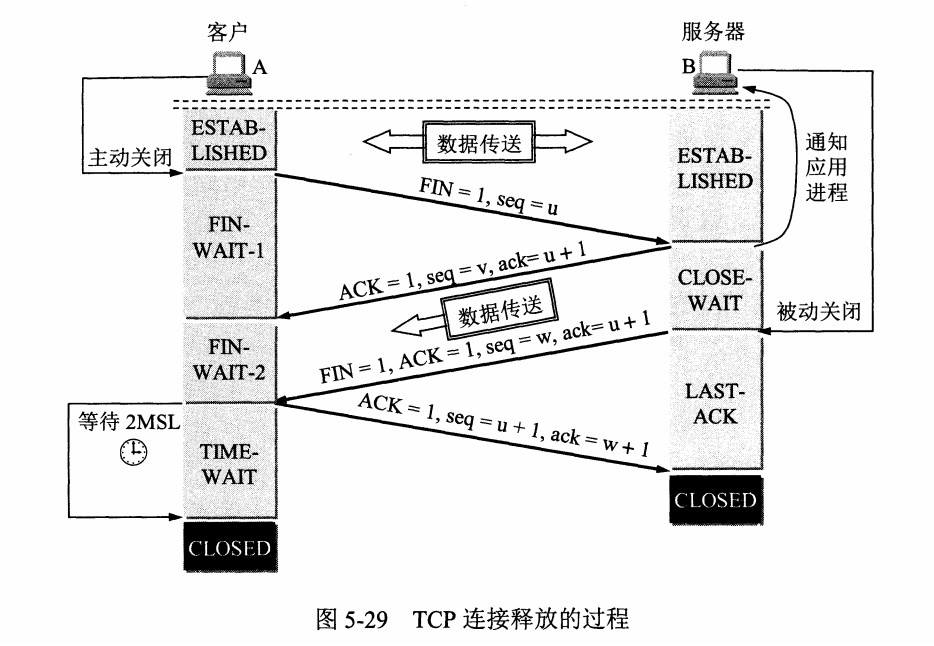

## 传输层

协议：

* TCP（Transmission Control Protocol，传输控制协议）
* UDP（User Datagram Protocol，用户数据报协议）

### TCP三次握手

- 首先服务器处于监听状态，等待客户的连接请求。

- 客户端向服务器发送连接请求报文，同步SYN=1，ACK=0，选择一个初始的序号seq=x。（ACK在建立连接后都为1）
- 服务器收到连接请求报文，如果同意建立连接，则向客户端发送连接确认报文。SYN=1，ACK=1，确认号为 x+1，同时也选择一个初始的序号 seq=y。
- 服务器收到客户端的连接确认报文后，还要向客户端发出确认，确认号为 y+1，序号为 x+1。
- 客户端收到服务器的确认后，连接建立。

**三次握手的原因**  

第三次握手是为了防止失效的连接请求到达服务器，让服务器错误打开连接：

客户端发送的连接请求如果在网络中滞留，那么就会隔很长一段时间才能收到服务器端发回的连接确认。客户端等待一个超时重传时间之后，就会重新请求连接。但是这个滞留的连接请求最后还是会到达服务器，如果不进行三次握手，那么服务器就会打开两个连接。如果有第三次握手，客户端会忽略服务器之后发送的对滞留连接请求的连接确认，不进行第三次握手，因此就不会再次打开连接。

### TCP 四次挥手

以下描述不讨论序号seq和确认号ack。ACK=1.

- 客户端发送连接释放报文，FIN=1。

- 服务器收到之后发出确认，此时 TCP 属于半关闭状态，服务器能向客户端发送数据但是客户端不能向服务器发送数据。

- 当服务器不再需要连接时，发送连接释放报文，FIN=1。

- 客户端收到后发出确认，进入 TIME-WAIT 状态，等待 2 MSL（最大报文存活时间）后释放连接。

- 服务器收到客户端的确认后释放连接。

**CLOSE_WAIT**

客户端发送了 FIN 连接释放报文之后，服务器收到了这个报文，就进入了 CLOSE-WAIT 状态。

这个状态是为了让服务器端发送还未传送完毕的数据，传送完毕之后，服务器会发送 FIN 连接释放报文。

**TIME_WAIT**  

客户端接收到服务器端的 FIN 报文后进入此状态，此时并不是直接进入 CLOSED 状态，还需要等待一个时间计时器设置的时间 2MSL。这么做有两个理由：

- 确保最后一个确认报文能够到达。如果服务器没收到客户端发送来的确认报文，那么就会重新发送连接释放请求报文，客户端等待一段时间就是为了处理这种情况的发生。

- 等待一段时间是为了让本连接持续时间内所产生的所有报文都从网络中消失，使得下一个新的连接不会出现旧的连接请求报文。

#### 为什么建立连接协议是三次握手，而关闭连接却是四次握手

### TCP滑动窗口

- 滑动窗口是一种缓存，发送方和接收方都有一个窗口。

- 滑动窗口动态调整（TCP流量控制）：接收方通过 TCP 报文段中的窗口字段告诉发送方自己的窗口大小，发送方根据这个值和其它信息设置自己的窗口大小。

- 发送窗口内的字节都允许被发送，接收窗口内的字节都允许被接收。

- 接收窗口只会对窗口内最后一个按序到达的字节进行确认，对多个报文段发送一个ACK进行确认

- 数据的四种状态

  

  

### TCP 拥塞控制

- 防止过多的数据注入到网络中，这样可以使网络中的路由器或链路不致过载。
- 和流量控制的区别：流量控制是为了让接收方能来得及接收，而拥塞控制是为了降低整个网络的拥塞程度。

- 发送方需要维护一个叫做**拥塞窗口**（cwnd）的状态变量

- 拥塞窗口与发送方窗口的区别：拥塞窗口只是一个状态变量，实际决定发送方能发送多少数据的是发送方窗口。

#### 1. 慢开始与拥塞避免

发送的最初执行慢开始，令 cwnd = 1，发送方只能发送 1 个报文段；当收到确认后，将 cwnd 加倍，因此之后发送方能够发送的报文段数量为：2、4、8 ...

注意到慢开始每个轮次都将 cwnd 加倍，这样会让 cwnd 增长速度非常快，从而使得发送方发送的速度增长速度过快，网络拥塞的可能性也就更高。设置一个慢开始门限 ssthresh，当 cwnd >= ssthresh 时，进入拥塞避免，每个轮次只将 cwnd 加 1。

如果出现了超时，则令 ssthresh = cwnd / 2，然后重新执行慢开始。

#### 2. 快重传与快恢复

在接收方，要求每次接收到报文段都应该对最后一个已收到的有序报文段进行确认。例如已经接收到 M1 和 M2，此时收到 M4，应当发送对 M2 的确认。

在发送方，如果收到三个重复确认，那么可以知道下一个报文段丢失，此时执行快重传，立即重传下一个报文段。例如收到三个 M2，则 M3 丢失，立即重传 M3。

在这种情况下，只是丢失个别报文段，而不是网络拥塞。因此执行快恢复，令 ssthresh = cwnd / 2 ，cwnd = ssthresh，注意到此时直接进入拥塞避免。

慢开始和快恢复的快慢指的是 cwnd 的设定值，而不是 cwnd 的增长速率。慢开始 cwnd 设定为 1，而快恢复 cwnd 设定为 ssthresh。

### TCP 与 UDP 的区别

1. TCP 首部开销20字节；UDP 的首部开销小，只有 8 个字节

2. **序号：**TCP 面向字节流（可能出现黏包问题），实际上是 TCP 把数据看成一连串无结构的字节流；UDP 是面向报文的（不会出现黏包问题）

3. **确认号：**TCP 面向连接一对一，UDP 是无连接的支持多对多

4. **窗口：**UDP 没有拥塞控制，因此网络出现拥塞不会使源主机的发送速率降低（对实时应用很有用，如 IP 电话，实时视频会议等）

5. TCP 提供可靠的服务，也就是说，通过 TCP 连接传送的数据，无差错，不丢失，不重复，且按序到达；UDP 尽最大努力交付，即不保证可靠交付

   

### TCP如何保持传输可靠性

- 连接管理

  三次握手、四次握手

- 确认和超时重传

  两个可能的原因：接收方未收到包、发送方未收到ACK。

  发送方在超过超时时间后，仍未收到ACK则重传。

  重传时间：每次判定超时重发的超时时间都是500ms的整数倍，以一个指数的形式增长。累计到一定的重传次数，强制关闭连接。

- 数据分片和排序

  TCP传输时将每个字节的数据都进行了编号。TCP传输的过程中，每次接收方收到数据后，都会对传输方进行确认ACK应答。

- 流量控制

  TCP头部的窗口大小，即接收端数据缓冲区的剩余大小。发送端根据窗口大小改变发送速度。

- 拥塞控制

  慢开始，快重传

- 校验和（UDP也有）

  两个数据段 加和、取反、加上进位

  如果接收方比对校验和与发送方不一致，那么数据一定传输有误。

https://blog.csdn.net/liuchenxia8/article/details/80428157

### 首部格式

-   **序号**   ：用于对字节流进行编号，表示第一个字节的编号。
-   **确认号**   ：期望收到的下一个报文段的序号。
-   **确认 ACK**   ：只有连接请求报文段 ACK=0，在连接建立后所有传送的报文段 ACK=1。
-   **同步 SYN**   ：在连接建立时用来同步序号。当 SYN=1，ACK=0 时表示这是一个连接请求报文段。若对方同意建立连接，则响应报文中 SYN=1，ACK=1。
-   **终止 FIN**   ：用来释放一个连接，当 FIN=1 时，表示此报文段的发送方的数据已发送完毕，并要求释放连接。
-   **窗口**   ：窗口值作为接收方让发送方设置其发送窗口的依据。之所以要有这个限制，是因为接收方的数据缓存空间是有限的。

源端口、目的端口、长度、检验和