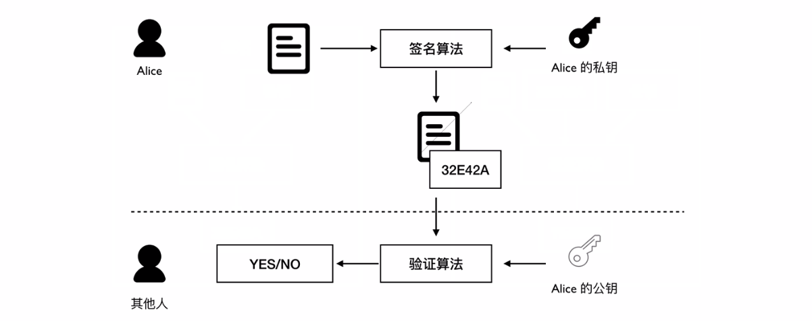
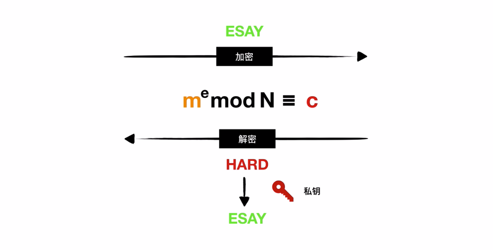

## 网络安全

### 对称加密与非对称加密

公开秘钥技术的两大应用：加密通信、数字签名

### SSL握手

> **SSL**（Secure Sockets Layer）安全套接字协议：在**传输层**对网络连接进行加密，是为网络通信提供安全及数据完整性的一种安全协议

#### 客户端发出请求

首先，客户端（通常是浏览器）先向服务器发出加密通信的请求，这被叫做ClientHello请求。

在这一步，客户端主要向服务器提供以下信息。

> （1） 支持的协议版本，比如TLS 1.0版。
>
> （2） 一个客户端生成的随机数，稍后用于生成"对话密钥"。
>
> （3） 支持的加密方法，比如RSA公钥加密。
>
> （4） 支持的压缩方法。

#### 服务器回应

服务器收到客户端请求后，向客户端发出回应，这叫做SeverHello。

服务器的回应包含以下内容。

> （1） 确认使用的加密通信协议版本，比如TLS 1.0版本。
>
> （2） 一个服务器生成的随机数，稍后用于生成"对话密钥"。
>
> （3） 确认使用的加密方法，比如RSA公钥加密。
>
> （4） 服务器证书。

#### 客户端回应

客户端收到服务器回应以后，验证服务器证书后从证书中取出服务器的公钥。然后，向服务器发送下面三项信息。

> （1） 一个随机数。该随机数用服务器公钥加密，防止被窃听。
>
> （2） 编码改变通知，表示随后的信息都将用双方商定的加密方法和密钥发送。
>
> （3） 客户端握手结束通知，表示客户端的握手阶段已经结束。这一项同时也是前面发送的所有内容的hash值，用来供服务器校验。

上面第一项的随机数，是整个握手阶段出现的第三个随机数，又称"pre-master key"。有了它以后，客户端和服务器就同时有了三个随机数，接着双方就用事先商定的加密方法，各自生成本次会话所用的同一把"会话密钥"。

至于为什么一定要用三个随机数，来生成"会话密钥"，[dog250](http://blog.csdn.net/dog250/article/details/5717162)解释得很好：

> "不管是客户端还是服务器，都需要随机数，这样生成的密钥才不会每次都一样。由于SSL协议中证书是静态的，因此十分有必要引入一种随机因素来保证协商出来的密钥的随机性。
>
> 对于RSA密钥交换算法来说，pre-master-key本身就是一个随机数，再加上hello消息中的随机，三个随机数通过一个密钥导出器最终导出一个对称密钥。
>
> pre master的存在在于SSL协议不信任每个主机都能产生完全随机的随机数，如果随机数不随机，那么pre master secret就有可能被猜出来，那么仅适用pre master secret作为密钥就不合适了，因此必须引入新的随机因素，那么客户端和服务器加上pre master secret三个随机数一同生成的密钥就不容易被猜出了，一个伪随机可能完全不随机，可是是三个伪随机就十分接近随机了，每增加一个自由度，随机性增加的可不是一。"

#### 服务器最后回应

服务器收到客户端的第三个随机数pre-master key之后，计算生成本次会话所用的"会话密钥"。然后，向客户端最后发送下面信息。

> （1）编码改变通知，表示随后的信息都将用双方商定的加密方法和密钥发送。
>
> （2）服务器握手结束通知，表示服务器的握手阶段已经结束。这一项同时也是前面发送的所有内容的hash值，用来供客户端校验。

至此，整个握手阶段全部结束。接下来，客户端与服务器进入加密通信，就完全是使用普通的HTTP协议，只不过用"会话密钥"加密内容。

#### ref

- http://www.ruanyifeng.com/blog/2014/02/ssl_tls.html
- https://blog.csdn.net/zhanyiwp?t=1

### 数字签名

- 作用：认证、防止抵赖、保证文件完整性。
- 私钥加密，公钥解密，和加密通信对称。
- 签名的目的不在于加密文件，而在于生成数字签名。

实例：Alice使用数字签名签名某个文件，把公钥放到公网上。其他人下载到文件和签名，使用Alice的公钥进行验证。

### 数字证书

常用于证明公钥属于某个人。

浏览器内置有CA的公钥，可以验证CA的签名。

### RSA算法

#### 实例

