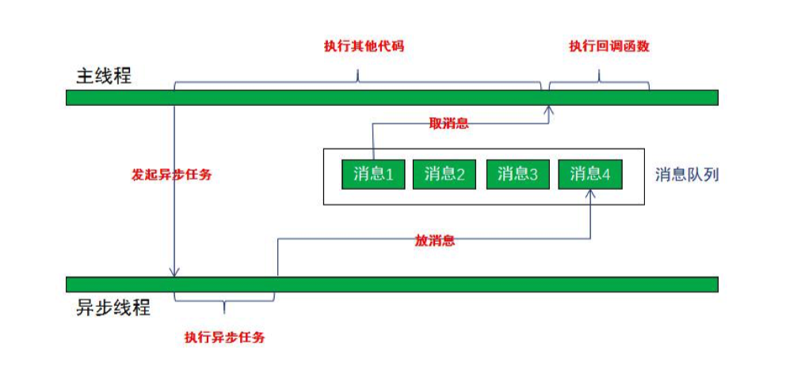

## 异步HTTP服务器设计

同步与异步：形容两者之间的关系

阻塞与非阻塞：形容一个IO的状态

异步如何设计：

1. 异步操作的上下文init_context
   1. pthread_create
   2. epoll_create
2. 销毁uninit_context
   1. pthread_cancel
   2. close
3. commit()
   1. 准备socket
   2. connect
   3. protocol; dns/http/redis/mysql
   4. send
   5. epoll_ctl(add,sockfd)，加入到统一epoll中管理
4. callback()
   1. epoll_wait()
   2. recv()

1. 需要创建一个线程，callback，监听异步事件
2. IO多路复用，epoll

