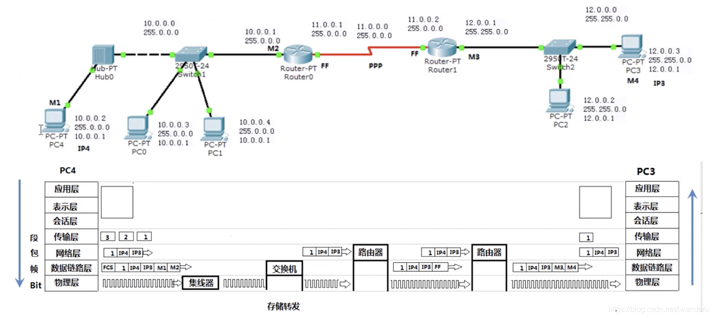
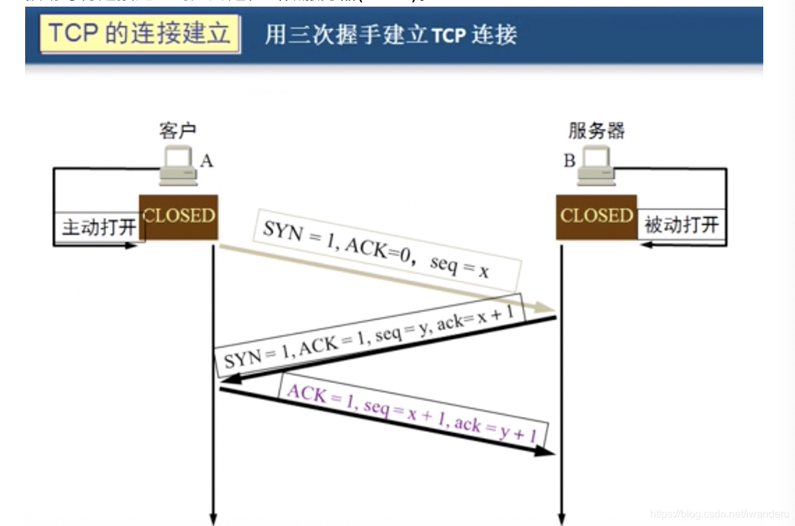

# TCP/IP协议

## OSI七层模型

### 物理层

物理层——网络设备接口标准，复用技术

### 数据链路层

数据链路层——**帧**的开始和结束，还有透明传输，差错校验(纠错由传输层解决)

在一段数据的前后分别添加帧头和帧尾，

透明传输：在数据中心出现的转义字符前加入一个转义字符，接收后删除前一个

循环冗余检验CRC

### 网络层（IP层）

负责在不同的网络之间(基于数据包的IP地址)尽力转发数据包，不负责丢包重传和接收顺序。

ARP协议：解决同一个局域网上的主机或路由器的IP地址和MAC地址的映射关系。

ICMP协议：ping命令

IGMP协议：广播

#### IP协议

(1)网络畅通的条件
沿途路由器必须知道下一跳给谁，数据包有去有回。

4.7.1 **静态路由**
需要管理员告诉路由器所有没有直连的网络下一跳给谁。

4.7.2 **动态路由**
(1)RIP协议
周期性广播(30s)路由表，选择路径的依据是最少的跳数，最大跳数是15跳，所以一般不适合大网络。
(2)OSPF协议
根据带宽选择路径。

4.8 **子网掩码**
能够帮助路由器判断对应主机是否在同一个网段中。

4.9 ABCDE类网络地址
网络地址(网络号)唯一指定了每个网络。同一网络中的每台计算机都共享相同的网络地址，并用它作为自己IP地址的一部分。ABC对应的子网掩码分别是255.0.0.0和255.255.0.0和255.255.255.0

### 传输层

传输层——可靠传输，流量控制，不可靠传输(一个数据包即可，不需要建立会话，例如向DNS查询网站IP地址)

UDP是无连接的，尽最大努力交付，不保证可靠交付

(1)TCP是面向连接的传输层协议。(三次握手)
(2)每一条TCP连接智能有两个端点(endpoint)，每一条TCP连接只能时点对点的(端口号拼接到ip地址的两个套接字)。
(3)TCP提供可靠交付的服务。(确保不丢包，超时重传)
(4)TCP提供全双工通信。
(5)面向字节流。

**三次握手建立连接**

 

同步位1，确认标志位0，序号为x

同步位1，确认标志位1，序号为y，确认号为x+1

同步位0，确认标志位1，序号x+1，确认号为y+1

第三次握手原因：假如把三次握手改成仅需要两次握手，死锁是可能发生的。作为例子，考虑计算机A和B之间的通信，假定A给B发送一个连接请求分组，B收到了这个分组，并发送了确认应答分组。按照两次握手的协定，B认为连接已经成功地建立了，可以开始发送数据分组。可是，B的应答分组在传输中被丢失的情况下，A将不知道B是否已准备好，A认为连接还未建立成功，将忽略B发来的任何数据分组，这样就形成了死锁。

## mqtt协议

https://www.runoob.com/w3cnote/mqtt-intro.html

https://mcxiaoke.gitbooks.io/mqtt-cn/content/

https://www.zhihu.com/question/23373904

