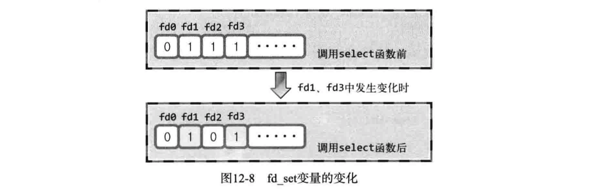

## 4-5 基于TCP的服务器端/客户端

### 函数说明

### socket

创建套接字

```c
#include <sys/socket.h>
int socket(int domain, int type, int protocol);
//成功返回文件描述符，失败返回-1
//PF_INET: IPv4
//SOCK_STREAM: TCP

serv_sock=socket(PF_INET, SOCK_STREAM, 0);
if(serv_sock == -1)
  error_handling("socket() error");

memset(&serv_addr, 0, sizeof(serv_addr));
serv_addr.sin_family=AF_INET;
serv_addr.sin_addr.s_addr=htonl(INADDR_ANY);
serv_addr.sin_port=htons(atoi(argv[1]));
```

### bind

给套接字分配地址

```c
#include <sys/socket.h>
int bind(int sockfd, struct sockaddr *myaddr, socklen_t addrlen);
//成功返回0，失败返回-1

if(bind(serv_sock, (struct sockaddr*) &serv_addr, sizeof(serv_addr))==-1 )
	error_handling("bind() error"); 
```

### listen

服务器端等待连接请求

```c
#include <sys/socket.h>
int listen(int sockfd, int backlog);
//成功返回0，失败返回-1

if(listen(serv_sock, 5)==-1)
  error_handling("listen() error");
```

### accept

服务器端接收连接请求

```c
#include <sys/socket.h>
int accept(int sockfd, struct sockaddr *addr, socklen_t *addrlen);
//成功返回创建的socket的文件描述符，失败返回-1
//*addr: accept函数将客户端地址赋值给addr

clnt_sock=accept(serv_sock, (struct sockaddr*)&clnt_addr,&clnt_addr_size);
if(clnt_sock==-1)
  error_handling("accept() error");  
```

### connect

客户端请求连接

```c
#include <sys/socket.h>
int connect(int sock, struct sockaddr *servaddr, socklen_t addrlen);
//成功返回0，失败返回-1
//sock: 客户端socket文件描述符
//servaddr: 服务器端地址，需要赋好值

if(connect(sock, (struct sockaddr*)&serv_addr, sizeof(serv_addr))==-1) 
  error_handling("connect() error!");
```

### *函数调用关系


### 运行

```sh
#服务器端
gcc -o hello_server hello_server.c
./hello_sever 9190
```


```sh
#客户端
gcc -o hello_client hello_client.c
./hello_client 127.0.0.1 9190
```

## 7 基于TCP的半关闭

## 10 多进程服务器端

### 僵尸进程

> 进程完成工作（执行完main函数后）应该被销毁，不销毁则变为僵尸进程

应该向创建子进程的父进程传递子进程的 exit 参数值或 return 语句的返回值

#### wait函数

调用wait函数时，如果没有已终止的子进程，程序将阻塞（blocking）直到有子进程终止

```c
#include <sys/wait.h>
pid_t wait(int *statloc);
//成功返回终止的子进程ID，失败返回-1
//statloc: 返回值

wait(&status);//调用 wait 函数。之前终止的子进程相关信息将保存到 status 变量，同时相关子进程被完全销毁。
if(WIFEXITED(status)) //通过 WIFEXITED 宏验证子进程是否正常终止。如果正常退出，则调用 WEXITSTATUS 宏输出子进程的返回值。
  printf("Child send one: %d \n", WEXITSTATUS(status));
```

父进程调用wait函数，**主动请求**获取子进程的返回值：

```c
#include <stdio.h>
#include <stdlib.h>
#include <unistd.h>
#include <sys/wait.h>

int main(int argc, char *argv[])
{
	int status;
	pid_t pid=fork();
	
	if(pid==0) /* 子进程 */
	{
		return 3;   	
	}
	else /* 父进程 */
	{
		printf("Child PID: %d \n", pid);
		pid=fork();
		if(pid==0)	/* 另一个子进程 */
		{
			exit(7);
		}
		else  /* 父进程 */
		{
			printf("Child PID: %d \n", pid);
			wait(&status);//调用 wait 函数。之前终止的子进程相关信息将保存到 status 变量，同时相关子进程被完全销毁。
			if(WIFEXITED(status)) //通过 WIFEXITED 宏验证子进程是否正常终止。如果正常退出，则调用 WEXITSTATUS 宏输出子进程的返回值。
				printf("Child send one: %d \n", WEXITSTATUS(status));

			wait(&status);
			if(WIFEXITED(status))
				printf("Child send two: %d \n", WEXITSTATUS(status));
			sleep(30);     // Sleep 30 sec.
		}
	}
	return 0;
}
```

#### waitpid函数

```c
#include <sys/wait.c>
pid_t waitpid(pid_t pid, int * statloc, int options);
//成功时返回终止的子进程ID（无终止的子进程时为0），失败时返回-1
//pid: 子进程ID，为-1时可以为任意子进程
//options: 传递头文件sys/wait.h中声明的常量 WNOHANG，即使没有终止的子进程也不会进入阻塞状态，而是返回 0 并退出函数。

void read_childproc(int sig)
{
	int status;
	pid_t id=waitpid(-1, &status, WNOHANG); //等待子程序终止
	if(WIFEXITED(status))
	{
		printf("Removed proc id: %d \n", id);
		printf("Child send: %d \n", WEXITSTATUS(status));
	}
}
```

调用 waitpid 函数时，程序不会阻塞：

```c
#include <stdio.h>
#include <unistd.h>
#include <sys/wait.h>

int main(int argc, char *argv[])
{
	int status;
	pid_t pid=fork();
	
	if(pid==0) /* 子进程 */
	{
		sleep(15);
		return 24;   	
	}
	else	/* 父进程 */
	{
		while(waitpid(-1, &status, WNOHANG) == 0)
    //若没有子进程返回（返回值为0），将会不停调用while
		{
			sleep(3);
			puts("sleep 3sec.");
		}
		if(WIFEXITED(status))
			printf("Child send %d \n", WEXITSTATUS(status));
	}
	return 0;
}

/*
root@my_linux:/home/swyoon/tcpip# gcc waitpid.c -o waitpid
root@my_linux:/home/swyoon/tcpip# ./waitpid
sleep 3sec.
sleep 3sec.
sleep 3sec.
sleep 3sec.
sleep 3sec.
Child send 24 
*/
```

### 信号处理

> 信号是在特定事件发生时，由操作系统向进程发送的消息

#### signal函数

```c
#include <signal.h>
void (*signal(int signo, void （*func)(int))(int);
//在产生信号时调用，返回之前注册的函数指针（调用func）

signal(SIGALRM, timeout);	//注册，alarm函数时间到时触发
signal(SIGINT, keycontrol);	//注册，输入CTRL+C时触发

```

alarm函数触发signal的示例

发生信号时将唤醒由于调用 sleep 函数而进入阻塞状态的进程


```c
#include <stdio.h>
#include <unistd.h>
#include <signal.h>

void timeout(int sig)
{
	if(sig==SIGALRM)
		puts("Time out!");
	alarm(2);		//每隔两秒产生SIGALRM信号
}
int main(int argc, char *argv[])
{
	int i;
	signal(SIGALRM, timeout);	//注册
	alarm(2);
	for(i=0; i<3; i++)
	{
		puts("wait...");
		sleep(100);
	}
	return 0;
}
```

#### sigaction函数

> 比signal使用更多，sigaction函数更稳定，在UNIX的不同操作系统完全相同

```c
#include <signal.h>
int sigaction(int signo, const struct sigaction *act, struct sigaction *oldact);
//signo: 和signal函数相同
//act: 对于信号信息的信号处理函数（信号处理器）
//oldact: 获取之前注册的信号处理函数指针，不需要时传递0
struct sigaction {
  void (*sa_handler)(int);
  sigset_t sa_mask;
  int sa_flags;
}
//sa_handler: 保存信号处理函数的指针值
//sa_mask、sa_flags: 置0即可

struct sigaction act;
act.sa_handler=read_childproc;
sigemptyset(&act.sa_mask);
act.sa_flags=0;
sigaction(SIGCHLD, &act, 0);
```

### 消灭僵尸进程

子进程终止时产生SIGCHLD信号，便可以写一个由SIGCHLD触发的信号处理函数，用以处理子进程终止


### fork复制文件描述符

调用fork函数后，2个文件描述符指向同一个socket


1个套接字在2个文件描述符都终止（销毁）后才能销毁。因此，调用fork函数后要关闭无关的socket文件描述符。

### IO分割

不同进程分别负责输入和输出

## 11 进程间通信

### 管道

```c
#include <unistd.h>
int pipe(int filedes[2]);
//成功返回0，失败返回-1
//filedes[0] := 管道出口
//filedes[1] := 管道入口

int fds[2];
pipe(fds);
char str[]="Who are you?";
char buf[BUF_SIZE];
write(fds[1], str, sizeof(str));	//写
read(fds[0], buf, BUF_SIZE);			//读
```

父进程在调用`pipe()`函数时自动创建管道，同时获得文件描述符，调用`fork()`函数时可以将文件描述符传递给子进程。


示例

```c
#include <stdio.h>
#include <unistd.h>
#define BUF_SIZE 30

int main(int argc, char *argv[])
{
	int fds1[2], fds2[2];
	char str1[]="Who are you?";
	char str2[]="Thank you for your message";
	char buf[BUF_SIZE];
	pid_t pid;
	
	pipe(fds1), pipe(fds2);
	pid=fork();
	
	if(pid==0)
	{
		write(fds1[1], str1, sizeof(str1));
		read(fds2[0], buf, BUF_SIZE);
		printf("Child proc output: %s \n",  buf);
	}
	else
	{
		read(fds1[0], buf, BUF_SIZE);
		printf("Parent proc output: %s \n", buf);
		write(fds2[1], str2, sizeof(str2));
		sleep(3);
	}
	return 0;
}
```


## 12 IO复用

> 并发服务器实现的一种方法。

无论连接多少客户端，提供服务的进程只有一个。


### select函数


```c
#include <sys/select.h>
#include <sys/time.h>

int select(int maxfd, fd_set *readset, fd_set *writeset, fd_set *except_set),
					 const struct timeval *timeout);
// maxfd := 监视的对象文件描述符数量，通常传递最大的文件描述符值+1
// readset := 待读取数据的文件描述符集合
// writeset := 可传输物阻塞数据的文件描述符集合
// exceptset := 异常的文件描述符集合
// timeout := 超时信息，传递NULL时阻塞，不会超时返回0
// 返回值：错误返回-1，超时返回0，其他返回发生事件的文件描述符数量

struct timeval 
{
	long tv_set;	//seconds
  long tv_usec;	//microseconds
}
```

**fd_set中注册或更改值**

```c
FD_ZERO(fd_set *fdset)    //将fdset所有位初始化为0
FD_SET(int fd, fd_set *fdset)   //在fdset中注册文件描述符fd
FD_CLR(int fd, fd_set *fdset)		//在fdset中清除文件描述符fd
FD_ISSET(int fd, fd_set *fdset)	//若fdset中有fd，则返回true
```

select调用完成后，原来为1的所有位都变为0，除了发生变化的文件描述符



示例

```c
#include <stdio.h>
#include <stdlib.h>
#include <string.h>
#include <unistd.h>
#include <arpa/inet.h>
#include <sys/socket.h>
#include <sys/time.h>
#include <sys/select.h>
#define BUF_SIZE 100
void error_handling(char *buf);

int main(int argc, char *argv[])
{
	int serv_sock, clnt_sock;
	struct sockaddr_in serv_adr, clnt_adr;
	struct timeval timeout;
	fd_set reads, cpy_reads;

	socklen_t adr_sz;
	int fd_max, str_len, fd_num, i;
	char buf[BUF_SIZE];
	if(argc!=2) {
		printf("Usage : %s <port>\n", argv[0]);
		exit(1);
	}

	serv_sock=socket(PF_INET, SOCK_STREAM, 0); //创建socket
	memset(&serv_adr, 0, sizeof(serv_adr));
	serv_adr.sin_family=AF_INET;
	serv_adr.sin_addr.s_addr=htonl(INADDR_ANY);
	serv_adr.sin_port=htons(atoi(argv[1]));
	
	if(bind(serv_sock, (struct sockaddr*) &serv_adr, sizeof(serv_adr))==-1)
		error_handling("bind() error");  //socket分配服务器地址
	if(listen(serv_sock, 5)==-1)  	//等待连接
		error_handling("listen() error");

	FD_ZERO(&reads);
	FD_SET(serv_sock, &reads); 	//将socket注册到reads中
	fd_max=serv_sock;

	while(1)
	{
		cpy_reads=reads;	//备份
		timeout.tv_sec=5;	//设置超时
		timeout.tv_usec=5000;

		if((fd_num=select(fd_max+1, &cpy_reads, 0, 0, &timeout))==-1)
			break;	//返回发生事件的数目
		
		if(fd_num==0)  //超时
			continue;

		for(i=0; i<fd_max+1; i++)  //遍历所有的文件描述符
		{
			if(FD_ISSET(i, &cpy_reads))  //如果文件描述符i发生变化
			{
				if(i==serv_sock)     // 且为连接请求
				{
					adr_sz=sizeof(clnt_adr);
					clnt_sock=accept(serv_sock, (struct sockaddr*)&clnt_adr, &adr_sz);
					//接收服务器端连接请求
          FD_SET(clnt_sock, &reads);
					if(fd_max<clnt_sock)
						fd_max=clnt_sock;
					printf("connected client: %d \n", clnt_sock);
				}
				else    // 否则接收的数据为字符串或断开连接的EOF
				{
					str_len=read(i, buf, BUF_SIZE);
					if(str_len==0)    // close request!
					{
						FD_CLR(i, &reads);
						close(i);
						printf("closed client: %d \n", i);
					}
					else
					{
						write(i, buf, str_len);    // 回声
					}
				}
			}
		}
	}
	close(serv_sock);
	return 0;
}

void error_handling(char *buf)
{
	fputs(buf, stderr);
	fputc('\n', stderr);
	exit(1);
}
```

## 13 多种IO函数


## 15 套接字和标准I/O

[关于write和read以及文件读写位置](https://blog.csdn.net/sinat_36629696/article/details/80001104)

### 标准IO的优点

- 有良好的移植性：标准函数按ANSI C标准定义，支持所有操作系统。

- 利用缓冲提高性能：传输的数据越多，缓冲能提升的性能越大。


```c
#include <stdio.h>
#define BUF_SIZE 3

int main(int argc, char* argv[]) {
    FILE* fp1;
    FILE* fp2;
    char buf[BUF_SIZE];

    fp1 = fopen("news.txt", "r");
    fp2 = fopen("cpy.txt", "w");

    while (fgets(buf, BUF_SIZE, fp1) != NULL)
        fputs(buf, fp2);

    fclose(fp1);
    fclose(fp2);
    return 0;
}
```

### 标准IO函数的缺点

- 不容易进行双向通信
- 有时可能频繁调用fflush函数
- 需要以FILE结构体指针的形式返回文件描述符

### FILE结构体和文件描述符转换

文件描述符转化为FILE

```c
#include <stdio.h>
File *fdopen(int fildes, const char *mode);

int fd=open("data.dat", O_WRONLY|O_CREAT|O_TRUNC);
FILE *fp=fdopen(fd, "w");
fputs("Network C programming \n", fp);
fclose(fp);
```

FILE转化为文件描述符

```c
#include <stdio.h>
int fileno(FILE *stream);
```

## 16 IO流分离

FILE指针的半关闭

### 目的

- 将FILE指针按读模式和写模式进行区分
- 区分读写模式降低实现难度
- 通过区分IO缓冲提高缓冲性能

### 终止流模型

fclose函数关闭文件描述符，能完全终止套接字


### 半关闭模型

创建FILE指针前先复制文件描述符


复制：fork函数会复制整个进程。dup在同一进程内，为了访问同一文件或套接字，创建另一个文件描述符。

```c
#include <unistd.h>
int dup(int fildes);
int dup2(int fildes, int fildes2);
//成功返回复制的文件描述符，失败返回-1
```

## 17 epoll

### select

弊端

- 每次调用select函数后，需要对所有文件描述符循环检查
- 每次调用select函数前，需要向操作系统传递对象信息。

优点

- epoll只在Linux下支持，select对操作系统的兼容性更好

### epoll相关函数

#### epoll_create

创建保存epoll文件描述符的空间

对比在select函数中，为了保存对象文件的文件描述符，直接声明了fd_set变量

```c
#include <sys/epoll.h>
int epoll_create(int size);
//size := epoll实例的大小，没啥用
//成功返回epoll的文件描述符，失败返回-1
```

epoll_create创建的资源与套接字相同，需要终止时也要调用close函数

#### epoll_ctl

用以注册或注销对象文件描述符

```c
#include <sys/epoll.h>
int epoll_ctl(int epfd, int op, int fd, struct epoll_event *event);
//epfd := epoll例程文件描述符
//op := 添加、删除、更改等操作
//fd := 监视对象的文件描述符
//event := 用于注册关注的事件
//成功返回0，失败返回-1
```

op参数传递的常量及意义

```c
EPOLL_CTL_ADD :将文件描述符注册到epoll例程
EPOLL_CTL_DEL :从epoll例程中删除文件描述符
EPOLL_CTL_MOD :更改注册的文件描述符的关注事件发生情况
```

#### epoll_wait

调用函数后，返回发生事件的文件描述符数，同时在第二个参数中保存发生事件的文件描述符

```c
#include <sys/epoll.h>
int epoll_wait(int epfd, struct epoll_event *events, int maxevents, int timeout);
//epfd := 事件监视范围的epoll例程文件描述符
//events := 发生事件的文件描述符集合
//maxevents := events中可以保存的最大事件数
//timeout := 以毫秒为单位的等待事件，-1则一直等待
//成功返回发生事件的文件描述符个数，失败返回-1
```

#### epoll_event结构体

将发生事件的文件描述符集中到一起

```c
struct epoll_event {
  __uint32_t events;
  epoll_data_t data;
}
```

events中可以保存的常量对应和事件类型

```c
EPOLLIN :需要读取数据的情况
EPOLLOUT :输出缓冲为空，可以立即发送数据的情况
```

### 条件触发和边缘触发

> 条件触发(Level Trigger)中，只要输入缓冲有数据就会一直通知该事件（epoll的默认方式）
>
> 边缘触发(Edge Trigger)中，仅在输入缓冲收到数据时注册一次该事件

边缘触发，若是以阻塞方式运行read&write，可能会导致服务器的长时间停顿。因此，边缘触发一般以非阻塞方式运行。

```cpp
// 边缘触发关键代码
	setnonblockingmode(serv_sock);  // 该语句必须先于serv_sock于epoll中注册

    event.events = EPOLLIN|EPOLLET;

void setnonblockingmode(int fd) {
    int flag = fcntl(fd, F_GETFL, 0);
    fcntl(fd, F_SETFL, flag|O_NONBLOCK);
}
```

边缘触发的优点：可以分离接收数据和处理数据的时间点

## 18 多线程

多个线程共享数据区和堆，线程切换需要切换栈

### pthread_create

```cpp
#include <pthread.h>
int pthread_create(
	pthread_t *restrict thread,
  const pthread_attr_t *restrict attr,
  void *(*start_routine)(void*),
  void *restrict arg
);
pthread_detach(t_id);	// 从内存中销毁已终止的线程
/*
	thread := 保存新创建线程ID的变量地址值
	attr := 传递线程属性的参数
	start_routine := 相当于线程main函数
	arg := 第三个参数传递参数的变量地址值
*/

```

### pthread_join

等待线程终止后继续执行原函数

```cpp
#include <pthread.h>
int pthread_join(pthread_t thread, void **status);
/*
	thread := 该参数ID的线程要终止后才会返回
	status := 保存线程main函数返回值的指针变量地址值
*/
```


### 线程安全的函数

根据临界区是否引起问题，函数可分为 线程安全函数 和 非线程安全函数。

Linux为线程安全和非线程安全提供了相同功能的函数，线程安全函数的名称后缀通常为_r

```cpp
struct hostent *gethostbyname (const char hostname);
struct hostent *gethostbyname_r (const char *name, struct hostent *result, char buffer, intbuflen, int *h_errnop);
```

可以通过声明头文件前定义_REENTRANT宏，自动将函数改为\_r的函数调用

```sh
gcc -D_REENTRANT mythread.c -o mythread -lpthread
```

### 多线程例子

使用两个线程来计算1~10之和


同步(Synchronization)：一个线程访问num时应该阻止其他线程访问

临界区：不是num本身，而是访问num的两条语句

### 线程同步：互斥量

互斥量(Mutual Exclusion): 不允许多个线程同时访问。

```cpp
#include <pthread.h>
int pthread_mutex_init(pthread_mutex_t *mutex, const pthread_mutexattr_t *attr);
int pthread_mutex_destroy(pthread_mutex_t *mutex);
// 成功时返回0
/*
	mutex := 保存互斥量变量的地址值
	attr := 互斥量属性
*/
```

互斥量锁与释放临界区：

进入临界区前调用pthread_mutex_lock，该函数直到unlock时才会返回。即当前线程将会一直阻塞，直到其他线程让出临界区。

```cpp
#include <pthread.h>
int pthread_mutex_lock(pthread_mutex_t *mutex);
int pthread_mutex_unlock(pthread_mutex_t *mutex);
// 成功时返回0
```

使用：

```c
pthread_mutex_lock(&mutex);
// 临界区的开始
// ...
// 临界区的结束
pthread_mutex_unlock(&mutex);
```


### 线程同步：信号量

下文为使用二进制信号量（0和1）完成控制线程顺序的同步方法。

```cpp
#include <semaphore.h>
int sem_init(sem_t *sem, int pshared, unsigned int value);
int sem_destroy(sem_t *sem);
// 成功时返回0
/*
	sem := 信号量的变量地址值
	pshared := 传递0时，为只允许一个进程使用的信号量。可传递其他值，允许多个进程共享。
	value := 信号量初始值
*/
```

信号量中相当于互斥量lock、unlock的函数

```c
#include <semaphore.h>
int sem_post(sem_t *sem);
int sem_wait(sem_t *sem);
// 成功时返回0
// sem_post使sem增1，sem_wait使sem减1
```

使用：

```c
sem_wait(&sem); // 信号量变为0
// 临界区的开始
// ...
// 临界区的结束
sem_post(&sem); // 信号量变为1
```

只有sem=1是才可执行sem_wait(&sem)进入临界区

通话服务端代码

```c
#include <stdio.h>
#include <stdlib.h>
#include <unistd.h>
#include <string.h>
#include <arpa/inet.h>
#include <sys/socket.h>
#include <netinet/in.h>
#include <pthread.h>

#define BUF_SIZE 100
#define MAX_CLNT 256

void* handle_clnt(void *arg);
void send_msg(char *msg, int len);
void error_handling(char *msg);

int clnt_cnt=0;
int clnt_socks[MAX_CLNT];
pthread_mutex_t mutx;

int main(int argc, char *argv[]) {
	if(argc!=2) {
		printf("Usage : %s <port>\n", argv[0]);
		exit(1);
	}

	pthread_t t_id;
	pthread_mutex_init(&mutx, NULL);

	int serv_sock=socket(PF_INET, SOCK_STREAM, 0);
	struct sockaddr_in serv_adr, clnt_adr;
	memset(&serv_adr, 0, sizeof(serv_adr));
	serv_adr.sin_family=AF_INET; 
	serv_adr.sin_addr.s_addr=htonl(INADDR_ANY);
	serv_adr.sin_port=htons(atoi(argv[1]));

	if(bind(serv_sock, (struct sockaddr*) &serv_adr, sizeof(serv_adr))==-1)
		error_handling("bind() error");
	if(listen(serv_sock, 5)==-1)
		error_handling("listen() error");

	while(1) {
		int clnt_adr_sz = sizeof(clnt_adr);
		int clnt_sock = accept(serv_sock, (struct sockaddr*)&clnt_adr, &clnt_adr_sz);

		pthread_mutex_lock(&mutx);
		clnt_socks[clnt_cnt++] = clnt_sock;
		pthread_mutex_unlock(&mutx);

		pthread_create(&t_id, NULL, handle_clnt, (void*)&clnt_sock);
		pthread_detach(t_id);
		printf("Connected client IP: %s\n", inet_ntoa(clnt_adr.sin_addr));
	}

	close(serv_sock);
	return 0;
}
	
// 向新接入的客户端提供服务
void * handle_clnt(void * arg) {
	int clnt_sock = *((int*)arg);
	int str_len = 0;
	char msg[BUF_SIZE];

	while((str_len = read(clnt_sock, msg, sizeof(msg))) != 0) {
		send_msg(msg, str_len);
	}

	pthread_mutex_lock(&mutx);
	for (int i = 0; i < clnt_cnt; i++) {
		if (clnt_sock == clnt_socks[i]) {
			while (i++ < clnt_cnt - 1) {
				clnt_socks[i] = clnt_socks[i + 1];
			}
			break;
		}
	}
	clnt_cnt--;
	pthread_mutex_unlock(&mutx);
	close(clnt_sock);
	return NULL;
}

void send_msg(char * msg, int len) {  // send to all
	int i;
	pthread_mutex_lock(&mutx);
	for (i = 0; i < clnt_cnt; i++) {
		write(clnt_socks[i], msg, len);
	}
	pthread_mutex_unlock(&mutx);
}

void error_handling(char * msg) {
	fputs(msg, stderr);
	fputc('\n', stderr);
	exit(1);
}
```


