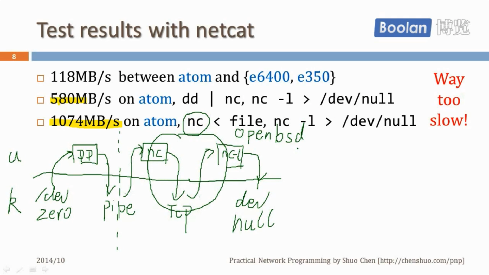
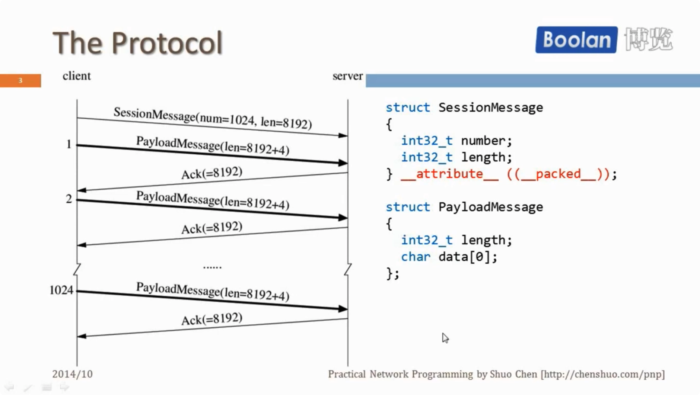
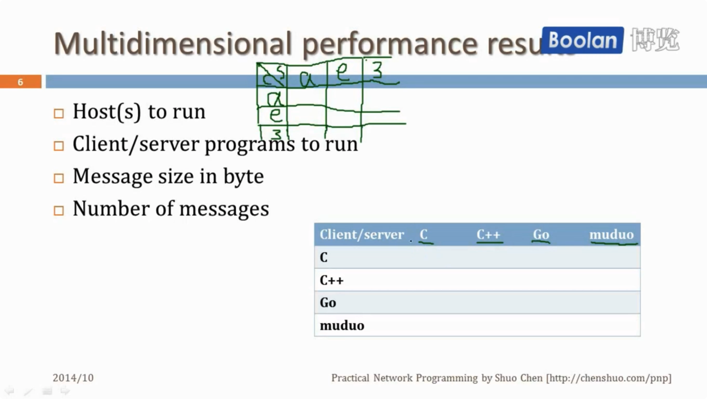

## 课程简介

### UNP中未提到的重要内容

- 消息格式的处理，特别是非阻塞IO下如何进行TCP分包
- 高并发模型陈旧：事务驱动+非阻塞IO。书中只有1章，《面向模式的软件架构. 第2卷》讲的更详细

强调可以测量的性能

### 网络分层

-  应用层消息(Application message)
- TCP分节(TCP segment)
- IP分组(IP packet)
- 以太网帧(Ethernet frame)

### 初学者常见的错误

- 穿插网络IO和业务代码
- TCP连接断开的时机和条件
- TCP是字节流的协议，保证字节流顺序到达，不保留消息的边界（TCP没有消息的概念，应用层需要有分包的逻辑）
- 直接发送C语言的结构体（不可拓展性）
- TCP自连接：localhost:54321 <-> localhost:54321

### TCPIP的速度

极限速度最大为117MB/s

### 实验

使用工具nc、netcat测试TCP的吞吐量

### ref

- 程硕：网络编程实践课程

- 《UNP1》

## 大纲

### 非并发 non-concurrent 

- TTCP: classic TCP performance testing tool，一个TCP性能测试工具，使用的协议与nc不同
- Round-trip: measure clock error between two hosts，测试两台机器之间的时间差，使用UDP
- Netcat: a Swiss knife，和标准输入输出有关
- Slow sink/source，慢速收发工具，用以模拟网速较慢的情况，从应用层模拟，可以验证在非阻塞情况下能否应对收发慢速的情况

### 并发 concurrent

- SOCKS proxy server，Relay two TCP connections ，socks代理服务器，用以中继两个TCP服务器
- Sudoku solver，客户端发送一个数独难题，服务端返回结果
  -  A lot services fit in this request-response model  
- Simple memcached，memcached已经被淘汰，在有网络库帮助的情况下500-600行即可实现
-  Broadcasting to multiple TCP peers，应用层的TCP广播，一个TCP发给多个接收端，几个连接间有交互 
  - How to deal with slow receiver?

### 多台机器数据处理

主流为hadoop、spark等，但也可用网络编程实现

- Parallel N-queues，并发的N皇后问题
- Median of numbers across machines，求多个数的中位数
- Frequent queries，求出现次数最多的查询
- Distributed sorting，分布式排序

四个项目的数据交换量按从小到大排列

### 高级主题

- RPC-A basic building block for various servers，基本的开发网络服务的工具，不用再和IO打交道
- Load balancing: Better than round-robin，负载均衡
- Capacity of a serving system，服务系统的容量管理
  - How many machines do I need to support X QPS?
  - What will be the number of replicas of each component?  
- Fight for (tail) latency，延迟
  - Mean and Percentiles: 95%, 99%

## TTCP

### 性能指标

- Bandwidth, MB/s，速度上限
- Throughput, messages/s, queries/s(QPS), transactions/s(TPS)，吞吐量
- Latency, milliseconds, percentiles，延迟，单位为时间
- Utilization, percent, payload vs carrier, goodput vs. Theory BW，资源使用率
- Overhead, eg CPU usage, for compression and /or encryption，额外开销，CPU在压缩或加密时会有额外开销，压缩和传输可以流水线操作

### 选择TTCP的原因

- It uses all basic Sockets APIs: socket, listen, bind, accept,  connect, read/recv, write/send, shutdown, close, etc.  使用了Socket编程中常用的API
- The protocol is binary, not just byte stream, so it's better than  the classic echo example，协议本身有格式，比传统的echo好
- Typical behaviors, meaningful results, instead of packets/s，TTCP本身由TCP实现，有一些典型的TCP行为，测试结果更有意义
- Service as benchmark for programming language as well, by  comparing CPU usage，反映了编程语言的性能
-  Not concurrent, at least in the very basic form，只有1个client和1个server，没有并发连接

### TTCP用到的协议

TTCP为一个请求-响应式协议

每次需要收到返回Ack，才会发送下一个消息

### TCP代码概览

- Straight forward with blocking IO，阻塞式IO
  - muduo/examples/ace/ttcp/ttcp_blocking.cc (C with sockets API) ，使用了Muduo库
  - recipes/tpc/ttcp.cc  (C++ with a thin wrapper)  ，没有使用Muduo库
  - muduo-examples-in-go/examples/ace/ttcp/ttcp.go (Go)  ，使用Go语言实现的单线程
- Non-blocking IO with mudu library，非阻塞IO，但是没有提高性能，使代码复杂化
  - muduo/examples/ace/ttcp/ttcp.cc
- None of above support concurrent connections，都不支持并发连接
  - Pretty easy to enable, thread-per-connection for first three

### 性能测试的评价

使用TTCP进行网络传输性能测试，TTCP和延迟关系较大，netcat和网络带宽关系大

考虑到多台机器、多种语言（分别做服务端和客户端）、不同消息长度

