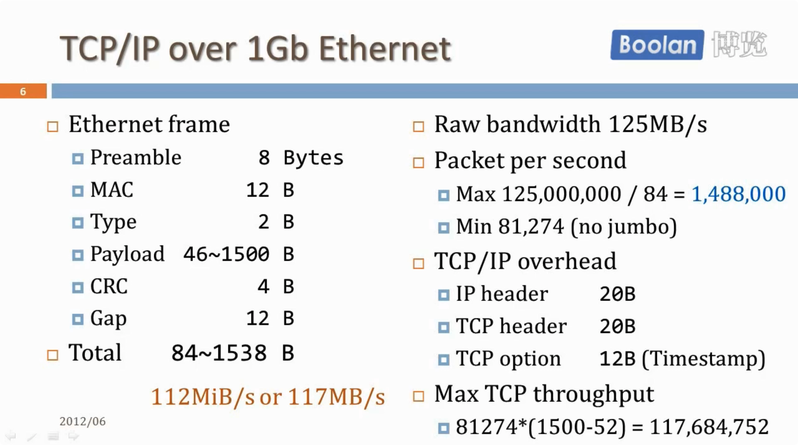

## 课程简介

### UNP中未提到的重要内容

- 消息格式的处理，特别是非阻塞IO下如何进行TCP分包
- 高并发模型陈旧：事务驱动+非阻塞IO。书中只有1章，《面向模式的软件架构. 第2卷》讲的更详细

强调可以测量的性能

### 网络分层

-  应用层消息(Application message)
- TCP分节(TCP segment)
- IP分组(IP packet)
- 以太网帧(Ethernet frame)

### 初学者常见的错误

- 穿插网络IO和业务代码
- TCP连接断开的时机和条件
- TCP是字节流的协议，保证字节流顺序到达，不保留消息的边界（TCP没有消息的概念，应用层需要有分包的逻辑）
- 直接发送C语言的结构体（不可拓展性）
- TCP自连接：localhost:54321 <-> localhost:54321

### TCPIP的速度

## ref: 

- 程硕：网络编程概要课程

- 《UNP1》