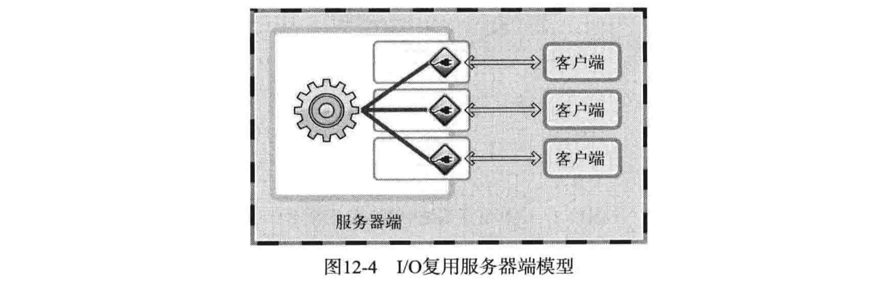
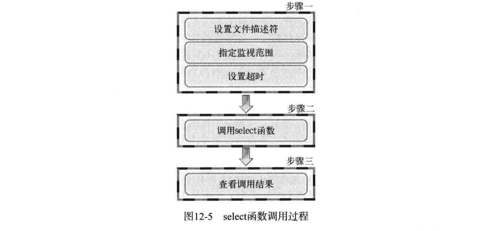
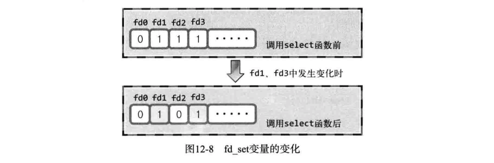

## 11 进程间通信

### 管道

```c
#include <unistd.h>
int pipe(int filedes[2]);
//成功返回0，失败返回-1
//filedes[0] := 管道出口
//filedes[1] := 管道入口

int fds[2];
pipe(fds);
char str[]="Who are you?";
char buf[BUF_SIZE];
write(fds[1], str, sizeof(str));	//写
read(fds[0], buf, BUF_SIZE);			//读
```

父进程在调用`pipe()`函数时自动创建管道，同时获得文件描述符，调用`fork()`函数时可以将文件描述符传递给子进程。


示例

```c
#include <stdio.h>
#include <unistd.h>
#define BUF_SIZE 30

int main(int argc, char *argv[])
{
	int fds1[2], fds2[2];
	char str1[]="Who are you?";
	char str2[]="Thank you for your message";
	char buf[BUF_SIZE];
	pid_t pid;
	
	pipe(fds1), pipe(fds2);
	pid=fork();
	
	if(pid==0)
	{
		write(fds1[1], str1, sizeof(str1));
		read(fds2[0], buf, BUF_SIZE);
		printf("Child proc output: %s \n",  buf);
	}
	else
	{
		read(fds1[0], buf, BUF_SIZE);
		printf("Parent proc output: %s \n", buf);
		write(fds2[1], str2, sizeof(str2));
		sleep(3);
	}
	return 0;
}
```


## 12 IO复用

> 并发服务器实现的一种方法。

无论连接多少客户端，提供服务的进程只有一个。



### select函数



```c
#include <sys/select.h>
#include <sys/time.h>

int select(int maxfd, fd_set *readset, fd_set *writeset, fd_set *except_set),
					 const struct timeval *timeout);
// maxfd := 监视的对象文件描述符数量，通常传递最大的文件描述符值+1
// readset := 待读取数据的文件描述符集合
// writeset := 可传输物阻塞数据的文件描述符集合
// exceptset := 异常的文件描述符集合
// timeout := 超时信息，传递NULL时阻塞，不会超时返回0
// 返回值：错误返回-1，超时返回0，其他返回发生事件的文件描述符数量

struct timeval 
{
	long tv_set;	//seconds
  long tv_usec;	//microseconds
}
```

**fd_set中注册或更改值**

```c
FD_ZERO(fd_set *fdset)    //将fdset所有位初始化为0
FD_SET(int fd, fd_set *fdset)   //在fdset中注册文件描述符fd
FD_CLR(int fd, fd_set *fdset)		//在fdset中清除文件描述符fd
FD_ISSET(int fd, fd_set *fdset)	//若fdset中有fd，则返回true
```

select调用完成后，原来为1的所有位都变为0，除了发生变化的文件描述符



示例

```c
#include <stdio.h>
#include <stdlib.h>
#include <string.h>
#include <unistd.h>
#include <arpa/inet.h>
#include <sys/socket.h>
#include <sys/time.h>
#include <sys/select.h>
#define BUF_SIZE 100
void error_handling(char *buf);

int main(int argc, char *argv[])
{
	int serv_sock, clnt_sock;
	struct sockaddr_in serv_adr, clnt_adr;
	struct timeval timeout;
	fd_set reads, cpy_reads;

	socklen_t adr_sz;
	int fd_max, str_len, fd_num, i;
	char buf[BUF_SIZE];
	if(argc!=2) {
		printf("Usage : %s <port>\n", argv[0]);
		exit(1);
	}

	serv_sock=socket(PF_INET, SOCK_STREAM, 0); //创建socket
	memset(&serv_adr, 0, sizeof(serv_adr));
	serv_adr.sin_family=AF_INET;
	serv_adr.sin_addr.s_addr=htonl(INADDR_ANY);
	serv_adr.sin_port=htons(atoi(argv[1]));
	
	if(bind(serv_sock, (struct sockaddr*) &serv_adr, sizeof(serv_adr))==-1)
		error_handling("bind() error");  //socket分配服务器地址
	if(listen(serv_sock, 5)==-1)  	//等待连接
		error_handling("listen() error");

	FD_ZERO(&reads);
	FD_SET(serv_sock, &reads); 	//将socket注册到reads中
	fd_max=serv_sock;

	while(1)
	{
		cpy_reads=reads;	//备份
		timeout.tv_sec=5;	//设置超时
		timeout.tv_usec=5000;

		if((fd_num=select(fd_max+1, &cpy_reads, 0, 0, &timeout))==-1)
			break;	//返回发生事件的数目
		
		if(fd_num==0)  //超时
			continue;

		for(i=0; i<fd_max+1; i++)  //遍历所有的文件描述符
		{
			if(FD_ISSET(i, &cpy_reads))  //如果文件描述符i发生变化
			{
				if(i==serv_sock)     // 且为连接请求
				{
					adr_sz=sizeof(clnt_adr);
					clnt_sock=accept(serv_sock, (struct sockaddr*)&clnt_adr, &adr_sz);
					//接收服务器端连接请求
          FD_SET(clnt_sock, &reads);
					if(fd_max<clnt_sock)
						fd_max=clnt_sock;
					printf("connected client: %d \n", clnt_sock);
				}
				else    // 否则接收的数据为字符串或断开连接的EOF
				{
					str_len=read(i, buf, BUF_SIZE);
					if(str_len==0)    // close request!
					{
						FD_CLR(i, &reads);
						close(i);
						printf("closed client: %d \n", i);
					}
					else
					{
						write(i, buf, str_len);    // 回声
					}
				}
			}
		}
	}
	close(serv_sock);
	return 0;
}

void error_handling(char *buf)
{
	fputs(buf, stderr);
	fputc('\n', stderr);
	exit(1);
}
```

## 13 多种IO函数


