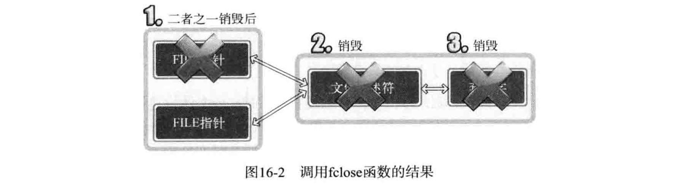

## 15 套接字和标准I/O

[关于write和read以及文件读写位置](https://blog.csdn.net/sinat_36629696/article/details/80001104)

### 标准IO的优点

- 有良好的移植性：标准函数按ANSI C标准定义，支持所有操作系统。

- 利用缓冲提高性能：传输的数据越多，缓冲能提升的性能越大。


```c
#include <stdio.h>
#define BUF_SIZE 3

int main(int argc, char* argv[]) {
    FILE* fp1;
    FILE* fp2;
    char buf[BUF_SIZE];

    fp1 = fopen("news.txt", "r");
    fp2 = fopen("cpy.txt", "w");

    while (fgets(buf, BUF_SIZE, fp1) != NULL)
        fputs(buf, fp2);

    fclose(fp1);
    fclose(fp2);
    return 0;
}
```

### 标准IO函数的缺点

- 不容易进行双向通信
- 有时可能频繁调用fflush函数
- 需要以FILE结构体指针的形式返回文件描述符

### FILE结构体和文件描述符转换

文件描述符转化为FILE

```c
#include <stdio.h>
File *fdopen(int fildes, const char *mode);

int fd=open("data.dat", O_WRONLY|O_CREAT|O_TRUNC);
FILE *fp=fdopen(fd, "w");
fputs("Network C programming \n", fp);
fclose(fp);
```

FILE转化为文件描述符

```c
#include <stdio.h>
int fileno(FILE *stream);
```

## 7 基于TCP的半关闭

## 16 IO流分离

FILE指针的半关闭

### 目的

- 将FILE指针按读模式和写模式进行区分
- 区分读写模式降低实现难度
- 通过区分IO缓冲提高缓冲性能

### 终止流模型

fclose函数关闭文件描述符，能完全终止套接字



### 半关闭模型

创建FILE指针前先复制文件描述符


复制：fork函数会复制整个进程。dup在同一进程内，为了访问同一文件或套接字，创建另一个文件描述符。

```c
#include <unistd.h>
int dup(int fildes);
int dup2(int fildes, int fildes2);
//成功返回复制的文件描述符，失败返回-1
```

## 17 epoll

### select

弊端

- 每次调用select函数后，需要对所有文件描述符循环检查
- 每次调用select函数前，需要向操作系统传递对象信息。

优点

- epoll只在Linux下支持，select对操作系统的兼容性更好

### epoll相关函数

#### epoll_create

创建保存epoll文件描述符的空间

对比在select函数中，为了保存对象文件的文件描述符，直接声明了fd_set变量

```c
#include <sys/epoll.h>
int epoll_create(int size);
//size := epoll实例的大小，没啥用
//成功返回epoll的文件描述符，失败返回-1
```

epoll_create创建的资源与套接字相同，需要终止时也要调用close函数

#### epoll_ctl

用以注册或注销对象文件描述符

```c
#include <sys/epoll.h>
int epoll_ctl(int epfd, int op, int fd, struct epoll_event *event);
//epfd := epoll例程文件描述符
//op := 添加、删除、更改等操作
//fd := 监视对象的文件描述符
//event := 用于注册关注的事件
//成功返回0，失败返回-1
```

op参数传递的常量及意义

```c
EPOLL_CTL_ADD :将文件描述符注册到epoll例程
EPOLL_CTL_DEL :从epoll例程中删除文件描述符
EPOLL_CTL_MOD :更改注册的文件描述符的关注事件发生情况
```

#### epoll_wait

调用函数后，返回发生事件的文件描述符数，同时在第二个参数中保存发生事件的文件描述符

```c
#include <sys/epoll.h>
int epoll_wait(int epfd, struct epoll_event *events, int maxevents, int timeout);
//epfd := 事件监视范围的epoll例程文件描述符
//events := 发生事件的文件描述符集合
//maxevents := events中可以保存的最大事件数
//timeout := 以毫秒为单位的等待事件，-1则一直等待
//成功返回发生事件的文件描述符个数，失败返回-1
```

#### epoll_event结构体

将发生事件的文件描述符集中到一起

```c
struct epoll_event {
  __uint32_t events;
  epoll_data_t data;
}
```

events中可以保存的常量对应和事件类型

```c
EPOLLIN :需要读取数据的情况
EPOLLOUT :输出缓冲为空，可以立即发送数据的情况
```

### 条件触发和边缘触发

