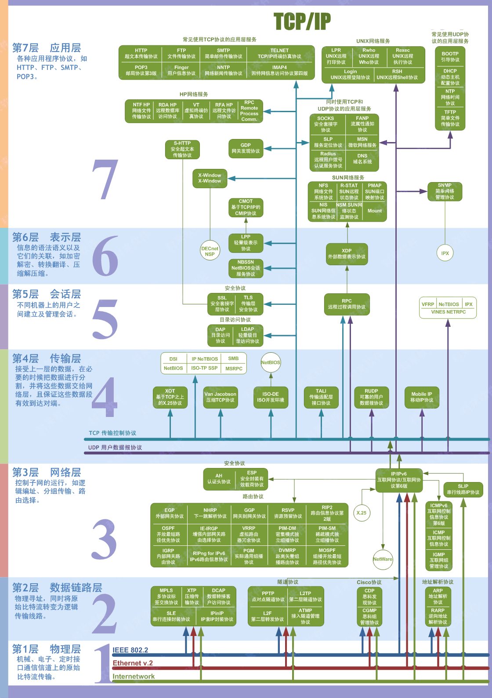
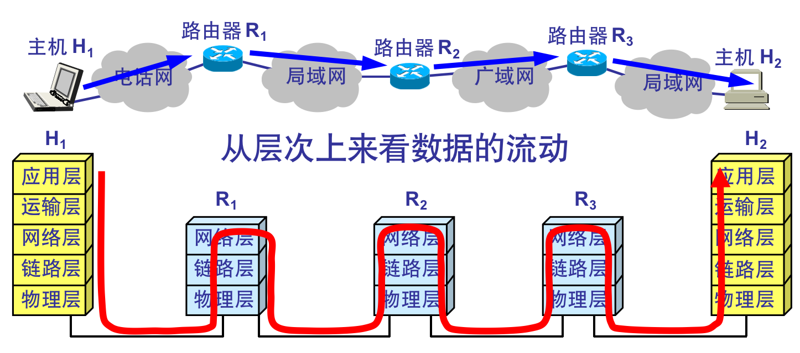
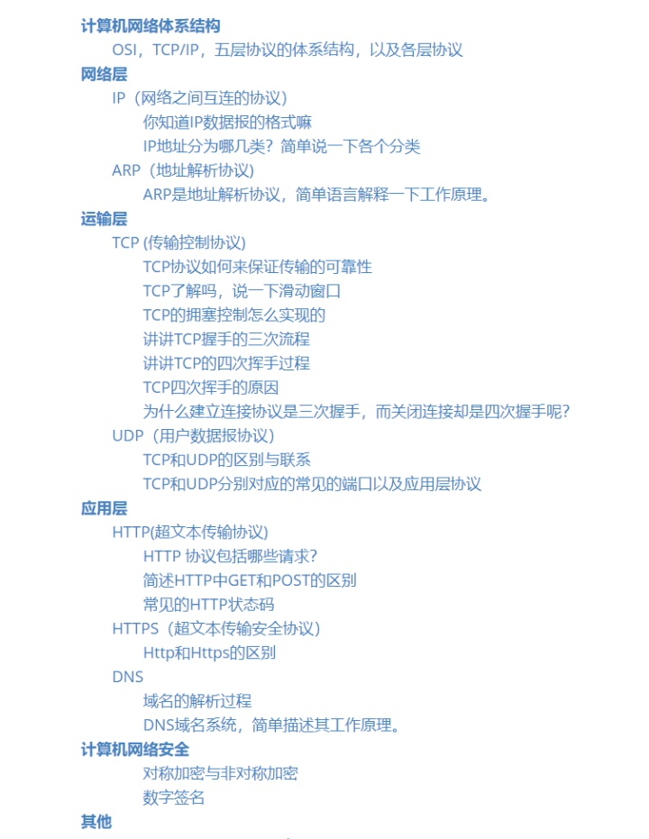

## 体系结构

### 五层协议

-   应用层：为特定应用程序提供数据传输服务，例如 HTTP、DNS 等协议。数据单位为**报文**。

-   传输层：为进程提供通用数据传输服务。运输层包括两种协议：

    传输控制协议 TCP，提供面向连接、可靠的数据传输服务，数据单位为**报文段**；

    用户数据报协议 UDP，提供无连接、尽最大努力的数据传输服务，数据单位为**数据报**。

    TCP 主要提供完整性服务，UDP 主要提供及时性服务。

-   网络层：跨网络通信。在计算机网络中进行通信的两个计算机之间可能会经过很多个数据链路，也可能还要经过很多通信子网=>选择合适的网间路由和交换结点， 确保数据及时传送。**数据包**

-   数据链路层 ：把数据包封装成**数据帧**。

-   物理层：实现相邻计算节点间透明传输**比特流**。

### TCP/IP

它只有四层，相当于五层协议中数据链路层和物理层合并为网络接口层。

应用层可能会直接使用 IP 层或者网络接口层。

### 七层架构

## 数据链路层

> http://www.cyc2018.xyz/%E8%AE%A1%E7%AE%97%E6%9C%BA%E5%9F%BA%E7%A1%80/%E7%BD%91%E7%BB%9C%E5%9F%BA%E7%A1%80/%E8%AE%A1%E7%AE%97%E6%9C%BA%E7%BD%91%E7%BB%9C%20-%20%E9%93%BE%E8%B7%AF%E5%B1%82.html

### 基本问题

封装成帧：在给一段数据添加首部和尾部，进行帧定界。

透明传输：字符填充法，在数据部分出现首部尾部相同的内容前面插入转义字符。

差错检测：CRC循环冗余校验

### 简单模型

## ref

- 路人甲：常见面试题整理--计算机网络篇（每位开发者必备）https://zhuanlan.zhihu.com/p/24001696
- CS-Notes: [计算机网络](http://www.cyc2018.xyz/%E8%AE%A1%E7%AE%97%E6%9C%BA%E5%9F%BA%E7%A1%80/%E7%BD%91%E7%BB%9C%E5%9F%BA%E7%A1%80/%E8%AE%A1%E7%AE%97%E6%9C%BA%E7%BD%91%E7%BB%9C%20-%20%E7%9B%AE%E5%BD%95.html) 
-  C/C++ 技术面试基础知识总结：[计算机网络](https://interview.huihut.com/#/?id=%e2%98%81%ef%b8%8f-%e8%ae%a1%e7%ae%97%e6%9c%ba%e7%bd%91%e7%bb%9c)
- 忘记出处了：
