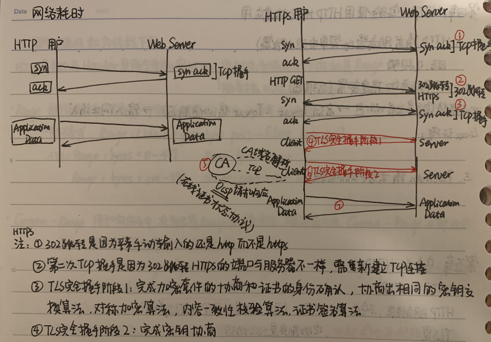
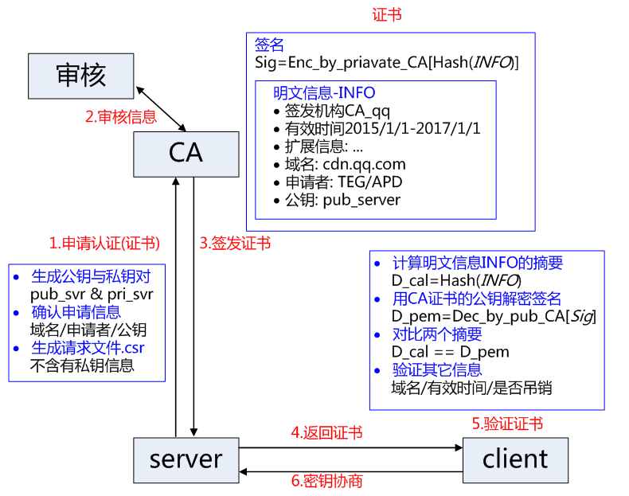
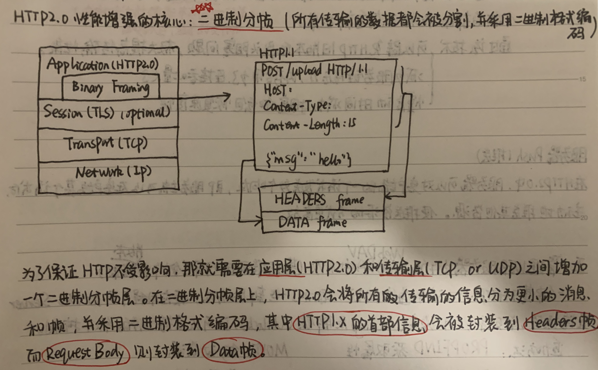
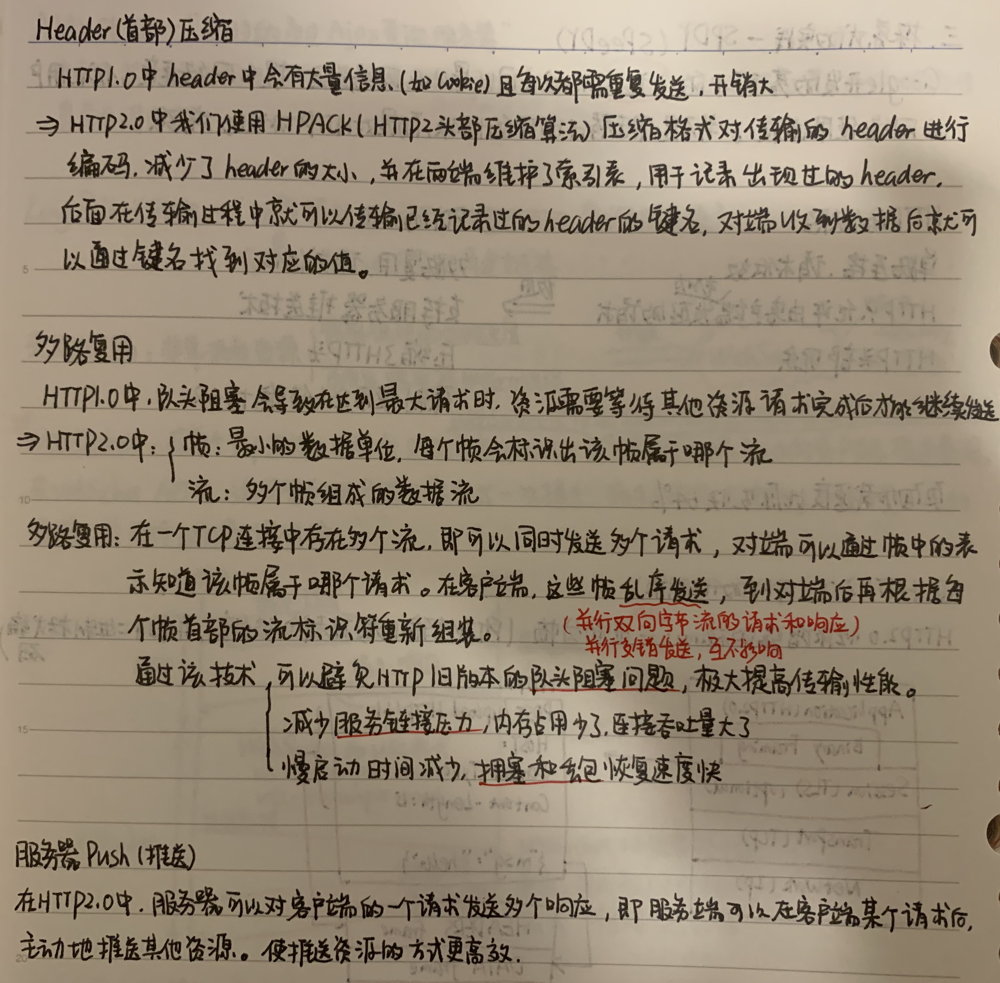
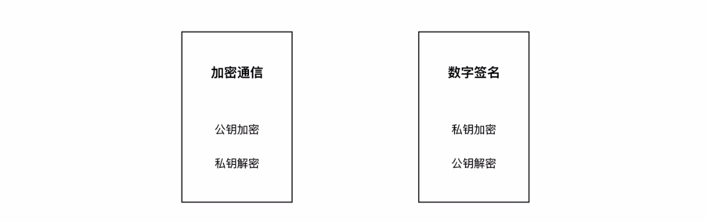
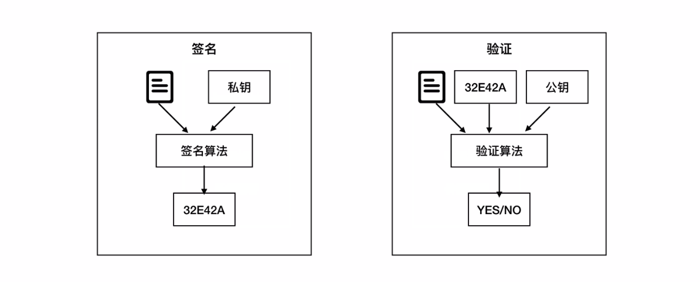
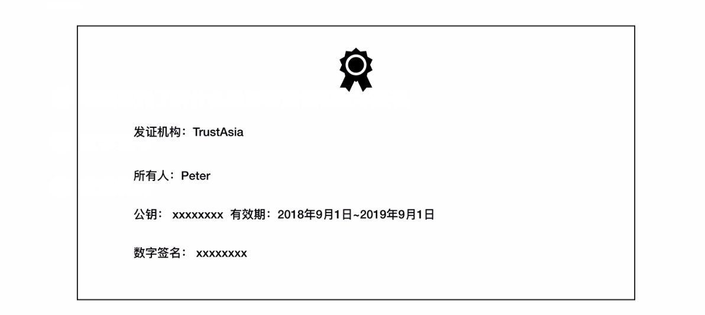
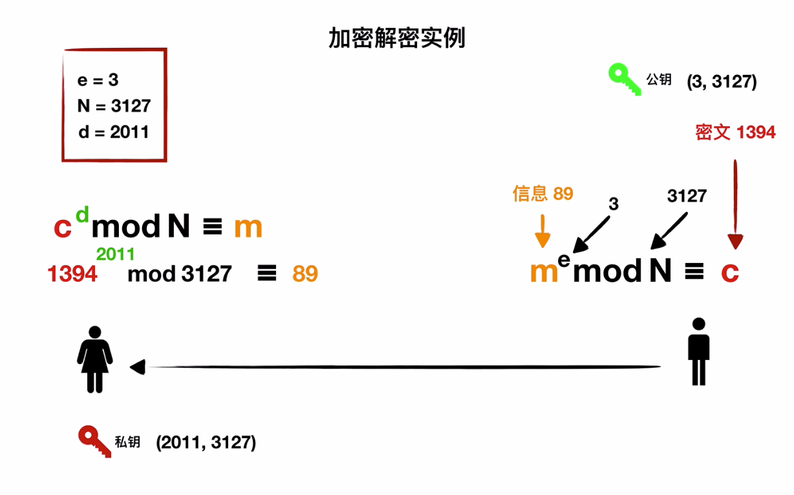

### HTTP介绍

超文本传输协议，用于从万维网服务器向本地客户端浏览器传输超文本的传送协议(有超链接的文本，例如html页面)

基于TCP(传输控制协议)的应用层协议，不关心数据传输的细节，主要是用来规定客户端和服务器端的数据传输格式，默认端口80

#### 特点

- 基于请求和响应模式（客户/服务器模式）

  

- 简单

  客户请求服务只需传送请求方法和路径（GET、HEAD、POST）

- 灵活

  允许传输任意类型的数据对象（Content-Type标识），对数据的兼容性强

- 无连接

  限制每次连接只处理一个请求。

  服务器处理完客户的请求，并收到客户的应答后即断开连接；可以节省传输时间，及时释放资源。

  网页中若包含图片：keep alive 保持连接

- 无状态

  协议对于事务处理没有记忆性

  cookie、session：用于保持HTTP连接状态的技术

#### 与tcp的不同

| HTTP               | TCP              |
| ------------------ | ---------------- |
| 应用层             | 传输层           |
| 只规定数据传输格式 | 关心数据传输细节 |
| 无连接无状态       | 面向连接         |

### 报文详解

> https://www.cnblogs.com/klguang/p/4618526.html

#### HTTP请求报文

请求行（方法、URL、协议版本）+请求头+空行+请求数据体

#### HTTP响应报文

状态行（协议版本、状态码、状态码描述）+响应头+空行+响应体

### HTTP方法

| 方法    | 意义                                                         |
| ------- | ------------------------------------------------------------ |
| OPTIONS | 请求一些选项信息，允许客户端查看服务器的性能                 |
| GET     | 请求指定的页面信息，并返回实体主体                           |
| HEAD    | 类似于 get 请求，只不过返回的响应中没有具体的内容，用于获取报头 |
| POST    | 向指定资源提交数据进行处理请求（例如提交表单或者上传文件）。数据被包含在请求体中。POST请求可能会导致新的资源的建立和/或已有资源的修改 |
| PUT     | 从客户端向服务器传送的数据取代指定的文档的内容               |
| DELETE  | 请求服务器删除指定的页面                                     |
| TRACE   | 回显服务器收到的请求，主要用于测试或诊断                     |

### 状态码

* 1xx：表示通知信息，如请求收到了或正在进行处理
  * 100 Continue：继续，客户端应继续其请求
  * 101 Switching Protocols 切换协议。服务器根据客户端的请求切换协议。只能切换到更高级的协议，例如，切换到 HTTP 的新版本协议
* 2xx：表示成功，如接收或知道了
  * **200 OK: 请求成功**
  * 202 Accepted：已接收未处理
  * 206 Partial Content：服务器成功处理了部分GET请求
* 3xx：表示重定向，如要完成请求还必须采取进一步的行动
  * **301 Moved Permanently: 永久移动**。请求的资源已被永久的移动到新 URL，返回信息会包括新的 URL，浏览器会自动定向到新 URL。今后任何新的请求都应使用新的 URL 代替
  * 302 Found：临时移动。
* 4xx：表示客户的差错，如请求中有错误的语法或不能完成
  * 400 Bad Request: 客户端请求的语法错误，服务器无法理解
  * 401 Unauthorized: 请求要求用户的身份认证
  * 403 Forbidden: 服务器理解请求客户端的请求，但是拒绝执行此请求（权限不够）
  * 404 Not Found: 服务器无法根据客户端的请求找到资源（网页）。通过此代码，网站设计人员可设置 “您所请求的资源无法找到” 的个性页面
  * 408 Request Timeout: 服务器等待客户端发送的请求时间过长，超时
* 5xx：表示服务器的差错，如服务器失效无法完成请求
  * 500 Internal Server Error: **服务器内部**错误，无法完成请求
  * 502 Bad Gateway：**充当网关或代理**的服务器，从远端服务器接受了一个无效请求
  * 503 Service Unavailable: 由于超载或系统维护，服务器暂时的无法处理客户端的请求。延时的长度可包含在服务器的 Retry-After 头信息中
  * 504 Gateway Timeout: 充当网关或代理的服务器，未及时从远端服务器获取请求

> 更多状态码：[菜鸟教程 . HTTP状态码](http://www.runoob.com/http/http-status-codes.html)

### GET和POST

> https://www.zhihu.com/question/28586791

相同：本质都是TCP链接，GET和POST能做的事情是一样的。

1. GET的参数在URL中，POST通过request body传递参数

2. GET请求有大小限制，POST请求无大小限制

3. 安全问题：GET参数会显示在地址栏中，而POST不会，安全性更高。但两种方法都可能被拦截

4. GET会被浏览器主动缓存，如果下一次传输的数据相同，则返回缓存中的内容，用于获取信息而非修改信息，是安全和幂等的；**POST不会被缓存**，每次刷新时数据都会被重新提交，所有有可能修改服务器上的资源，不符合安全和幂等性。

   > 安全：该操作用于获取信息而非修改信息；
   >
   > 幂等性(Idempotence): 则指的是无论调用这个URL 多少次，都不会有不同的结果的 HTTP 方法

5. GET产生一个TCP数据包；POST产生两个TCP数据包

   > 对于GET方式的请求，浏览器会把请求头和请求数据一并发送出去，服务器响应200（返回数据）；
   >
   > 而对于POST，浏览器先发送请求头，服务器响应100 continue，浏览器再发送请求数据，服务器响应200 ok（返回数据）。

### HTTP和HTTPS区别

#### 安全性

HTTP是**超文本传输协议**，信息明文传输，客户端和服务器端都无法验证对方的身份。

HTTPS协议是由**SSL/TLS+HTTP协议构建的加密传输协议**。信息加密传输，身份认证(CA)，保证数据完整性，比http协议安全，但耗费更多服务器资源

> SSL（Secure Sockets Layer）安全套接字协议：在传输层对网络连接进行加密，是为网络通信提供安全及数据完整性的一种安全协议

#### 端口

HTTP的URL由“http://”起始且默认使用**端口80**，而HTTPS的URL由“https://”起始且默认使用**端口443**

### SSL握手

[1.5.网络安全](1.5.网络安全.md)

### HTTPS流程

### HTTPS加密过程

用于防止中间人攻击

1. 服务器把自己的公开密钥登录至数字证书认证机构。
2. 数字证书认证机构用自己的私有密钥向服务器的公开密码署数字签名并颁发公钥证书。
3. 客户端拿到服务器的公钥证书后，使用数字签名认证机构的公开密钥，向数字证书认证机构验证公钥证书上的数字签名，以确认服务器的公开密钥的真实性。
4. 使用服务器的公开密钥对报文加密后发送。
5. 服务器用私有密钥对报文解密。

### HTTP长连接短连接

- HTTP1.0默认使用短连接：客户端和服务端每进行一次http操作，就建立一次连接，结束之后中断。

- 长连接要求在响应头部加上：Connection:keep-alive。Keep-Alive不会永久保持连接，它有一个保持时间。

- HTTP1.1起默认使用长连接，用以保持连接特性。在使用长连接的情况下，当一个网页打开完成后，客户端和服务器之间用于传输HTTP数据的TCP连接不会关闭，客户端再次访问这个服务器时，会继续使用这一条已经建立的连接。

- HTTP协议的长连接和短连接，实质上是**TCP协议的长连接和短连接**。

- 腾讯一面：TCP是长连接短连接？

  都有，HTTP协议的长连接和短连接，实质上是**TCP协议的长连接和短连接**。短连接即一次连接一次读写操作；长连接-应用层的心跳检测+TCP的keepalive保活机制。

  - https://zhuanlan.zhihu.com/p/47074758

  - http://www.360doc.com/content/18/0425/06/11935121_748528178.shtml

### HTTP的升级

> 1.0->1.1->2.0->3.0

#### http1.0

短连接，需要keep-alive参数告知服务器建立长连接

- **链接无法复用：**每次都要三次握手和**慢启动**，服务器完成请求后立即断开，不跟踪历史记录

  > 慢启动：当tcp开始传输数据或发现数据丢失->开始重发时，先对网络实际容量进行探测，防止发送过量数据导致阻塞---拥塞控制

- **线头阻塞：**请求队列的第一个请求因为服务器正忙，导致后面的请求堵塞。

#### http1.1

长连接，支持只发送header信息，可做权限请求、支持host域

- 支持持久连接：头部字段中的connection选择close或由keep-alive控制
- 增加请求头和响应头来扩充功能--hosts请求、断点续传、身份认证、状态管理、缓存管理

> HTTP 1.1支持只发送header信息(不带任何body信息)，如果服务器认为客户端有权限请求服务器，则返回100，否则返回401。 
>
> 客户端如果接受到100，才开始把请求body发送到服务器。这样当服务器返回401的时候，客户端就可以不用发送请求body了，节约了带宽。 
>
> 另外HTTP还支持传送内容的一部分。这样当客户端已经有一部分的资源后，只需要跟服务器请求另外的部分资源即可。这是支持文件断点续传的基础。

#### http2.0

二进制分帧、首部压缩、多路复用、服务器复用

#### http3.0

QUIC (Quick UDP Internet Connections), 快速 UDP 互联网连接。

谷歌指定的一种基于UDP的低时延的互联网传输层协议。

两个主要特性：

- 线头阻塞(HOL)问题的解决更为彻底：->没有队头阻塞的多路复用

  > 基于TCP的HTTP/2，尽管从逻辑上来说，不同的流之间相互独立，不会相互影响，但在实际传输方面，数据还是要一帧一帧的发送和接收，一旦某一个流的数据有丢包，则同样会阻塞在它之后传输的流数据传输。
  >
  >  而基于UDP的QUIC协议则可以更为彻底地解决这样的问题，让不同的流之间真正的实现相互独立传输，互不干扰。

- 解决建立连接的握手时延大的问题->0 RRT的连接建立时延

  > 2）切换网络时的连接保持：
  >
  > 当前移动端的应用环境，用户的网络可能会经常切换，比如从办公室或家里出门，WiFi断开，网络切换为3G或4G。 
  >
  > 基于TCP的协议，由于切换网络之后，IP会改变，因而之前的连接不可能继续保持。
  >
  > 而基于UDP的QUIC协议，则可以内建与TCP中不同的连接标识方法，从而在网络完成切换之后，恢复之前与服务器的连接。

### cookie和session

二者都是HTTP服务器用来记录用户状态的机制，因为HTTP是无状态的协议

1，session 在服务器端，cookie 在客户端（浏览器）

2，session 默认被存在在服务器的一个文件里（不是内存）

3，session 的运行依赖 session id，而 session id 是存在 cookie 中的，也就是说，如果浏览器禁用了 cookie ，同时 session 也会失效（但是可以通过其它方式实现，比如在 url 中传递 session_id）

4，session 可以放在 文件、数据库、或内存中都可以。

5，用户验证这种场合一般会用 session

因此，维持一个会话的核心就是客户端的唯一标识，即 session id

### TCP Fast Open

> https://www.cnblogs.com/Serverlessops/p/12249539.html

TCP Fast Open（TFO）是用来**加速连续TCP连接**的数据交互的TCP协议扩展。

原理：在TCP三次握手的过程中，当用户首次访问Server时，发送SYN包，Server根据用户IP生成Cookie（已加密），**并与SYN-ACK一同发回Client**。

当Client随后重连时，在SYN包携带TCP Cookie；**如果Server校验合法，则在用户回复ACK前就可以直接发送数据；**否则按照正常三次握手进行。

小结：TFO在TCP的第一次握手时就携带请求报文，对于35%的http请求，可节省一个RTT。Cookie是加密的，一定程度上减少了攻击可能性

### URI和URL的区别

- URI(Uniform Resource Identifier) 是统一资源标志符，可以唯一标识一个资源。
- URL(Uniform Resource Location) 是统一资源定位符，可以提供该资源的路径。它是一种具体的 URI，即 URL 可以用来标识一个资源，而且还指明了如何 locate 这个资源。

URI的作用像身份证号一样，URL的作用更像家庭住址一样。

URL是一种具体的URI，它不仅**唯一标识资源**，而且还提供了**定位该资源的信息**。

### Websocket?

> https://www.runoob.com/html/html5-websocket.html

（Http为了支持长链接所打的大补丁）

- 在单个TCP连接上进行全双工通信的协议(通信协议)，使得客户端和服务器之间的数据交换变得更加简单。**允许服务器端主动向客户端推送数据**。
- 在Websocket API中，浏览器和服务器**只需完成一次握手**，两端之间就可以直接创建**持久性**的连接并进行双向数据传输。

### 浏览器输入URL后的全过程

> https://blog.csdn.net/qq_21993785/article/details/81188253

1. DNS解析URL（获得IP地址）

   先后搜索本地、本地域名服务器等

2. 建立TCP连接（三次握手）

3. 发送HTTP请求

4. 服务器收到请求并响应，返回HTTP报文

5. 浏览器解析渲染

6. 断开连接（四次握手）

### Web页面请求过程

#### 1. DHCP 配置主机信息

- 假设主机最开始没有 IP 地址以及其它信息，那么就需要先使用 DHCP 来获取。

- 主机生成一个 DHCP 请求报文，并将这个报文放入具有目的端口 67 和源端口 68 的 UDP 报文段中。

- 该报文段则被放入在一个具有广播 IP 目的地址(255.255.255.255) 和源 IP 地址（0.0.0.0）的 IP 数据报中。

- 该数据报则被放置在 MAC 帧中，该帧具有目的地址 FF:<zero-width space>FF:<zero-width space>FF:<zero-width space>FF:<zero-width space>FF:FF，将广播到与交换机连接的所有设备。

- 连接在交换机的 DHCP 服务器收到广播帧之后，不断地向上分解得到 IP 数据报、UDP 报文段、DHCP 请求报文，之后生成 DHCP ACK 报文，该报文包含以下信息：IP 地址、DNS 服务器的 IP 地址、默认网关路由器的 IP 地址和子网掩码。该报文被放入 UDP 报文段中，UDP 报文段有被放入 IP 数据报中，最后放入 MAC 帧中。

- 该帧的目的地址是请求主机的 MAC 地址，因为交换机具有自学习能力，之前主机发送了广播帧之后就记录了 MAC 地址到其转发接口的交换表项，因此现在交换机就可以直接知道应该向哪个接口发送该帧。

- 主机收到该帧后，不断分解得到 DHCP 报文。之后就配置它的 IP 地址、子网掩码和 DNS 服务器的 IP 地址，并在其 IP 转发表中安装默认网关。

#### 2. ARP 解析 MAC 地址

- 主机通过浏览器生成一个 TCP 套接字，套接字向 HTTP 服务器发送 HTTP 请求。为了生成该套接字，主机需要知道网站的域名对应的 IP 地址。

- 主机生成一个 DNS 查询报文，该报文具有 53 号端口，因为 DNS 服务器的端口号是 53。

- 该 DNS 查询报文被放入目的地址为 DNS 服务器 IP 地址的 IP 数据报中。

- 该 IP 数据报被放入一个以太网帧中，该帧将发送到网关路由器。

- DHCP 过程只知道网关路由器的 IP 地址，为了获取网关路由器的 MAC 地址，需要使用 ARP 协议。

- 主机生成一个包含目的地址为网关路由器 IP 地址的 ARP 查询报文，将该 ARP 查询报文放入一个具有广播目的地址（FF:<zero-width space>FF:<zero-width space>FF:<zero-width space>FF:<zero-width space>FF:FF）的以太网帧中，并向交换机发送该以太网帧，交换机将该帧转发给所有的连接设备，包括网关路由器。

- 网关路由器接收到该帧后，不断向上分解得到 ARP 报文，发现其中的 IP 地址与其接口的 IP 地址匹配，因此就发送一个 ARP 回答报文，包含了它的 MAC 地址，发回给主机。

#### 3. DNS 解析域名

- 知道了网关路由器的 MAC 地址之后，就可以继续 DNS 的解析过程了。

- 网关路由器接收到包含 DNS 查询报文的以太网帧后，抽取出 IP 数据报，并根据转发表决定该 IP 数据报应该转发的路由器。

- 因为路由器具有内部网关协议（RIP、OSPF）和外部网关协议（BGP）这两种路由选择协议，因此路由表中已经配置了网关路由器到达 DNS 服务器的路由表项。

- 到达 DNS 服务器之后，DNS 服务器抽取出 DNS 查询报文，并在 DNS 数据库中查找待解析的域名。

- 找到 DNS 记录之后，发送 DNS 回答报文，将该回答报文放入 UDP 报文段中，然后放入 IP 数据报中，通过路由器反向转发回网关路由器，并经过以太网交换机到达主机。

#### 4. HTTP 请求页面

- 有了 HTTP 服务器的 IP 地址之后，主机就能够生成 TCP 套接字，该套接字将用于向 Web 服务器发送 HTTP GET 报文。

- 在生成 TCP 套接字之前，必须先与 HTTP 服务器进行三次握手来建立连接。生成一个具有目的端口 80 的 TCP SYN 报文段，并向 HTTP 服务器发送该报文段。

- HTTP 服务器收到该报文段之后，生成 TCP SYN ACK 报文段，发回给主机。

- 连接建立之后，浏览器生成 HTTP GET 报文，并交付给 HTTP 服务器。

- HTTP 服务器从 TCP 套接字读取 HTTP GET 报文，生成一个 HTTP 响应报文，将 Web 页面内容放入报文主体中，发回给主机。

- 浏览器收到 HTTP 响应报文后，抽取出 Web 页面内容，之后进行渲染，显示 Web 页面。

### 常用端口

|       应用       | 应用层协议 | 端口号  | 传输层协议 |            备注             |
| :--------------: | :--------: | :-----: | :--------: | :-------------------------: |
|     域名解析     |    DNS     |   53    |  UDP/TCP   | 长度超过 512 字节时使用 TCP |
| 动态主机配置协议 |    DHCP    |  67/68  |    UDP     |                             |
| 简单网络管理协议 |    SNMP    | 161/162 |    UDP     |                             |
|   文件传送协议   |    FTP     |  20/21  |    TCP     |  控制连接 21，数据连接 20   |
|                  |    SSH     |   22    |            |                             |
|   远程终端协议   |   TELNET   |   23    |    TCP     |                             |
|  超文本传送协议  |    HTTP    |   80    |    TCP     |                             |
| 简单邮件传送协议 |    SMTP    |   25    |    TCP     |                             |
|   邮件读取协议   |    POP3    |   110   |    TCP     |                             |
| 网际报文存取协议 |    IMAP    |   143   |    TCP     |                             |

### 其他协议

#### 文件传送协议FTP

FTP 使用 TCP 进行连接，它需要两个连接来传送一个文件：

- 控制连接：服务器打开端口号 21 等待客户端的连接，客户端主动建立连接后，使用这个连接将客户端的命令传送给服务器，并传回服务器的应答。

- 数据连接：用来传送文件数据。

  根据**数据连接**是否是服务器端主动建立，FTP 有主动和被动两种模式：

  - 主动模式：服务器端主动建立数据连接，其中服务器端的端口号为 20，客户端的端口号随机（必须大于 1024， 0\~1023 是熟知端口号）。

    主动模式要求客户端开放端口号给服务器端，需要配置客户端的防火墙。

    

  - 被动模式：客户端主动建立数据连接，其中客户端的端口号由客户端自己指定，服务器端的端口号随机。

    被动模式下，服务器端开放端口号即可，无需客户端配置防火墙。但是被动模式会导致服务器端的安全性减弱，因为开放了过多的端口号。

    

#### 动态主机配置协议DHCP

DHCP (Dynamic Host Configuration Protocol) 提供了即插即用的连网方式，用户不再需要手动配置 IP 地址等信息。

DHCP 配置的内容不仅是 IP 地址，还包括子网掩码、网关 IP 地址。

DHCP 工作过程如下：

1. 客户端发送 Discover 报文，该报文的目的地址为 255.255.255.255:67，源地址为 0.0.0.0:68，被放入 UDP 中，该报文被广播到同一个子网的所有主机上。如果客户端和 DHCP 服务器不在同一个子网，就需要使用中继代理。
2. DHCP 服务器收到 Discover 报文之后，发送 Offer 报文给客户端，该报文包含了客户端所需要的信息。因为客户端可能收到多个 DHCP 服务器提供的信息，因此客户端需要进行选择。
3. 如果客户端选择了某个 DHCP 服务器提供的信息，那么就发送 Request 报文给该 DHCP 服务器。
4. DHCP 服务器发送 Ack 报文，表示客户端此时可以使用提供给它的信息。

#### 远程登录协议telnet

TELNET 用于登录到远程主机上，并且远程主机上的输出也会返回。

TELNET 可以适应许多计算机和操作系统的差异，例如不同操作系统系统的换行符定义。

#### 电子邮件协议

一个电子邮件系统由三部分组成：用户代理、邮件服务器以及邮件协议。

邮件协议包含发送协议和读取协议，发送协议常用 SMTP，读取协议常用 POP3 和 IMAP。

#### ssh协议

> https://www.cnblogs.com/zyd112/p/11211102.html

SSH是一种网络协议，我们常说的 ssh 一般指其实现，即 OpenSSH，在 shell 中，也就是 ssh 命令。

> Secure Shell（安全外壳协议，简称SSH）是一种加密的网络传输协议，可在不安全的网络中为网络服务提供安全的传输环境。SSH通过在网络中建立安全隧道来实现SSH客户端与服务器之间的连接。

SSH 的原理跟 HTTPS 差不多，都是基于 TCP 和 非对称加密进行的应用层协议。它跟 HTTPS 的不同之处在于 HTTPS 通过 数字证书 和 数字证书认证中心 来防止中间人攻击，而 ssh 服务器的公钥没有人公证，只能通过其公钥指纹来人工确定其身份。

如下图所示，我们第一次使用 ssh 登陆某台服务器时， ssh 会提示我们验证服务器的公钥指纹。

当我们验证此公钥指纹是我们要登陆的服务器后，服务器的公钥会被添加到 ~/.ssh/known_hosts 里，再登陆时，ssh 检测到是已认证服务器后就会跳过公钥验证阶段。

**SSH连接建连过程**

关于通信加密的概念，我在之前的文章也有所介绍，参见：再谈加密-RSA非对称加密的理解和使用。至于 SSH 协议的建连过程，则可以参阅：Protocol Basics: Secure Shell Protocol 。

总结起来主要包括以下步骤：

- TCP 三次握手
- SSH 协议版本协商
- 客户端与服务端的公钥交换
- 加密算法协商
- 客户端使用对称加密的密钥认证
- 客户端与服务端安全通信

## 网络安全

### 对称加密与非对称加密

公开秘钥技术的两大应用：加密通信、数字签名

### SSL握手

> **SSL**（Secure Sockets Layer）安全套接字协议：在**传输层**对网络连接进行加密，是为网络通信提供安全及数据完整性的一种安全协议

#### 客户端发出请求

首先，客户端（通常是浏览器）先向服务器发出加密通信的请求，这被叫做ClientHello请求。

在这一步，客户端主要向服务器提供以下信息。

> （1） 支持的协议版本，比如TLS 1.0版。
>
> （2） 一个客户端生成的随机数，稍后用于生成"对话密钥"。
>
> （3） 支持的加密方法，比如RSA公钥加密。
>
> （4） 支持的压缩方法。

#### 服务器回应

服务器收到客户端请求后，向客户端发出回应，这叫做SeverHello。

服务器的回应包含以下内容。

> （1） 确认使用的加密通信协议版本，比如TLS 1.0版本。
>
> （2） 一个服务器生成的随机数，稍后用于生成"对话密钥"。
>
> （3） 确认使用的加密方法，比如RSA公钥加密。
>
> （4） 服务器证书。

#### 客户端回应

客户端收到服务器回应以后，验证服务器证书后从证书中取出服务器的公钥。然后，向服务器发送下面三项信息。

> （1） 一个随机数。该随机数用服务器公钥加密，防止被窃听。
>
> （2） 编码改变通知，表示随后的信息都将用双方商定的加密方法和密钥发送。
>
> （3） 客户端握手结束通知，表示客户端的握手阶段已经结束。这一项同时也是前面发送的所有内容的hash值，用来供服务器校验。

上面第一项的随机数，是整个握手阶段出现的第三个随机数，又称"pre-master key"。有了它以后，客户端和服务器就同时有了三个随机数，接着双方就用事先商定的加密方法，各自生成本次会话所用的同一把"会话密钥"。

至于为什么一定要用三个随机数，来生成"会话密钥"，[dog250](http://blog.csdn.net/dog250/article/details/5717162)解释得很好：

> "不管是客户端还是服务器，都需要随机数，这样生成的密钥才不会每次都一样。由于SSL协议中证书是静态的，因此十分有必要引入一种随机因素来保证协商出来的密钥的随机性。
>
> 对于RSA密钥交换算法来说，pre-master-key本身就是一个随机数，再加上hello消息中的随机，三个随机数通过一个密钥导出器最终导出一个对称密钥。
>
> pre master的存在在于SSL协议不信任每个主机都能产生完全随机的随机数，如果随机数不随机，那么pre master secret就有可能被猜出来，那么仅适用pre master secret作为密钥就不合适了，因此必须引入新的随机因素，那么客户端和服务器加上pre master secret三个随机数一同生成的密钥就不容易被猜出了，一个伪随机可能完全不随机，可是是三个伪随机就十分接近随机了，每增加一个自由度，随机性增加的可不是一。"

#### 服务器最后回应

服务器收到客户端的第三个随机数pre-master key之后，计算生成本次会话所用的"会话密钥"。然后，向客户端最后发送下面信息。

> （1）编码改变通知，表示随后的信息都将用双方商定的加密方法和密钥发送。
>
> （2）服务器握手结束通知，表示服务器的握手阶段已经结束。这一项同时也是前面发送的所有内容的hash值，用来供客户端校验。

至此，整个握手阶段全部结束。接下来，客户端与服务器进入加密通信，就完全是使用普通的HTTP协议，只不过用"会话密钥"加密内容。

#### ref

- http://www.ruanyifeng.com/blog/2014/02/ssl_tls.html
- https://blog.csdn.net/zhanyiwp?t=1

### 数字签名

- 作用：认证、防止抵赖、保证文件完整性。
- 私钥加密，公钥解密，和加密通信对称。
- 签名的目的不在于加密文件，而在于生成数字签名。

实例：Alice使用数字签名签名某个文件，把公钥放到公网上。其他人下载到文件和签名，使用Alice的公钥进行验证。

### 数字证书

私钥加密，公钥解密。

常用于证明公钥属于某个人。

浏览器内置有CA的公钥，可以验证CA的签名。

### RSA算法

#### 实例

