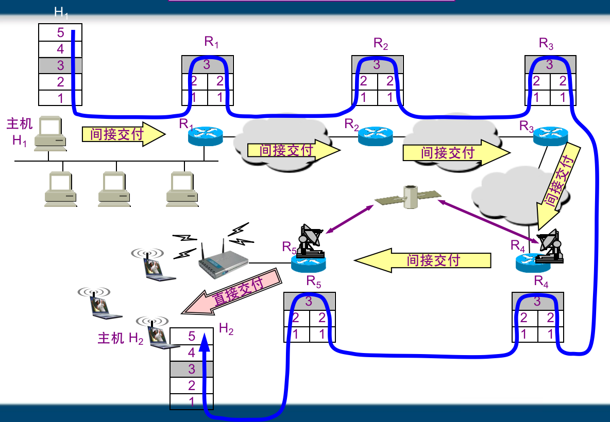

## 网络层

### 提供的服务

网络层的功能：网络层只负责在不同的网络间尽力转发数据包，不负责数据包的顺序和丢包重传。每个数据包都单独选择路径，H1发送给H2的数据可能沿着不同的路径传送。

### 数据包在互联网中的传送

路由器只关心目标IP地址，选择下一跳的最优路径（根据Mac地址）。

发送端：

1. 应用程序准备要传输的文件
2. 传输层 将文件分段 并编号
3. 网络层 给每一段加IP地址成为数据包
4. 数据链路层 使用子网掩码判断自己和目标地址的网段，并加上Mac地址和帧校验序列
   1. 如果在一个网络中，则根据ARP协议解析目标Mac地址
   2. 不在一个网段，则根据ARP获得路由器(网关)的Mac地址

交换机：存储转发。接收bit流，根据Mac地址决定从哪个口进行转发

路由器：根据数据包的目标IP地址决定出口。需要路由表

### IP数据包格式

- 版本：4或6
- 首部长度、总长度（首部+数据部分）
- 生存时间：TTL。以路由器跳数为单位，当 TTL 为 0 时就丢弃数据报。
- 协议 ：指出携带的数据应该上交给哪个协议进行处理，例如 ICMP、TCP、UDP 等。
- 首部检验和 ：因为数据报每经过一个路由器，都要重新计算检验和，因此检验和不包含数据部分可以减少计算的工作量。

### IP地址分类

IP地址共32位，由两部分组成，网络号和主机号，其中不同分类具有不同的网络号长度，并且是固定的。

IP 地址 := `{< 网络号 >, < 主机号 >}`

- A类地址：1个字节的网络号，3个字节的主机号，用于少量的大型网络；
- B类地址：2个字节的网络号，2个字节的主机号，用于中等规模的网络；
- C类地址：3个字节的网络号，1个字节的主机号，用于小规模的网络。

### 子网划分

通过在主机号字段中拿一部分作为子网号，把两级 IP 地址划分为三级 IP 地址。

IP 地址 ::= {< 网络号 >, < 子网号 >, < 主机号 >}

要使用子网，必须配置子网掩码。一个 B 类地址的默认子网掩码为 255.255.0.0，如果 B 类地址的子网占两个比特，那么子网掩码为 11111111 11111111 11000000 00000000，也就是 255.255.192.0。

注意，外部网络看不到子网的存在。

### ARP工作原理

每个主机都有一个 ARP 高速缓存，里面有本局域网上的各主机和路由器的 IP 地址到 MAC 地址的映射表。

如果A不知道B的MAC地址，则A通过广播发送ARP请求，B接收到后发送ARP响应给A。

若目标IP不在一个网段中，则通过ARP找到路由器的Mac地址，发送给路由器，通过路由器转发给下一个网络。

### ICMP

ping判断网络通还是不通

Traceroute 是 ICMP 的另一个应用，用来跟踪一个分组从源点到终点的路径。
