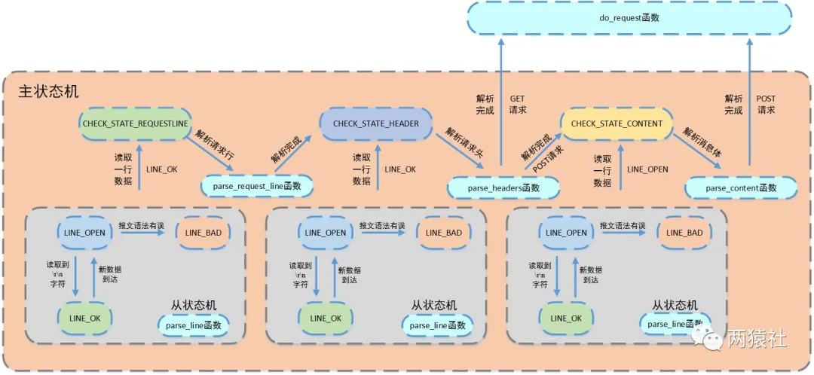
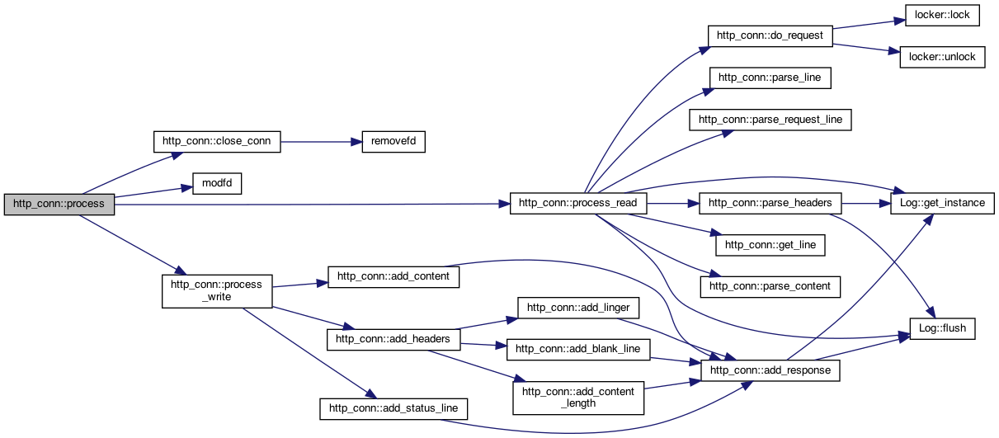
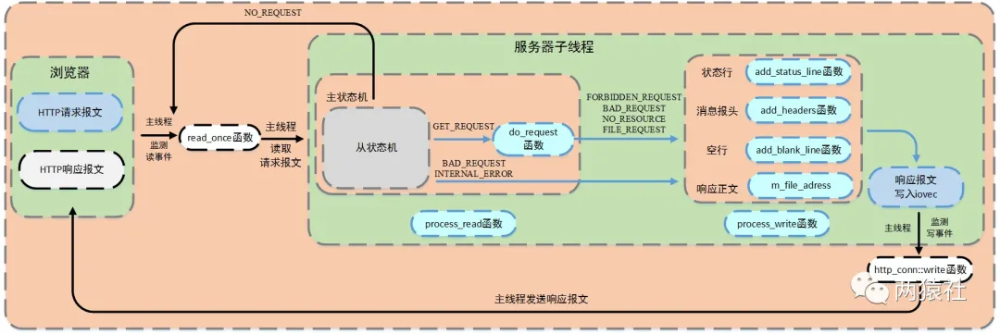
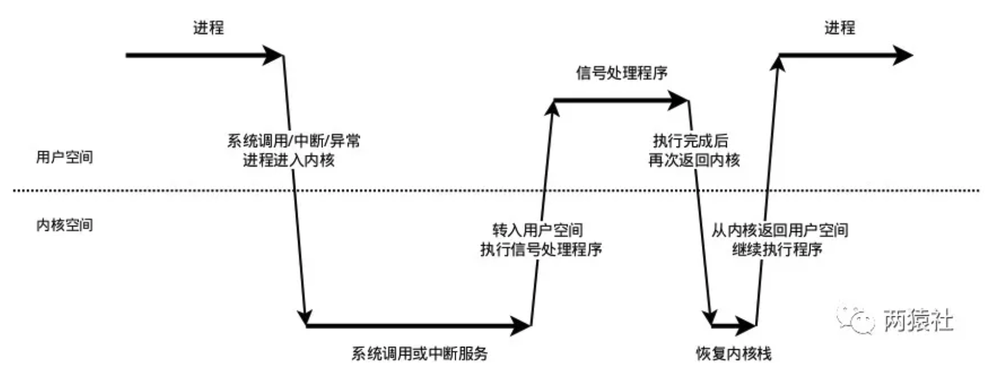

[分析](https://mp.weixin.qq.com/mp/appmsgalbum?__biz=MzAxNzU2MzcwMw==&action=getalbum&album_id=1339230165934882817&scene=173&from_msgid=2649274278&from_itemidx=3&count=3&nolastread=1#wechat_redirect)


## 线程同步机制封装类

### 基础知识

#### **RAII**

- RAII全称是“Resource Acquisition is Initialization”，直译过来是“资源获取即初始化”.
- 在构造函数中申请分配资源，在析构函数中释放资源。在C++中，当一个对象创建的时候，自动调用构造函数，当对象超出作用域的时候会自动调用析构函数。
- RAII的核心思想是将资源或者状态与对象的生命周期绑定，通过C++的语言机制，使用类来管理资源，实现资源和状态的安全管理。智能指针是RAII最好的例子

#### **信号量**

信号量是一种特殊的变量，它只能取自然数值并且只支持两种操作：等待(P)和信号(V).假设有信号量SV，对其的P、V操作如下：

> - P，如果SV的值大于0，则将其减一；若SV的值为0，则挂起执行
> - V，如果有其他进行因为等待SV而挂起，则唤醒；若没有，则将SV值加一

信号量的取值可以是任何自然数，最常用的，最简单的信号量是二进制信号量，只有0和1两个值.

> - sem_init函数 用于初始化一个未命名的信号量
> - sem_destory函数 用于销毁信号量
> - sem_wait函数 将以原子操作方式将信号量减一,信号量为0时,sem_wait阻塞
> - sem_post函数 以原子操作方式将信号量加一,信号量大于0时,唤醒调用sem_post的线程
>
> 以上，成功返回0，失败返回errno


信号量需要实现sem类，提供以下接口

- `sem()` 创建一个信号量
- `sem(num)` 创建一个指定大小的信号量
- `~sem()` 析构
- `wait()` 即P（等待）操作；如果SV的值大于0，则将其减一；若SV的值为0，则挂起执行
- `post()` 即V（信号）操作；如果有其他进行因为等待SV而挂起，则唤醒；若没有，则将SV值加一

#### **互斥量**

互斥锁,也成互斥量,可以保护关键代码段,以确保独占式访问.当进入关键代码段,获得互斥锁将其加锁;离开关键代码段,唤醒等待该互斥锁的线程.

> - pthread_mutex_init函数 用于初始化互斥锁
> - pthread_mutex_destory函数 用于销毁互斥锁
> - pthread_mutex_lock函数 以原子操作方式给互斥锁加锁
> - pthread_mutex_unlock函数 以原子操作方式给互斥锁解锁
>
> 以上，成功返回0，失败返回errno

互斥量需要实现locker类，并提供以下接口

- `locker()` 创建一个互斥量
- `lock()` 加锁
- `unlock()` 解锁
- `get()` 获取锁

#### **条件变量**

条件变量提供了一种线程间的通知机制,当某个共享数据达到某个值时,唤醒等待这个共享数据的线程.

> - pthread_cond_init函数用于初始化条件变量
> - pthread_cond_destory函数销毁条件变量
> - pthread_cond_broadcast函数以广播的方式唤醒**所有**等待目标条件变量的线程
> - pthread_cond_wait函数用于等待目标条件变量变为true.该函数调用时需要传入 **mutex参数(加锁的互斥锁)** ,函数执行时,先把调用线程放入条件变量的请求队列,然后将互斥锁mutex解锁,当函数成功返回为0时,互斥锁会再次被锁上. **也就是说函数内部会有一次解锁和加锁操作**.


条件变量需要实现cond类，并提供以下接口

- `cond()` 创建一个条件变量
- `wait(pthread_mutex_t* m_mutex) `
- `timewait(pthread_mutex_t* *m_mutex*, struct timespec *t*)`
- `signal()`
- `broadcast()`

### 功能

#### **锁机制的功能**

- 实现多线程同步，通过锁机制，确保任一时刻只能有一个线程能进入关键代码段.

#### **封装的功能**

- 类中主要是Linux下三种锁进行封装，将锁的创建于销毁函数封装在类的构造与析构函数中，实现RAII机制

```cpp
class sem{}
```

- 将重复使用的代码封装为函数，减少代码的重复，使其更简洁

```cpp
//条件变量的使用机制需要配合锁来使用
//内部会有一次加锁和解锁
//封装起来会使得更加简洁
bool wait()
bool signal()
```

## 半同步半反应堆线程池

### 服务器编程基本框架

主要由I/O单元，逻辑单元和网络存储单元组成，其中每个单元之间通过请求队列进行通信，从而协同完成任务。

其中I/O单元用于处理客户端连接，读写网络数据；逻辑单元用于处理业务逻辑的线程；网络存储单元指本地数据库和文件等。


### 事件处理模式

- reactor模式中，主线程(**I/O处理单元**)只负责监听文件描述符上是否有事件发生，有的话立即通知工作线程(**逻辑单元** )，读写数据、接受新连接及处理客户请求均在工作线程中完成。通常由**同步I/O**实现。
- proactor模式中，主线程和内核负责处理读写数据、接受新连接等I/O操作，工作线程仅负责业务逻辑，如处理客户请求。通常由**异步I/O**实现。

### 同步I/O模拟proactor模式

由于异步I/O并不成熟，实际中使用较少，这里将使用同步I/O模拟实现proactor模式。

同步I/O模型的工作流程如下（epoll_wait为例）：

> - 主线程往epoll内核事件表注册socket上的读就绪事件。
> - 主线程调用epoll_wait等待socket上有数据可读
> - 当socket上有数据可读，epoll_wait通知主线程,主线程从socket循环读取数据，直到没有更多数据可读，然后将读取到的数据封装成一个请求对象并插入请求队列。
> - 睡眠在请求队列上某个工作线程被唤醒，它获得请求对象并处理客户请求，然后往epoll内核事件表中注册该socket上的写就绪事件
> - 主线程调用epoll_wait等待socket可写。
> - 当socket上有数据可写，epoll_wait通知主线程。主线程往socket上写入服务器处理客户请求的结果。

### 并发编程模式

并发编程方法的实现有多线程和多进程两种，但这里涉及的并发模式指I/O处理单元与逻辑单元的协同完成任务的方法。

- 半同步/半异步模式
- 领导者/追随者模式

### 半同步/半反应堆

半同步/半反应堆工作流程（以Proactor模式为例）

> - 主线程充当异步线程，负责监听所有socket上的事件
> - 若有新请求到来，主线程接收之以得到新的连接socket，然后往epoll内核事件表中注册该socket上的读写事件
> - 如果连接socket上有读写事件发生，主线程从socket上接收数据，并将数据封装成请求对象插入到请求队列中
> - 所有工作线程睡眠在请求队列上，当有任务到来时，通过竞争（如互斥锁）获得任务的接管权

### 线程池

- 空间换时间,浪费服务器的硬件资源,换取运行效率.
- 池是一组资源的集合,这组资源在服务器启动之初就被完全创建好并初始化,这称为静态资源.
- 当服务器进入正式运行阶段,开始处理客户请求的时候,如果它需要相关的资源,可以直接从池中获取,无需动态分配.
- 当服务器处理完一个客户连接后,可以把相关的资源放回池中,无需执行系统调用释放资源.

### 基础知识

#### pthread_create陷阱

首先看一下该函数的函数原型。

```cpp
#include <pthread.h>
int pthread_create 
(pthread_t *thread_tid,          //返回新生成的线程的id
const pthread_attr_t *attr,      //指向线程属性的指针,通常设置为NULL
void * (*start_routine) (void *),//处理线程函数的地址
void *arg);                      //start_routine()中的参数
```

函数原型中的第三个参数，为函数指针，指向处理线程函数的地址。该函数，要求为静态函数。如果处理线程函数为类成员函数时，需要将其设置为**静态成员函数**。

#### this指针的锅

pthread_create的函数原型中第三个参数的类型为函数指针，指向的线程处理函数参数类型为`(void *)`,若线程函数为类成员函数，则this指针会作为默认的参数被传进函数中，从而和线程函数参数`(void*)`不能匹配，不能通过编译。

静态成员函数就没有这个问题，里面没有this指针。

### 线程池分析

线程池的设计模式为半同步/半反应堆，其中反应堆具体为Proactor事件处理模式。

#### 线程池创建与回收

在构造函数中创建线程池。

循环调用pthread_create函数创建n个线程。pthread_create将threadpool对象作为参数传递给类的静态函数worker，在worker中调用threadpool的动态方法run()。

- 用pthread_create循环创建线程，并用pthread_detach分离线程

#### 向请求队列中添加任务

通过list容器创建请求队列，向队列中添加时，通过mutex互斥锁保证线程安全，添加完成后通过sem信号量通知线程池中线程。线程池中在运行run()的线程通过wait()接收到sem信号量。

```cpp
template<typename T>
bool threadpool<T>::append(T* request){}
```

#### 线程处理函数

它不断从工作队列中取出任务并执行之

```cpp
template<typename T>
void* threadpool<T>::worker(void* arg){}
```

#### run执行任务

信号量等待，唤醒后加锁，从请求队列中取出队头的任务。

调用任务的process操作，进行处理

```cpp
template<typename T>
void threadpool<T>::run(){}
```

## http_conn

`基础知识方面`，包括epoll、HTTP报文格式、状态码和有限状态机。

`代码分析方面`，首先对服务器端处理http请求的全部流程进行简要介绍，然后结合代码对http类及请求接收进行详细分析。

### EPOLL

```c
int epoll_create(int size);
// 用于操作内核事件表监控的文件描述符上的事件：注册、修改、删除
int epoll_ctl(int epfd, int op, int fd, struct epoll_event *event);

struct epoll_event {
  __uint32_t events; /* Epoll events */
  epoll_data_t data; /* User data variable */
};
// 用于等待所监控文件描述符上有事件的产生，返回就绪的文件描述符个数
int epoll_wait(int epfd, struct epoll_event *events, int maxevents, int timeout);
```

### HTTP报文格式

#### HTTP请求报文

请求行（方法、URL、协议版本）+请求头+空行+请求数据体


#### HTTP响应报文

状态行（协议版本、状态码、状态码描述）+响应头+空行+响应体


### 有限状态机

有限状态机，是一种抽象的理论模型，它能够把有限个变量描述的状态变化过程，以可构造可验证的方式呈现出来。比如，封闭的有向图。

有限状态机可以通过if-else,switch-case和函数指针来实现，从软件工程的角度看，主要是为了封装逻辑。

状态机的当前状态记录在cur_State变量中，逻辑处理时，状态机先通过getNewPackage获取数据包，然后根据当前状态对数据进行处理，处理完后，状态机通过改变cur_State完成状态转移。

```c
STATE_MACHINE(){
    State cur_State = type_A;
    while(cur_State != type_C){
        Package _pack = getNewPackage();
        switch(){
            case type_A:
                process_pkg_state_A(_pack);
                cur_State = type_B;
                break;
            case type_B:
                process_pkg_state_B(_pack);
                cur_State = type_C;
                break;
        }
    }
}
```

### http_conn类定义

根据状态转移,通过主从状态机封装了http连接类。其中,主状态机在内部调用从状态机,从状态机将处理状态和数据传给主状态机

1. 客户端发出http连接请求
2. 从状态机读取数据,更新自身状态和接收数据,传给主状态机
3. 主状态机根据从状态机状态,更新自身状态,决定响应请求还是继续读取

**接口**

- 读缓冲区、写缓冲区
- 报文请求方法：GET、POST等
- 建立连接init()
- process()处理流程，包括读、写等操作


### epoll相关

- 非阻塞模式 setnonblocking
- 内核事件表注册事件 addfd
- 内核事件表删除事件 removefd
- 重置EPOLLONESHOT事件 modfd

### epoll过程

在main函数中：

1. socket、setsockopt、bind、listen、epoll_create、addfd

2. 循环等待，直到浏览器端发出http连接请求（监听的文件描述符发生事件）

   1. epoll_wait并处理所有就绪事件

      分为新的客户连接、异常事件、信号、读写数据

### 处理新的客户连接

1. accept
2. 初始化http_conn对象，即调用http_conn::init()初始化新接受的连接，包括HTML方法、读写缓冲区等

### 处理读数据

1. http_conn::read_once()中调用recv读入数据到m_read_buf中
2. 将当前http_conn对象加入线程池
3. 线程池从任务队列中取出一个任务进行处理，回调http_conn的process函数
4. process函数内调用process_write完成报文解析

### HTTP报文解析

流程图与状态机：描述主、从状态机调用关系与状态转移过程。

**从状态机负责读取报文的一行，主状态机负责对该行数据进行解析**，主状态机内部调用从状态机，从状态机驱动主状态机。



http_conn::process



#### 解析报文整体流程

process_read通过while循环，将主从状态机进行封装，对报文的每一行进行循环处理。

- 判断条件

- - 主状态机转移到CHECK_STATE_CONTENT，该条件涉及解析消息体
  - 从状态机转移到LINE_OK，该条件涉及解析请求行和请求头部
  - 两者为或关系，当条件为真则继续循环，否则退出

- 循环体

- - 从状态机读取数据
  - 调用get_line函数，通过m_start_line将从状态机读取数据间接赋给text
  - 主状态机解析text

#### 从状态机逻辑parse_line

在HTTP报文中，每一行的数据由\r\n作为结束字符，空行则是仅仅是字符\r\n。因此，可以通过查找\r\n将报文拆解成单独的行进行解析。

- 从状态机从m_read_buf中逐字节读取，判断当前字节是否为\r

- - 接下来的字符是\n，将\r\n修改成\0\0，将m_checked_idx指向下一行的开头，则返回LINE_OK
  - 接下来达到了buffer末尾，表示buffer还需要继续接收，返回LINE_OPEN
  - 否则，表示语法错误，返回LINE_BAD

- 当前字节不是\r，判断是否是\n（**一般是上次读取到\r就到了buffer末尾，没有接收完整，再次接收时会出现这种情况**）

- - 如果前一个字符是\r，则将\r\n修改成\0\0，将m_checked_idx指向下一行的开头，则返回LINE_OK

- 当前字节既不是\r，也不是\n

- - 表示接收不完整，需要继续接收，返回LINE_OPEN

#### 主状态机逻辑

parse_request_line、parse_header、parse_content

主状态机初始状态是CHECK_STATE_REQUESTLINE，通过调用从状态机来驱动主状态机，在主状态机进行解析前，从状态机已经将每一行的末尾\r\n符号改为\0\0，以便于主状态机直接取出对应字符串进行处理。

- CHECK_STATE_REQUESTLINE

- - 主状态机的初始状态，调用parse_request_line函数解析请求行
  - 解析函数从m_read_buf中解析HTTP请求行，获得请求方法、目标URL及HTTP版本号
  - 解析完成后主状态机的状态变为CHECK_STATE_HEADER

解析完请求行后，主状态机继续分析请求头。在报文中，请求头和空行的处理使用的同一个函数，这里通过判断当前的text首位是不是\0字符，若是，则表示当前处理的是空行，若不是，则表示当前处理的是请求头。

- CHECK_STATE_HEADER

- - 调用parse_headers函数解析请求头部信息
  - 判断是空行还是请求头，若是空行，进而判断content-length是否为0，如果不是0，表明是POST请求，则状态转移到CHECK_STATE_CONTENT，否则说明是GET请求，则报文解析结束。
  - 若解析的是请求头部字段，则主要分析connection字段，content-length字段，其他字段可以直接跳过，各位也可以根据需求继续分析。
  - connection字段判断是keep-alive还是close，决定是长连接还是短连接
  - content-length字段，这里用于读取post请求的消息体长度

- CHECK_STATE_CONTENT

- - 仅用于解析POST请求，调用parse_content函数解析消息体
  - 用于保存post请求消息体，为后面的登录和注册做准备

### 基础API

`stat`、`mmap`、`iovec`、`writev`

#### stat

取得文件属性，包括类型和权限、文件大小

```c
//获取文件属性，存储在statbuf中
int stat(const char *pathname, struct stat *statbuf);

struct stat {
   mode_t    st_mode;        /* 文件类型和权限 */
   off_t     st_size;        /* 文件大小，字节数*/
};
```

#### mmap

用于将一个文件或其他对象映射到内存，提高文件的访问速度。

```c
void* mmap(void* start,size_t length,int prot,int flags,int fd,off_t offset);
int munmap(void* start,size_t length);
```

- start：映射区的开始地址，设置为0时表示由系统决定映射区的起始地址

- length：映射区的长度

- prot：期望的内存保护标志，不能与文件的打开模式冲突

- - PROT_READ 表示页内容可以被读取

- flags：指定映射对象的类型，映射选项和映射页是否可以共享

- - MAP_PRIVATE 建立一个写入时拷贝的私有映射，内存区域的写入不会影响到原文件

- fd：有效的文件描述符，一般是由open()函数返回

- off_toffset：被映射对象内容的起点

#### struct iovec

```c
struct iovec {
    void      *iov_base;      //数据的地址
    size_t    iov_len;        //数据的长度
};
```

#### writev

在一次函数调用中，写多个非连续缓冲区

```c
ssize_t writev(int fd, const struct iovec *iov, int iovcnt);
```

若成功则返回已写的字节数，若出错则返回-1。

`writev`以顺序`iov[0]`，`iov[1]`至`iov[iovcnt-1]`从缓冲区中聚集输出数据。`writev`返回输出的字节总数，通常，它应等于所有缓冲区长度之和。

> **特别注意：** 循环调用writev时，需要重新处理iovec中的指针和长度，该函数不会对这两个成员做任何处理。writev的返回值为已写的字节数，但这个返回值“实用性”并不高，因为参数传入的是iovec数组，计量单位是iovcnt，而不是字节数，我们仍然需要通过遍历iovec来计算新的基址，另外写入数据的“结束点”可能位于一个iovec的中间某个位置，因此需要调整临界iovec的io_base和io_len。


### 响应报文

服务器如何响应请求报文，并将该报文发送给浏览器端

上文已完成：浏览器端发出HTTP请求报文，服务器端接收该报文并调用`process_read`对其进行解析，根据解析结果`HTTP_CODE`，进入相应的逻辑和模块。

其中，服务器子线程完成报文的解析与响应；主线程监测读写事件，调用`read_once`和`http_conn::write`完成数据的读取与发送。




#### **HTTP_CODE含义**

表示HTTP请求的处理结果，在头文件中初始化了八种情形，在报文解析与响应中只用到了七种。

- NO_REQUEST

- - 请求不完整，需要继续读取请求报文数据
  - 跳转主线程继续监测读事件

- GET_REQUEST

- - 获得了完整的HTTP请求
  - 调用do_request完成请求资源映射

- NO_RESOURCE

- - 请求资源不存在
  - 跳转process_write完成响应报文

- BAD_REQUEST

- - HTTP请求报文有语法错误或请求资源为目录
  - 跳转process_write完成响应报文

- FORBIDDEN_REQUEST

- - 请求资源禁止访问，没有读取权限
  - 跳转process_write完成响应报文

- FILE_REQUEST

- - 请求资源可以正常访问
  - 跳转process_write完成响应报文

- INTERNAL_ERROR

- - 服务器内部错误，该结果在主状态机逻辑switch的default下，一般不会触发

#### do_request

`process_read`函数的返回值是对请求的文件分析后的结果，一部分是语法错误导致的`BAD_REQUEST`，一部分是`do_request`的返回结果.该函数将网站根目录和`url`文件拼接，然后通过stat判断该文件属性。另外，为了提高访问速度，通过mmap进行映射，将普通文件映射到内存逻辑地址。

为了更好的理解**请求资源的访问流程**，这里对各种各页面跳转机制进行简要介绍。其中，浏览器网址栏中的字符，即`url`，可以将其抽象成`ip:port/xxx`，`xxx`通过`html`文件的`action`属性进行设置。

m_url为请求报文中解析出的请求资源，以/开头，也就是`/xxx`，项目中解析后的m_url有8种情况。

- /

- - GET请求，跳转到judge.html，即欢迎访问页面

- /0

- - POST请求，跳转到register.html，即注册页面

- /1

- - POST请求，跳转到log.html，即登录页面

- /2CGISQL.cgi

- - POST请求，进行登录校验
  - 验证成功跳转到welcome.html，即资源请求成功页面
  - 验证失败跳转到logError.html，即登录失败页面

- /3CGISQL.cgi

- - POST请求，进行注册校验
  - 注册成功跳转到log.html，即登录页面
  - 注册失败跳转到registerError.html，即注册失败页面

- /5

- - POST请求，跳转到picture.html，即图片请求页面

- /6

- - POST请求，跳转到video.html，即视频请求页面

- /7

- - POST请求，跳转到fans.html，即关注页面

如果大家对上述设置方式不理解，不用担心。具体的登录和注册校验功能会在第12节进行详解，到时候还会针对html进行介绍。

#### process_write

根据`do_request`的返回状态，服务器子线程调用`process_write`向`m_write_buf`中写入响应报文。

- add_status_line函数，添加状态行：http/1.1 状态码 状态消息

- add_headers函数添加消息报头，内部调用add_content_length和add_linger函数

- - content-length记录响应报文长度，用于浏览器端判断服务器是否发送完数据
  - connection记录连接状态，用于告诉浏览器端保持长连接

- add_blank_line添加空行

上述涉及的5个函数，均是内部调用`add_response`函数更新`m_write_idx`指针和缓冲区`m_write_buf`中的内容。

#### 响应报文类型

响应报文分为两种，一种是请求的文件存在，通过`io`向量机制`iovec`，声明两个`iovec`，第一个指向`m_write_buf`，第二个指向`mmap`的地址`m_file_address`；一种是请求出错，这时候只申请一个`iovec`，指向`m_write_buf`。

#### http_conn::write

服务器子线程调用`process_write`完成响应报文，随后注册`epollout`事件。服务器主线程检测写事件，并调用`http_conn::write`函数将响应报文发送给浏览器端。

该函数具体逻辑如下：

在生成响应报文时初始化byte_to_send，包括头部信息和文件数据大小。通过writev函数循环发送响应报文数据，根据返回值更新byte_have_send和iovec结构体的指针和长度，并判断响应报文整体是否发送成功。

- 若writev单次发送成功，更新byte_to_send和byte_have_send的大小，若响应报文整体发送成功,则取消mmap映射,并判断是否是长连接.

- - 长连接重置http类实例，注册读事件，不关闭连接，
  - 短连接直接关闭连接

- 若writev单次发送不成功，判断是否是写缓冲区满了。

- - 若不是因为缓冲区满了而失败，取消mmap映射，关闭连接
  - 若eagain则满了，更新iovec结构体的指针和长度，并注册写事件，等待下一次写事件触发（当写缓冲区从不可写变为可写，触发epollout），因此在此期间无法立即接收到同一用户的下一请求，但可以保证连接的完整性。

## 定时器

> `定时器`，利用结构体定时事件封装。具体的，即定期检测非活跃连接，这里将该事件与连接资源封装为一个结构体定时器。
>
> `定时器容器`，使用容器将多个定时器组合起来，便于对定时事件统一管理。具体的，项目中使用升序链表将所有定时器串联组织起来。

利用`alarm`函数周期性地触发`SIGALRM`信号，信号处理函数利用管道通知主循环，主循环接收到该信号后对升序链表上所有定时器进行处理，若该段时间内没有交换数据，则将该连接关闭，释放所占用的资源。

定时器处理非活动连接模块，主要分为两部分。其一为定时方法与信号通知流程，其二为定时器及其容器设计与定时任务的处理。

### 基础API

#### **sigaction结构体**

```c
struct sigaction {
    void (*sa_handler)(int);
    void (*sa_sigaction)(int, siginfo_t *, void *);
    sigset_t sa_mask;
    int sa_flags;
    void (*sa_restorer)(void);
}
```

- sa_handler是一个函数指针，指向信号处理函数

- sa_sigaction同样是信号处理函数，有三个参数，可以获得关于信号更详细的信息

- sa_mask用来指定在信号处理函数执行期间需要被屏蔽的信号

- sa_flags用于指定信号处理的行为

- - SA_RESTART，使被信号打断的系统调用自动重新发起
  - SA_NOCLDSTOP，使父进程在它的子进程暂停或继续运行时不会收到 SIGCHLD 信号
  - SA_NOCLDWAIT，使父进程在它的子进程退出时不会收到 SIGCHLD 信号，这时子进程如果退出也不会成为僵尸进程
  - SA_NODEFER，使对信号的屏蔽无效，即在信号处理函数执行期间仍能发出这个信号
  - SA_RESETHAND，信号处理之后重新设置为默认的处理方式
  - SA_SIGINFO，使用 sa_sigaction 成员而不是 sa_handler 作为信号处理函数

- sa_restorer一般不使用

#### sigfillset函数

```c
int sigfillset(sigset_t *set);
```

将参数set信号集初始化，然后把所有的信号加入到此信号集里。

#### SIGALRM、SIGTERM信号

```c
#define SIGALRM  14     //由alarm系统调用产生timer时钟信号
#define SIGTERM  15     //终端发送的终止信号
```

#### alarm函数

```c
unsigned int alarm(unsigned int seconds);
```

设置信号传送闹钟：信号SIGALRM在经过参数seconds秒数后发送给目前的进程。

如果未设置信号SIGALRM的处理函数，那么alarm()默认处理终止进程.

#### socketpair函数

创建一对套接字进行通信，项目中使用管道通信。

```c
int socketpair(int domain, int type, int protocol, int sv[2]);
```

- domain表示协议族，PF_UNIX或者AF_UNIX
- type表示协议，可以是SOCK_STREAM或者SOCK_DGRAM，SOCK_STREAM基于TCP，SOCK_DGRAM基于UDP
- protocol表示类型，只能为0
- sv[2]表示套节字柄对，该两个句柄作用相同，均能进行读写双向操作
- 返回结果， 0为创建成功，-1为创建失败

#### **send函数**

```c
ssize_t send(int sockfd, const void *buf, size_t len, int flags);
```

当套接字发送缓冲区变满时，send通常会阻塞，除非套接字设置为非阻塞模式，当缓冲区变满时，返回EAGAIN或者EWOULDBLOCK错误，此时可以调用select函数来监视何时可以发送数据。

### 信号通知流程

信号处理函数应当尽可能简单。仅发送信号通知程序主循环，将信号对应的处理逻辑放在程序主循环中，由主循环执行信号对应的逻辑代码。

> 使用异步处理信号，信号处理函数和当前进程是两条不同的执行路线。
> 具体的，当进程收到信号时，操作系统会中断进程当前的正常流程，转而进入信号处理函数执行操作，完成后再返回中断的地方继续执行。
>
> 为避免信号竞态现象发生，信号处理期间系统不会再次触发它。所以，为确保该信号不被屏蔽太久，信号处理函数需要尽可能快地执行完毕。一般的信号处理函数需要处理该信号对应的逻辑，当该逻辑比较复杂时，信号处理函数执行时间过长，会导致信号屏蔽太久。

#### 统一事件源

统一事件源，是指将信号事件与其他事件一样被处理。

具体的，信号处理函数使用管道将信号传递给主循环，信号处理函数往管道的写端写入信号值，主循环则从管道的读端读出信号值，使用I/O复用系统调用来监听管道读端的可读事件，这样信号事件与其他文件描述符都可以通过epoll来监测，从而实现统一处理。

#### **信号处理机制**

每个进程之中，都有存着一个表，里面存着每种信号所代表的含义，内核通过设置表项中每一个位来标识对应的信号类型。



- 信号的接收

- - 当内核接收到信号后，将其放到对应进程的信号队列中，同时向进程发送一个**中断**，使其陷入内核态。

- 信号的检测

- - 进程从内核态返回到用户态前进行信号检测
  - 进程在内核态中，从睡眠状态被唤醒的时候进行信号检测
  - 当发现有新信号时，便会进入下一步，信号的处理。

- 信号的处理

- - ( **内核** )信号处理函数是运行在用户态的，调用处理函数前，内核会将当前内核栈的内容备份拷贝到用户栈上，并且修改指令寄存器（eip）将其指向信号处理函数。
  - ( **用户** )接下来进程返回到用户态中，执行相应的信号处理函数。
  - ( **内核** )信号处理函数执行完成后，还需要返回内核态，检查是否还有其它信号未处理。
  - ( **用户** )如果所有信号都处理完成，就会将内核栈恢复（从用户栈的备份拷贝回来），同时恢复指令寄存器（eip）将其指向中断前的运行位置，最后回到用户态继续执行进程。

#### 信号处理函数

sig_handler(int sig)将信号值从管道写端写入

addsig(int *sig*, void(handler)(int), bool restart = true)将信号添加到信号集中，并执行sigaction函数

#### **信号通知逻辑**

- 创建管道，其中管道写端写入信号值，管道读端通过I/O复用系统监测读事件

- 设置信号处理函数SIGALRM（时间到了触发）和SIGTERM（kill会触发，Ctrl+C）

- - 通过struct sigaction结构体和sigaction函数注册信号捕捉函数
  - 在结构体的handler参数设置信号处理函数，具体的，从管道写端写入信号的名字

- 利用I/O复用系统监听管道读端文件描述符的可读事件

- 信息值传递给主循环，主循环再根据接收到的信号值执行目标信号对应的逻辑代码

### 定时器容器设计

定时器容器为带头尾结点的升序双向链表，具体的为每个连接创建一个定时器，将其添加到链表中，并按照超时时间升序排列。执行定时任务时，将到期的定时器从链表中删除。

从实现上看，主要涉及双向链表的插入，删除操作，其中添加定时器的事件复杂度是O(n),删除定时器的事件复杂度是O(1)。

升序双向链表主要逻辑如下，具体的，

- 创建头尾节点，其中头尾节点没有意义

- add_timer函数，将目标定时器添加到链表中，添加时按照升序添加

- - 若当前链表中只有头尾节点，直接插入
  - 否则，将定时器按升序插入

- adjust_timer函数，当定时任务发生变化,调整对应定时器在链表中的位置

- - 客户端在设定时间内有数据收发,则当前时刻对该定时器重新设定时间，这里只是往后延长超时时间
  - 被调整的目标定时器在尾部，或定时器新的超时值仍然小于下一个定时器的超时，不用调整
  - 否则先将定时器从链表取出，重新插入链表

- del_timer函数将超时的定时器从链表中删除

- - 常规双向链表删除结点

### 如何使用定时器

服务器首先创建定时器容器链表，然后用统一事件源将异常事件，读写事件和信号事件统一处理，根据不同事件的对应逻辑使用定时器。

具体的，

- 浏览器与服务器连接时，创建该连接对应的定时器，并将该定时器添加到链表上
- 处理异常事件时，执行定时事件，服务器关闭连接，从链表上移除对应定时器
- 处理定时信号时，将定时标志设置为true
- 处理读事件时，若某连接上发生读事件，将对应定时器向后移动，否则，执行定时事件
- 处理写事件时，若服务器通过某连接给浏览器发送数据，将对应定时器向后移动，否则，执行定时事件

