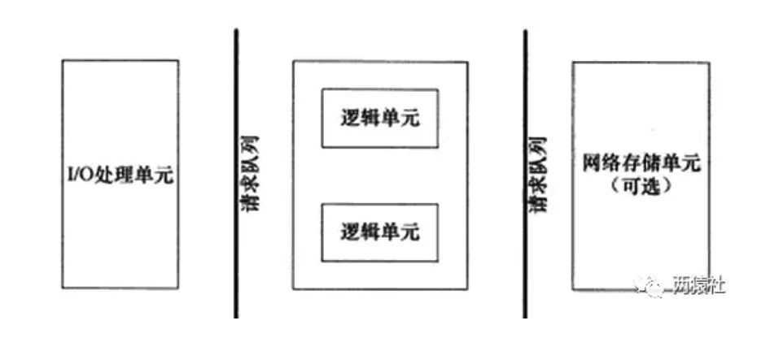

## 线程同步机制封装类

### 基础知识

#### **RAII**

- RAII全称是“Resource Acquisition is Initialization”，直译过来是“资源获取即初始化”.
- 在构造函数中申请分配资源，在析构函数中释放资源。在C++中，当一个对象创建的时候，自动调用构造函数，当对象超出作用域的时候会自动调用析构函数。
- RAII的核心思想是将资源或者状态与对象的生命周期绑定，通过C++的语言机制，使用类来管理资源，实现资源和状态的安全管理。智能指针是RAII最好的例子

#### **信号量**

信号量是一种特殊的变量，它只能取自然数值并且只支持两种操作：等待(P)和信号(V).假设有信号量SV，对其的P、V操作如下：

> - P，如果SV的值大于0，则将其减一；若SV的值为0，则挂起执行
> - V，如果有其他进行因为等待SV而挂起，则唤醒；若没有，则将SV值加一

信号量的取值可以是任何自然数，最常用的，最简单的信号量是二进制信号量，只有0和1两个值.

> - sem_init函数 用于初始化一个未命名的信号量
> - sem_destory函数 用于销毁信号量
> - sem_wait函数 将以原子操作方式将信号量减一,信号量为0时,sem_wait阻塞
> - sem_post函数 以原子操作方式将信号量加一,信号量大于0时,唤醒调用sem_post的线程
>
> 以上，成功返回0，失败返回errno


信号量需要实现sem类，提供以下接口

- `sem()` 创建一个信号量
- `sem(num)` 创建一个指定大小的信号量
- `~sem()` 析构
- `wait()` 即P（等待）操作；如果SV的值大于0，则将其减一；若SV的值为0，则挂起执行
- `post()` 即V（信号）操作；如果有其他进行因为等待SV而挂起，则唤醒；若没有，则将SV值加一

#### **互斥量**

互斥锁,也成互斥量,可以保护关键代码段,以确保独占式访问.当进入关键代码段,获得互斥锁将其加锁;离开关键代码段,唤醒等待该互斥锁的线程.

> - pthread_mutex_init函数 用于初始化互斥锁
> - pthread_mutex_destory函数 用于销毁互斥锁
> - pthread_mutex_lock函数 以原子操作方式给互斥锁加锁
> - pthread_mutex_unlock函数 以原子操作方式给互斥锁解锁
>
> 以上，成功返回0，失败返回errno

互斥量需要实现locker类，并提供以下接口

- `locker()` 创建一个互斥量
- `lock()` 加锁
- `unlock()` 解锁
- `get()` 获取锁

#### **条件变量**

条件变量提供了一种线程间的通知机制,当某个共享数据达到某个值时,唤醒等待这个共享数据的线程.

> - pthread_cond_init函数用于初始化条件变量
> - pthread_cond_destory函数销毁条件变量
> - pthread_cond_broadcast函数以广播的方式唤醒**所有**等待目标条件变量的线程
> - pthread_cond_wait函数用于等待目标条件变量变为true.该函数调用时需要传入 **mutex参数(加锁的互斥锁)** ,函数执行时,先把调用线程放入条件变量的请求队列,然后将互斥锁mutex解锁,当函数成功返回为0时,互斥锁会再次被锁上. **也就是说函数内部会有一次解锁和加锁操作**.


条件变量需要实现cond类，并提供以下接口

- `cond()` 创建一个条件变量
- `wait(pthread_mutex_t* m_mutex) `
- `timewait(pthread_mutex_t* *m_mutex*, struct timespec *t*)`
- `signal()`
- `broadcast()`

### 功能

#### **锁机制的功能**

- 实现多线程同步，通过锁机制，确保任一时刻只能有一个线程能进入关键代码段.

#### **封装的功能**

- 类中主要是Linux下三种锁进行封装，将锁的创建于销毁函数封装在类的构造与析构函数中，实现RAII机制

```cpp
class sem{}
```

- 将重复使用的代码封装为函数，减少代码的重复，使其更简洁

```cpp
//条件变量的使用机制需要配合锁来使用
//内部会有一次加锁和解锁
//封装起来会使得更加简洁
bool wait()
bool signal()
```

## 半同步半反应堆线程池

### 服务器编程基本框架

主要由I/O单元，逻辑单元和网络存储单元组成，其中每个单元之间通过请求队列进行通信，从而协同完成任务。

其中I/O单元用于处理客户端连接，读写网络数据；逻辑单元用于处理业务逻辑的线程；网络存储单元指本地数据库和文件等。



### 五种I/O模型

- **阻塞IO**:调用者调用了某个函数，等待这个函数返回，期间什么也不做，不停的去检查这个函数有没有返回，必须等这个函数返回才能进行下一步动作
- **非阻塞IO**:非阻塞等待，每隔一段时间就去检测IO事件是否就绪。没有就绪就可以做其他事。非阻塞I/O执行系统调用总是立即返回，不管时间是否已经发生，若时间没有发生，则返回-1，此时可以根据errno区分这两种情况，对于accept，recv和send，事件未发生时，errno通常被设置成eagain
- **信号驱动IO**:linux用套接口进行信号驱动IO，安装一个信号处理函数，进程继续运行并不阻塞，当IO时间就绪，进程收到SIGIO信号。然后处理IO事件。
- **IO复用**:linux用select/poll函数实现IO复用模型，这两个函数也会使进程阻塞，但是和阻塞IO所不同的是这两个函数可以同时阻塞多个IO操作。而且可以同时对多个读操作、写操作的IO函数进行检测。知道有数据可读或可写时，才真正调用IO操作函数
- **异步IO**:linux中，可以调用aio_read函数告诉内核描述字缓冲区指针和缓冲区的大小、文件偏移及通知的方式，然后立即返回，当内核将数据拷贝到缓冲区后，再通知应用程序。

#### 阻塞IO和非阻塞IO

阻塞IO：用户线程被阻塞在等待数据上或拷贝数据上。

非阻塞IO：数据拷贝到用户空间后，才去通知用户线程，一上来就可以直接操作数据了。

#### 同步IO和异步IO

同步IO是指发起IO请求后，必须拿到IO的数据才可以继续执行。

异步IO是指发起IO请求后，不用拿到IO的数据就可以继续执行。

### 事件处理模式

- reactor模式中，主线程(**I/O处理单元**)只负责监听文件描述符上是否有事件发生，有的话立即通知工作线程(**逻辑单元** )，读写数据、接受新连接及处理客户请求均在工作线程中完成。通常由**同步I/O**实现。
- proactor模式中，主线程和内核负责处理读写数据、接受新连接等I/O操作，工作线程仅负责业务逻辑，如处理客户请求。通常由**异步I/O**实现。

### 同步I/O模拟proactor模式

由于异步I/O并不成熟，实际中使用较少，这里将使用同步I/O模拟实现proactor模式。

同步I/O模型的工作流程如下（epoll_wait为例）：

> - 主线程往epoll内核事件表注册socket上的读就绪事件。
> - 主线程调用epoll_wait等待socket上有数据可读
> - 当socket上有数据可读，epoll_wait通知主线程,主线程从socket循环读取数据，直到没有更多数据可读，然后将读取到的数据封装成一个请求对象并插入请求队列。
> - 睡眠在请求队列上某个工作线程被唤醒，它获得请求对象并处理客户请求，然后往epoll内核事件表中注册该socket上的写就绪事件
> - 主线程调用epoll_wait等待socket可写。
> - 当socket上有数据可写，epoll_wait通知主线程。主线程往socket上写入服务器处理客户请求的结果。

### 并发编程模式

并发编程方法的实现有多线程和多进程两种，但这里涉及的并发模式指I/O处理单元与逻辑单元的协同完成任务的方法。

- 半同步/半异步模式
- 领导者/追随者模式

### 半同步/半反应堆

半同步/半反应堆并发模式是半同步/半异步的变体，将半异步具体化为某种事件处理模式.

并发模式中的同步和异步

> - 同步指的是程序完全按照代码序列的顺序执行
> - 异步指的是程序的执行需要由系统事件驱动

半同步/半异步模式工作流程

> - 同步线程用于处理客户逻辑
> - 异步线程用于处理I/O事件
> - 异步线程监听到客户请求后，就将其封装成请求对象并插入请求队列中
> - 请求队列将通知某个工作在**同步模式的工作线程**来读取并处理该请求对象

半同步/半反应堆工作流程（以Proactor模式为例）

> - 主线程充当异步线程，负责监听所有socket上的事件
> - 若有新请求到来，主线程接收之以得到新的连接socket，然后往epoll内核事件表中注册该socket上的读写事件
> - 如果连接socket上有读写事件发生，主线程从socket上接收数据，并将数据封装成请求对象插入到请求队列中
> - 所有工作线程睡眠在请求队列上，当有任务到来时，通过竞争（如互斥锁）获得任务的接管权

### 线程池

- 空间换时间,浪费服务器的硬件资源,换取运行效率.
- 池是一组资源的集合,这组资源在服务器启动之初就被完全创建好并初始化,这称为静态资源.
- 当服务器进入正式运行阶段,开始处理客户请求的时候,如果它需要相关的资源,可以直接从池中获取,无需动态分配.
- 当服务器处理完一个客户连接后,可以把相关的资源放回池中,无需执行系统调用释放资源.

### 基础知识

#### **静态成员变量**

将类成员变量声明为static，则为静态成员变量，与一般的成员变量不同，无论建立多少对象，都只有一个静态成员变量的拷贝，静态成员变量属于一个类，所有对象共享。

静态变量在编译阶段就分配了空间，对象还没创建时就已经分配了空间，放到全局静态区。

- 静态成员变量

- - 最好是类内声明，类外初始化（以免类名访问静态成员访问不到）。
  - 无论公有，私有，静态成员都可以在类外定义，但私有成员仍有访问权限。
  - 非静态成员类外不能初始化。
  - 静态成员数据是共享的。

#### **静态成员函数**

将类成员函数声明为static，则为静态成员函数。

- 静态成员函数

- - 静态成员函数可以直接访问静态成员变量，不能直接访问普通成员变量，但可以通过参数传递的方式访问。
  - 普通成员函数可以访问普通成员变量，也可以访问静态成员变量。
  - 静态成员函数没有this指针。非静态数据成员为对象单独维护，但静态成员函数为共享函数，无法区分是哪个对象，因此不能直接访问普通变量成员，也没有this指针。

#### pthread_create陷阱

首先看一下该函数的函数原型。

```cpp
#include <pthread.h>
int pthread_create 
(pthread_t *thread_tid,          //返回新生成的线程的id
const pthread_attr_t *attr,      //指向线程属性的指针,通常设置为NULL
void * (*start_routine) (void *),//处理线程函数的地址
void *arg);                      //start_routine()中的参数
```

函数原型中的第三个参数，为函数指针，指向处理线程函数的地址。该函数，要求为静态函数。如果处理线程函数为类成员函数时，需要将其设置为**静态成员函数**。

#### this指针的锅

pthread_create的函数原型中第三个参数的类型为函数指针，指向的线程处理函数参数类型为`(void *)`,若线程函数为类成员函数，则this指针会作为默认的参数被传进函数中，从而和线程函数参数`(void*)`不能匹配，不能通过编译。

静态成员函数就没有这个问题，里面没有this指针。

### 线程池分析

线程池的设计模式为半同步/半反应堆，其中反应堆具体为Proactor事件处理模式。

具体的，主线程为异步线程，负责监听文件描述符，接收socket新连接，若当前监听的socket发生了读写事件，然后将任务插入到请求队列。工作线程从请求队列中取出任务，完成读写数据的处理。

#### 线程池类定义

具体定义可以看代码。需要注意，线程处理函数和运行函数设置为私有属性。

```cpp
template<typename T>
class threadpool{};
```

#### 线程池创建与回收

构造函数中创建线程池,pthread_create函数中将类的对象作为参数传递给静态函数(worker),在静态函数中引用这个对象,并调用其动态方法(run)。

具体的，类对象传递时用this指针，传递给静态函数后，将其转换为线程池类，并调用私有成员函数run。

```cpp
template<typename T>
threadpool<T>::threadpool(connection_pool *connPool, int thread_number, int max_requests) 
  : m_thread_number(thread_number), m_max_requests(max_requests), m_stop(false), m_threads(NULL),m_connPool(connPool){}
```

- 用m_thread_number初始化描述线程池的数组m_threads
- 用pthread_create循环创建线程，并用pthread_detach分离线程

析构时，delete[] m_threads，并将m_stop结束线程标志置为true

#### **向请求队列中添加任务**

通过list容器创建请求队列，向队列中添加时，通过互斥锁保证线程安全，添加完成后通过信号量提醒有任务要处理，最后注意线程同步。

```cpp
template<typename T>
bool threadpool<T>::append(T* request){}
```

- 给请求队列加锁，添加任务后，解锁
- 信号量提醒有任务要处理

#### 线程处理函数

内部访问私有成员函数run，完成线程处理要求。

工作线程运行的函数，它不断从工作队列中取出任务并执行之

```cpp
template<typename T>
void* threadpool<T>::worker(void* arg){}
```

#### run执行任务

主要实现，工作线程从请求队列中取出某个任务进行处理，注意线程同步。

```cpp
template<typename T>
void threadpool<T>::run(){}
```

- 对信号量执行P操作
- 加锁
- 若请求队列为空，则解锁后从头循环
- 若请求队列非空，则取队头并pop，然后解锁
- 从连接池中取出一个数据库连接
- 调用请求的process操作，进行处理（包含将数据库连接放回连接池操作）